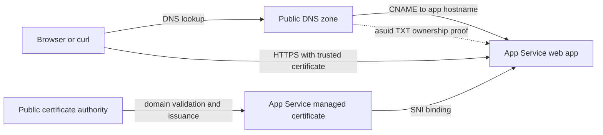

import Tabs from '@theme/Tabs';
import TabItem from '@theme/TabItem';
import PathPicker from '@site/src/components/PathPicker';
import Prerequisites from '@site/src/components/SharedMarkdown/_prerequisites.mdx';
import ProvisionResourceGroup from '@site/src/components/SharedMarkdown/_provision_resource_group.mdx';
import ProvisionResources from '@site/src/components/SharedMarkdown/_provision_resources.mdx';
import Cleanup from '@site/src/components/SharedMarkdown/_cleanup.mdx';

# Secure a custom domain with a managed certificate

The default `*.azurewebsites.net` hostname on Azure App Service is already
protected by a platform certificate. A production hostname that you own needs
its own DNS mapping and certificate. In this lab, you map a real public
subdomain, issue a free App Service managed certificate, bind it with
Server Name Indication (SNI), and require modern HTTPS.

You must own or control a public DNS domain to complete this lab. DNS ownership
cannot be simulated, and a made-up hostname cannot receive a publicly trusted
certificate.

**Estimated time:** 35 to 60 minutes, plus DNS propagation and certificate
issuance time.

## Objectives

By the end of this lab, you will be able to:

- Choose between a free managed certificate and bring-your-own-certificate
  options.
- Map a public custom hostname to an App Service app without weakening domain
  ownership validation.
- Create and bind an App Service managed certificate.
- Enable HTTPS-only and require TLS 1.2 or later for the app and SCM endpoint.
- Verify DNS, HTTP redirect behavior, the certificate, and the App Service
  configuration.

<Prerequisites
  tools={[
    { name: 'Azure Developer CLI (azd)', url: 'https://learn.microsoft.com/azure/developer/azure-developer-cli/install-azd', description: '(for the azd provisioning path)' },
    { name: 'A public DNS domain that you own or administer', description: 'with permission to create CNAME, A, and TXT records' },
    { name: 'A DNS lookup tool', description: '(dig, nslookup, or Resolve-DnsName)' },
  ]}
/>

:::caution A real domain and paid App Service plan are required
Do not continue with a production domain unless you are authorized to change
its DNS. This lab uses a temporary subdomain such as
`asl-tls.example.com`, not the root domain or an active production hostname.

Custom TLS bindings require **Basic B1 or higher**. This lab uses a B1 plan,
about USD 13/month if left running. The managed certificate is free, but your
domain registration and DNS provider can have separate costs. Delete the test
resources and DNS records when you finish.
:::

## How DNS validation and TLS fit together

The DNS record sends clients to App Service. The `asuid` TXT record proves that
your subscription controls the target app and helps prevent a dangling DNS
record from being claimed by another app. After App Service accepts the
hostname, it asks a public certificate authority to validate the domain and
issue the managed certificate.



The mapping and certificate behavior are the same for Windows and Linux App
Service plans. Runtime language does not affect the certificate.

### Choose the certificate type first

| Requirement | Best fit |
| :-- | :-- |
| One public root domain or subdomain, basic server TLS, automatic renewal | **App Service managed certificate** used in this lab |
| Wildcard hostname such as `*.example.com` | App Service certificate or another public certificate |
| Export the certificate or use the private key outside App Service | Bring your own certificate (BYOC) |
| Control certificate authority, key lifecycle, or certificate policy | BYOC, commonly stored in Azure Key Vault |
| Use the certificate as a client certificate | BYOC |
| Private DNS in multitenant App Service | A public managed certificate is not suitable |

Managed certificates are not exportable, do not support wildcards, and can
change issuer and key material during renewal. Do not pin clients to their
certificate or issuer. Automatic renewal depends on keeping the supported DNS
mapping and hostname binding in place.

### Optional concept: Key Vault and BYOC

For BYOC, store a password-protected PFX certificate in Azure Key Vault and
import it into App Service. Grant only the App Service resource provider access
required for the import, and let App Service synchronize later certificate
versions. BYOC changes certificate procurement, rotation, and incident-response
responsibilities, so it is outside this executable lab. Never commit the PFX
password or certificate private key.

## Provision resources

<PathPicker
  description="Set the tooling once. Every matching step below follows your choice."
  groups={[
    { id: 'tooling', label: 'Tooling', options: [
      { value: 'azd', label: 'azd' },
      { value: 'az', label: 'az CLI' },
      { value: 'portal', label: 'Portal' },
    ]},
  ]}
/>

Create or reuse a web app on a B1 or higher App Service plan. Choose one path.
The azd template creates and owns its resource group. The Azure CLI and portal
paths use the shared lab resource group.

<Tabs groupId="tooling" queryString>
<TabItem value="azd" label="Azure Developer CLI (azd)">

Use the repository sample to provision a Linux B1 plan and deploy a web app:

```bash
git clone https://github.com/Azure-Samples/app-service-labs.git
cd app-service-labs/samples/zava-widgets

SUFFIX=$(openssl rand -hex 3)
azd auth login
azd env new "asl-tls-${SUFFIX}" --location eastus
azd up
```

Read the generated app and resource group names:

```bash
export RG_NAME=$(azd env get-value RESOURCE_GROUP_NAME)
export APP_NAME=$(azd env get-value WEB_APP_NAME)
```

`azd` provisions the app, but it does not own records at an arbitrary external
DNS provider. The domain-validation and certificate operations below therefore
use the App Service management commands after `azd up`. Keep the `azd`
environment so `azd down` can remove the Azure resources later.

</TabItem>
<TabItem value="az" label="Azure CLI (az)">

<ProvisionResourceGroup />

<ProvisionResources />

Create a Linux B1 plan and web app:

```bash
export PLAN_NAME=plan-asl-tls-$RAND
export APP_NAME=app-asl-tls-$RAND

az appservice plan create \
  --name "$PLAN_NAME" \
  --resource-group "$RG_NAME" \
  --sku B1 \
  --is-linux

az webapp create \
  --name "$APP_NAME" \
  --resource-group "$RG_NAME" \
  --plan "$PLAN_NAME" \
  --runtime "NODE:22-lts"
```

The platform welcome page is enough for this TLS-focused lab. If you prefer to
deploy code, complete [Deploy your first web app](../getting-started/deploy-your-first-web-app.md)
before continuing.

</TabItem>
<TabItem value="portal" label="Azure portal">

<ProvisionResourceGroup />

<ProvisionResources />

1. In the [Azure portal](https://portal.azure.com), create **Web App**.
2. Put it in the resource group created above.
3. Choose **Code**, either **Linux** or **Windows**, and a supported runtime.
4. Create or select a **Basic B1** App Service plan.
5. On **Monitoring**, do not add extra services for this lab.
6. Select **Review + create**, then **Create**.
7. When deployment completes, open the resource and record the app name in your
   terminal:

   ```bash
   export APP_NAME="<your-app-name>"
   ```

</TabItem>
</Tabs>

Confirm the default HTTPS endpoint responds before changing DNS:

```bash
DEFAULT_HOSTNAME=$(az webapp show \
  --name "$APP_NAME" \
  --resource-group "$RG_NAME" \
  --query defaultHostName -o tsv)

curl --fail --silent --show-error \
  "https://${DEFAULT_HOSTNAME}/" \
  --output /dev/null \
  --write-out "HTTP %{http_code}\n"
```

Expected output:

```text
HTTP 200
```

## Step 1: Choose a temporary hostname

Prefer a subdomain because a CNAME follows the stable App Service hostname and
does not depend on an inbound IP address. Set the real hostname that you
control:

```bash
export CUSTOM_HOSTNAME=asl-tls.example.com
```

Replace `example.com`. Do not type the `https://` scheme.

Read the target hostname and ownership verification ID:

```bash
DEFAULT_HOSTNAME=$(az webapp show \
  --name "$APP_NAME" \
  --resource-group "$RG_NAME" \
  --query defaultHostName -o tsv)

VERIFICATION_ID=$(az webapp show \
  --name "$APP_NAME" \
  --resource-group "$RG_NAME" \
  --query customDomainVerificationId -o tsv)

printf "CNAME target: %s\nTXT value: %s\n" \
  "$DEFAULT_HOSTNAME" "$VERIFICATION_ID"
```

## Step 2: Create the public DNS records

<Tabs groupId="tooling" queryString>
<TabItem value="azd" label="Azure Developer CLI (azd)">

Create these records at the authoritative DNS provider for your domain:

| Type | Name for `asl-tls.example.com` | Value |
| :-- | :-- | :-- |
| CNAME | `asl-tls` | the value in `$DEFAULT_HOSTNAME` |
| TXT | `asuid.asl-tls` | the value in `$VERIFICATION_ID` |

The CNAME must point directly to the app's `*.azurewebsites.net` hostname for
this lab. An intermediate CNAME, proxy, or traffic service can prevent managed
certificate issuance.

</TabItem>
<TabItem value="az" label="Azure CLI (az)">

If your authoritative zone is in Azure DNS, set its resource group and create
the records:

```bash
export DNS_RESOURCE_GROUP="<dns-resource-group>"
export DNS_ZONE=example.com
export DNS_RECORD=asl-tls

az network dns record-set cname set-record \
  --resource-group "$DNS_RESOURCE_GROUP" \
  --zone-name "$DNS_ZONE" \
  --record-set-name "$DNS_RECORD" \
  --cname "$DEFAULT_HOSTNAME"

az network dns record-set txt add-record \
  --resource-group "$DNS_RESOURCE_GROUP" \
  --zone-name "$DNS_ZONE" \
  --record-set-name "asuid.${DNS_RECORD}" \
  --value "$VERIFICATION_ID"
```

For another DNS provider, create the equivalent CNAME and TXT records in that
provider's management interface.

</TabItem>
<TabItem value="portal" label="Azure portal">

1. In your web app, select **Settings** > **Custom domains**.
2. Select **Add custom domain**.
3. Select **All other domain services** and **App Service Managed
   Certificate**.
4. Enter the fully qualified hostname, but do not select **Validate** yet.
5. Copy the CNAME and TXT record names and values shown under **Domain
   validation**.
6. At your authoritative DNS provider, create both records and save the change.

</TabItem>
</Tabs>

Wait for public DNS to return both records. Use one of these commands:

<Tabs groupId="os" queryString>
<TabItem value="linux" label="Linux or macOS">

```bash
dig +short "$CUSTOM_HOSTNAME" CNAME
dig +short "asuid.${CUSTOM_HOSTNAME}" TXT
```

</TabItem>
<TabItem value="windows" label="Windows">

```powershell
Resolve-DnsName $env:CUSTOM_HOSTNAME -Type CNAME
Resolve-DnsName "asuid.$env:CUSTOM_HOSTNAME" -Type TXT
```

</TabItem>
</Tabs>

The CNAME result must end in `azurewebsites.net`, and the TXT result must match
the app's verification ID. DNS propagation can take minutes or hours according
to your provider's time-to-live (TTL).

:::note Mapping a root domain
For a root such as `example.com`, use an A record that points to the app's
inbound IP address and a TXT record named `asuid`. Root records are more
sensitive to IP-address changes. The executable path in this lab intentionally
uses a subdomain and CNAME.
:::

## Step 3: Add the custom hostname

<Tabs groupId="tooling" queryString>
<TabItem value="azd" label="Azure Developer CLI (azd)">

Because the hostname depends on external DNS, add it after `azd up`:

```bash
az webapp config hostname add \
  --webapp-name "$APP_NAME" \
  --resource-group "$RG_NAME" \
  --hostname "$CUSTOM_HOSTNAME"
```

</TabItem>
<TabItem value="az" label="Azure CLI (az)">

```bash
az webapp config hostname add \
  --webapp-name "$APP_NAME" \
  --resource-group "$RG_NAME" \
  --hostname "$CUSTOM_HOSTNAME"
```

</TabItem>
<TabItem value="portal" label="Azure portal">

Return to the **Add custom domain** pane and select **Validate**. Both DNS checks
must show success. Select **Add**.

</TabItem>
</Tabs>

## Step 4: Create and bind the managed certificate

<Tabs groupId="tooling" queryString>
<TabItem value="azd" label="Azure Developer CLI (azd)">

The App Service managed-certificate CLI command is currently in preview.
Certificate issuance is asynchronous, so request the certificate, wait for Azure
to return its thumbprint, and then bind it to the hostname:

```bash
az webapp config ssl create \
  --name "$APP_NAME" \
  --resource-group "$RG_NAME" \
  --hostname "$CUSTOM_HOSTNAME" \
  --output none

CERT_THUMBPRINT=""
for attempt in {1..30}; do
  CERT_THUMBPRINT=$(az webapp config ssl list \
    --resource-group "$RG_NAME" \
    --query "[?contains(hostNames, '$CUSTOM_HOSTNAME')].thumbprint | [0]" \
    --output tsv)
  if [[ -n "$CERT_THUMBPRINT" ]]; then
    break
  fi
  echo "Waiting for certificate issuance ($attempt/30)..."
  sleep 10
done

if [[ -z "$CERT_THUMBPRINT" ]]; then
  echo "Certificate issuance did not finish within 5 minutes." >&2
  exit 1
fi

az webapp config ssl bind \
  --name "$APP_NAME" \
  --resource-group "$RG_NAME" \
  --hostname "$CUSTOM_HOSTNAME" \
  --certificate-thumbprint "$CERT_THUMBPRINT" \
  --ssl-type SNI
```

</TabItem>
<TabItem value="az" label="Azure CLI (az)">

The App Service managed-certificate CLI command is currently in preview.
Certificate issuance is asynchronous, so request the certificate, wait for Azure
to return its thumbprint, and then bind it:

```bash
az webapp config ssl create \
  --name "$APP_NAME" \
  --resource-group "$RG_NAME" \
  --hostname "$CUSTOM_HOSTNAME" \
  --output none

CERT_THUMBPRINT=""
for attempt in {1..30}; do
  CERT_THUMBPRINT=$(az webapp config ssl list \
    --resource-group "$RG_NAME" \
    --query "[?contains(hostNames, '$CUSTOM_HOSTNAME')].thumbprint | [0]" \
    --output tsv)
  if [[ -n "$CERT_THUMBPRINT" ]]; then
    break
  fi
  echo "Waiting for certificate issuance ($attempt/30)..."
  sleep 10
done

if [[ -z "$CERT_THUMBPRINT" ]]; then
  echo "Certificate issuance did not finish within 5 minutes." >&2
  exit 1
fi

az webapp config ssl bind \
  --name "$APP_NAME" \
  --resource-group "$RG_NAME" \
  --hostname "$CUSTOM_HOSTNAME" \
  --certificate-thumbprint "$CERT_THUMBPRINT" \
  --ssl-type SNI
```

</TabItem>
<TabItem value="portal" label="Azure portal">

The combined **Add custom domain** flow requests and binds the managed
certificate. On **Custom domains**, wait until the hostname changes from
**No binding** to **Secured**. Certificate issuance can take several minutes.

If you added the hostname without a certificate, select **Certificates** >
**Managed certificates** > **Add certificate**, choose the hostname, and
select **Validate**. After issuance, return to **Custom domains**, select
**Add binding**, choose the certificate, and use **SNI SSL**.

</TabItem>
</Tabs>

## Step 5: Enforce HTTPS and modern TLS

<Tabs groupId="tooling" queryString>
<TabItem value="azd" label="Azure Developer CLI (azd)">

Apply the secure settings to the app. The sample already declares HTTPS-only
and app TLS 1.2 in Bicep; this command also sets SCM TLS 1.2 explicitly:

```bash
az webapp update \
  --name "$APP_NAME" \
  --resource-group "$RG_NAME" \
  --set httpsOnly=true

az webapp config set \
  --name "$APP_NAME" \
  --resource-group "$RG_NAME" \
  --min-tls-version 1.2 \
  --generic-configurations '{"scmMinTlsVersion":"1.2"}'
```

</TabItem>
<TabItem value="az" label="Azure CLI (az)">

```bash
az webapp update \
  --name "$APP_NAME" \
  --resource-group "$RG_NAME" \
  --set httpsOnly=true

az webapp config set \
  --name "$APP_NAME" \
  --resource-group "$RG_NAME" \
  --min-tls-version 1.2 \
  --generic-configurations '{"scmMinTlsVersion":"1.2"}'
```

</TabItem>
<TabItem value="portal" label="Azure portal">

1. In the web app, select **Settings** > **Configuration** > **General
   settings**.
2. Set **HTTPS Only** to **On**.
3. Set **Minimum inbound TLS version** to **1.2** or a higher version supported
   by all clients.
4. Set **SCM minimum TLS version** to **1.2** or higher.
5. Select **Save**.

</TabItem>
</Tabs>

## Verify

Verify the mapping from outside Azure, not only in the portal.

1. Confirm HTTP redirects to HTTPS:

   ```bash
   curl --head "http://${CUSTOM_HOSTNAME}/"
   ```

   Expect a `301`, `302`, `307`, or `308` response with an HTTPS `Location`.

2. Confirm HTTPS succeeds and the app responds:

   ```bash
   curl --fail --silent --show-error \
     "https://${CUSTOM_HOSTNAME}/" \
     --output /dev/null \
     --write-out "HTTP %{http_code}\n"
   ```

   Expected output:

   ```text
   HTTP 200
   ```

3. Inspect the presented certificate:

   ```bash
   echo | openssl s_client \
     -connect "${CUSTOM_HOSTNAME}:443" \
     -servername "$CUSTOM_HOSTNAME" 2>/dev/null \
     | openssl x509 -noout -subject -issuer -dates
   ```

   Confirm the subject covers your hostname, the issuer is publicly trusted,
   and the validity dates include today.

4. Confirm the App Service binding and security settings:

   ```bash
   az webapp config hostname list \
     --webapp-name "$APP_NAME" \
     --resource-group "$RG_NAME" \
     --query "[?name=='$CUSTOM_HOSTNAME'].{hostname:name,sslState:sslState,thumbprint:thumbprint}" \
     -o table

   az webapp show \
     --name "$APP_NAME" \
     --resource-group "$RG_NAME" \
     --query "{httpsOnly:httpsOnly}" \
     -o table

   az webapp config show \
     --name "$APP_NAME" \
     --resource-group "$RG_NAME" \
     --query "{minTls:minTlsVersion,scmMinTls:scmMinTlsVersion}" \
     -o table
   ```

   Expect `SniEnabled`, a nonempty thumbprint, `httpsOnly` set to `true`, and
   both TLS values set to `1.2` or higher.

:::danger Remove DNS before deleting the app
Delete the CNAME and `asuid` TXT records from your DNS provider first, then
wait until a public DNS lookup no longer returns them. Deleting the app while
its CNAME still targets `azurewebsites.net` creates a dangling DNS window.
:::

<Tabs groupId="tooling" queryString>
<TabItem value="azd" label="Azure Developer CLI (azd)">

## Cleanup

Run this from `samples/zava-widgets` to delete the resources owned by the azd
environment:

```bash
azd down --purge --force
```

</TabItem>
<TabItem value="az" label="Azure CLI (az)">

<Cleanup />

</TabItem>
<TabItem value="portal" label="Azure portal">

<Cleanup />

</TabItem>
</Tabs>

Wait for deletion, then verify the resource group is gone:

```bash
while [ "$(az group exists --name "$RG_NAME")" = "true" ]; do
  sleep 10
done
az group exists --name "$RG_NAME"
```

Expected output:

```text
false
```

## Summary

You mapped a real public subdomain to App Service, proved domain ownership with
an `asuid` TXT record, created and bound a free managed certificate, and
enforced HTTPS with TLS 1.2 or later. You also learned when a managed
certificate is not enough and a Key Vault-backed BYOC design is more suitable.

## Troubleshooting

- **Hostname validation fails.** Query the public authoritative DNS records.
  The CNAME must resolve directly to the app's default hostname, and the
  `asuid` TXT value must match `customDomainVerificationId`. Remove surrounding
  quotation marks added as literal TXT content.
- **Certificate stays pending or creation fails.** Confirm the hostname is
  already mapped, the public CNAME still points directly to App Service, and no
  Certification Authority Authorization (CAA) record blocks DigiCert. Some
  domains need a CAA record that permits `digicert.com`.
- **A proxy or content delivery network hides the App Service hostname.**
  Complete certificate issuance with the supported direct DNS mapping first,
  or terminate TLS at the proxy with a certificate managed there.
- **HTTPS returns the wrong certificate.** Make the request with the custom
  hostname, not the app's IP address. SNI uses the hostname to choose the
  certificate.
- **The page returns 404 after DNS changed.** Flush the local DNS cache or try a
  resolver that has the new record. Verify that the hostname appears in the
  web app's custom domains list.
- **A root domain does not accept CNAME.** Use the app's inbound IP for an A
  record and use `asuid` for the ownership TXT record, or use a DNS provider
  that supports standards-compliant alias records at the zone apex.

## Learn more

- [Use a custom domain and managed certificate](https://learn.microsoft.com/azure/app-service/tutorial-secure-domain-certificate)
- [Set up an existing custom domain](https://learn.microsoft.com/azure/app-service/app-service-web-tutorial-custom-domain)
- [Add and manage App Service certificates](https://learn.microsoft.com/azure/app-service/configure-ssl-certificate)
- [Secure a custom domain with a TLS binding](https://learn.microsoft.com/azure/app-service/configure-ssl-bindings)
- [Configure general App Service settings](https://learn.microsoft.com/azure/app-service/configure-common)
- [Prevent dangling DNS entries](https://learn.microsoft.com/azure/security/fundamentals/subdomain-takeover)
