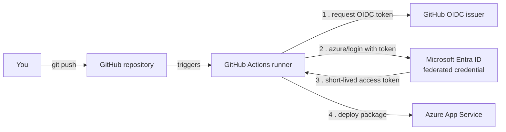

{/*
SCREENSHOT MANIFEST - capture the following and save under
static/img/labs/deploy-with-github-actions/. Lightweight placeholder PNGs are
committed so the build passes; replace them with real captures later. All images
are referenced as /img/labs/deploy-with-github-actions/<name>.png

1. deployment-center-github.png
   URL/blade: App Service -> Deployment -> Deployment Center -> Source = GitHub
   Capture: Deployment Center with Source set to GitHub, an Organization,
   Repository, and Branch selected, and Authentication type set to
   "User-assigned managed identity" (the keyless option), before selecting Save.

2. deployment-center-logs.png
   URL/blade: App Service -> Deployment -> Deployment Center -> Logs tab
   Capture: the Logs tab showing a successful (green) deployment triggered by a
   GitHub Actions run, with the commit and status visible.

3. github-actions-run.png
   URL/blade: GitHub repo -> Actions tab -> the workflow run
   Capture: a completed workflow run showing the build and deploy jobs green,
   with the "Deploy to Azure Web App" step expanded.

4. github-actions-oidc-login.png
   URL/blade: GitHub repo -> Actions -> workflow run -> Azure Login step
   Capture: the expanded "Azure Login" (azure/login@v2) step log showing a
   successful federated (OIDC) sign-in with no secret in the output.

5. github-repo-secrets.png
   URL/blade: GitHub repo -> Settings -> Secrets and variables -> Actions
   Capture: the repository secrets list showing AZURE_CLIENT_ID,
   AZURE_TENANT_ID, and AZURE_SUBSCRIPTION_ID (values hidden). No publish
   profile or client secret is present.

6. app-running.png
   URL/blade: the running app in a browser tab
   Capture: the deployed app at *.azurewebsites.net returning its page after the
   GitHub Actions deployment completes.
*/}

import Tabs from '@theme/Tabs';
import TabItem from '@theme/TabItem';
import PathPicker from '@site/src/components/PathPicker';
import Prerequisites from '@site/src/components/SharedMarkdown/_prerequisites.mdx';

# Deploy to App Service with GitHub Actions

In this lab, you set up continuous deployment from a GitHub repository to [Azure App Service](https://learn.microsoft.com/azure/app-service/overview) using [GitHub Actions](https://docs.github.com/actions). Every push to your main branch builds your app and deploys it, with no manual steps.

You'll lead with the recommended keyless path: **OpenID Connect (OIDC)** federated credentials. Your workflow signs in to Azure with a short-lived token that GitHub issues at run time, so there are no long-lived secrets or publish profiles to store or rotate. The lab also shows the publish-profile and service-principal-secret alternatives so you can recognize them, but OIDC is the pattern to reach for.

You'll set this up three ways so you can pick the workflow that fits you:

- **Azure Developer CLI (azd)** - `azd pipeline config` wires up the federated credential, role assignment, and workflow for you.
- **Azure CLI (az)** - explicit commands that create the identity, federated credential, and role assignment.
- **Azure portal** - the visual **Deployment Center** experience.

You can follow the lab in your language of choice: **.NET**, **Node.js**, **Python**, **Java**, or **PHP**. Each path calls out the differences between **Linux** and **Windows** App Service plans.

:::info App Service Labs complements Microsoft Learn
This lab is a hands-on, end-to-end walkthrough. For reference depth on any concept, follow the "Learn more" links to the official Microsoft Learn articles.
:::

**Estimated time:** 25-35 minutes

## What you'll build

A GitHub Actions workflow that builds your app and deploys it to an App Service web app on every push to `main`. The workflow authenticates to Azure with an OIDC federated credential on a user-assigned managed identity, so no secrets are stored in GitHub. When it finishes, the app returns HTTP `200` at its `https://<app-name>.azurewebsites.net` hostname.

## Objectives

By the end of this lab you will be able to:

- Explain how GitHub Actions authenticates to Azure with OIDC federated credentials instead of stored secrets.
- Create a user-assigned managed identity, add a GitHub federated credential, and grant it least-privilege access to your web app.
- Author a `.github/workflows` pipeline that builds and deploys **.NET**, **Node.js**, **Python**, **Java**, or **PHP** on **Linux** or **Windows**.
- Verify a deployment end to end and confirm the app returns HTTP `200`.
- Recognize the publish-profile and service-principal-secret alternatives and why OIDC is preferred.

<Prerequisites
  tools={[
    { name: 'A GitHub account and a repository', url: 'https://github.com/new', description: 'with your app code (or fork a sample linked in each language step)' },
    { name: 'Azure Developer CLI (azd)', url: 'https://learn.microsoft.com/azure/developer/azure-developer-cli/install-azd', description: '(for the azd path)' },
    { name: 'The SDK or runtime for your chosen language', description: '(.NET SDK, Node.js, Python, JDK + Maven, or PHP)' },
  ]}
/>

:::tip Choose a region and low-cost tier
This lab uses the **East US** region and the **B1 (Basic)** pricing tier, a low-cost option that's ideal for learning. You can change the region to one near you.
:::

:::note Permissions for OIDC
Creating a **user-assigned managed identity** and a **federated credential** needs Contributor on your resource group - the same permission you use to create the app - so the recommended path in this lab does **not** require creating a Microsoft Entra app registration. The app-registration alternative later in the lab is marked **[Manual / admin]** because it needs directory permissions many corporate tenants restrict.
:::

## How continuous deployment works

When you push to your repository, GitHub Actions runs your workflow on a hosted runner. The workflow builds your app, then signs in to Azure and deploys. With OIDC, the sign-in step exchanges a GitHub-issued token for a short-lived Azure access token - no secret is stored anywhere.



The trust is established by a **federated credential**: you tell Azure to trust tokens from GitHub's issuer for a specific repository and branch (the token's `subject`). GitHub never holds an Azure secret; it proves its identity per run.

## Choose your authentication method

`azure/login` supports three ways to authenticate. Lead with OIDC.

| Method | What GitHub stores | Rotation | Recommendation |
| :-- | :-- | :-- | :-- |
| **OIDC federated credential** (this lab) | Client, tenant, and subscription IDs only (not secrets) | Nothing to rotate | **Recommended** - keyless and least-privilege |
| **Service principal secret** | A client secret in `AZURE_CREDENTIALS` | Expires; must rotate | Use only where OIDC isn't possible |
| **Publish profile** | The app's publish profile XML | Regenerate if leaked | Simplest, but a broad long-lived credential |

:::tip Why keyless
A leaked publish profile or client secret is a standing risk until you notice and rotate it. An OIDC federated credential has nothing to leak: the token GitHub presents is valid for minutes and only for the repository and branch you trust. See [Use GitHub Actions to connect to Azure](https://learn.microsoft.com/azure/developer/github/connect-from-azure-openid-connect).
:::

## Set up the app and identity

Set your path once, then follow the matching steps and code samples below.

<PathPicker
  description="Set these once - every matching step and code sample below follows your choice."
  groups={[
    { id: 'tooling', label: 'Tooling', options: [
      { value: 'azd', label: 'azd' },
      { value: 'az', label: 'az CLI' },
      { value: 'portal', label: 'Portal' },
    ]},
    { id: 'language', label: 'Language', options: [
      { value: 'dotnet', label: '.NET' },
      { value: 'node', label: 'Node.js' },
      { value: 'python', label: 'Python' },
      { value: 'java', label: 'Java' },
      { value: 'php', label: 'PHP' },
    ]},
    { id: 'os', label: 'OS', options: [
      { value: 'linux', label: 'Linux' },
      { value: 'windows', label: 'Windows' },
    ]},
  ]}
/>

<Tabs groupId="tooling" queryString>

<TabItem value="azd" label="Azure Developer CLI (azd)">

The Azure Developer CLI can provision your app **and** configure the GitHub Actions pipeline, including the OIDC federated credential and role assignment, in one command.

### 1. Initialize and provision

From your app's folder, initialize an `azd` project (or start from a template), then provision the app:

```bash
azd auth login
azd init
azd provision
```

`azd init` detects your language and scaffolds `azure.yaml` plus an `infra/` folder. `azd provision` creates the App Service plan and web app.

### 2. Configure the pipeline with OIDC

```bash
azd pipeline config --provider github
```

This command:

- Creates (or reuses) a managed identity or app registration.
- Adds a **federated credential** so GitHub Actions can sign in without a secret.
- Grants the identity access to your resources.
- Commits a ready-to-run workflow under `.github/workflows/`.

When prompted, choose **federated credential (OIDC)** rather than a client secret.

:::tip azd writes the workflow for you
`azd pipeline config` generates a workflow that runs `azd deploy`. If you'd rather use the language-specific `azure/webapps-deploy` workflow shown in the next section, keep the identity and secrets `azd` created and replace the workflow file.
:::

### 3. Push to trigger a deploy

```bash
git add .
git commit -m "Configure GitHub Actions deployment"
git push
```

Open the **Actions** tab of your repository to watch the run.

</TabItem>

<TabItem value="az" label="Azure CLI (az)">

With the Azure CLI you create each piece explicitly: the app, a user-assigned managed identity, a GitHub federated credential, and a least-privilege role assignment. This is the keyless path validated for this lab.

### 1. Sign in and set variables

```bash
az login
```

```bash
export RESOURCE_GROUP=rg-gha-lab
export LOCATION=eastus
export PLAN_NAME=plan-gha-lab
export APP_NAME=app-gha-$RANDOM
export IDENTITY_NAME=id-gha-deploy
# Your GitHub repo, in the form owner/repo:
export GH_REPO=your-org/your-repo
```

### 2. Create the resource group, plan, and web app

```bash
az group create --name $RESOURCE_GROUP --location $LOCATION
```

Create the plan. Use `--is-linux` for a Linux plan, or omit it for Windows:

<Tabs groupId="os" queryString>

<TabItem value="linux" label="Linux">

```bash
az appservice plan create \
  --name $PLAN_NAME \
  --resource-group $RESOURCE_GROUP \
  --sku B1 \
  --is-linux
```

</TabItem>

<TabItem value="windows" label="Windows">

```bash
az appservice plan create \
  --name $PLAN_NAME \
  --resource-group $RESOURCE_GROUP \
  --sku B1
```

</TabItem>

</Tabs>

Create the web app with the runtime for your language (list options with `az webapp list-runtimes --os linux`):

<Tabs groupId="language" queryString>
<TabItem value="dotnet" label=".NET">

```bash
az webapp create -g $RESOURCE_GROUP -p $PLAN_NAME -n $APP_NAME --runtime "DOTNETCORE:8.0"
```

</TabItem>
<TabItem value="node" label="Node.js">

```bash
az webapp create -g $RESOURCE_GROUP -p $PLAN_NAME -n $APP_NAME --runtime "NODE:22-lts"
```

</TabItem>
<TabItem value="python" label="Python">

Python runs on **Linux plans only**.

```bash
az webapp create -g $RESOURCE_GROUP -p $PLAN_NAME -n $APP_NAME --runtime "PYTHON:3.13"
```

</TabItem>
<TabItem value="java" label="Java">

```bash
az webapp create -g $RESOURCE_GROUP -p $PLAN_NAME -n $APP_NAME --runtime "JAVA:17-java17"
```

</TabItem>
<TabItem value="php" label="PHP">

PHP runs on **Linux plans only**.

```bash
az webapp create -g $RESOURCE_GROUP -p $PLAN_NAME -n $APP_NAME --runtime "PHP:8.4"
```

</TabItem>
</Tabs>

### 3. Create a managed identity and federated credential

Create a user-assigned managed identity - the workload identity GitHub Actions will sign in as:

```bash
az identity create --name $IDENTITY_NAME --resource-group $RESOURCE_GROUP
```

Add a **federated credential** that trusts GitHub Actions tokens from your repository's `main` branch. The `subject` must match the token GitHub issues for the branch (`repo:<owner>/<repo>:ref:refs/heads/main`):

```bash
az identity federated-credential create \
  --name gha-main \
  --identity-name $IDENTITY_NAME \
  --resource-group $RESOURCE_GROUP \
  --issuer "https://token.actions.githubusercontent.com" \
  --subject "repo:${GH_REPO}:ref:refs/heads/main" \
  --audiences "api://AzureADTokenExchange"
```

:::note Match the subject to your trigger
The `subject` pins the trust to a branch, tag, pull request, or environment. For a `main`-branch push use `ref:refs/heads/main`; for a tag use `ref:refs/tags/<tag>`; for a GitHub environment use `environment:<name>`. A mismatch is the most common cause of a failed `azure/login`. See [federated identity credential subject claims](https://learn.microsoft.com/entra/workload-id/workload-identity-federation-create-trust#github-actions).
:::

### 4. Grant least-privilege access

Give the identity the **Website Contributor** role scoped to just this web app - enough to deploy, nothing more:

```bash
APP_ID=$(az webapp show -g $RESOURCE_GROUP -n $APP_NAME --query id -o tsv)
IDENTITY_PRINCIPAL_ID=$(az identity show -g $RESOURCE_GROUP -n $IDENTITY_NAME --query principalId -o tsv)

az role assignment create \
  --assignee-object-id $IDENTITY_PRINCIPAL_ID \
  --assignee-principal-type ServicePrincipal \
  --role "Website Contributor" \
  --scope $APP_ID
```

### 5. Save the identity IDs as GitHub secrets

The workflow needs three **non-secret** IDs (they aren't credentials, but storing them as secrets keeps them out of the workflow file). Set them with the [GitHub CLI](https://cli.github.com/):

```bash
CLIENT_ID=$(az identity show -g $RESOURCE_GROUP -n $IDENTITY_NAME --query clientId -o tsv)
TENANT_ID=$(az account show --query tenantId -o tsv)
SUBSCRIPTION_ID=$(az account show --query id -o tsv)

gh secret set AZURE_CLIENT_ID --body "$CLIENT_ID" --repo $GH_REPO
gh secret set AZURE_TENANT_ID --body "$TENANT_ID" --repo $GH_REPO
gh secret set AZURE_SUBSCRIPTION_ID --body "$SUBSCRIPTION_ID" --repo $GH_REPO
```

Note your `APP_NAME` - you'll put it in the workflow next.

</TabItem>

<TabItem value="portal" label="Azure portal">

The portal's **Deployment Center** connects your GitHub repository and generates the workflow for you, including a keyless managed-identity option.

### 1. Create the web app

If you don't have one yet, follow [Deploy your first web app](../getting-started/deploy-your-first-web-app.md) to create an App Service web app with your language's runtime on a **B1** plan in **East US**.

### 2. Open Deployment Center and connect GitHub

In the [Azure portal](https://portal.azure.com), open your web app, then select **Deployment** > **Deployment Center**.

1. Set **Source** to **GitHub** and authorize Azure to access your account if prompted.
1. Select your **Organization**, **Repository**, and **Branch** (for example, `main`).
1. Under **Authentication type**, select **User-assigned managed identity** - the keyless (OIDC) option.
1. Select **Save**.


{/* Capture: Deployment Center with Source=GitHub, org/repo/branch selected, Authentication type=User-assigned managed identity, before Save. */}

Deployment Center commits a workflow file to `.github/workflows/` in your repository, creates the federated credential, and adds the identity IDs as repository secrets - all without a publish profile.

### 3. Watch the first run

Saving triggers the first workflow run. Watch it on the **Logs** tab of Deployment Center, or on the **Actions** tab of your GitHub repository.


{/* Capture: Deployment Center Logs tab with a green deployment from a GitHub Actions run. */}

:::tip Portal generates the workflow
The generated workflow uses `azure/webapps-deploy` with OIDC login. You can edit it in your repository to add build steps or change triggers, just like the hand-authored versions in the next section.
:::

</TabItem>

</Tabs>

## Add the GitHub Actions workflow

Create `.github/workflows/deploy.yml` in your repository. The workflow has two jobs: **build** produces a deployable artifact, and **deploy** signs in with OIDC and publishes it. Pin action versions and use `azure/login@v2`.

:::warning Two permissions are required for OIDC
The `permissions` block is mandatory: `id-token: write` lets the job request the OIDC token, and `contents: read` lets it check out your code. Without `id-token: write`, `azure/login` can't use federated credentials.
:::

Set `AZURE_WEBAPP_NAME` to your app's name. The `AZURE_*` values come from the repository secrets you created.

<Tabs groupId="language" queryString>

<TabItem value="dotnet" label=".NET">

The build job publishes a self-contained folder; the deploy job pushes it. On **Windows** plans, the same workflow works - only the app's runtime differs.

```yaml
name: Deploy to App Service

on:
  push:
    branches: [main]
  workflow_dispatch:

permissions:
  id-token: write
  contents: read

env:
  AZURE_WEBAPP_NAME: your-app-name
  DOTNET_VERSION: '8.0.x'

jobs:
  build:
    runs-on: ubuntu-latest
    steps:
      - uses: actions/checkout@v4
      - uses: actions/setup-dotnet@v4
        with:
          dotnet-version: ${{ env.DOTNET_VERSION }}
      - name: Publish
        run: dotnet publish -c Release -o ${{ github.workspace }}/publish
      - uses: actions/upload-artifact@v4
        with:
          name: app
          path: ${{ github.workspace }}/publish

  deploy:
    runs-on: ubuntu-latest
    needs: build
    steps:
      - uses: actions/download-artifact@v4
        with:
          name: app
          path: ./publish
      - name: Azure Login
        uses: azure/login@v2
        with:
          client-id: ${{ secrets.AZURE_CLIENT_ID }}
          tenant-id: ${{ secrets.AZURE_TENANT_ID }}
          subscription-id: ${{ secrets.AZURE_SUBSCRIPTION_ID }}
      - name: Deploy to Azure Web App
        uses: azure/webapps-deploy@v3
        with:
          app-name: ${{ env.AZURE_WEBAPP_NAME }}
          package: ./publish
```

</TabItem>

<TabItem value="node" label="Node.js">

Install dependencies (and build, if your app has a build step) in the build job, then deploy the folder.

```yaml
name: Deploy to App Service

on:
  push:
    branches: [main]
  workflow_dispatch:

permissions:
  id-token: write
  contents: read

env:
  AZURE_WEBAPP_NAME: your-app-name
  NODE_VERSION: '22.x'

jobs:
  build:
    runs-on: ubuntu-latest
    steps:
      - uses: actions/checkout@v4
      - uses: actions/setup-node@v4
        with:
          node-version: ${{ env.NODE_VERSION }}
      - name: Install and build
        run: |
          npm ci
          npm run build --if-present
      - uses: actions/upload-artifact@v4
        with:
          name: app
          path: .

  deploy:
    runs-on: ubuntu-latest
    needs: build
    steps:
      - uses: actions/download-artifact@v4
        with:
          name: app
          path: .
      - name: Azure Login
        uses: azure/login@v2
        with:
          client-id: ${{ secrets.AZURE_CLIENT_ID }}
          tenant-id: ${{ secrets.AZURE_TENANT_ID }}
          subscription-id: ${{ secrets.AZURE_SUBSCRIPTION_ID }}
      - name: Deploy to Azure Web App
        uses: azure/webapps-deploy@v3
        with:
          app-name: ${{ env.AZURE_WEBAPP_NAME }}
          package: .
```

:::note Windows and Node.js
On a **Windows** plan, Node apps run behind iisnode and may need a `web.config`. Linux plans run Node directly with your `start` script, so no `web.config` is required. Prefer Linux for Node unless you have a Windows-specific dependency.
:::

</TabItem>

<TabItem value="python" label="Python">

Python runs on **Linux plans only**. Deploy your source and let App Service build it with Oryx (set the `SCM_DO_BUILD_DURING_DEPLOYMENT` app setting to `true`), or install dependencies in the workflow. This example deploys source.

```yaml
name: Deploy to App Service

on:
  push:
    branches: [main]
  workflow_dispatch:

permissions:
  id-token: write
  contents: read

env:
  AZURE_WEBAPP_NAME: your-app-name
  PYTHON_VERSION: '3.13'

jobs:
  build:
    runs-on: ubuntu-latest
    steps:
      - uses: actions/checkout@v4
      - uses: actions/setup-python@v5
        with:
          python-version: ${{ env.PYTHON_VERSION }}
      - name: Install dependencies
        run: pip install -r requirements.txt
      - uses: actions/upload-artifact@v4
        with:
          name: app
          path: .

  deploy:
    runs-on: ubuntu-latest
    needs: build
    steps:
      - uses: actions/download-artifact@v4
        with:
          name: app
          path: .
      - name: Azure Login
        uses: azure/login@v2
        with:
          client-id: ${{ secrets.AZURE_CLIENT_ID }}
          tenant-id: ${{ secrets.AZURE_TENANT_ID }}
          subscription-id: ${{ secrets.AZURE_SUBSCRIPTION_ID }}
      - name: Deploy to Azure Web App
        uses: azure/webapps-deploy@v3
        with:
          app-name: ${{ env.AZURE_WEBAPP_NAME }}
          package: .
```

</TabItem>

<TabItem value="java" label="Java">

Build the JAR with Maven, then deploy it. App Service runs the JAR directly on both Linux and Windows plans.

```yaml
name: Deploy to App Service

on:
  push:
    branches: [main]
  workflow_dispatch:

permissions:
  id-token: write
  contents: read

env:
  AZURE_WEBAPP_NAME: your-app-name
  JAVA_VERSION: '17'

jobs:
  build:
    runs-on: ubuntu-latest
    steps:
      - uses: actions/checkout@v4
      - uses: actions/setup-java@v4
        with:
          distribution: 'microsoft'
          java-version: ${{ env.JAVA_VERSION }}
      - name: Build with Maven
        run: mvn -B package --file pom.xml
      - uses: actions/upload-artifact@v4
        with:
          name: app
          path: '${{ github.workspace }}/target/*.jar'

  deploy:
    runs-on: ubuntu-latest
    needs: build
    steps:
      - uses: actions/download-artifact@v4
        with:
          name: app
          path: .
      - name: Azure Login
        uses: azure/login@v2
        with:
          client-id: ${{ secrets.AZURE_CLIENT_ID }}
          tenant-id: ${{ secrets.AZURE_TENANT_ID }}
          subscription-id: ${{ secrets.AZURE_SUBSCRIPTION_ID }}
      - name: Deploy to Azure Web App
        uses: azure/webapps-deploy@v3
        with:
          app-name: ${{ env.AZURE_WEBAPP_NAME }}
          package: '*.jar'
```

</TabItem>

<TabItem value="php" label="PHP">

PHP runs on **Linux plans only**. Deploy your source; App Service serves it with the PHP runtime.

```yaml
name: Deploy to App Service

on:
  push:
    branches: [main]
  workflow_dispatch:

permissions:
  id-token: write
  contents: read

env:
  AZURE_WEBAPP_NAME: your-app-name

jobs:
  build:
    runs-on: ubuntu-latest
    steps:
      - uses: actions/checkout@v4
      - name: Install Composer dependencies
        run: composer install --no-dev --optimize-autoloader --no-interaction
        # Skip if your project has no composer.json
        continue-on-error: true
      - uses: actions/upload-artifact@v4
        with:
          name: app
          path: .

  deploy:
    runs-on: ubuntu-latest
    needs: build
    steps:
      - uses: actions/download-artifact@v4
        with:
          name: app
          path: .
      - name: Azure Login
        uses: azure/login@v2
        with:
          client-id: ${{ secrets.AZURE_CLIENT_ID }}
          tenant-id: ${{ secrets.AZURE_TENANT_ID }}
          subscription-id: ${{ secrets.AZURE_SUBSCRIPTION_ID }}
      - name: Deploy to Azure Web App
        uses: azure/webapps-deploy@v3
        with:
          app-name: ${{ env.AZURE_WEBAPP_NAME }}
          package: .
```

</TabItem>

</Tabs>

Commit and push the workflow to trigger a deployment:

```bash
git add .github/workflows/deploy.yml
git commit -m "Add GitHub Actions deployment workflow"
git push
```


{/* Capture: completed workflow run in the Actions tab with build and deploy jobs green and the Deploy step expanded. */}

The **Azure Login** step signs in with the OIDC token - notice there's no secret in the log, only the federated exchange.


{/* Capture: expanded azure/login@v2 step showing successful federated sign-in with no secret. */}

## Verify your deployment

When the workflow completes, open the app's URL in a browser, or test it from the command line and confirm you get an HTTP `200` response:

```bash
curl -I https://<your-app-name>.azurewebsites.net
```

Expected output (validated during authoring):

```text
HTTP/1.1 200 OK
Content-Type: text/html
```


{/* Capture: the deployed app at *.azurewebsites.net returning its page. */}

You can confirm no secrets are stored: in your repository, go to **Settings** > **Secrets and variables** > **Actions**. You should see only `AZURE_CLIENT_ID`, `AZURE_TENANT_ID`, and `AZURE_SUBSCRIPTION_ID` - no publish profile and no client secret.


{/* Capture: Actions secrets list with the three AZURE_ IDs and no publish profile or client secret. */}

:::tip First request can be slow
The first request after a deployment may take a few seconds while the app starts. If you see a "starting" or `503` page, wait a moment and refresh.
:::

## Alternatives to OIDC

OIDC is the recommended path, but you may encounter these older approaches. Both store a long-lived credential in GitHub, so treat them as fallbacks.

### Service principal with a client secret

If you can't use OIDC, create a service principal secret and store the whole JSON blob as one secret named `AZURE_CREDENTIALS`.

**[Manual / admin]** Creating a service principal needs permission to create a Microsoft Entra app registration, which many corporate tenants restrict. Ask an administrator if the command fails.

```bash
az ad sp create-for-rbac \
  --name gha-deploy-sp \
  --role "Website Contributor" \
  --scopes /subscriptions/<sub-id>/resourceGroups/<rg>/providers/Microsoft.Web/sites/<app-name> \
  --json-auth
```

Store the output as the `AZURE_CREDENTIALS` secret, then sign in with `creds` instead of the three IDs:

```yaml
      - name: Azure Login
        uses: azure/login@v2
        with:
          creds: ${{ secrets.AZURE_CREDENTIALS }}
```

The client secret expires and must be rotated. Prefer adding a federated credential to the same app registration to go keyless.

### Publish profile

The simplest option is the app's **publish profile**, a single file that contains deployment credentials. Download it and store it as a secret named `AZURE_WEBAPP_PUBLISH_PROFILE`:

```bash
az webapp deployment list-publishing-profiles \
  --resource-group <rg> --name <app-name> --xml
```

Then deploy without a separate login step:

```yaml
      - name: Deploy to Azure Web App
        uses: azure/webapps-deploy@v3
        with:
          app-name: your-app-name
          publish-profile: ${{ secrets.AZURE_WEBAPP_PUBLISH_PROFILE }}
          package: .
```

:::warning Publish profiles are broad, long-lived credentials
A publish profile grants full deployment access and doesn't expire on its own. If it leaks, regenerate it immediately with `az webapp deployment list-publishing-profiles`. Disable basic authentication and use OIDC where you can.
:::

## Clean up resources

To avoid ongoing charges, delete the resources when you're done. Deleting the resource group removes the web app, App Service plan, and managed identity. Removing the GitHub secrets and workflow file is optional.

<Tabs groupId="tooling" queryString>

<TabItem value="azd" label="Azure Developer CLI (azd)">

```bash
azd down --purge --force
```

</TabItem>

<TabItem value="az" label="Azure CLI (az)">

```bash
az group delete --name $RESOURCE_GROUP --yes --no-wait
```

Confirm the group is gone (returns `false` when deletion completes):

```bash
az group exists --name $RESOURCE_GROUP
```

</TabItem>

<TabItem value="portal" label="Azure portal">

In the portal, open your resource group, select **Delete resource group**, enter the group name to confirm, and select **Delete**.

</TabItem>

</Tabs>

## Summary

In this lab, you set up continuous deployment from GitHub to Azure App Service and confirmed the app returns HTTP `200`. You learned how to:

- Authenticate GitHub Actions to Azure with **OIDC federated credentials** instead of stored secrets.
- Create a **user-assigned managed identity**, add a GitHub **federated credential**, and grant **least-privilege** access with the Website Contributor role.
- Author a build-and-deploy workflow for **.NET**, **Node.js**, **Python**, **Java**, or **PHP**, on **Linux** or **Windows**.
- Set up the pipeline three ways - with **azd**, the **Azure CLI**, and the portal's **Deployment Center**.
- Recognize the publish-profile and service-principal-secret alternatives and why OIDC is preferred.

## Troubleshooting

**`azure/login` fails with `AADSTS70021: No matching federated identity record found`.**
The token's `subject` doesn't match your federated credential. Confirm the credential's subject matches the trigger - for a `main` push it must be `repo:<owner>/<repo>:ref:refs/heads/main`. Check with `az identity federated-credential list --identity-name <name> -g <rg> -o table`.

**`azure/login` fails with `Unable to get ACTIONS_ID_TOKEN_REQUEST_URL`.**
The job is missing `permissions: id-token: write`. Add the `permissions` block at the workflow or job level.

**Deploy step returns `403` or `AuthorizationFailed`.**
The identity lacks a role on the app. Assign **Website Contributor** (or Contributor) scoped to the web app, as shown in step 4. Role assignments can take a minute to propagate.

**The app shows a default page or `503` after a successful deploy.**
The package layout may not match the runtime's expectations, or the app is still starting. Wait and refresh. For Linux Node or Python, confirm your start command and that dependencies were installed (set `SCM_DO_BUILD_DURING_DEPLOYMENT=true` if you deploy source).

**Workflow doesn't trigger on push.**
Confirm the file is at `.github/workflows/deploy.yml` on the branch in `on: push: branches`, and that Actions is enabled under the repository's **Settings** > **Actions**.

## Learn more

- [Deploy to App Service using GitHub Actions](https://learn.microsoft.com/azure/app-service/deploy-github-actions)
- [Use GitHub Actions to connect to Azure with OpenID Connect](https://learn.microsoft.com/azure/developer/github/connect-from-azure-openid-connect)
- [Configure a federated identity credential on a user-assigned managed identity](https://learn.microsoft.com/entra/workload-id/workload-identity-federation-config-app-trust-managed-identity)
- [azure/login action](https://github.com/Azure/login)
- [azure/webapps-deploy action](https://github.com/Azure/webapps-deploy)
- [Azure Developer CLI: configure a pipeline](https://learn.microsoft.com/azure/developer/azure-developer-cli/configure-devops-pipeline)
- [Continuous deployment to App Service](https://learn.microsoft.com/azure/app-service/deploy-continuous-deployment)
