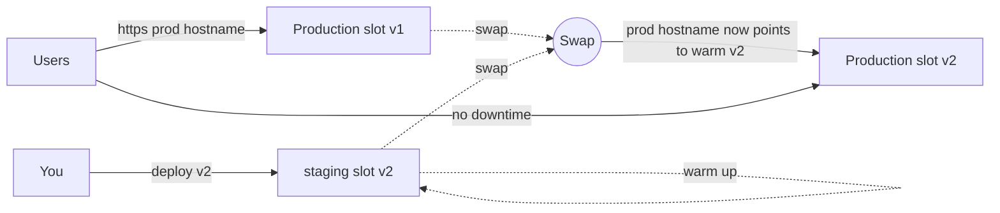

import Tabs from '@theme/Tabs';
import TabItem from '@theme/TabItem';
import PathPicker from '@site/src/components/PathPicker';
import Prerequisites from '@site/src/components/SharedMarkdown/_prerequisites.mdx';

# Use deployment slots for zero-downtime releases

In this lab, you release a new version of a web app to [Azure App Service](https://learn.microsoft.com/azure/app-service/overview) with no downtime, using a [deployment slot](https://learn.microsoft.com/azure/app-service/deploy-staging-slots) and a swap. A deployment slot is a live copy of your app with its own hostname. You deploy and warm up the new version in a `staging` slot, then swap it into production in a few seconds. Because the swap only re-points traffic once the new instances are ready, your users never see a cold start or a broken deploy.

You will deploy version 1 (`v1`) to production, create a `staging` slot, deploy version 2 (`v2`) to staging, warm it up, and swap. Production then serves `v2`. If something looks wrong, you swap back to instantly roll back to `v1`. You also configure slot-specific ("sticky") settings that stay put during a swap, and see how swap with preview lets you validate production configuration before you commit.

You will do this three ways so you can pick the workflow that fits you:

- **Azure Developer CLI (azd)** - provision the app (and slot) from infrastructure, then deploy.
- **Azure CLI (az)** - explicit `az webapp deployment slot` commands to create, deploy, and swap.
- **Azure portal** - the visual **Deployment slots** blade.

Slots are language-agnostic: the swap mechanics are identical whether your app is **.NET**, **Node.js**, **Python**, **Java**, or **PHP**. The lab uses a tiny app that prints its version so you can see the swap happen; pick your language for the app, and the slot steps stay the same.

:::info App Service Labs complements Microsoft Learn
This lab is a hands-on, end-to-end walkthrough. For reference depth on any concept, follow the "Learn more" links to the official Microsoft Learn articles.
:::

**Estimated time:** 30-45 minutes

## What you'll build

A production web app on a **Standard (S1)** App Service plan with a `staging` deployment slot. You deploy `v1` to production and `v2` to staging, then swap staging into production with zero downtime. When you finish, `curl` against the production hostname returns HTTP `200` with a body that changes from `Hello from v1` to `Hello from v2` across the swap - and back again after you roll back.

## Objectives

By the end of this lab you will be able to:

- Explain how a slot swap gives you a zero-downtime release and an instant rollback.
- Create a `staging` deployment slot on a Standard-or-higher App Service plan.
- Deploy different versions to production and staging, then swap them.
- Configure slot-specific (sticky) settings that do not move during a swap.
- Use swap with preview to validate production configuration before completing the swap.
- Roll back a bad release by swapping back.

<Prerequisites
  tools={[
    { name: 'Azure Developer CLI (azd)', url: 'https://learn.microsoft.com/azure/developer/azure-developer-cli/install-azd', description: '(for the azd path)' },
    { name: 'The SDK or runtime for your chosen language', description: '(.NET SDK, Node.js, Python, JDK + Maven, or PHP - linked in each step)' },
  ]}
/>

:::caution Slots need Standard tier or higher
Deployment slots are a feature of the **Standard**, **Premium**, and **Isolated** pricing tiers. The **Free (F1)** and **Basic (B1, B2, B3)** tiers have **no** slots - you cannot create one there. This lab uses the **Standard S1** tier (Linux, about USD 70/month), the smallest tier that supports slots. Standard S1 includes up to 5 slots per app. Delete the resources when you finish (see Clean up) so you are not billed for idle time.
:::

## How a slot swap works

Each slot is a full deployment of your app with its own hostname (`https://<app>-<slot>.azurewebsites.net`). You deploy to the `staging` slot and let it warm up - App Service starts the app and, when configured, hits its warm-up path so the runtime is JIT-compiled and caches are primed.

A **swap** does not copy files. It swaps the two slots' running instances and their non-sticky configuration, after warming up the source slot against the target's settings. Because the staging instances are already running and warm, App Service just re-points the production hostname to them. In-flight requests finish on the old instances; new requests land on the new ones. There is no restart on the production hostname, so there is no downtime.



After the swap, the old production version (`v1`) lives in the `staging` slot. That is your rollback: swap again and production instantly serves `v1` once more.

:::note Sticky (slot) settings
Most app settings and connection strings move with the app during a swap. You can mark specific ones as a **deployment slot setting** ("sticky") so they stay with the slot instead. Use sticky settings for anything that must differ between staging and production - for example, a `staging` slot that points at a test database, or a feature flag you only turn on in production.
:::

## Set your path

Set your tooling and language once. Every matching step and code sample below follows your choice.

<PathPicker
  description="Set these once - every matching step and code sample below follows your choice."
  groups={[
    { id: 'tooling', label: 'Tooling', options: [
      { value: 'azd', label: 'azd' },
      { value: 'az', label: 'az CLI' },
      { value: 'portal', label: 'Portal' },
    ]},
    { id: 'language', label: 'Language', options: [
      { value: 'dotnet', label: '.NET' },
      { value: 'node', label: 'Node.js' },
      { value: 'python', label: 'Python' },
      { value: 'java', label: 'Java' },
      { value: 'php', label: 'PHP' },
    ]},
  ]}
/>

## Create the app and deploy v1

First, create a web app on a Standard S1 plan and deploy version 1. Use the tiny "prints its version" app below, or bring your own - the slot steps are the same either way.

The app is intentionally minimal: it returns a single line, `Hello from v1`, and reads an optional `RELEASE_COLOR` setting so you can see sticky settings in action. For `v2`, you change `v1` to `v2` in the response and redeploy - nothing else changes.

<Tabs groupId="language" queryString>
<TabItem value="dotnet" label=".NET">

Create a minimal API in `Program.cs`:

```csharp
var builder = WebApplication.CreateBuilder(args);
var app = builder.Build();
var version = "v1"; // change to "v2" for the second release
app.MapGet("/", () =>
{
    var color = Environment.GetEnvironmentVariable("RELEASE_COLOR") ?? "none";
    return Results.Text($"Hello from {version} (slot color: {color})\n");
});
app.Run();
```

</TabItem>
<TabItem value="node" label="Node.js">

Create `server.js`:

```javascript
const http = require('http');
const VERSION = 'v1'; // change to 'v2' for the second release
const port = process.env.PORT || 8080;
http.createServer((req, res) => {
  const color = process.env.RELEASE_COLOR || 'none';
  res.writeHead(200, { 'Content-Type': 'text/plain' });
  res.end(`Hello from ${VERSION} (slot color: ${color})\n`);
}).listen(port);
```

Add a `package.json` with a `start` script:

```json
{
  "name": "slots-demo",
  "version": "1.0.0",
  "main": "server.js",
  "scripts": { "start": "node server.js" }
}
```

</TabItem>
<TabItem value="python" label="Python">

Python runs on **Linux plans only**. Create `app.py`:

```python
import os
from flask import Flask

app = Flask(__name__)
VERSION = "v1"  # change to "v2" for the second release

@app.route("/")
def home():
    color = os.environ.get("RELEASE_COLOR", "none")
    return f"Hello from {VERSION} (slot color: {color})\n", 200, {"Content-Type": "text/plain"}
```

Add a `requirements.txt`:

```text
flask
gunicorn
```

</TabItem>
<TabItem value="java" label="Java">

Create a minimal Spring Boot controller. The app packages as a JAR that App Service runs directly:

```java
import org.springframework.boot.SpringApplication;
import org.springframework.boot.autoconfigure.SpringBootApplication;
import org.springframework.web.bind.annotation.GetMapping;
import org.springframework.web.bind.annotation.RestController;

@SpringBootApplication
@RestController
public class DemoApplication {
    static final String VERSION = "v1"; // change to "v2" for the second release

    public static void main(String[] args) {
        SpringApplication.run(DemoApplication.class, args);
    }

    @GetMapping(value = "/", produces = "text/plain")
    public String home() {
        String color = System.getenv().getOrDefault("RELEASE_COLOR", "none");
        return "Hello from " + VERSION + " (slot color: " + color + ")\n";
    }
}
```

</TabItem>
<TabItem value="php" label="PHP">

PHP runs on **Linux plans only**. Create `index.php`:

```php
<?php
$version = 'v1'; // change to 'v2' for the second release
$color = getenv('RELEASE_COLOR') ?: 'none';
header('Content-Type: text/plain');
echo "Hello from {$version} (slot color: {$color})\n";
```

</TabItem>
</Tabs>

Now create the app and deploy `v1`. Choose your tooling.

<Tabs groupId="tooling" queryString>

<TabItem value="azd" label="Azure Developer CLI (azd)">

With `azd` you define the app **and** its `staging` slot in infrastructure, then deploy. `azd deploy` targets the production slot; you deploy to staging with `az` in a later step.

### 1. Sign in

```bash
azd auth login
```

### 2. Add an azure.yaml and infrastructure

In your app folder, create `azure.yaml` (set `language` to `dotnet`, `js`, `python`, or `java`):

```yaml
# yaml-language-server: $schema=https://raw.githubusercontent.com/Azure/azure-dev/main/schemas/v1.0/azure.yaml.json
name: slots-demo
services:
  web:
    project: ./src
    language: js
    host: appservice
```

Create `infra/main.parameters.json`:

```json
{
  "$schema": "https://schema.management.azure.com/schemas/2019-04-01/deploymentParameters.json#",
  "contentVersion": "1.0.0.0",
  "parameters": {
    "environmentName": { "value": "${AZURE_ENV_NAME}" },
    "location": { "value": "${AZURE_LOCATION}" },
    "resourceGroupName": { "value": "${AZURE_RESOURCE_GROUP}" }
  }
}
```

Create `infra/main.bicep`. It runs at subscription scope so `azd` creates and owns the resource group:

```bicep
targetScope = 'subscription'

@description('Name of the azd environment; used to derive resource names.')
param environmentName string

@description('Azure region for all resources.')
param location string

@description('Resource group to create for this environment.')
param resourceGroupName string

resource rg 'Microsoft.Resources/resourceGroups@2024-03-01' = {
  name: resourceGroupName
  location: location
}

module resources 'resources.bicep' = {
  name: 'resources'
  scope: rg
  params: {
    location: location
    environmentName: environmentName
  }
}

output WEB_URI string = resources.outputs.webUri
```

Create `infra/resources.bicep`. The key parts are the **S1** plan (slots need Standard or higher) and a child **`staging` slot** resource:

```bicep
@description('Azure region for all resources.')
param location string

@description('Name of the azd environment; used to derive resource names.')
param environmentName string

var token = uniqueString(subscription().id, environmentName, location)
var appName = 'app-${token}'

resource plan 'Microsoft.Web/serverfarms@2023-12-01' = {
  name: 'plan-${token}'
  location: location
  sku: {
    name: 'S1' // Standard - required for deployment slots
    tier: 'Standard'
  }
  kind: 'linux'
  properties: {
    reserved: true
  }
}

resource web 'Microsoft.Web/sites@2023-12-01' = {
  name: appName
  location: location
  tags: { 'azd-service-name': 'web' }
  properties: {
    serverFarmId: plan.id
    siteConfig: {
      linuxFxVersion: 'NODE|22-lts' // match your language
      appCommandLine: 'node server.js'
    }
    httpsOnly: true
  }
}

resource stagingSlot 'Microsoft.Web/sites/slots@2023-12-01' = {
  parent: web
  name: 'staging'
  location: location
  properties: {
    serverFarmId: plan.id
    siteConfig: {
      linuxFxVersion: 'NODE|22-lts'
      appCommandLine: 'node server.js'
    }
    httpsOnly: true
  }
}

output webUri string = 'https://${web.properties.defaultHostName}'
```

:::note Set linuxFxVersion for your language
Use the runtime that matches your app: `DOTNETCORE|8.0`, `NODE|22-lts`, `PYTHON|3.13`, `JAVA|17-java17`, or `PHP|8.4`. List valid values with `az webapp list-runtimes --os linux`. Remove `appCommandLine` for stacks that do not need a custom start command.
:::

### 3. Provision and deploy v1

```bash
azd up
```

`azd up` prompts for an environment name, region, and subscription, then provisions the plan, web app, and `staging` slot and deploys `v1` to production. Note the `WEB_URI` it prints.

</TabItem>

<TabItem value="az" label="Azure CLI (az)">

With the Azure CLI you create each piece explicitly, then deploy `v1` to production.

### 1. Sign in and set variables

```bash
az login
```

```bash
export RESOURCE_GROUP=rg-slots-lab
export LOCATION=eastus
export PLAN_NAME=plan-slots-lab
export APP_NAME=app-slots-$RANDOM
```

### 2. Create the resource group and a Standard plan

```bash
az group create --name $RESOURCE_GROUP --location $LOCATION
```

Create the plan on the **S1 (Standard)** tier - the smallest tier that supports slots:

```bash
az appservice plan create \
  --name $PLAN_NAME \
  --resource-group $RESOURCE_GROUP \
  --sku S1 \
  --is-linux
```

### 3. Create the web app

Create the web app with your language's runtime (list options with `az webapp list-runtimes --os linux`):

<Tabs groupId="language" queryString>
<TabItem value="dotnet" label=".NET">

```bash
az webapp create -g $RESOURCE_GROUP -p $PLAN_NAME -n $APP_NAME --runtime "DOTNETCORE:8.0"
```

</TabItem>
<TabItem value="node" label="Node.js">

```bash
az webapp create -g $RESOURCE_GROUP -p $PLAN_NAME -n $APP_NAME --runtime "NODE:22-lts"
az webapp config set -g $RESOURCE_GROUP -n $APP_NAME --startup-file "node server.js"
```

</TabItem>
<TabItem value="python" label="Python">

Python runs on **Linux plans only**.

```bash
az webapp create -g $RESOURCE_GROUP -p $PLAN_NAME -n $APP_NAME --runtime "PYTHON:3.13"
```

</TabItem>
<TabItem value="java" label="Java">

```bash
az webapp create -g $RESOURCE_GROUP -p $PLAN_NAME -n $APP_NAME --runtime "JAVA:17-java17"
```

</TabItem>
<TabItem value="php" label="PHP">

PHP runs on **Linux plans only**.

```bash
az webapp create -g $RESOURCE_GROUP -p $PLAN_NAME -n $APP_NAME --runtime "PHP:8.4"
```

</TabItem>
</Tabs>

### 4. Deploy v1 to production

Package your app and deploy it to the production slot. This example zips the current folder and deploys it with `az webapp deploy`:

```bash
zip -r v1.zip .
az webapp deploy -g $RESOURCE_GROUP -n $APP_NAME --src-path v1.zip --type zip
```

:::tip Deploy however you like
The slot workflow does not care how you deploy. Any method works - `az webapp deploy`, `azd deploy`, `az webapp up`, GitHub Actions, or the portal. See [Deploy to App Service with GitHub Actions](./deploy-with-github-actions.md) to wire up CI/CD.
:::

</TabItem>

<TabItem value="portal" label="Azure portal">

### 1. Create the web app on a Standard plan

In the [Azure portal](https://portal.azure.com), select **Create a resource** > **Web App**. On the **Basics** tab:

1. Choose your **Subscription** and create or pick a **Resource Group**.
1. Enter a globally unique **Name**.
1. Set **Publish** to **Code** and pick your **Runtime stack** (for example, **Node 22 LTS**).
1. Set **Operating System** to **Linux** and choose a **Region**.
1. Under **App Service plan** > **Pricing plan**, select **Standard S1**. The **Free** and **Basic** tiers do not offer slots, so a lower tier removes the option to add one.
1. Select **Review + create**, then **Create**.

### 2. Deploy v1

Deploy your `v1` code to the app with your preferred method - **Deployment Center** (GitHub or local Git), VS Code, or the Azure CLI. Confirm the app returns `Hello from v1` at `https://<app-name>.azurewebsites.net`.

</TabItem>

</Tabs>

Confirm production serves `v1` before you go on:

```bash
curl https://<app-name>.azurewebsites.net
```

You should see `Hello from v1 (slot color: none)`.

## Create a staging slot

Add a `staging` slot. A new slot starts empty unless you clone configuration from another slot; here you clone from production so staging inherits the same runtime and settings to start.

<Tabs groupId="tooling" queryString>

<TabItem value="azd" label="Azure Developer CLI (azd)">

Your `infra/resources.bicep` already declares the `staging` slot, so `azd up` created it. Confirm it exists:

```bash
az webapp deployment slot list -g <resource-group> -n <app-name> -o table
```

:::tip azd owns the resource group
`azd` created and named the resource group for your environment. Find it with `azd env get-values | grep AZURE_RESOURCE_GROUP`, then use that name where the commands below say `<resource-group>`.
:::

</TabItem>

<TabItem value="az" label="Azure CLI (az)">

```bash
az webapp deployment slot create \
  --resource-group $RESOURCE_GROUP \
  --name $APP_NAME \
  --slot staging \
  --configuration-source $APP_NAME
```

The `--configuration-source` flag clones app settings and configuration from the production slot into the new `staging` slot.

</TabItem>

<TabItem value="portal" label="Azure portal">

1. In your web app, select **Deployment** > **Deployment slots**.
1. Select **Add Slot**.
1. Enter the name `staging`.
1. Under **Clone settings from**, select your production slot so staging inherits its configuration.
1. Select **Add**, then **Close**.

</TabItem>

</Tabs>

The staging slot now has its own hostname: `https://<app-name>-staging.azurewebsites.net`.

## Configure a slot-specific (sticky) setting

Sticky settings stay with a slot during a swap. Mark `RELEASE_COLOR` as a deployment slot setting on **both** slots, with a different value each, so you can watch it stay put when you swap. Production keeps `blue`; staging keeps `green`.

<Tabs groupId="tooling" queryString>

<TabItem value="azd" label="Azure Developer CLI (azd)">

Use `az` to set sticky settings on the slots `azd` provisioned:

```bash
az webapp config appsettings set \
  -g <resource-group> -n <app-name> \
  --slot-settings RELEASE_COLOR=blue

az webapp config appsettings set \
  -g <resource-group> -n <app-name> --slot staging \
  --slot-settings RELEASE_COLOR=green
```

</TabItem>

<TabItem value="az" label="Azure CLI (az)">

```bash
az webapp config appsettings set \
  -g $RESOURCE_GROUP -n $APP_NAME \
  --slot-settings RELEASE_COLOR=blue

az webapp config appsettings set \
  -g $RESOURCE_GROUP -n $APP_NAME --slot staging \
  --slot-settings RELEASE_COLOR=green
```

`--slot-settings` (rather than `--settings`) is what makes each value sticky. A sticky setting does not move during a swap, so production keeps `blue` and staging keeps `green` no matter how many times you swap.

</TabItem>

<TabItem value="portal" label="Azure portal">

1. In your web app, select **Settings** > **Environment variables**.
1. Add an app setting named `RELEASE_COLOR` with value `blue`, and select **Deployment slot setting** so it becomes sticky. Select **Apply**.
1. Switch to the `staging` slot (use the slot picker at the top of the app blade), open **Environment variables**, and add `RELEASE_COLOR` = `green`, also marked as a **Deployment slot setting**. Select **Apply**.

</TabItem>

</Tabs>

## Deploy v2 to staging and warm it up

Now build version 2. Change the version string in your app from `v1` to `v2` (the one-line change called out in each language sample above), then deploy it to the **staging** slot only. Production keeps serving `v1` the whole time.

<Tabs groupId="tooling" queryString>

<TabItem value="azd" label="Azure Developer CLI (azd)">

`azd deploy` targets production, so deploy the `v2` build to the staging slot with `az`. Zip your updated app and deploy to the slot:

```bash
zip -r v2.zip .
az webapp deploy \
  -g <resource-group> -n <app-name> --slot staging \
  --src-path v2.zip --type zip
```

</TabItem>

<TabItem value="az" label="Azure CLI (az)">

```bash
zip -r v2.zip .
az webapp deploy \
  -g $RESOURCE_GROUP -n $APP_NAME --slot staging \
  --src-path v2.zip --type zip
```

</TabItem>

<TabItem value="portal" label="Azure portal">

Deploy your `v2` code to the `staging` slot. In **Deployment Center**, switch to the `staging` slot first (using the slot picker), then deploy as you did for production. Or push to a branch wired to the staging slot.

</TabItem>

</Tabs>

Confirm staging serves `v2` while production still serves `v1`:

```bash
echo -n "PROD:    "; curl -s https://<app-name>.azurewebsites.net
echo -n "STAGING: "; curl -s https://<app-name>-staging.azurewebsites.net
```

Expected (validated during authoring):

```text
PROD:    Hello from v1 (slot color: blue)
STAGING: Hello from v2 (slot color: green)
```

:::tip Warm up before you swap
Hit the staging hostname a few times, or set the `WEBSITE_SWAP_WARMUP_PING_PATH` and `WEBSITE_SWAP_WARMUP_PING_STATUSES` app settings so App Service pings a path and waits for a healthy status before completing a swap. Warming up first is what keeps the swap instantaneous for your users. See [Specify custom warm-up](https://learn.microsoft.com/azure/app-service/deploy-staging-slots#specify-custom-warm-up).
:::

## Swap staging into production

Swap the `staging` slot into production. App Service warms up the staging instances against production settings, then re-points the production hostname to them.

<Tabs groupId="tooling" queryString>

<TabItem value="azd" label="Azure Developer CLI (azd)">

Swap with `az` (there is no `azd` swap command):

```bash
az webapp deployment slot swap \
  -g <resource-group> -n <app-name> \
  --slot staging --target-slot production
```

</TabItem>

<TabItem value="az" label="Azure CLI (az)">

```bash
az webapp deployment slot swap \
  -g $RESOURCE_GROUP -n $APP_NAME \
  --slot staging --target-slot production
```

</TabItem>

<TabItem value="portal" label="Azure portal">

1. In your web app, select **Deployment** > **Deployment slots**.
1. Select **Swap**.
1. Set **Source** to `staging` and **Target** to `production`.
1. Review the configuration changes the swap will apply, then select **Swap**.

</TabItem>

</Tabs>

:::note Swap with preview
For a safer swap, use **swap with preview** (a multi-phase swap). Phase 1 applies production's settings to the staging instances and warms them up, but leaves the production hostname on the old version, so you can test the staging hostname with production configuration. If it looks good, complete the swap; if not, cancel and nothing changes for users. With the CLI, start with `az webapp deployment slot swap ... --action preview` and finish with `--action swap`. See [Swap with preview](https://learn.microsoft.com/azure/app-service/deploy-staging-slots#swap-two-slots).
:::

## Verify

Confirm production now serves `v2` and returns HTTP `200`:

```bash
curl -i https://<app-name>.azurewebsites.net
```

Expected output (validated during authoring):

```text
HTTP/1.1 200 OK
Content-Type: text/plain

Hello from v2 (slot color: blue)
```

Two things to notice:

- The body changed from `Hello from v1` to `Hello from v2` with no failed requests in between - a zero-downtime release.
- The `slot color` is still `blue`, not `green`. The sticky `RELEASE_COLOR` setting stayed with the production slot, exactly as intended.

The old version (`v1`) now lives in the `staging` slot - that is your rollback source. The sticky settings are authoritative in configuration: production keeps `blue` and staging keeps `green`, whichever build each currently holds. Confirm it directly:

```bash
az webapp config appsettings list -g <resource-group> -n <app-name> \
  --query "[?name=='RELEASE_COLOR'].{name:name,value:value,sticky:slotSetting}" -o table
az webapp config appsettings list -g <resource-group> -n <app-name> --slot staging \
  --query "[?name=='RELEASE_COLOR'].{name:name,value:value,sticky:slotSetting}" -o table
```

```text
Name           Value    Sticky
-------------  -------  --------
RELEASE_COLOR  blue     True

Name           Value    Sticky
-------------  -------  --------
RELEASE_COLOR  green    True
```

:::note Slot values settle after a restart
Right after a swap, the `staging` slot can briefly still report the color it was warmed up with, because App Service warms the source slot against the target's configuration during the swap. Its own sticky value applies once its instances restart. The production hostname - the one that matters for users - reflects its sticky value immediately, as you saw above.
:::

## Roll back with a swap back

Because `v1` is now in the `staging` slot, rolling back is just another swap. Run the swap again and production instantly returns to `v1`:

<Tabs groupId="tooling" queryString>

<TabItem value="azd" label="Azure Developer CLI (azd)">

```bash
az webapp deployment slot swap \
  -g <resource-group> -n <app-name> \
  --slot staging --target-slot production
```

</TabItem>

<TabItem value="az" label="Azure CLI (az)">

```bash
az webapp deployment slot swap \
  -g $RESOURCE_GROUP -n $APP_NAME \
  --slot staging --target-slot production
```

</TabItem>

<TabItem value="portal" label="Azure portal">

On the **Deployment slots** blade, select **Swap** again with **Source** `staging` and **Target** `production`.

</TabItem>

</Tabs>

Confirm production is back on `v1`:

```bash
curl -s https://<app-name>.azurewebsites.net
```

```text
Hello from v1 (slot color: blue)
```

That instant rollback is the biggest operational win of slots: a bad release is one swap away from being undone, with no rebuild and no redeploy.

## Clean up resources

To avoid ongoing charges, delete the resources when you are done. Deleting the resource group removes the web app, its slots, and the App Service plan.

<Tabs groupId="tooling" queryString>

<TabItem value="azd" label="Azure Developer CLI (azd)">

```bash
azd down --purge --force
```

</TabItem>

<TabItem value="az" label="Azure CLI (az)">

```bash
az group delete --name $RESOURCE_GROUP --yes --no-wait
```

Confirm the group is gone (returns `false` when deletion completes):

```bash
az group exists --name $RESOURCE_GROUP
```

</TabItem>

<TabItem value="portal" label="Azure portal">

In the portal, open your resource group, select **Delete resource group**, enter the group name to confirm, and select **Delete**.

</TabItem>

</Tabs>

## Summary

In this lab, you released a new version of a web app with no downtime by using a deployment slot and a swap, and confirmed production returned HTTP `200`. You learned how to:

- Create a `staging` deployment slot on a **Standard (S1)** plan, and why **Free** and **Basic** tiers have no slots.
- Deploy different versions to production and staging, then **swap** to release `v2` with zero downtime.
- Configure **slot-specific (sticky)** settings that stay put during a swap.
- Use **swap with preview** to validate production configuration before you commit.
- **Roll back** instantly by swapping back to the previous version.
- Do all of this three ways - with **azd**, the **Azure CLI**, and the portal's **Deployment slots** blade.

## Troubleshooting

**`az webapp deployment slot create` fails with `Cannot add slots ... plan ... does not support them`.**
Your plan is on the Free or Basic tier, which has no slots. Scale the plan up to Standard or higher: `az appservice plan update -g <rg> -n <plan> --sku S1`, then create the slot again.

**After the swap, production still shows the old version.**
The swap may not have completed, or you are seeing a cached response. Re-run the swap and wait for it to return, then retry with a cache-busting request such as `curl -s "https://<app-name>.azurewebsites.net/?t=$(date +%s)"`. Confirm the slots' contents with a request to each hostname.

**The sticky setting moved (or did not) unexpectedly.**
A setting is sticky only when you set it with `--slot-settings` (CLI) or check **Deployment slot setting** (portal). If it moved during the swap, it was a normal setting - set it again as a slot setting. Confirm with `az webapp config appsettings list -g <rg> -n <app> --slot <slot> -o table` and look at the `slotSetting` column.

**The staging slot returns `503` or a slow first response right after deploy.**
The app is still starting. Warm it up before swapping by hitting the staging hostname, or configure `WEBSITE_SWAP_WARMUP_PING_PATH`. A swap of a cold slot can briefly delay the first production requests, which defeats the purpose.

**Swap fails or hangs during warm-up.**
If you configured `WEBSITE_SWAP_WARMUP_PING_PATH`, the swap waits for that path to return a healthy status. Confirm the path returns `200` (or one of your `WEBSITE_SWAP_WARMUP_PING_STATUSES`) on the staging hostname. A path that never returns healthy blocks the swap.

**You do not see a `staging` slot after `azd up`.**
Confirm your `infra/resources.bicep` includes the `Microsoft.Web/sites/slots` resource and that `azd provision` (or `azd up`) completed without errors. List slots with `az webapp deployment slot list -g <rg> -n <app> -o table`.

## Learn more

- [Set up staging environments in Azure App Service](https://learn.microsoft.com/azure/app-service/deploy-staging-slots)
- [Azure App Service plan overview and pricing tiers](https://learn.microsoft.com/azure/app-service/overview-hosting-plans)
- [Configure apps: slot-specific settings](https://learn.microsoft.com/azure/app-service/configure-common#configure-app-settings)
- [az webapp deployment slot commands](https://learn.microsoft.com/cli/azure/webapp/deployment/slot)
- [Continuous deployment to App Service](https://learn.microsoft.com/azure/app-service/deploy-continuous-deployment)
