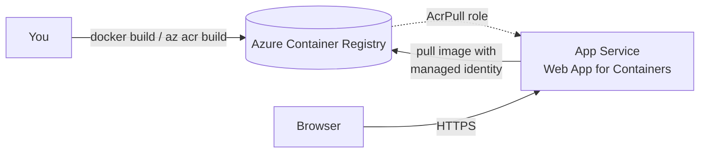

{/*
SCREENSHOT MANIFEST - Azure portal captures needed for this lab.
Do not capture these yourself. The orchestrator captures them later.
All images are referenced as /img/labs/deploy-a-custom-container/<name>.png

1. acr-create.png
   URL/blade: Create container registry wizard, Basics tab
   (portal.azure.com/#create/Microsoft.ContainerRegistry)
   Capture: The Basics tab with Subscription, Resource Group
   (new: rg-customcontainer), Registry name, Location = East US, and
   Pricing plan = Basic. Show that no admin user is required.

2. create-webapp-basics.png
   URL/blade: Create Web App wizard, Basics tab
   (portal.azure.com/#create/Microsoft.WebSite)
   Capture: The Basics tab with Publish = Container, Operating System = Linux,
   Region = East US, and the pricing plan section showing a Basic B1 plan.

3. create-webapp-docker.png
   URL/blade: Create Web App wizard, Container tab
   Capture: The Container tab with Image Source = Azure Container Registry,
   the registry and image selected, and Authentication = Managed identity
   (system-assigned) rather than admin credentials.

4. identity-acrpull.png
   URL/blade: Container registry -> Access control (IAM) -> Role assignments
   Capture: The AcrPull role assigned to the web app's system-assigned managed
   identity, confirming the app can pull images without stored credentials.

5. deployment-center.png
   URL/blade: App Service -> Deployment -> Deployment Center (Container settings)
   Capture: The Container settings showing the ACR registry, image, and tag,
   with Authentication set to Managed identity.

6. overview-domain.png
   URL/blade: App Service -> Overview
   Capture: The Overview blade with the Default domain
   (for example, app-customcontainer-xxxxxx.azurewebsites.net) highlighted.

7. running-container.png
   URL/blade: The running app in a browser tab
   Capture: The page served by the container at *.azurewebsites.net -
   "Hello from a custom container on Azure App Service!"

8. delete-resource-group.png
   URL/blade: Resource group Overview blade
   Capture: The resource group command bar with "Delete resource group"
   highlighted and the confirmation pane asking to type the group name.
*/}

import Tabs from '@theme/Tabs';
import TabItem from '@theme/TabItem';
import PathPicker from '@site/src/components/PathPicker';
import Prerequisites from '@site/src/components/SharedMarkdown/_prerequisites.mdx';

# Deploy a custom container

In this lab, you package a small web app as a container image, push it to [Azure Container Registry](https://learn.microsoft.com/azure/container-registry/container-registry-intro), and run it on [Azure App Service](https://learn.microsoft.com/azure/app-service/overview) with [Web App for Containers](https://learn.microsoft.com/azure/app-service/quickstart-custom-container). A custom container lets you bring your own runtime, system packages, and dependencies while App Service handles TLS, scaling, and patching of the host.

The app pulls its image from your registry using a **managed identity** granted the **AcrPull** role - so App Service authenticates to the registry with an Azure identity instead of admin username and password credentials.

You'll build the same result three ways so you can pick the workflow that fits you:

- **Azure Developer CLI (azd)** - an opinionated, repeatable workflow that provisions the registry and app, then builds and pushes your image in one step.
- **Azure CLI (az)** - explicit commands that create each resource, build the image, and wire up managed-identity pull.
- **Azure portal** - a visual, click-through experience.

You can follow the lab in your language of choice: **.NET**, **Node.js**, **Python**, **Java**, or **PHP**. Each path pins its base image to a specific tag so builds stay reproducible.

:::info App Service Labs complements Microsoft Learn
This lab is a hands-on, end-to-end walkthrough. For reference depth on any concept, follow the "Learn more" links to the official Microsoft Learn quickstarts.
:::

**Estimated time:** 20-30 minutes

## What you'll build

A Linux web app running on an App Service plan that pulls a container image from Azure Container Registry. App Service uses the app's system-assigned managed identity (holding the **AcrPull** role) to authenticate to the registry, then serves the container at a default `https://<app-name>.azurewebsites.net` hostname that returns HTTP 200.



<Prerequisites
  tools={[
    { name: 'Docker Desktop', url: 'https://www.docker.com/products/docker-desktop/', description: '(optional - only needed if you build images locally instead of with az acr build)' },
    { name: 'Azure Developer CLI (azd)', url: 'https://learn.microsoft.com/azure/developer/azure-developer-cli/install-azd', description: '(for the azd path)' },
    { name: 'The SDK or runtime for your chosen language', description: '(.NET SDK, Node.js, Python, JDK + Maven, or PHP - only if you want to run the app locally first)' },
  ]}
/>

:::tip Choose a region and low-cost tier
This lab uses the **East US** region and the **B1 (Basic)** pricing tier, a low-cost option that's ideal for learning. Custom containers require a **Basic** tier or higher - the **Free (F1)** tier doesn't support them. You can change the region to one near you.
:::

## Containerize the app

Each language below packages a tiny web server that returns `Hello from a custom container on Azure App Service!` and listens on port `80`. Pick your language, create the files, then build the image in a later step.

App Service for Linux containers routes public traffic to the port your container listens on. This lab has every container listen on port `80` and sets the `WEBSITES_PORT` app setting to `80` so the mapping is explicit.

<PathPicker
  description="Set these once - the sample files and every deployment step below follow your choice."
  groups={[
    { id: 'language', label: 'Language', options: [
      { value: 'dotnet', label: '.NET' },
      { value: 'node', label: 'Node.js' },
      { value: 'python', label: 'Python' },
      { value: 'java', label: 'Java' },
      { value: 'php', label: 'PHP' },
    ]},
    { id: 'tooling', label: 'Deploy with', options: [
      { value: 'azd', label: 'azd' },
      { value: 'az', label: 'az CLI' },
      { value: 'portal', label: 'Portal' },
    ]},
  ]}
/>

<Tabs groupId="language" queryString>

<TabItem value="dotnet" label=".NET">

Create an ASP.NET Core app:

```bash
mkdir custom-container-app && cd custom-container-app
dotnet new web -n MyApp
```

Make the app listen on port `80`. In `MyApp/Program.cs`, ensure the app responds on the root path:

```csharp
var builder = WebApplication.CreateBuilder(args);
var app = builder.Build();
app.MapGet("/", () => Results.Content(
    "<h1>Hello from a custom container on Azure App Service!</h1>", "text/html"));
app.Run();
```

Create `Dockerfile` in the `custom-container-app` folder. This multi-stage build compiles with the SDK image and runs on the smaller ASP.NET runtime image:

```dockerfile
# Build stage - pinned to a specific tag, never :latest
FROM mcr.microsoft.com/dotnet/sdk:8.0 AS build
WORKDIR /src
COPY MyApp/. ./MyApp/
RUN dotnet publish MyApp -c Release -o /app

# Runtime stage
FROM mcr.microsoft.com/dotnet/aspnet:8.0
WORKDIR /app
COPY --from=build /app .
ENV ASPNETCORE_URLS=http://+:80
EXPOSE 80
ENTRYPOINT ["dotnet", "MyApp.dll"]
```

</TabItem>

<TabItem value="node" label="Node.js">

Create `server.js`:

```js
const http = require('http');
const port = process.env.PORT || 80;
http.createServer((req, res) => {
  res.writeHead(200, { 'Content-Type': 'text/html' });
  res.end('<h1>Hello from a custom container on Azure App Service!</h1>');
}).listen(port, () => console.log('listening on ' + port));
```

Create `package.json`:

```json
{
  "name": "custom-container-webapp",
  "version": "1.0.0",
  "main": "server.js",
  "scripts": { "start": "node server.js" }
}
```

Create `Dockerfile`:

```dockerfile
# Pinned to a specific tag, never :latest
FROM node:22-alpine
WORKDIR /app
COPY package.json ./
COPY server.js ./
ENV PORT=80
EXPOSE 80
CMD ["node", "server.js"]
```

</TabItem>

<TabItem value="python" label="Python">

Create `app.py` (a minimal Flask app):

```python
from flask import Flask

app = Flask(__name__)

@app.route("/")
def home():
    return "<h1>Hello from a custom container on Azure App Service!</h1>"
```

Create `requirements.txt`:

```text
flask
gunicorn
```

Create `Dockerfile`. Gunicorn serves the Flask `app` object on port `80`:

```dockerfile
# Pinned to a specific tag, never :latest
FROM python:3.13-slim
WORKDIR /app
COPY requirements.txt ./
RUN pip install --no-cache-dir -r requirements.txt
COPY . .
EXPOSE 80
CMD ["gunicorn", "--bind", "0.0.0.0:80", "app:app"]
```

</TabItem>

<TabItem value="java" label="Java">

Use a Spring Boot app that returns the greeting from the root path, packaged as an executable JAR. Create `Dockerfile`. This multi-stage build compiles with Maven and runs on a slim JRE image:

```dockerfile
# Build stage - pinned to a specific tag, never :latest
FROM maven:3.9-eclipse-temurin-17 AS build
WORKDIR /src
COPY . .
RUN mvn -q clean package -DskipTests

# Runtime stage
FROM eclipse-temurin:17-jre
WORKDIR /app
COPY --from=build /src/target/*.jar app.jar
EXPOSE 80
ENTRYPOINT ["java", "-jar", "app.jar", "--server.port=80"]
```

Set `server.port=80` (as shown) so Spring Boot binds the port App Service expects.

</TabItem>

<TabItem value="php" label="PHP">

Create `index.php`:

```php
<?php echo "<h1>Hello from a custom container on Azure App Service!</h1>"; ?>
```

Create `Dockerfile`. The Apache image serves on port `80` by default:

```dockerfile
# Pinned to a specific tag, never :latest
FROM php:8.4-apache
COPY index.php /var/www/html/
EXPOSE 80
```

</TabItem>

</Tabs>

:::tip Pin to a digest for full reproducibility
Pinning to a tag (for example, `node:22-alpine`) is required by this lab - never use `:latest`. For the strongest guarantee, pin to an immutable digest, for example `node:22-alpine@sha256:...`, so the base image can never change underneath you.
:::

## Deploy to App Service

Choose a deployment mechanism. All three create a **Basic B1 Linux** App Service plan, an Azure Container Registry with the admin user disabled, and a web app that pulls the image using its **system-assigned managed identity**.

<Tabs groupId="tooling" queryString>

<TabItem value="azd" label="Azure Developer CLI (azd)">

The Azure Developer CLI provisions the registry and app with Bicep, then a `postprovision` hook builds your image with `az acr build`, pushes it to the registry, and points the app at it. Add these files alongside your `Dockerfile`.

`azure.yaml`

```yaml
# yaml-language-server: $schema=https://raw.githubusercontent.com/Azure/azure-dev/main/schemas/v1.0/azure.yaml.json
name: asl-custom-container
hooks:
  postprovision:
    posix:
      shell: sh
      # Build the image in the cloud and point the app at it after provisioning.
      # The variables come from the Bicep outputs (azd exposes them as env vars).
      run: |
        az acr build --registry "$ACR_NAME" --image customwebapp:v1 .
        az webapp config container set \
          --name "$WEB_APP_NAME" --resource-group "$AZURE_RESOURCE_GROUP" \
          --container-image-name "$ACR_LOGIN_SERVER/customwebapp:v1" \
          --container-registry-url "https://$ACR_LOGIN_SERVER"
        az webapp restart --name "$WEB_APP_NAME" --resource-group "$AZURE_RESOURCE_GROUP"
```

:::note Why a hook instead of a service
`azd`'s built-in code deploy (the `services` block) publishes app code, not container images, to App Service. Building the image in a `postprovision` hook keeps everything in one `azd up` and pulls with managed identity - no admin credentials.
:::

`infra/main.bicep`

```bicep
targetScope = 'subscription'

@description('Name of the azd environment; used to derive resource names.')
param environmentName string

@description('Azure region for all resources.')
param location string

@description('Resource group to create for this environment.')
param resourceGroupName string

resource rg 'Microsoft.Resources/resourceGroups@2024-03-01' = {
  name: resourceGroupName
  location: location
}

module resources 'resources.bicep' = {
  name: 'resources'
  scope: rg
  params: {
    location: location
    environmentName: environmentName
  }
}

// azd surfaces these outputs as environment variables the postprovision hook reads.
output ACR_NAME string = resources.outputs.acrName
output ACR_LOGIN_SERVER string = resources.outputs.registryEndpoint
output WEB_APP_NAME string = resources.outputs.webAppName
output WEB_URI string = resources.outputs.webUri
```

`infra/resources.bicep`

```bicep
@description('Azure region for all resources.')
param location string

@description('azd environment name used to derive globally unique names.')
param environmentName string

var suffix = uniqueString(subscription().id, resourceGroup().id, environmentName)
var acrName = toLower('acr${suffix}')
var planName = 'plan-${suffix}'
var webName = 'app-${suffix}'
// Built-in AcrPull role definition ID.
var acrPullRoleId = subscriptionResourceId('Microsoft.Authorization/roleDefinitions', '7f951dda-4ed3-4680-a7ca-43fe172d538d')

resource acr 'Microsoft.ContainerRegistry/registries@2023-11-01-preview' = {
  name: acrName
  location: location
  sku: { name: 'Basic' }
  properties: {
    adminUserEnabled: false // pull uses managed identity, not admin creds
  }
}

resource plan 'Microsoft.Web/serverfarms@2023-12-01' = {
  name: planName
  location: location
  sku: { name: 'B1', tier: 'Basic' }
  kind: 'linux'
  properties: { reserved: true } // required for Linux plans
}

resource web 'Microsoft.Web/sites@2023-12-01' = {
  name: webName
  location: location
  kind: 'app,linux,container'
  identity: { type: 'SystemAssigned' } // system-assigned managed identity for ACR pull
  properties: {
    serverFarmId: plan.id
    httpsOnly: true
    siteConfig: {
      // The hook sets the real image after provisioning; this is just a placeholder.
      linuxFxVersion: 'DOCKER|${acr.properties.loginServer}/${webName}:starter'
      acrUseManagedIdentityCreds: true // pull from ACR with the managed identity
      appSettings: [
        { name: 'WEBSITES_PORT', value: '80' }
      ]
    }
  }
}

// Grant the web app's managed identity permission to pull from the registry.
resource acrPull 'Microsoft.Authorization/roleAssignments@2022-04-01' = {
  name: guid(acr.id, web.id, acrPullRoleId)
  scope: acr
  properties: {
    roleDefinitionId: acrPullRoleId
    principalId: web.identity.principalId
    principalType: 'ServicePrincipal'
  }
}

output acrName string = acr.name
output registryEndpoint string = acr.properties.loginServer
output webAppName string = web.name
output webUri string = 'https://${web.properties.defaultHostName}'
```

`infra/main.parameters.json`

```json
{
  "$schema": "https://schema.management.azure.com/schemas/2019-04-01/deploymentParameters.json#",
  "contentVersion": "1.0.0.0",
  "parameters": {
    "environmentName": { "value": "${AZURE_ENV_NAME}" },
    "location": { "value": "${AZURE_LOCATION}" },
    "resourceGroupName": { "value": "${AZURE_RESOURCE_GROUP}" }
  }
}
```

Sign in, create an environment with a unique suffix, then provision and deploy:

```bash
azd auth login

SUFFIX=$(openssl rand -hex 3)   # 6 lowercase hex chars
azd env new "asl-cc-${SUFFIX}" --location eastus
azd env set AZURE_RESOURCE_GROUP "rg-customcontainer-${SUFFIX}"

azd up
```

`azd up` provisions the registry, plan, and app, then runs the hook to build the image and point the app at it. When it finishes, azd prints a success message and the `WEB_URI` output:

```text
SUCCESS: Your up workflow to provision and deploy to Azure completed in 2 minutes 16 seconds.
```

Get the app URL any time with:

```bash
azd env get-value WEB_URI
```

</TabItem>

<TabItem value="az" label="Azure CLI (az)">

With the Azure CLI you create each resource explicitly, build and push the image, then wire up managed-identity pull.

### 1. Sign in and set variables

```bash
az login
```

```bash
SUFFIX=$(openssl rand -hex 3)
export RG="rg-customcontainer-${SUFFIX}"
export LOCATION=eastus
export ACR="acrcustom${SUFFIX}"       # registry names are alphanumeric, 5-50 chars
export PLAN="plan-customcontainer-${SUFFIX}"
export APP="app-customcontainer-${SUFFIX}"
export IMAGE="customwebapp:v1"
```

### 2. Create the resource group and registry

Create the registry with the admin user disabled - the app pulls with a managed identity, not admin credentials:

```bash
az group create --name "$RG" --location "$LOCATION"

az acr create --name "$ACR" --resource-group "$RG" --sku Basic --admin-enabled false

export LOGIN_SERVER=$(az acr show --name "$ACR" --query loginServer --output tsv)
```

### 3. Build and push the image

The simplest option is `az acr build`, which builds the image in the cloud from your `Dockerfile` - no local Docker required:

```bash
az acr build --registry "$ACR" --image "$IMAGE" .
```

If you prefer to build locally with Docker, sign in to the registry and push instead:

```bash
az acr login --name "$ACR"
docker build --tag "$LOGIN_SERVER/$IMAGE" .
docker push "$LOGIN_SERVER/$IMAGE"
```

### 4. Create the plan and web app

```bash
az appservice plan create \
  --resource-group "$RG" \
  --name "$PLAN" \
  --is-linux \
  --sku B1

az webapp create \
  --resource-group "$RG" \
  --plan "$PLAN" \
  --name "$APP" \
  --container-image-name "$LOGIN_SERVER/$IMAGE"
```

### 5. Grant the app's managed identity AcrPull

Turn on a system-assigned managed identity, then give it the **AcrPull** role scoped to the registry:

```bash
export PRINCIPAL_ID=$(az webapp identity assign \
  --resource-group "$RG" --name "$APP" \
  --query principalId --output tsv)

export ACR_ID=$(az acr show --name "$ACR" --query id --output tsv)

az role assignment create \
  --assignee-object-id "$PRINCIPAL_ID" \
  --assignee-principal-type ServicePrincipal \
  --role AcrPull \
  --scope "$ACR_ID"
```

### 6. Configure managed-identity pull and the port

Tell App Service to authenticate to the registry with the managed identity, point it at the image, and set the container port:

```bash
az webapp config set \
  --resource-group "$RG" --name "$APP" \
  --generic-configurations '{"acrUseManagedIdentityCreds": true}'

az webapp config container set \
  --resource-group "$RG" --name "$APP" \
  --container-image-name "$LOGIN_SERVER/$IMAGE" \
  --container-registry-url "https://$LOGIN_SERVER"

az webapp config appsettings set \
  --resource-group "$RG" --name "$APP" \
  --settings WEBSITES_PORT=80

az webapp restart --resource-group "$RG" --name "$APP"
```

:::note Credential lookup warning is expected
`az webapp config container set` prints a warning that it couldn't retrieve registry credentials. That's expected here - you disabled the admin user on purpose. Because `acrUseManagedIdentityCreds` is `true`, App Service pulls with the managed identity and the warning is safe to ignore.
:::

### 7. Get the app URL

```bash
az webapp show \
  --resource-group "$RG" --name "$APP" \
  --query defaultHostName --output tsv
```

</TabItem>

<TabItem value="portal" label="Azure portal">

The Azure portal gives you a visual way to create the registry and app. You create the registry first, push your image, then create the web app and grant it AcrPull.

### 1. Create a container registry

Sign in to the [Azure portal](https://portal.azure.com). In the top search bar, enter **container registries**, select **Container registries**, then select **Create**.

- **Resource group**: select **Create new** and enter `rg-customcontainer`.
- **Registry name**: a globally unique name.
- **Location**: **East US**.
- **Pricing plan**: **Basic**.

Leave the admin user disabled. Select **Review + create**, then **Create**.


{/* Capture: Create container registry Basics tab with a new resource group, registry name, East US, and Basic pricing. */}

### 2. Push your image to the registry

From the folder with your `Dockerfile`, build the image in the cloud with the Azure CLI (no local Docker needed) - replace `<registry-name>` with the name you chose:

```bash
az acr build --registry <registry-name> --image customwebapp:v1 .
```

### 3. Create the web app

Select **Create a resource** > **Web App**. On the **Basics** tab, set:

- **Resource Group**: `rg-customcontainer`.
- **Name**: a globally unique name (this becomes `<name>.azurewebsites.net`).
- **Publish**: **Container**.
- **Operating System**: **Linux**.
- **Region**: **East US**.
- **Pricing plan**: create or select a **Basic B1** plan.


{/* Capture: Basics tab with Publish=Container, OS=Linux, Region=East US, Basic B1 plan. */}

On the **Container** tab, set:

- **Image Source**: **Azure Container Registry**.
- **Registry**: your registry.
- **Image** and **Tag**: `customwebapp` and `v1`.
- **Authentication**: **Managed identity** (system-assigned).


{/* Capture: Container tab with Image Source=Azure Container Registry, image selected, Authentication=Managed identity. */}

Select **Review + create**, then **Create**.

### 4. Confirm the AcrPull role assignment

When you choose **Managed identity** authentication, the portal creates the app's system-assigned identity and assigns it the **AcrPull** role on the registry. Confirm it under the registry's **Access control (IAM)** > **Role assignments**.


{/* Capture: Registry IAM role assignments showing AcrPull granted to the web app's managed identity. */}

### 5. Set the container port

If your container listens on a port other than the default, go to the app's **Settings** > **Environment variables** and add **WEBSITES_PORT** = **80**. You can review or change the image later under **Deployment** > **Deployment Center**.


{/* Capture: Deployment Center container settings showing the ACR image and Managed identity authentication. */}

On the app's **Overview** page, copy the **Default domain**.


{/* Capture: Overview blade with the default *.azurewebsites.net domain highlighted. */}

</TabItem>

</Tabs>

## Verify your app is running

Open the app's URL in a browser, or test it from the command line and confirm you get an HTTP `200` response:

```bash
curl -I https://<your-app-name>.azurewebsites.net
```

Expected output (validated during authoring):

```text
HTTP/1.1 200 OK
Content-Type: text/html
```

You should see the page served by your container:


{/* Capture: the running app at *.azurewebsites.net returning "Hello from a custom container on Azure App Service!". */}

:::tip First request can be slow
The first request after a deployment pulls the image and starts the container, which can take a minute or two. If you see a "starting" or `503` page, wait a moment and refresh. Check container startup logs any time with `az webapp log tail --resource-group "$RG" --name "$APP"`.
:::

:::note Windows containers
This lab uses **Linux** containers, the mainstream path for App Service. App Service also supports **Windows** containers for apps that need the Windows base image - for example, older .NET Framework apps. Windows containers require a Windows container plan (`az appservice plan create --hyper-v --sku P1V3`) and a Windows base image such as `mcr.microsoft.com/dotnet/framework/aspnet:4.8-windowsservercore-ltsc2022`. The registry, managed identity, and AcrPull steps are the same. See [Run a custom Windows container](https://learn.microsoft.com/azure/app-service/quickstart-custom-container?pivots=container-windows).
:::

## Clean up resources

To avoid ongoing charges, delete the resources when you're done. Deleting the resource group removes the web app, the App Service plan, and the container registry.

<Tabs groupId="tooling" queryString>

<TabItem value="azd" label="Azure Developer CLI (azd)">

```bash
azd down --purge --force
```

</TabItem>

<TabItem value="az" label="Azure CLI (az)">

```bash
az group delete --name "$RG" --yes --no-wait
```

</TabItem>

<TabItem value="portal" label="Azure portal">

In the portal, open the **rg-customcontainer** resource group, select **Delete resource group**, enter the group name to confirm, and select **Delete**.


{/* Capture: resource group command bar with "Delete resource group" and the confirmation pane. */}

</TabItem>

</Tabs>

## Summary

In this lab, you packaged a web app as a container image and ran it on Azure App Service, confirming it returns an HTTP `200` response. You learned how to:

- Write a `Dockerfile` for **.NET**, **Node.js**, **Python**, **Java**, or **PHP**, pinned to a specific base image tag instead of `:latest`.
- Build and push an image to **Azure Container Registry** with `az acr build` or local Docker.
- Create a **Web App for Containers** on a **Basic B1 Linux** plan three ways - with **azd**, the **Azure CLI**, and the **Azure portal**.
- Pull the image with a **system-assigned managed identity** granted the **AcrPull** role, avoiding stored admin credentials.
- Clean up resources to avoid charges.

## Troubleshooting

- **The app shows a default "welcome" page, not your container.** App Service may still be pulling and starting the image. Wait a minute, then refresh. Tail the logs with `az webapp log tail --resource-group "$RG" --name "$APP"`.
- **`504`, `503`, or a blank page.** The container likely isn't listening on the expected port. Confirm the app listens on port `80` and that the **WEBSITES_PORT** app setting is `80`.
- **Image pull fails with an authentication or `403` error.** The managed identity may lack the AcrPull role, or `acrUseManagedIdentityCreds` isn't set. Re-run the role assignment and `az webapp config set --generic-configurations '{"acrUseManagedIdentityCreds": true}'`, then restart the app. Role assignments can take a minute to propagate.
- **`az webapp config container set` warns it couldn't retrieve credentials.** Expected when the registry admin user is disabled. Managed identity handles the pull; the warning is safe to ignore.
- **`az acr build` fails or is slow.** Confirm your `Dockerfile` builds locally with `docker build .`. Very large build contexts upload slowly - add a `.dockerignore` to exclude files you don't need in the image.

## Learn more

- [Run a custom container in App Service](https://learn.microsoft.com/azure/app-service/quickstart-custom-container)
- [Azure Container Registry introduction](https://learn.microsoft.com/azure/container-registry/container-registry-intro)
- [Authenticate to a registry with a managed identity](https://learn.microsoft.com/azure/container-registry/container-registry-authentication-managed-identity)
- [Deploy to App Service using a managed identity to pull from ACR](https://learn.microsoft.com/azure/app-service/tutorial-custom-container?tabs=azure-cli#configure-registry-authentication)
- [Build and push an image with az acr build](https://learn.microsoft.com/azure/container-registry/container-registry-tutorial-quick-task)
- [Azure Developer CLI overview](https://learn.microsoft.com/azure/developer/azure-developer-cli/overview)
- [App Service plans and pricing tiers](https://learn.microsoft.com/azure/app-service/overview-hosting-plans)
- Back to the [Getting Started overview](./overview.md)
