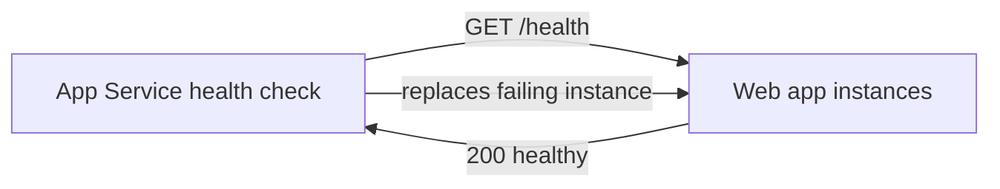

import Tabs from '@theme/Tabs';
import TabItem from '@theme/TabItem';
import PathPicker from '@site/src/components/PathPicker';
import PathNav from '@site/src/components/LearningPath/PathNav';

# Step 5: Add health checks and Always On

This is step 5 of the [enterprise web app learning path](/docs/learning-paths/enterprise-web-app).
So far Zava Widgets is configured, data-driven, and keyless - but the platform
has no way to know whether a running instance is actually healthy, and on a lower
tier the app can go cold between requests. This step fixes both. You point App
Service **health check** at the app's `/health` endpoint so the platform can detect
and replace unhealthy instances, and you turn on **Always On** so the app stays
loaded and responsive.

The app already exposes a health probe. `GET /health` returns HTTP 200 with a small
JSON body that also reports the current data source, so it doubles as a quick status
check.

In this step you will:

- Configure App Service health check to poll `/health`.
- Turn on Always On so the app is not unloaded when idle.
- Confirm both settings and see the probe respond.

**Estimated time:** 15 to 20 minutes.

## Objectives

By the end of this step you will be able to:

- Configure an App Service health check path.
- Explain how health check and multiple instances work together to remove unhealthy nodes.
- Turn on Always On and describe when you need it.

## Before you start

You need the resource group and web app from the earlier steps:

```bash
RESOURCE_GROUP="rg-zava-widgets"
APP_NAME="<your-app-name>"
```

If you deployed with `azd`, read the names from your environment:

```bash
cd app-service-labs/samples/zava-widgets
RESOURCE_GROUP=$(azd env get-values | grep RESOURCE_GROUP_NAME | cut -d'"' -f2)
APP_NAME=$(azd env get-values | grep WEB_APP_NAME | cut -d'"' -f2)
```

## How health check and Always On help

App Service **health check** pings a path you choose on every instance. When an
instance keeps failing and you are running two or more instances, the platform stops
routing traffic to the bad one and replaces it - so a single wedged instance does
not serve errors. **Always On** keeps the app loaded instead of unloading it after
a period of inactivity, which avoids a slow first request (a cold start) and is
required for continuous background work.



Health check does the most for you when the app runs on more than one instance -
which is exactly what you add in the next step, autoscale. Setting it now means the
platform is ready to act the moment you scale out.

<PathPicker
  title="Choose your tooling"
  groups={[
    {
      id: 'tooling',
      label: 'Configure with',
      options: [
        { value: 'az', label: 'Azure CLI (az)' },
        { value: 'portal', label: 'Azure portal' },
      ],
    },
  ]}
/>

## Turn on health check and Always On

<Tabs groupId="tooling" queryString>
<TabItem value="az" label="Azure CLI (az)">

Set the health check path and turn on Always On:

```bash
az webapp config set \
  --name "$APP_NAME" --resource-group "$RESOURCE_GROUP" \
  --always-on true \
  --generic-configurations '{"healthCheckPath": "/health"}'
```

</TabItem>
<TabItem value="portal" label="Azure portal">

1. In the [Azure portal](https://portal.azure.com), go to your web app.
2. Select **Monitoring** > **Health check**. Set it to **Enable**, enter the path `/health`, and select **Save**.
3. Select **Settings** > **Configuration** (or **Settings** > **General settings**), set **Always On** to **On**, and select **Save**.

</TabItem>
</Tabs>

## Verify

Confirm both settings are in place:

```bash
az webapp config show \
  --name "$APP_NAME" --resource-group "$RESOURCE_GROUP" \
  --query "{healthCheckPath: healthCheckPath, alwaysOn: alwaysOn}"
```

You should see `/health` and `true`:

```json
{"alwaysOn": true, "healthCheckPath": "/health"}
```

Now call the probe directly:

```bash
APP_URL="https://$(az webapp show --name "$APP_NAME" --resource-group "$RESOURCE_GROUP" --query defaultHostName -o tsv)"
curl -s "$APP_URL/health"
```

It returns HTTP 200 with the app's status and current data source:

```json
{"status":"healthy","dataSource":"azure-sql"}
```

:::tip Health check needs somewhere to send traffic
With a single instance, health check can detect a problem but has no healthy
instance to fail over to. Its value shows up once you run two or more instances,
which is the next step. Keep the path lightweight - `/health` should check that the
app is up without doing heavy work on every ping.
:::

## Troubleshooting

- **`healthCheckPath` is empty after saving.** Confirm you passed the path exactly
  as `{"healthCheckPath": "/health"}` and that `/health` returns 200. Re-run the
  `az webapp config show` query to confirm.
- **Always On is greyed out in the portal.** Always On requires a Basic tier or
  higher. It is not available on Free or Shared plans. This path runs on B1, which
  supports it.
- **The probe returns a non-200 status.** Open `$APP_URL/health` in a browser. If it
  errors, the app is not healthy for another reason - check the earlier steps and
  the app logs before relying on the probe.

## Summary

App Service now watches Zava Widgets: it polls `/health`, is ready to pull a bad
instance out of rotation, and keeps the app warm with Always On. That is the
groundwork for running more than one instance. Next you add autoscale, so the app
grows and shrinks its instance count with load - and health check finally has
somewhere to route around failures.

## Learn more

- [Monitor App Service instances with health check](https://learn.microsoft.com/azure/app-service/monitor-instances-health-check)
- [Configure an App Service app](https://learn.microsoft.com/azure/app-service/configure-common)

<PathNav pathId="enterprise-web-app" step={5} />
