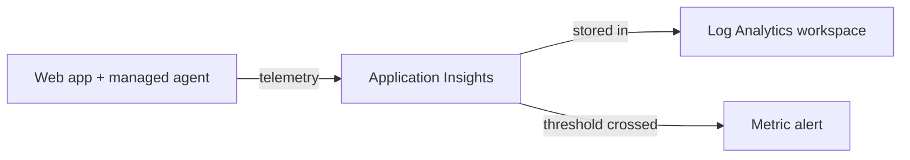

import Tabs from '@theme/Tabs';
import TabItem from '@theme/TabItem';
import PathPicker from '@site/src/components/PathPicker';
import PathNav from '@site/src/components/LearningPath/PathNav';

# Step 8: Add monitoring and alerts

This is step 8 of the [enterprise web app learning path](/docs/learning-paths/enterprise-web-app).
Zava Widgets releases safely now, but once a release is live you have little insight
into how it behaves - how fast requests are, how often they fail, or what broke when
something does. In this step you turn on **Application Insights** so the platform
collects request, dependency, and exception telemetry automatically, then you add an
**alert** so you find out about problems before your users report them.

Application Insights stores telemetry in a Log Analytics workspace. Your app sends
data to it through the `APPLICATIONINSIGHTS_CONNECTION_STRING` app setting, and a
second app setting turns on the App Service-managed agent that instruments Node.js
with no code change.

In this step you will:

- Create a Log Analytics workspace and a workspace-based Application Insights resource.
- Connect the app with the connection string and enable auto-instrumentation.
- Generate a little traffic and confirm telemetry is flowing.
- Create a metric alert that fires on server errors.

**Estimated time:** 30 to 40 minutes.

## Objectives

By the end of this step you will be able to:

- Explain how Application Insights, the connection string, and the managed agent fit together.
- Create a workspace-based Application Insights resource.
- Instrument a Node.js app on App Service without changing code.
- Create and confirm a metric alert rule.

## Before you start

You need the resource group and web app from the earlier steps, plus a name for the
new monitoring resources:

```bash
RESOURCE_GROUP="rg-zava-widgets"
APP_NAME="<your-app-name>"
LOCATION="eastus"
LAW_NAME="law-zava-widgets"
AI_NAME="appi-zava-widgets"
```

## How Application Insights instruments your app

Application Insights is the application performance monitoring service in Azure
Monitor. On App Service you do not add an SDK to instrument a Node.js app - you set
two app settings and the platform attaches an agent that captures requests,
dependencies, and exceptions for you:

- `APPLICATIONINSIGHTS_CONNECTION_STRING` tells the app where to send telemetry.
- `ApplicationInsightsAgent_EXTENSION_VERSION` turns on the managed agent (codeless attach).



<PathPicker
  title="Choose your tooling"
  groups={[
    {
      id: 'tooling',
      label: 'Configure with',
      options: [
        { value: 'az', label: 'Azure CLI (az)' },
        { value: 'portal', label: 'Azure portal' },
      ],
    },
  ]}
/>

## Create Application Insights and connect the app

<Tabs groupId="tooling" queryString>
<TabItem value="az" label="Azure CLI (az)">

Create the Log Analytics workspace, then a workspace-based Application Insights
resource:

```bash
az monitor log-analytics workspace create \
  --resource-group "$RESOURCE_GROUP" \
  --workspace-name "$LAW_NAME" \
  --location "$LOCATION"

LAW_ID=$(az monitor log-analytics workspace show \
  --resource-group "$RESOURCE_GROUP" --workspace-name "$LAW_NAME" \
  --query id -o tsv)

az monitor app-insights component create \
  --app "$AI_NAME" \
  --location "$LOCATION" \
  --resource-group "$RESOURCE_GROUP" \
  --workspace "$LAW_ID" \
  --application-type web
```

Read the connection string and set the app settings that connect and instrument the
app, then restart it:

```bash
AI_CONN=$(az monitor app-insights component show \
  --app "$AI_NAME" --resource-group "$RESOURCE_GROUP" \
  --query connectionString -o tsv)

az webapp config appsettings set \
  --name "$APP_NAME" --resource-group "$RESOURCE_GROUP" \
  --settings \
    APPLICATIONINSIGHTS_CONNECTION_STRING="$AI_CONN" \
    ApplicationInsightsAgent_EXTENSION_VERSION="~3" \
    XDT_MicrosoftApplicationInsights_Mode="recommended"

az webapp restart --name "$APP_NAME" --resource-group "$RESOURCE_GROUP"
```

</TabItem>
<TabItem value="portal" label="Azure portal">

1. In the [Azure portal](https://portal.azure.com), go to your web app.
2. Select **Settings** > **Application Insights**, then select **Turn on Application Insights**.
3. Choose **Create new resource** (or select an existing one), pick your Log Analytics workspace, and select **Apply**, then **Yes** to confirm.
4. The portal sets `APPLICATIONINSIGHTS_CONNECTION_STRING` and the agent app settings for you and restarts the app.

</TabItem>
</Tabs>

## Generate traffic and confirm telemetry

Send a few requests so there is something to see:

```bash
APP_URL="https://$(az webapp show --name "$APP_NAME" --resource-group "$RESOURCE_GROUP" --query defaultHostName -o tsv)"
for i in $(seq 1 20); do curl -s -o /dev/null "$APP_URL/"; curl -s -o /dev/null "$APP_URL/api/products"; done
```

Confirm the connection string is set on the app:

```bash
az webapp config appsettings list \
  --name "$APP_NAME" --resource-group "$RESOURCE_GROUP" \
  --query "[?name=='APPLICATIONINSIGHTS_CONNECTION_STRING'].name" -o tsv
```

It prints `APPLICATIONINSIGHTS_CONNECTION_STRING`, confirming the app is wired up.
Telemetry takes a couple of minutes to appear. In the portal, open your Application
Insights resource and select **Live metrics** to watch requests arrive in real time,
or **Application map** and **Failures** for the aggregated view.

## Create an alert on server errors

<Tabs groupId="tooling" queryString>
<TabItem value="az" label="Azure CLI (az)">

Create a metric alert on the App Service `Http5xx` metric. It fires when there are
more than 10 server errors in 5 minutes:

```bash
APP_ID=$(az webapp show --name "$APP_NAME" --resource-group "$RESOURCE_GROUP" --query id -o tsv)

az monitor metrics alert create \
  --name "alert-http5xx-$APP_NAME" \
  --resource-group "$RESOURCE_GROUP" \
  --scopes "$APP_ID" \
  --condition "total Http5xx > 10" \
  --window-size 5m \
  --evaluation-frequency 1m \
  --severity 2 \
  --description "More than 10 HTTP 5xx responses in 5 minutes."
```

To actually be notified, attach an
[action group](https://learn.microsoft.com/azure/azure-monitor/alerts/action-groups)
with `--action <action-group-id>` so the alert can email or message you.

</TabItem>
<TabItem value="portal" label="Azure portal">

1. In your web app, select **Monitoring** > **Alerts** > **Create** > **Alert rule**.
2. **Scope** is prefilled with your web app.
3. **Condition**: choose the **Http Server Errors** (`Http5xx`) signal, aggregation **Total**, **Greater than** `10`, over **5 minutes**.
4. **Actions**: attach or create an **action group** so the alert can notify you.
5. **Details**: name the rule, set **Severity** to **2**, then select **Create**.

</TabItem>
</Tabs>

## Verify

Confirm the alert rule exists and is enabled:

```bash
az monitor metrics alert list --resource-group "$RESOURCE_GROUP" \
  --query "[].{name:name, enabled:enabled, severity:severity}" -o table
```

You should see your rule with `enabled` set to `True`:

```text
Name                              Enabled    Severity
--------------------------------  ---------  ----------
alert-http5xx-<your-app-name>     True       2
```

:::tip Alert on symptoms your users feel
Good first alerts track things users actually notice: server errors (`Http5xx`),
slow responses (server response time), and availability. Start with a couple of
high-signal rules and add more as you learn the app's normal behavior.
:::

## Troubleshooting

- **No telemetry after a few minutes.** Confirm `APPLICATIONINSIGHTS_CONNECTION_STRING`
  and `ApplicationInsightsAgent_EXTENSION_VERSION` are both set, then restart the app.
  Auto-instrumentation attaches at startup.
- **`az monitor app-insights` is not found.** The CLI installs the `application-insights`
  extension automatically the first time you run the command; accept the prompt, or run
  `az extension add --name application-insights`.
- **The alert never fires.** `Http5xx` only crosses the threshold when the app actually
  returns server errors. That is expected for a healthy app - the rule is still active
  and will fire when errors occur.

## Summary

Zava Widgets is now observable: Application Insights captures requests, dependencies,
and exceptions with no code change, stores them in a Log Analytics workspace, and an
alert watches for a spike in server errors. You can see what the app is doing in
production and get told when it misbehaves. Next you put a front door on it - requiring
users to sign in with Entra ID before they can reach the app at all.

## Learn more

- [Application Insights for Azure App Service](https://learn.microsoft.com/azure/azure-monitor/app/azure-web-apps-nodejs)
- [Create metric alert rules in Azure Monitor](https://learn.microsoft.com/azure/azure-monitor/alerts/alerts-create-metric-alert-rule)

<PathNav pathId="enterprise-web-app" step={8} />
