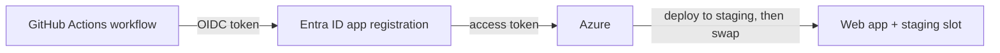

import Tabs from '@theme/Tabs';
import TabItem from '@theme/TabItem';
import PathPicker from '@site/src/components/PathPicker';
import PathNav from '@site/src/components/LearningPath/PathNav';

# Step 11: Automate delivery with GitHub Actions

This is the final step of the [enterprise web app learning path](/docs/learning-paths/enterprise-web-app).
You have deployed Zava Widgets by hand throughout this path. Enterprise teams do not
ship that way - they push code and a pipeline takes it to production the same way every
time. In this step you wire up **GitHub Actions** to build the app, deploy it to the
**staging slot** from step 7, and **swap** it into production on every push to `main` -
all authenticated with **OpenID Connect (OIDC)**, so there is no publish profile or
password stored in GitHub.

OIDC lets the workflow request a short-lived token from Entra ID at run time instead of
holding a secret. You create an Entra app registration, tell it to trust your GitHub
repository, and grant it permission to deploy to the web app.

In this step you will:

- Create an Entra app registration and a federated credential that trusts your repo.
- Grant it permission to deploy to the web app.
- Add a GitHub Actions workflow that deploys to staging and swaps to production.

**Estimated time:** 25 to 35 minutes.

## Objectives

By the end of this step you will be able to:

- Explain how GitHub OIDC replaces stored deployment credentials.
- Create a federated credential that trusts a GitHub repository.
- Author a workflow that deploys to a slot and swaps to production.

## Before you start

You need the resource group, web app, and the `staging` slot from
[step 7](/docs/learning-paths/enterprise-web-app/release-with-deployment-slots), and your own fork of
the sample repository on GitHub. Reuse your variables:

```bash
RESOURCE_GROUP="rg-zava-widgets"
APP_NAME="<your-app-name>"
GITHUB_ORG="<your-github-username>"
GITHUB_REPO="app-service-labs"
```

## How keyless deployment works

The workflow authenticates to Azure with OIDC. When it runs, GitHub issues a signed
token that describes the workflow (repo, branch). Entra ID trusts that token because
of the **federated credential** you attach to an app registration, and hands back an
Azure access token. The app registration has a role assignment on the web app, so it
can deploy. Nothing secret is stored in GitHub.



## Create the app registration and federated credential

Create an app registration and a service principal, then add a federated credential
that trusts pushes to `main` in your fork:

```bash
APP_ID=$(az ad app create --display-name "zava-widgets-gh-actions" --query appId -o tsv)
az ad sp create --id "$APP_ID"

az ad app federated-credential create --id "$APP_ID" --parameters "{
  \"name\": \"github-main\",
  \"issuer\": \"https://token.actions.githubusercontent.com\",
  \"subject\": \"repo:${GITHUB_ORG}/${GITHUB_REPO}:ref:refs/heads/main\",
  \"audiences\": [\"api://AzureADTokenExchange\"]
}"
```

Grant the app registration permission to deploy to your web app. Scoping the role to
the web app (not the whole subscription) keeps it least-privilege:

```bash
APP_RESOURCE_ID=$(az webapp show --name "$APP_NAME" --resource-group "$RESOURCE_GROUP" --query id -o tsv)

az role assignment create \
  --assignee "$APP_ID" \
  --role "Contributor" \
  --scope "$APP_RESOURCE_ID"
```

## Add the workflow secrets

The workflow needs three non-secret identifiers to sign in with OIDC. Add them as
repository secrets in your fork (**Settings** > **Secrets and variables** > **Actions**):

```bash
echo "AZURE_CLIENT_ID       = $APP_ID"
echo "AZURE_TENANT_ID       = $(az account show --query tenantId -o tsv)"
echo "AZURE_SUBSCRIPTION_ID  = $(az account show --query id -o tsv)"
```

Add `AZURE_CLIENT_ID`, `AZURE_TENANT_ID`, and `AZURE_SUBSCRIPTION_ID` with those
values. These are identifiers, not passwords - the actual credential is the federated
trust you created above.

## Add the workflow

Create `.github/workflows/deploy-zava.yml` in your fork. It builds the app, deploys to
the `staging` slot, then swaps staging into production:

```yaml
name: Deploy Zava Widgets

on:
  push:
    branches: [main]
  workflow_dispatch:

permissions:
  id-token: write
  contents: read

env:
  APP_NAME: <your-app-name>
  RESOURCE_GROUP: rg-zava-widgets
  PACKAGE_PATH: samples/zava-widgets

jobs:
  deploy:
    runs-on: ubuntu-latest
    steps:
      - uses: actions/checkout@v5

      - uses: actions/setup-node@v6
        with:
          node-version: '22'

      - name: Install dependencies
        run: npm ci
        working-directory: ${{ env.PACKAGE_PATH }}

      - uses: azure/login@v2
        with:
          client-id: ${{ secrets.AZURE_CLIENT_ID }}
          tenant-id: ${{ secrets.AZURE_TENANT_ID }}
          subscription-id: ${{ secrets.AZURE_SUBSCRIPTION_ID }}

      - name: Deploy to staging slot
        uses: azure/webapps-deploy@v3
        with:
          app-name: ${{ env.APP_NAME }}
          slot-name: staging
          package: ${{ env.PACKAGE_PATH }}

      - name: Swap staging into production
        run: |
          az webapp deployment slot swap \
            --name "$APP_NAME" \
            --resource-group "$RESOURCE_GROUP" \
            --slot staging --target-slot production
```

Replace `<your-app-name>` with your web app's name. Commit and push the workflow to
`main`.

## Verify

Push a change to `main` (or run the workflow manually from the **Actions** tab with
**Run workflow**). Watch the run in the **Actions** tab: the job signs in with OIDC,
deploys to staging, and swaps to production. When it finishes, confirm production is
serving the deployed build:

```bash
APP_URL="https://$(az webapp show --name "$APP_NAME" --resource-group "$RESOURCE_GROUP" --query defaultHostName -o tsv)"
curl -s "$APP_URL/api/info"
```

You can confirm the Azure-side setup independently of a workflow run. The federated
credential and role assignment both exist:

```bash
az ad app federated-credential list --id "$APP_ID" \
  --query "[].{name:name, subject:subject}" -o table

az role assignment list --assignee "$APP_ID" --scope "$APP_RESOURCE_ID" \
  --query "[].roleDefinitionName" -o tsv
```

The first lists your `github-main` credential and its `repo:.../main` subject; the
second returns `Contributor`. With those in place, the workflow can deploy without any
stored password.

:::tip Deploy to staging, never straight to production
The workflow deploys to the `staging` slot and swaps, so production is only ever updated
by a warm, already-running slot. If a deployment is bad, you swap back - exactly the
safe-release pattern from step 7, now automated.
:::

## Troubleshooting

- **`azure/login` fails with AADSTS70021 (no matching federated identity record).**
  The token's subject must match the federated credential exactly. A push to `main`
  produces `repo:<org>/<repo>:ref:refs/heads/main`; a pull request or tag produces a
  different subject and needs its own credential.
- **Deploy step returns 403.** The app registration needs a role assignment on the web
  app. Confirm the `Contributor` (or **Website Contributor**) assignment on the app's
  resource ID.
- **Swap fails because the slot is not ready.** The deploy step must finish before the
  swap. Keep them as ordered steps in the same job, as shown.

## Summary

Zava Widgets now ships itself. A push to `main` builds the app, deploys it to a staging
slot, and swaps it into production - authenticated with OIDC, with no deployment
secrets in GitHub. That completes the path: you took one app from a basic deployment
all the way to an enterprise-grade web app - externalized configuration, a managed-identity
database, Key Vault secrets, health checks, autoscale, safe slot releases, monitoring
and alerts, Entra sign-in, private networking, and automated delivery. Congratulations.

When you are done exploring, delete the resource group to stop billing:

```bash
az group delete --name "$RESOURCE_GROUP" --yes --no-wait
```

## Learn more

- [Deploy to App Service using GitHub Actions](https://learn.microsoft.com/azure/app-service/deploy-github-actions)
- [Use GitHub Actions to connect to Azure with OIDC](https://learn.microsoft.com/azure/developer/github/connect-from-azure-openid-connect)
- [Configure OpenID Connect in Microsoft Entra ID](https://learn.microsoft.com/entra/workload-id/workload-identity-federation)

<PathNav pathId="enterprise-web-app" step={11} />
