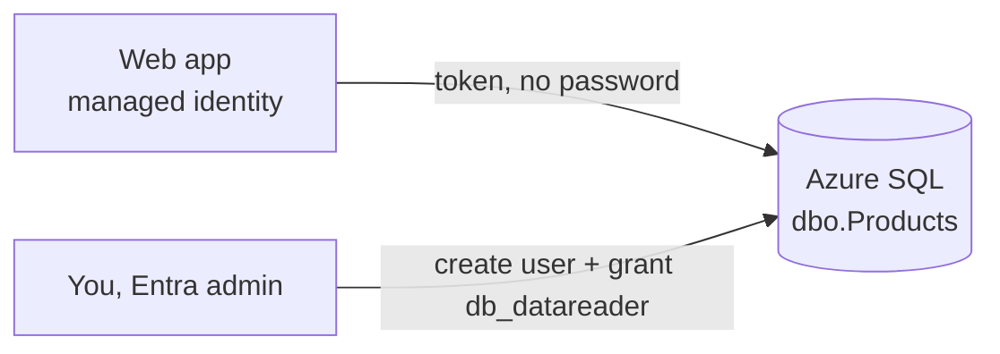

import Tabs from '@theme/Tabs';
import TabItem from '@theme/TabItem';
import PathPicker from '@site/src/components/PathPicker';
import PathNav from '@site/src/components/LearningPath/PathNav';

# Step 3: Connect a database with managed identity

This is step 3 of the [enterprise web app learning path](/docs/learning-paths/enterprise-web-app).
So far Zava Widgets serves an in-memory catalog. Real apps keep their data in a
database - and the tempting shortcut is to paste a database username and password
into a connection string. This step does it the right way instead: the catalog
moves into [Azure SQL Database](https://learn.microsoft.com/azure/azure-sql/database/sql-database-paas-overview),
and the app reads it using its **managed identity**. There is no SQL password
anywhere - not in the code, not in configuration.

The app already knows how to do this. When the `AZURE_SQL_SERVER` and
`AZURE_SQL_DATABASE` app settings are present, Zava Widgets connects to Azure
SQL with `azure-active-directory-default` authentication, which uses the app's
identity. When they are absent, it falls back to the in-memory catalog.

In this step you will:

- Create an Azure SQL server and database that use Microsoft Entra authentication only.
- Create the catalog table and grant the app's managed identity read access - no SQL login.
- Point the app at the database with two app settings and watch the data source switch.

**Estimated time:** 25 to 35 minutes.

## Objectives

By the end of this step you will be able to:

- Create an Azure SQL database that uses Entra authentication only.
- Grant a web app's managed identity least-privilege access to a database.
- Configure an app to read from Azure SQL with no stored credentials.

## Before you start

You need the resource group and web app from the earlier steps, plus the app's
managed identity (you turned it on in step 1). Reuse your variables:

```bash
RESOURCE_GROUP="rg-zava-widgets"
APP_NAME="<your-app-name>"
LOCATION="eastus"
```

If you deployed with `azd`, read the names from your environment:

```bash
cd app-service-labs/samples/zava-widgets
RESOURCE_GROUP=$(azd env get-values | grep RESOURCE_GROUP_NAME | cut -d'"' -f2)
APP_NAME=$(azd env get-values | grep WEB_APP_NAME | cut -d'"' -f2)
```

You also need the [sqlcmd](https://learn.microsoft.com/sql/tools/sqlcmd/sqlcmd-utility)
tool to run a few SQL statements, or you can use the portal **Query editor**.

## How passwordless access works

The app authenticates to Azure SQL as its **managed identity**. Azure SQL is set
to Entra-only authentication, and you create a contained database user for the
app's identity and grant it the `db_datareader` role. At runtime, the app requests
a token for its identity and connects - no password is ever created or stored.



<PathPicker
  title="Choose your tooling"
  groups={[
    {
      id: 'tooling',
      label: 'Provision with',
      options: [
        { value: 'az', label: 'Azure CLI (az)' },
        { value: 'portal', label: 'Azure portal' },
      ],
    },
  ]}
/>

## Create the Azure SQL database

<Tabs groupId="tooling" queryString>
<TabItem value="az" label="Azure CLI (az)">

Set names and create an Entra-only SQL server with yourself as the admin, then a
low-cost **Basic** database:

```bash
SQL_SERVER="sql-zava-$RANDOM"
SQL_DB="zava-catalog"
MY_UPN=$(az ad signed-in-user show --query userPrincipalName -o tsv)
MY_OID=$(az ad signed-in-user show --query id -o tsv)

az sql server create \
  --name "$SQL_SERVER" \
  --resource-group "$RESOURCE_GROUP" \
  --location "$LOCATION" \
  --enable-ad-only-auth \
  --external-admin-principal-type User \
  --external-admin-name "$MY_UPN" \
  --external-admin-sid "$MY_OID"

az sql db create \
  --resource-group "$RESOURCE_GROUP" \
  --server "$SQL_SERVER" \
  --name "$SQL_DB" \
  --edition Basic
```

Allow other Azure services (your web app) to reach the server, and allow your own
client IP so you can run the setup SQL:

```bash
az sql server firewall-rule create \
  --resource-group "$RESOURCE_GROUP" --server "$SQL_SERVER" \
  --name AllowAzureServices \
  --start-ip-address 0.0.0.0 --end-ip-address 0.0.0.0

MY_IP=$(curl -s https://api.ipify.org)
az sql server firewall-rule create \
  --resource-group "$RESOURCE_GROUP" --server "$SQL_SERVER" \
  --name AllowMyClient \
  --start-ip-address "$MY_IP" --end-ip-address "$MY_IP"
```

</TabItem>
<TabItem value="portal" label="Azure portal">

1. In the [Azure portal](https://portal.azure.com), search for **SQL databases** and select **Create**.
2. Choose your resource group, name the database `zava-catalog`, and next to **Server** select **Create new**.
3. Name the server (for example, `sql-zava-<unique>`), pick **East US**, and for **Authentication method** choose **Use Microsoft Entra-only authentication**. Set yourself as the Entra admin, then select **OK**.
4. For **Workload environment**, choose **Development**, or set the **Compute + storage** to the **Basic** tier to keep costs low.
5. On the **Networking** tab, set **Connectivity method** to **Public endpoint**, and set both **Allow Azure services...** and **Add current client IP address** to **Yes**.
6. Select **Review + create**, then **Create**. Note the server name, which ends in `.database.windows.net`.

</TabItem>
</Tabs>

## Create the table and grant the app access

Connect to the database **as yourself** (the Entra admin) and run the SQL below.
It creates the catalog table, seeds the six products, creates a contained user for
the app's managed identity, and grants it read-only access.

Replace `APP_NAME_HERE` with your web app's name (that is the identity's name for a
system-assigned managed identity).

```sql
CREATE TABLE dbo.Products (
  id INT PRIMARY KEY,
  name NVARCHAR(100) NOT NULL,
  category NVARCHAR(50) NOT NULL,
  price DECIMAL(10,2) NOT NULL,
  description NVARCHAR(300) NOT NULL
);

INSERT INTO dbo.Products (id, name, category, price, description) VALUES
  (1, 'Aurora Smart Bulb', 'Lighting', 24.99, 'Tunable-white LED bulb with app and voice control.'),
  (2, 'Nimbus Wi-Fi Plug', 'Power', 14.99, 'Energy-monitoring smart plug with scheduling.'),
  (3, 'Terra Door Sensor', 'Security', 19.99, 'Contact sensor that alerts you when a door opens.'),
  (4, 'Solis Thermostat', 'Climate', 89.99, 'Learning thermostat that trims your heating bill.'),
  (5, 'Vega Motion Camera', 'Security', 59.99, 'Battery camera with on-device motion detection.'),
  (6, 'Cirro Leak Detector', 'Safety', 29.99, 'Water-leak sensor that pings you before damage spreads.');

CREATE USER [APP_NAME_HERE] FROM EXTERNAL PROVIDER;
ALTER ROLE db_datareader ADD MEMBER [APP_NAME_HERE];
```

<Tabs groupId="tooling" queryString>
<TabItem value="az" label="Azure CLI (az)">

Save the SQL above to `setup.sql` (with your app name substituted), then run it
with the [sqlcmd](https://learn.microsoft.com/sql/tools/sqlcmd/sqlcmd-utility)
utility. The `ActiveDirectoryDefault` method reuses your Azure CLI login, so there
is no password prompt:

```bash
sed "s/APP_NAME_HERE/$APP_NAME/g" setup.sql > setup.ready.sql

sqlcmd -S "$SQL_SERVER.database.windows.net" -d "$SQL_DB" \
  --authentication-method ActiveDirectoryDefault \
  -i setup.ready.sql
```

</TabItem>
<TabItem value="portal" label="Azure portal">

1. In the portal, open your `zava-catalog` database and select **Query editor (preview)** in the left menu.
2. Sign in with **Microsoft Entra authentication** (you are the admin).
3. Paste the SQL above, replace both `APP_NAME_HERE` occurrences with your web app's name, and select **Run**.

</TabItem>
</Tabs>

## Point the app at the database

Set the two app settings the app looks for. Saving them restarts the app.

<Tabs groupId="tooling" queryString>
<TabItem value="az" label="Azure CLI (az)">

```bash
az webapp config appsettings set \
  --name "$APP_NAME" \
  --resource-group "$RESOURCE_GROUP" \
  --settings \
    AZURE_SQL_SERVER="$SQL_SERVER.database.windows.net" \
    AZURE_SQL_DATABASE="$SQL_DB"
```

</TabItem>
<TabItem value="portal" label="Azure portal">

1. Go to your web app and select **Settings** > **Environment variables**.
2. Add `AZURE_SQL_SERVER` with the value `<your-server>.database.windows.net`.
3. Add `AZURE_SQL_DATABASE` with the value `zava-catalog`.
4. Select **Apply**, then **Confirm**. The app restarts.

</TabItem>
</Tabs>

## Verify

Give the app a few seconds to restart, then check the data source:

```bash
APP_URL="https://$(az webapp show --name "$APP_NAME" --resource-group "$RESOURCE_GROUP" --query defaultHostName -o tsv)"
curl -s "$APP_URL/api/products"
```

The response now reports `azure-sql` as the source, and the products come from the
database:

```json
{"source":"azure-sql","count":6,"products":[{"id":1,"name":"Aurora Smart Bulb", ...}]}
```

Open `$APP_URL` in a browser. The storefront badge now reads **Data source: Azure
SQL (managed identity)**. The app is reading live data from Azure SQL, and it did
so without a single stored credential.

:::tip Prove there is no secret
Look at the app's configuration - there is no SQL username or password anywhere.
The only database settings are the server and database names. Authentication is
the app's managed identity, granted `db_datareader` and nothing more.
:::

## Troubleshooting

- **Login failed for the app / data source still says in-memory.** Confirm both
  `AZURE_SQL_SERVER` (ending in `.database.windows.net`) and `AZURE_SQL_DATABASE`
  are set, and that you created the contained user with your web app's exact name.
  Restart the app and retry.
- **`sqlcmd` cannot connect.** Make sure your client IP firewall rule exists and
  that you are signed in with `az login` as the server's Entra admin.
- **The app cannot reach the server.** Confirm the **Allow Azure services**
  firewall rule (start and end IP `0.0.0.0`) is present on the SQL server.

## Summary

You gave Zava Widgets a real database and connected to it with the app's
managed identity - no password, no connection-string secret. The app now serves
live catalog data from Azure SQL, and its only database configuration is two
non-secret names. You have a configured, data-driven app running securely on App
Service. That is a strong foundation; the remaining steps in this path add secrets
management, resilience, monitoring, private networking, and automated delivery on
top of it.

You have reached the end of the published steps for now. Keep your resources if
you plan to continue when the next steps ship, or delete the resource group to
stop billing:

```bash
az group delete --name "$RESOURCE_GROUP" --yes --no-wait
```

## Learn more

- [Azure SQL Database overview](https://learn.microsoft.com/azure/azure-sql/database/sql-database-paas-overview)
- [Connect with managed identity to Azure SQL](https://learn.microsoft.com/azure/app-service/tutorial-connect-msi-sql-database)
- [Microsoft Entra authentication for Azure SQL](https://learn.microsoft.com/azure/azure-sql/database/authentication-aad-overview)

<PathNav pathId="enterprise-web-app" step={3} />
