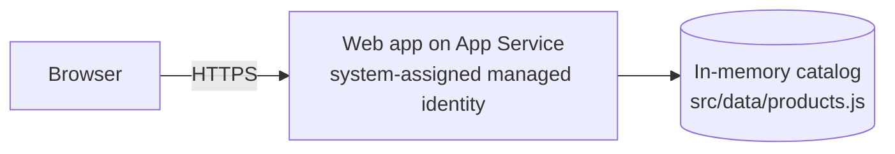

import Tabs from '@theme/Tabs';
import TabItem from '@theme/TabItem';
import PathPicker from '@site/src/components/PathPicker';
import PathNav from '@site/src/components/LearningPath/PathNav';
import Prerequisites from '@site/src/components/SharedMarkdown/_prerequisites.mdx';

# Step 1: Deploy the app

This is the first step of the [enterprise web app learning path](/docs/learning-paths/enterprise-web-app).
You start by deploying **Zava Widgets**, a small Node.js product-catalog app,
to [Azure App Service](https://learn.microsoft.com/azure/app-service/overview).
Right now the app serves a hard-coded, in-memory list of products. Over the next
steps you add configuration, a database, and more - all without rewriting the app.

In this step you will:

- Get the sample app and look at how it is put together.
- Deploy it to a Linux web app on App Service with a **system-assigned managed identity** turned on from the start.
- Confirm the storefront is live and serving its in-memory catalog.

:::info App Service Labs complements Microsoft Learn
This is a hands-on walkthrough. For reference depth on any concept, follow the
"Learn more" links to the official Microsoft Learn documentation.
:::

**Estimated time:** 15 to 20 minutes.

## Objectives

By the end of this step you will be able to:

- Deploy a Node.js app to App Service with the Azure Developer CLI or the Azure CLI.
- Explain why the app turns on a managed identity before it needs one.
- Verify a running web app from the command line.

<Prerequisites
  tools={[
    { name: 'Azure Developer CLI (azd)', url: 'https://learn.microsoft.com/azure/developer/azure-developer-cli/install-azd' },
    { name: 'Node.js 22 or later', url: 'https://nodejs.org/' },
  ]}
/>

:::tip One resource group for the whole path
Every step of this path adds to the **same resource group**. Note the resource
group and web app names from this step - you reuse them in every later step.
Keep the resources running until the final step, where you delete the group to
stop billing. This path uses the **East US** region and the **B1 (Basic)** plan,
a low-cost Linux tier (about USD 13/month) that is ideal for learning.
:::

## Meet the app

Zava Widgets is intentionally small. The important idea is that every
capability you add later is gated behind an **app setting** (an environment
variable), so the same code grows from a first deploy into an enterprise-grade
app. The app exposes a few endpoints:

| Path | Purpose |
| :-- | :-- |
| `/` | HTML storefront |
| `/api/products` | Catalog as JSON, with the current data source |
| `/api/info` | Current configuration and data source - handy for verifying each step |
| `/health` | Health probe used in a later step |



## Get the sample app

Clone the repository and move into the app folder.

```bash
git clone https://github.com/Azure-Samples/app-service-labs.git
cd app-service-labs/samples/zava-widgets
```

The folder has three parts: `src/` (the Express app), `infra/` (the Bicep that
provisions Azure resources), and `azure.yaml` (which tells `azd` how to deploy).

Choose how you want to deploy. The Azure Developer CLI is the fastest path; the
Azure CLI shows each resource explicitly.

<PathPicker
  title="Choose your tooling"
  groups={[
    {
      id: 'tooling',
      label: 'Deploy with',
      options: [
        { value: 'azd', label: 'Azure Developer CLI (azd)' },
        { value: 'az', label: 'Azure CLI (az)' },
      ],
    },
  ]}
/>

## Deploy the app

<Tabs groupId="tooling" queryString>
<TabItem value="azd" label="Azure Developer CLI (azd)">

Sign in, then provision and deploy in one command:

```bash
azd auth login
azd up
```

When prompted, enter an **environment name** (for example, `zava-widgets`),
choose your subscription, and choose the **East US** location. `azd` creates a
resource group named `rg-<environment-name>`, provisions the App Service plan and
web app from `infra/`, and deploys the code from `src/`.

When it finishes, `azd` prints the app URL. Capture the names you will reuse in
later steps:

```bash
azd env get-values | grep -E 'RESOURCE_GROUP_NAME|WEB_APP_NAME|WEB_APP_URI'
```

</TabItem>
<TabItem value="az" label="Azure CLI (az)">

Sign in and set a few variables. Reuse these exact names in later steps.

```bash
az login

RESOURCE_GROUP="rg-zava-widgets"
LOCATION="eastus"
APP_NAME="zava-widgets-$RANDOM"
PLAN_NAME="plan-zava-widgets"
```

Create the resource group, a Linux App Service plan on B1, and the web app on
Node 22:

```bash
az group create --name "$RESOURCE_GROUP" --location "$LOCATION"

az appservice plan create \
  --name "$PLAN_NAME" \
  --resource-group "$RESOURCE_GROUP" \
  --location "$LOCATION" \
  --sku B1 \
  --is-linux

az webapp create \
  --name "$APP_NAME" \
  --resource-group "$RESOURCE_GROUP" \
  --plan "$PLAN_NAME" \
  --runtime "NODE:22-lts"
```

Turn on the system-assigned managed identity now, so later steps can grant it
access without adding any secrets:

```bash
az webapp identity assign \
  --name "$APP_NAME" \
  --resource-group "$RESOURCE_GROUP"
```

Build the app on deploy, then deploy the code from `src/` as a zip:

```bash
az webapp config appsettings set \
  --name "$APP_NAME" \
  --resource-group "$RESOURCE_GROUP" \
  --settings SCM_DO_BUILD_DURING_DEPLOYMENT=true

cd src
zip -r ../app.zip . -x "node_modules/*"
cd ..

az webapp deploy \
  --name "$APP_NAME" \
  --resource-group "$RESOURCE_GROUP" \
  --src-path app.zip \
  --type zip
```

</TabItem>
</Tabs>

## Verify

Get the app URL and open it. The storefront shows six products and a badge that
reads **Data source: in-memory seed**.

<Tabs groupId="tooling" queryString>
<TabItem value="azd" label="Azure Developer CLI (azd)">

```bash
APP_URL=$(azd env get-values | grep WEB_APP_URI | cut -d'"' -f2)
curl -s "$APP_URL/api/info"
```

</TabItem>
<TabItem value="az" label="Azure CLI (az)">

```bash
APP_URL="https://$(az webapp show --name "$APP_NAME" --resource-group "$RESOURCE_GROUP" --query defaultHostName -o tsv)"
curl -s "$APP_URL/api/info"
```

</TabItem>
</Tabs>

You should see a response like this, confirming the app is live and serving its
in-memory catalog:

```json
{"catalogTitle":"Zava Widgets","dataSource":"in-memory","partnerIntegration":"not-configured","node":"v20.x.x"}
```

Open `$APP_URL` in a browser to see the storefront.

:::tip Keep your resources
Do not delete anything yet. The next step reuses this same web app and resource
group. You only clean up at the end of the path.
:::

## Summary

You deployed Zava Widgets to App Service and confirmed it serves its in-memory
catalog. You also turned on the app's managed identity up front - an identity the
app does not need yet, but which later steps use to reach a database and Key Vault
without a single stored secret. Next, you move the app's configuration out of the
code and into app settings.

## Learn more

- [App Service overview](https://learn.microsoft.com/azure/app-service/overview)
- [Deploy Node.js apps to App Service](https://learn.microsoft.com/azure/app-service/quickstart-nodejs)
- [What are managed identities for Azure resources?](https://learn.microsoft.com/entra/identity/managed-identities-azure-resources/overview)

<PathNav pathId="enterprise-web-app" step={1} />
