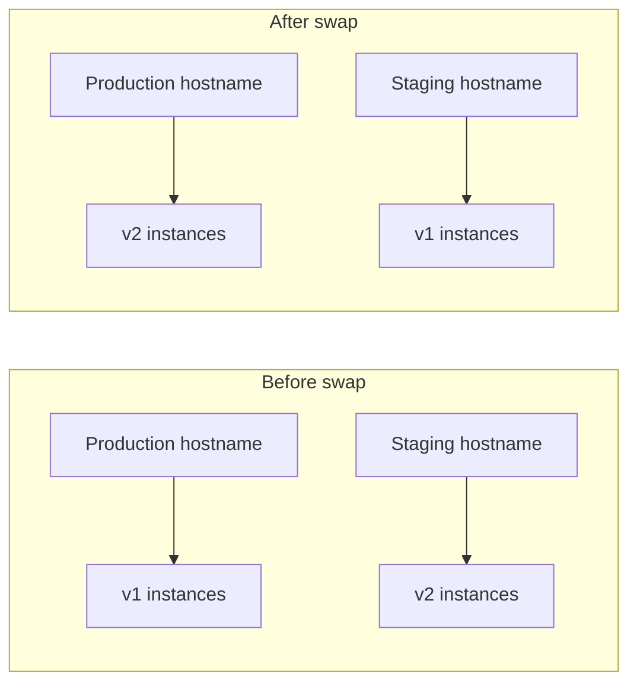

import Tabs from '@theme/Tabs';
import TabItem from '@theme/TabItem';
import PathPicker from '@site/src/components/PathPicker';
import PathNav from '@site/src/components/LearningPath/PathNav';

# Step 7: Release safely with deployment slots

This is step 7 of the [enterprise web app learning path](/docs/learning-paths/enterprise-web-app).
Right now every deploy goes straight to production. If a release is bad, users see
it immediately. In this step you add a **deployment slot** - a live copy of the app
with its own hostname - so you can deploy and warm up a new version in **staging**,
check it, then **swap** it into production in a few seconds with zero downtime. If
something is wrong after the swap, you swap back to roll it right back.

You are already on the Standard (S1) plan from step 6, and slots are a Standard-tier
feature, so no tier change is needed here.

The app reports a release marker so you can watch the swap happen. `GET /api/info`
returns an `appVersion` field, set from the `APP_VERSION` app setting. You deploy
the app to staging, set `APP_VERSION` to `2.0` there, confirm the staging hostname
serves `2.0` while production still serves `1.0`, then swap.

In this step you will:

- Create a `staging` deployment slot that inherits production's configuration.
- Deploy the app to staging and mark it as version `2.0`.
- Verify staging independently on its own hostname.
- Swap staging into production and confirm the new version is live.
- Roll back with a second swap.

**Estimated time:** 25 to 35 minutes.

## Objectives

By the end of this step you will be able to:

- Explain how a slot swap delivers a zero-downtime release and an instant rollback.
- Create a staging slot that inherits production configuration.
- Deploy a new version to staging and validate it before it reaches users.
- Swap staging into production, and roll back by swapping again.

## Before you start

You need the resource group and web app from the earlier steps, and the app package
you deployed in step 1:

```bash
RESOURCE_GROUP="rg-zava-widgets"
APP_NAME="<your-app-name>"
```

Build the deployment package from the sample so you can deploy it to the slot:

```bash
cd app-service-labs/samples/zava-widgets/src
npm ci --omit=dev
zip -r ../app.zip . -x "*.git*" > /dev/null
cd ..
```

## How a slot swap works

A slot is a full deployment of your app with its own hostname
(`https://<app>-<slot>.azurewebsites.net`). You deploy to `staging` and let it warm
up, then swap: App Service re-points the production hostname to the warmed-up
staging instances and moves the old production instances into staging. Because
traffic only moves once the new instances are ready, users never hit a cold start
or a half-finished deploy.



Most settings move with the swap, so what you tested in staging is what goes live.
Some settings should stay with their slot - a database name or a slot-only feature
flag. Those are marked as **slot settings** (sticky), and they do not move during a
swap.

<PathPicker
  title="Choose your tooling"
  groups={[
    {
      id: 'tooling',
      label: 'Configure with',
      options: [
        { value: 'az', label: 'Azure CLI (az)' },
        { value: 'portal', label: 'Azure portal' },
      ],
    },
  ]}
/>

## Create the staging slot

<Tabs groupId="tooling" queryString>
<TabItem value="az" label="Azure CLI (az)">

Create a `staging` slot that inherits the production app's configuration:

```bash
az webapp deployment slot create \
  --name "$APP_NAME" --resource-group "$RESOURCE_GROUP" \
  --slot staging \
  --configuration-source "$APP_NAME"
```

</TabItem>
<TabItem value="portal" label="Azure portal">

1. In the [Azure portal](https://portal.azure.com), go to your web app.
2. Select **Deployment** > **Deployment slots**, then select **Add slot**.
3. Name the slot `staging`. For **Clone settings from**, choose your production app so the slot inherits its configuration. Select **Add**, then **Close**.

</TabItem>
</Tabs>

## Deploy version 2.0 to staging

<Tabs groupId="tooling" queryString>
<TabItem value="az" label="Azure CLI (az)">

Deploy the app package to the staging slot, then mark it as version `2.0`:

```bash
az webapp deploy \
  --name "$APP_NAME" --resource-group "$RESOURCE_GROUP" \
  --slot staging \
  --src-path app.zip --type zip

az webapp config appsettings set \
  --name "$APP_NAME" --resource-group "$RESOURCE_GROUP" \
  --slot staging \
  --settings APP_VERSION=2.0
```

</TabItem>
<TabItem value="portal" label="Azure portal">

1. Deploy your app to the `staging` slot the same way you deploy to production (for example, `az webapp deploy ... --slot staging`, or your CI/CD target set to the slot).
2. In the portal, open the **staging** slot (it appears as `your-app/staging`).
3. Select **Settings** > **Environment variables** (or **Configuration**), add an application setting named `APP_VERSION` with value `2.0`, and select **Save**.

</TabItem>
</Tabs>

## Verify staging before you swap

Check staging and production side by side. Staging serves `2.0`; production still
serves `1.0`:

```bash
STAGING_URL="https://$(az webapp show --name "$APP_NAME" --resource-group "$RESOURCE_GROUP" --slot staging --query defaultHostName -o tsv)"
PROD_URL="https://$(az webapp show --name "$APP_NAME" --resource-group "$RESOURCE_GROUP" --query defaultHostName -o tsv)"

echo "staging:"; curl -s "$STAGING_URL/api/info"
echo; echo "production:"; curl -s "$PROD_URL/api/info"
```

Staging reports the new version; production is unchanged:

```json
staging:    {"appVersion":"2.0", ...}
production: {"appVersion":"1.0", ...}
```

Each slot has its own hostname, so this is how you validate a release: staging is
live and warmed up, but no user traffic reaches it yet.

## Swap staging into production

<Tabs groupId="tooling" queryString>
<TabItem value="az" label="Azure CLI (az)">

Swap staging into production:

```bash
az webapp deployment slot swap \
  --name "$APP_NAME" --resource-group "$RESOURCE_GROUP" \
  --slot staging --target-slot production
```

</TabItem>
<TabItem value="portal" label="Azure portal">

1. In the portal, go to your web app and select **Deployment** > **Deployment slots**.
2. Select **Swap**. Set **Source** to `staging` and **Target** to `production`.
3. Review the settings that will change, then select **Swap**.

</TabItem>
</Tabs>

Confirm production now serves `2.0`:

```bash
curl -s "$PROD_URL/api/info"
```

```json
{"appVersion":"2.0", ...}
```

The `appVersion` marker moved with the swap - that is your app content and settings
going live on the production hostname, with no downtime for users.

## Roll back with a second swap

If a release looks wrong in production, swap again to put the previous version back
instantly:

```bash
az webapp deployment slot swap \
  --name "$APP_NAME" --resource-group "$RESOURCE_GROUP" \
  --slot staging --target-slot production

curl -s "$PROD_URL/api/info"
```

Production returns to `"appVersion":"1.0"`. Rollback is just another swap, so
recovering from a bad release takes seconds.

:::tip Keep slot-specific settings sticky
Mark any setting that must stay with its slot as a **slot setting** so it does not
move during a swap - for example, a staging-only database or a feature flag you only
want in staging. With `az`, use `az webapp config appsettings set --slot-settings`
instead of `--settings`. In the portal, select the **Deployment slot setting**
checkbox next to the setting.
:::

## Troubleshooting

- **Cannot create a slot.** Slots need Standard tier or higher. Confirm the plan is
  S1 from step 6:
  `az appservice plan show --name "$PLAN_NAME" --resource-group "$RESOURCE_GROUP" --query sku.name`.
- **Staging shows the default "app not deployed" page.** A new slot starts empty.
  Make sure the `az webapp deploy ... --slot staging` step completed before you test
  the staging hostname.
- **Staging cannot read the database.** Each slot has its own managed identity, so
  the staging slot's identity is not yet authorized on Azure SQL. That is expected;
  this step's release marker does not need the database. If you want staging to read
  from Azure SQL too, grant its identity the same database role you granted
  production in step 3.
- **Production did not change after the swap.** A swap usually takes a minute or
  two, but can occasionally take longer while the target slot warms up - and the new
  process still needs to boot afterward. Wait and re-run the `curl`; the app reads
  `APP_VERSION` at startup. If a swap seems stuck, check for an in-progress operation
  with `az webapp show --name "$APP_NAME" --resource-group "$RESOURCE_GROUP" --query state`
  before starting another one.

## Summary

Zava Widgets now has a safe release path: you deploy to `staging`, validate it on its
own hostname, and swap it into production with zero downtime - and roll back just as
fast. That completes the reliability and delivery core of the app. Next you gain
visibility into how it behaves in production by turning on **Application Insights**
monitoring and alerts.

## Learn more

- [Set up staging environments in Azure App Service](https://learn.microsoft.com/azure/app-service/deploy-staging-slots)
- [Considerations for using slot swaps](https://learn.microsoft.com/azure/app-service/deploy-staging-slots#swap-operation-steps)

<PathNav pathId="enterprise-web-app" step={7} />
