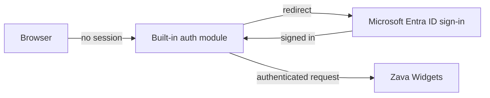

import Tabs from '@theme/Tabs';
import TabItem from '@theme/TabItem';
import PathPicker from '@site/src/components/PathPicker';
import PathNav from '@site/src/components/LearningPath/PathNav';

# Step 9: Lock down access with Entra ID

This is step 9 of the [enterprise web app learning path](/docs/learning-paths/enterprise-web-app).
So far anyone on the internet can reach Zava Widgets. For an internal or partner-facing
app, you want users to **sign in with Microsoft Entra ID** first. In this step you turn
on the App Service **built-in authentication** (also called Easy Auth) so the platform
requires a valid Entra sign-in before any request reaches your app - with no
authentication code in the app itself.

Built-in authentication runs as a module in front of your app. When a request arrives
without a valid session, the platform redirects the user to sign in with Entra ID and
only lets authenticated requests through. Your app code does not change.

In this step you will:

- Turn on App Service built-in authentication with Entra ID as the identity provider.
- Require sign-in for every request.
- Confirm that an unauthenticated request is redirected to sign in.

**Estimated time:** 20 to 30 minutes.

## Objectives

By the end of this step you will be able to:

- Explain how App Service built-in authentication protects an app without code changes.
- Add Microsoft Entra ID as an identity provider.
- Require authenticated access and verify that anonymous requests are blocked.

## Before you start

You need the resource group and web app from the earlier steps:

```bash
RESOURCE_GROUP="rg-zava-widgets"
APP_NAME="<your-app-name>"
```

## How built-in authentication works

App Service built-in authentication is a module that runs in the same sandbox as your
app but outside your code. You pick an identity provider (Entra ID here), and the
platform handles the sign-in redirect, token validation, and session cookie. You
choose what happens to unauthenticated requests: send them to sign in, or reject them
with a 401 for an API.



<PathPicker
  title="Choose your tooling"
  groups={[
    {
      id: 'tooling',
      label: 'Configure with',
      options: [
        { value: 'portal', label: 'Azure portal' },
        { value: 'az', label: 'Azure CLI (az)' },
      ],
    },
  ]}
/>

## Turn on authentication

<Tabs groupId="tooling" queryString>
<TabItem value="portal" label="Azure portal">

The portal creates the Entra app registration for you, which is the easiest way to
start:

1. In the [Azure portal](https://portal.azure.com), go to your web app.
2. Select **Settings** > **Authentication**, then select **Add identity provider**.
3. Choose **Microsoft** as the identity provider.
4. For **App registration type**, keep **Create new app registration**.
5. Under **Authentication settings**, set **Restrict access** to **Require authentication** and **Unauthenticated requests** to **HTTP 302 Found redirect (recommended for websites)**.
6. Select **Add**.

</TabItem>
<TabItem value="az" label="Azure CLI (az)">

Create an Entra app registration for the app, then point built-in authentication at
it and require sign-in:

```bash
APP_URL="https://$(az webapp show --name "$APP_NAME" --resource-group "$RESOURCE_GROUP" --query defaultHostName -o tsv)"
TENANT_ID=$(az account show --query tenantId -o tsv)

CLIENT_ID=$(az ad app create \
  --display-name "zava-widgets-auth" \
  --web-redirect-uris "${APP_URL}/.auth/login/aad/callback" \
  --enable-id-token-issuance true \
  --query appId -o tsv)

az webapp auth microsoft update \
  --name "$APP_NAME" --resource-group "$RESOURCE_GROUP" \
  --client-id "$CLIENT_ID" \
  --issuer "https://sts.windows.net/${TENANT_ID}/"

az webapp auth update \
  --name "$APP_NAME" --resource-group "$RESOURCE_GROUP" \
  --enabled true \
  --action RedirectToLoginPage \
  --redirect-provider azureActiveDirectory
```

</TabItem>
</Tabs>

## Verify

From a terminal (no browser session), request the app and follow what the platform
returns. An unauthenticated request is redirected to sign in instead of reaching the
app:

```bash
APP_URL="https://$(az webapp show --name "$APP_NAME" --resource-group "$RESOURCE_GROUP" --query defaultHostName -o tsv)"
curl -s -o /dev/null -w "%{http_code} -> %{redirect_url}\n" "$APP_URL/"
```

You get a `302` redirect to the Microsoft sign-in page:

```text
302 -> https://login.microsoftonline.com/...
```

That redirect is the built-in auth module doing its job - the request never reached
Zava Widgets. Open the app in a browser and you are prompted to sign in with Entra ID;
after signing in, the storefront loads as before.

:::tip Return 401 for APIs
`RedirectToLoginPage` suits a browser app. For an API, set the unauthenticated action
to return **401** instead so callers get a clean status code rather than an HTML
sign-in page. With `az`, use `--action Return401`. Built-in auth also passes the
signed-in user's claims to your app in request headers if you want to use them later.
:::

## Troubleshooting

- **Still reachable anonymously.** Confirm authentication is enabled and set to require
  authentication: `az webapp auth show --name "$APP_NAME" --resource-group "$RESOURCE_GROUP" --query "{enabled: platform.enabled, action: globalValidation.unauthenticatedClientAction}"`.
- **`az ad app create` is not permitted.** Creating an app registration requires
  permission in your Entra tenant. Use the portal path (which handles it) or ask an
  administrator to create the registration.
- **Redirect loop after sign-in.** Make sure the redirect URI on the app registration
  matches `https://<your-app>/.auth/login/aad/callback` exactly, including `https`.

## Summary

Zava Widgets now sits behind Microsoft Entra ID: the platform requires a valid sign-in
before any request reaches the app, and it does so without a line of authentication
code. Combined with everything before it, the app is configured, data-driven, keyless,
reliable, scalable, releasable, observable, and now access-controlled. The last piece
is to close the network: keep the app's traffic to its database off the public
internet with private networking.

## Learn more

- [Authentication and authorization in Azure App Service](https://learn.microsoft.com/azure/app-service/overview-authentication-authorization)
- [Configure your App Service app to sign in using Entra ID](https://learn.microsoft.com/azure/app-service/configure-authentication-provider-aad)

<PathNav pathId="enterprise-web-app" step={9} />
