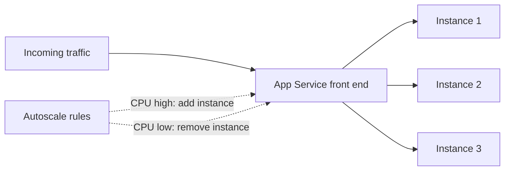

import Tabs from '@theme/Tabs';
import TabItem from '@theme/TabItem';
import PathPicker from '@site/src/components/PathPicker';
import PathNav from '@site/src/components/LearningPath/PathNav';

# Step 6: Scale out with autoscale

This is step 6 of the [enterprise web app learning path](/docs/learning-paths/enterprise-web-app).
Zava Widgets is reliable now - it has a health probe and stays warm - but it still
runs on a single instance. If traffic spikes, that one instance has to absorb all of
it. In this step you let the platform add and remove instances for you with
**autoscale**, so capacity follows demand instead of being fixed.

Autoscale is a feature of the **Standard** tier and higher, so you first scale the
App Service plan **up** from Basic (B1) to Standard (S1). Then you add rules that
**scale out** (add instances) when CPU is high and **scale in** (remove instances)
when it settles down.

In this step you will:

- Scale the App Service plan up to Standard (S1) so autoscale is available.
- Create an autoscale setting with a minimum, maximum, and default instance count.
- Add a scale-out rule and a scale-in rule based on CPU.
- Confirm the rules are in place.

**Estimated time:** 20 to 30 minutes.

## Objectives

By the end of this step you will be able to:

- Explain the difference between scaling up (bigger instances) and scaling out (more instances).
- Describe why autoscale needs the Standard tier or higher.
- Create an autoscale profile with minimum, maximum, and default instance counts.
- Add CPU-based scale-out and scale-in rules.

## Before you start

You need the resource group, web app, and plan from the earlier steps:

```bash
RESOURCE_GROUP="rg-zava-widgets"
APP_NAME="<your-app-name>"
```

If you deployed with `azd`, read the names from your environment:

```bash
cd app-service-labs/samples/zava-widgets
RESOURCE_GROUP=$(azd env get-values | grep RESOURCE_GROUP_NAME | cut -d'"' -f2)
APP_NAME=$(azd env get-values | grep WEB_APP_NAME | cut -d'"' -f2)
```

Get the App Service plan name from the app:

```bash
PLAN_NAME=$(az webapp show --name "$APP_NAME" --resource-group "$RESOURCE_GROUP" \
  --query appServicePlanId -o tsv | xargs basename)
echo "$PLAN_NAME"
```

## Scale up vs. scale out

These are two different moves, and autoscale is about the second one:

- **Scale up** gives each instance more CPU and memory by moving to a larger
  pricing tier (for example, B1 to S1, or S1 to P1v3). It is a vertical change.
- **Scale out** runs *more copies* of the app behind the same front end, sharing
  the load. It is a horizontal change, and it is what autoscale automates.

You scale up once here to reach a tier that supports autoscale, then let autoscale
handle scaling out from that point on.



This is also where the health check you set up in step 5 starts to pay off: with
more than one instance, App Service can route around an unhealthy one.

<PathPicker
  title="Choose your tooling"
  groups={[
    {
      id: 'tooling',
      label: 'Configure with',
      options: [
        { value: 'az', label: 'Azure CLI (az)' },
        { value: 'portal', label: 'Azure portal' },
      ],
    },
  ]}
/>

## Scale the plan up to Standard

<Tabs groupId="tooling" queryString>
<TabItem value="az" label="Azure CLI (az)">

Move the plan to the Standard S1 tier:

```bash
az appservice plan update \
  --name "$PLAN_NAME" --resource-group "$RESOURCE_GROUP" \
  --sku S1
```

</TabItem>
<TabItem value="portal" label="Azure portal">

1. In the [Azure portal](https://portal.azure.com), go to your web app.
2. Select **Settings** > **Scale up (App Service plan)**.
3. Choose the **Standard S1** plan and select **Select** to apply it.

</TabItem>
</Tabs>

:::info Standard adds features, not just size
Moving to Standard unlocks autoscale rules, deployment slots (the next step), and
daily backups. It costs more than Basic - about USD 70/month for S1 Linux - so in
your own projects, right-size the tier to the workload.
:::

## Add autoscale rules

<Tabs groupId="tooling" queryString>
<TabItem value="az" label="Azure CLI (az)">

Create an autoscale setting on the plan with a floor of 1 instance, a ceiling of 3,
and a default of 1:

```bash
az monitor autoscale create \
  --resource-group "$RESOURCE_GROUP" \
  --resource "$PLAN_NAME" \
  --resource-type Microsoft.Web/serverfarms \
  --name zava-autoscale \
  --min-count 1 --max-count 3 --count 1
```

Add a rule that adds one instance when average CPU stays above 70 percent:

```bash
az monitor autoscale rule create \
  --resource-group "$RESOURCE_GROUP" \
  --autoscale-name zava-autoscale \
  --condition "CpuPercentage > 70 avg 5m" \
  --scale out 1
```

Add a rule that removes one instance when average CPU drops below 30 percent:

```bash
az monitor autoscale rule create \
  --resource-group "$RESOURCE_GROUP" \
  --autoscale-name zava-autoscale \
  --condition "CpuPercentage < 30 avg 5m" \
  --scale in 1
```

</TabItem>
<TabItem value="portal" label="Azure portal">

1. In the [Azure portal](https://portal.azure.com), go to your web app.
2. Select **Settings** > **Scale out (App Service plan)**.
3. Select **Custom autoscale**.
4. Under **Instance limits**, set **Minimum** to `1`, **Maximum** to `3`, and **Default** to `1`.
5. Under the default profile, select **Add a rule**. Set **Metric** to **CPU Percentage**, **Operator** to **Greater than**, **Threshold** to `70`, **Duration** to `5` minutes, **Operation** to **Increase count by** `1`, then select **Add**.
6. Select **Add a rule** again. Set **Operator** to **Less than**, **Threshold** to `30`, **Operation** to **Decrease count by** `1`, then select **Add**.
7. Select **Save**.

</TabItem>
</Tabs>

## Verify

Confirm the autoscale setting and its rules:

```bash
az monitor autoscale show \
  --resource-group "$RESOURCE_GROUP" --name zava-autoscale \
  --query "{min: profiles[0].capacity.minimum, max: profiles[0].capacity.maximum, default: profiles[0].capacity.default, rules: length(profiles[0].rules)}"
```

You should see the limits you set and two rules:

```json
{"default": "1", "max": "3", "min": "1", "rules": 2}
```

Autoscale now watches CPU and adjusts the instance count between 1 and 3 on its own.
You do not need to generate load to prove it works - the presence of the two rules
and the instance limits confirm the configuration. In production you would watch the
**Run history** on the Scale out blade to see scale actions as they happen.

:::tip Set a sensible floor and ceiling
The minimum protects availability (never drop below it), and the maximum protects
your bill (never exceed it). Start conservative and widen the range once you have
seen real traffic patterns.
:::

## Troubleshooting

- **`az appservice plan update` fails or autoscale is unavailable.** Autoscale
  requires Standard or higher. Confirm the plan moved to S1 with
  `az appservice plan show --name "$PLAN_NAME" --resource-group "$RESOURCE_GROUP" --query sku.name`.
- **The scale-in rule never fires.** Scale-in needs CPU to stay below the threshold
  for the full duration. If the app is idle it will sit at the minimum instance
  count, which is expected.
- **Rules conflict.** Keep the scale-out threshold well above the scale-in
  threshold (70 vs. 30 here) so the app does not flap between adding and removing
  instances.

## Summary

Zava Widgets now grows and shrinks with demand: autoscale holds it at one instance
when quiet and adds up to two more when CPU climbs, then scales back in when the
spike passes. Combined with the health check from step 5, the app can lose an
instance and keep serving. Next you make releases safe by staging changes in a
**deployment slot** and swapping them into production with zero downtime.

## Learn more

- [Get started with autoscale in Azure](https://learn.microsoft.com/azure/azure-monitor/autoscale/autoscale-get-started)
- [Scale up an app in Azure App Service](https://learn.microsoft.com/azure/app-service/manage-scale-up)

<PathNav pathId="enterprise-web-app" step={6} />
