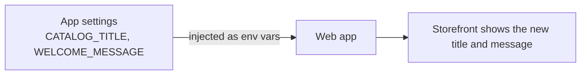

import Tabs from '@theme/Tabs';
import TabItem from '@theme/TabItem';
import PathPicker from '@site/src/components/PathPicker';
import PathNav from '@site/src/components/LearningPath/PathNav';

# Step 2: Externalize configuration

This is step 2 of the [enterprise web app learning path](/docs/learning-paths/overview).
In [step 1](/docs/learning-paths/deploy-the-app) you deployed Contoso Widgets and
it served a hard-coded title and welcome message. Hard-coding those means a change
requires a redeploy, and the same build cannot be reused across environments. In
this step you move that configuration into **App Service app settings**, so you can
change it without touching the code.

App settings are exposed to your app as environment variables. Contoso Widgets
already reads `CATALOG_TITLE` and `WELCOME_MESSAGE` from the environment and falls
back to defaults when they are absent - so you only need to set them.

In this step you will:

- Set two app settings on the web app you deployed in step 1.
- See the storefront pick up the new values after the app restarts.
- Learn how app settings and connection strings differ.

**Estimated time:** 15 to 20 minutes.

## Objectives

By the end of this step you will be able to:

- Add and update App Service app settings with the Azure CLI or the Azure portal.
- Explain how app settings surface in your app as environment variables.
- Describe when to use a connection string setting instead of an app setting.

## Before you start

You need the resource group and web app you created in step 1. If you deployed
with the Azure CLI, reuse the same variables:

```bash
RESOURCE_GROUP="rg-contoso-widgets"
APP_NAME="<your-app-name>"   # the name you created in step 1
```

If you deployed with `azd`, read the names from your environment:

```bash
cd app-service-labs/samples/contoso-widgets
RESOURCE_GROUP=$(azd env get-values | grep RESOURCE_GROUP_NAME | cut -d'"' -f2)
APP_NAME=$(azd env get-values | grep WEB_APP_NAME | cut -d'"' -f2)
```

## How app settings reach your app

An App Service **app setting** is a name-value pair that the platform injects into
your app as an environment variable at runtime. Your code reads it the same way it
reads any environment variable - `process.env.CATALOG_TITLE` in Node.js. Because
the value lives in the platform, not in your build, you can change it per
environment and update it without redeploying. Saving an app setting restarts the
app so it picks up the new value.



<PathPicker
  title="Choose your tooling"
  groups={[
    {
      id: 'tooling',
      label: 'Configure with',
      options: [
        { value: 'az', label: 'Azure CLI (az)' },
        { value: 'portal', label: 'Azure portal' },
      ],
    },
  ]}
/>

## Set the app settings

<Tabs groupId="tooling" queryString>
<TabItem value="az" label="Azure CLI (az)">

Set both values in one command:

```bash
az webapp config appsettings set \
  --name "$APP_NAME" \
  --resource-group "$RESOURCE_GROUP" \
  --settings \
    CATALOG_TITLE="Contoso Widgets - Spring Sale" \
    WELCOME_MESSAGE="Fresh smart-home deals, updated daily."
```

The command returns the full list of app settings. Setting them restarts the app.

</TabItem>
<TabItem value="portal" label="Azure portal">

1. In the [Azure portal](https://portal.azure.com), go to your web app.
2. In the left menu, select **Settings** > **Environment variables**.
3. On the **App settings** tab, select **Add**.
4. Enter the name `CATALOG_TITLE` and the value `Contoso Widgets - Spring Sale`, then select **Apply**.
5. Select **Add** again, enter `WELCOME_MESSAGE` and the value `Fresh smart-home deals, updated daily.`, then select **Apply**.
6. Select **Apply** at the bottom of the page, then **Confirm** to save. The app restarts.

</TabItem>
</Tabs>

## Verify

Give the app a few seconds to restart, then check the configuration endpoint:

```bash
APP_URL="https://$(az webapp show --name "$APP_NAME" --resource-group "$RESOURCE_GROUP" --query defaultHostName -o tsv)"
curl -s "$APP_URL/api/info"
```

The `catalogTitle` now reflects your setting:

```json
{"catalogTitle":"Contoso Widgets - Spring Sale","dataSource":"in-memory","partnerIntegration":"not-configured","node":"v20.x.x"}
```

Open `$APP_URL` in a browser. The header shows the new title and welcome message -
with no code change and no redeploy.

:::tip App settings vs. connection strings
App Service also has a separate **connection strings** section. It works like app
settings - the values are injected as environment variables - but it is meant for
database and service connection strings, is masked in the portal, and can be
prefixed by type. You use a connection setting in the next step when you point the
app at a database. For general configuration like these two values, app settings
are the right choice.
:::

## Summary

You moved the storefront's title and message out of the code and into app
settings, and changed them without redeploying. This is the foundation for the
rest of the path: configuration lives in the platform, not the build. Next, you
give the app real data - a database it reaches with its managed identity, no
password required.

## Learn more

- [Configure app settings in App Service](https://learn.microsoft.com/azure/app-service/configure-common)
- [Environment variables and app settings reference](https://learn.microsoft.com/azure/app-service/reference-app-settings)

<PathNav pathId="enterprise-web-app" step={2} />
