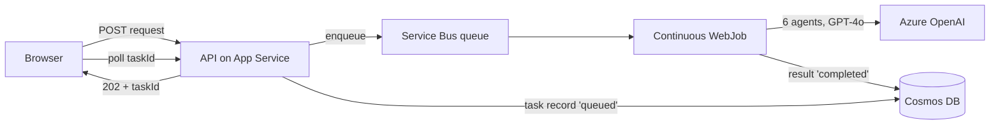

import PathNav from '@site/src/components/LearningPath/PathNav';
import Prerequisites from '@site/src/components/SharedMarkdown/_prerequisites.mdx';

# Step 1: Deploy the multi-agent app

This is the first step of the
[Govern multi-agent AI learning path](/docs/learning-paths/govern-multi-agent-ai).
You deploy a **six-agent travel planner** built with the
[Microsoft Agent Framework](https://learn.microsoft.com/agent-framework/) to
[Azure App Service](https://learn.microsoft.com/azure/app-service/overview). One
command provisions every resource and deploys the code. Over the next steps you
add observability and governance - without rewriting the app.

In this step you will:

- Get the sample app and understand how its six agents collaborate.
- Deploy it to App Service with the Azure Developer CLI (`azd up`).
- Submit a travel request and watch the agents produce a complete itinerary.

:::info App Service Labs complements Microsoft Learn
This is a hands-on walkthrough. For reference depth on any concept, follow the
"Learn more" links to the official Microsoft Learn documentation.
:::

**Estimated time:** 30 to 40 minutes.

## Objectives

By the end of this step you will be able to:

- Deploy a multi-agent .NET app to App Service with the Azure Developer CLI.
- Describe the async request-reply pattern the app uses (API, Service Bus, WebJob, Cosmos DB).
- Verify a running multi-agent workflow from the browser or the command line.

<Prerequisites
  tools={[
    { name: 'Azure Developer CLI (azd)', url: 'https://learn.microsoft.com/azure/developer/azure-developer-cli/install-azd' },
    { name: '.NET SDK 10 or later', url: 'https://dotnet.microsoft.com/download' },
    { name: 'Access to Azure OpenAI with GPT-4o quota', url: 'https://learn.microsoft.com/azure/ai-services/openai/how-to/create-resource' },
  ]}
/>

:::tip One resource group for the whole path
`azd up` puts every resource in a **single resource group** named
`rg-<environment-name>`. Note that name - you reuse it in every later step. Keep
the resources running until the final step, where you delete the group to stop
billing. This app uses a **Premium v4 (P0v4)** Windows plan (about USD 75/month)
because it runs a continuous WebJob alongside the API; the plan is prorated, so a
few hours of learning costs little.
:::

## Meet the app

The travel planner turns one request - a destination, dates, budget, and
interests - into a day-by-day itinerary. Six specialized agents collaborate to
build it:

| Agent | Job | Tool it calls |
| :-- | :-- | :-- |
| Travel Planning Coordinator | Orchestrates the workflow and writes the final plan | (none) |
| Currency Conversion Specialist | Converts the budget to the local currency | Frankfurter exchange-rate API |
| Weather & Packing Advisor | Checks the forecast and packing needs | National Weather Service API |
| Local Expert & Cultural Guide | Adds local knowledge and etiquette | (none) |
| Itinerary Planning Expert | Builds the daily schedule | (none) |
| Budget Optimization Specialist | Keeps the plan within budget | (none) |

The app is built for production, not just a demo. The API accepts a request,
enqueues it on Service Bus, writes a task record to Cosmos DB, and returns a
**task ID** immediately. A continuous **WebJob** picks up the message, runs the
multi-agent workflow, and writes the result back to Cosmos DB. The client polls
until the task is `completed`. This async request-reply pattern keeps the API
responsive even though a full plan takes many model calls.



## Get the sample app

Clone the repository and check out the **`start`** branch. This branch has the app
with observability wired in but **without** governance - you add governance
yourself in Step 3.

```bash
git clone --branch start https://github.com/Azure-Samples/app-service-multi-agent-maf-otel.git
cd app-service-multi-agent-maf-otel
```

The repository has three parts: `src/` (the .NET solution - `TravelPlanner.Api`,
`TravelPlanner.WebJob`, and the shared `TravelPlanner.Shared` library with the six
agents), `infra/` (the Bicep that provisions Azure resources), and `azure.yaml`
(which tells `azd` how to deploy).

## Deploy the app

Sign in, then provision and deploy in one command:

```bash
azd auth login
azd up
```

When prompted, enter an **environment name** (for example, `maf-travel`), choose
your subscription, and choose a region that has **GPT-4o** quota (for example,
**East US 2**). `azd` then:

- Creates a resource group named `rg-<environment-name>`.
- Provisions the App Service plan (P0v4 Windows) and web app, a Service Bus
  namespace and queue, a Cosmos DB account, an Azure OpenAI resource with a
  **GPT-4o** deployment, and Application Insights with Log Analytics.
- Assigns a **managed identity** to the app and grants it access to Service Bus,
  Cosmos DB, and Azure OpenAI - so there are no secrets in the app.
- Deploys the API and the continuous WebJob.

The first run takes several minutes. When it finishes, `azd` prints the app URL.
Capture the values you reuse in later steps:

```bash
azd env get-values | grep -E 'SERVICE_API_URI|AZURE_RESOURCE_GROUP|APPLICATIONINSIGHTS_NAME'
```

## Verify

Open the app URL (`SERVICE_API_URI`) in a browser. The travel planner shows a
form. Enter a destination, dates, a budget, and a couple of interests, then submit.
The page shows the request move from **queued** to **processing** to **completed**,
then renders the finished itinerary. Producing a full plan takes 30 to 60 seconds
because six agents each make one or more model calls.

Prefer the command line? Submit a request and poll for the result:

```bash
APP_URL=$(azd env get-values | grep SERVICE_API_URI | cut -d'"' -f2)

# Submit a travel plan; capture the task ID from the 202 response.
TASK_ID=$(curl -s -X POST "$APP_URL/api/travel-plans" \
  -H "Content-Type: application/json" \
  -d '{
    "destination": "Tokyo, Japan",
    "startDate": "2025-10-10",
    "endDate": "2025-10-14",
    "budget": 2500,
    "interests": ["food", "history"],
    "travelStyle": "balanced"
  }' | python3 -c "import sys,json; print(json.load(sys.stdin)['taskId'])")

echo "Task: $TASK_ID"

# Poll until the status is completed.
curl -s "$APP_URL/api/travel-plans/$TASK_ID" | python3 -m json.tool
```

Repeat the status call until `"status": "completed"`, then fetch the itinerary:

```bash
curl -s "$APP_URL/api/travel-plans/$TASK_ID/result" | python3 -m json.tool
```

A completed plan includes daily activities, a budget breakdown, packing list, and
travel tips - the combined output of all six agents.

:::tip Keep your resources
Do not delete anything yet. The next step reuses this same app and its Application
Insights resource. You only clean up at the end of the path.
:::

## Summary

You deployed a six-agent travel planner to App Service with a single `azd up`
command, and confirmed the agents collaborate to produce a complete itinerary. The
app already emits OpenTelemetry telemetry - you just cannot see it yet. Next, you
open the Application Insights **Agents (Preview)** view and watch every agent,
token, and tool call in real time.

## Learn more

- [Microsoft Agent Framework](https://learn.microsoft.com/agent-framework/)
- [What is the Azure Developer CLI?](https://learn.microsoft.com/azure/developer/azure-developer-cli/overview)
- [Run background tasks with WebJobs in App Service](https://learn.microsoft.com/azure/app-service/webjobs-create)
- [Asynchronous request-reply pattern](https://learn.microsoft.com/azure/architecture/patterns/async-request-reply)

<PathNav pathId="govern-multi-agent-ai" step={1} />
