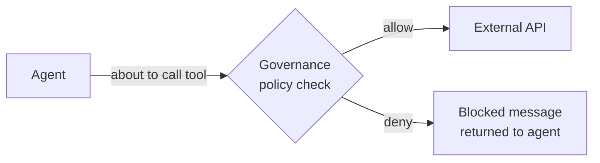

import PathNav from '@site/src/components/LearningPath/PathNav';

# Step 3: Govern the agents

This is the final step of the
[Govern multi-agent AI learning path](/docs/learning-paths/govern-multi-agent-ai).
You can see what the agents are doing. The last question is **what they are allowed
to do**. In this step you add the
[Agent Governance Toolkit](https://github.com/microsoft/agent-governance-toolkit)
so a **policy file** decides which tools each agent may call - and any call the
policy denies is blocked at runtime, before it reaches an external API.

In this step you will:

- Add the governance toolkit to the app with five small, focused changes.
- Define a policy that allows only the agent tool calls you expect.
- Redeploy and watch a disallowed tool call get blocked.

**Estimated time:** 30 to 40 minutes.

## Objectives

By the end of this step you will be able to:

- Explain how a governance layer intercepts agent tool calls.
- Add a deny-by-default tool policy to a Microsoft Agent Framework app.
- Verify enforcement by observing a blocked tool call.

## How governance fits in

The toolkit plugs into the Microsoft Agent Framework agent pipeline. Every time an
agent is about to call a tool, the governance layer evaluates the call against your
policy. If the policy **allows** it, the call proceeds; if it **denies** it, the
agent gets a blocked message instead of a tool result - and the model works with
that.



The design uses **graceful degradation**: agents resolve the governance kernel from
dependency injection and only enforce policy if it is registered. That is why the
`start` branch runs fine without governance - and why adding it is purely additive.

:::tip Compare with the finished version
The `main` branch of the sample is the completed, governed app. If you get stuck,
run `git diff start main` to see every change, or open the files on
[GitHub](https://github.com/Azure-Samples/app-service-multi-agent-maf-otel).
:::

## Add governance in five changes

Make these five changes in the repository you cloned in Step 1.

### 1. Reference the toolkit package

In `src/TravelPlanner.Shared/TravelPlanner.Shared.csproj`, add the package
reference inside the existing `<ItemGroup>` of package references:

```xml
<PackageReference Include="Microsoft.AgentGovernance" Version="3.0.2" />
```

### 2. Add the governance extension

Create `src/TravelPlanner.Shared/Governance/GovernanceExtensions.cs`. This
extension plugs the toolkit into the agent builder pipeline and intercepts every
tool call:

```csharp
using AgentGovernance;
using AgentGovernance.Integration;
using Microsoft.Agents.AI;
using Microsoft.Extensions.AI;

namespace TravelPlanner.Shared.Governance;

/// <summary>
/// Extension that plugs the Agent Governance Toolkit into the MAF agent builder pipeline.
/// Intercepts tool/function invocations and evaluates them against loaded policies.
/// </summary>
public static class GovernanceExtensions
{
    public static AIAgentBuilder UseGovernance(this AIAgentBuilder builder, GovernanceKernel kernel, string agentName)
    {
        return FunctionInvocationDelegatingAgentBuilderExtensions.Use(builder,
            async (AIAgent agent, FunctionInvocationContext context, Func<FunctionInvocationContext, CancellationToken, ValueTask<object?>> next, CancellationToken ct) =>
            {
                var toolName = context.Function.Name;

                ToolCallResult result = kernel.EvaluateToolCall(
                    agentId: agentName,
                    toolName: toolName,
                    args: new Dictionary<string, object> { ["tool"] = toolName, ["agent"] = agentName });

                if (!result.Allowed)
                    return $"[Governance] Tool call '{toolName}' blocked for agent '{agentName}': {result.Reason}";

                return await next(context, ct);
            });
    }
}
```

### 3. Add the policy file

Create `src/TravelPlanner.Api/governance-policies.yaml`. This policy is
**deny-by-default**: it blocks every tool call except the three the app expects:

```yaml
# Governance policies for the Travel Planner multi-agent workflow.
apiVersion: governance.toolkit/v1
name: travel-planner-governance
description: Policy enforcement for the multi-agent travel planner on App Service
scope: global
defaultAction: deny
rules:
  - name: allow-currency-conversion
    condition: "tool == 'ConvertCurrency'"
    action: allow
    priority: 10
    description: Allow Currency Converter agent to call Frankfurter exchange rate API
  - name: allow-weather-forecast
    condition: "tool == 'GetWeatherForecast'"
    action: allow
    priority: 10
    description: Allow Weather Advisor agent to call NWS forecast API
  - name: allow-weather-alerts
    condition: "tool == 'GetWeatherAlerts'"
    action: allow
    priority: 10
    description: Allow Weather Advisor agent to check NWS weather alerts
```

Then tell the build to copy the policy file to the output so the app can read it at
runtime. In `src/TravelPlanner.Api/TravelPlanner.Api.csproj`, add this `<ItemGroup>`
before the closing `</Project>` tag:

```xml
<ItemGroup>
  <None Update="governance-policies.yaml">
    <CopyToOutputDirectory>PreserveNewest</CopyToOutputDirectory>
  </None>
</ItemGroup>
```

### 4. Load the policy at startup

In `src/TravelPlanner.Api/Program.cs`, add the using directive near the other
`using` statements:

```csharp
using AgentGovernance;
```

Then, right after the `builder.Services.AddOpenTelemetry().UseAzureMonitor();`
line, load the policy and register the governance kernel. Because agents resolve
the kernel from dependency injection, **not registering it means no governance** -
so this block fails safe:

```csharp
// Configure Agent Governance Toolkit - policy enforcement for agent tool calls.
var policyPath = Path.Combine(builder.Environment.ContentRootPath, "governance-policies.yaml");
if (File.Exists(policyPath))
{
    try
    {
        var yaml = File.ReadAllText(policyPath);
        var kernel = new GovernanceKernel(new GovernanceOptions { EnableAudit = true, EnableMetrics = true });
        kernel.LoadPolicyFromYaml(yaml);
        builder.Services.AddSingleton(kernel);
        Console.WriteLine($"[Governance] Loaded policies from {policyPath}");
    }
    catch (Exception ex)
    {
        Console.WriteLine($"[Governance] Failed to load policies: {ex.Message}. Running without governance.");
    }
}
else
{
    Console.WriteLine("[Governance] No governance-policies.yaml found. Running without governance.");
}
```

`EnableAudit = true` sends every allow/deny decision to OpenTelemetry, so
governance decisions show up alongside the agent traces you explored in Step 2.

### 5. Enforce policy in the agents

Every agent inherits from `BaseAgent`. In
`src/TravelPlanner.Shared/Agents/BaseAgent.cs`, add these two using directives at
the top:

```csharp
using AgentGovernance;
using TravelPlanner.Shared.Governance;
```

`BaseAgent` has two constructors (one for agents with tools, one without). In
**each** constructor, add the governance call right after the
`.UseOpenTelemetry(sourceName: AgentName)` builder line and before
`Agent = builder.Build();`:

```csharp
var kernel = serviceProvider.GetService<GovernanceKernel>();
if (kernel is not null)
    builder.UseGovernance(kernel, AgentName);
```

That is the whole integration: one policy file, one extension, and one line per
agent constructor. Build locally to confirm everything compiles:

```bash
dotnet build src
```

## Redeploy

Deploy the updated code to the app you provisioned in Step 1 - no new
infrastructure is needed:

```bash
azd deploy
```

When the deploy finishes, submit a travel plan (from the web form or with the curl
command from Step 1). With the default policy, all three expected tools are
allowed, so the plan completes exactly as before - but now every tool call is being
checked against your policy.

## See governance block a call

A policy is only convincing when you watch it stop something. Tighten the policy so
the weather tools are no longer allowed. In `governance-policies.yaml`, delete the
`allow-weather-forecast` and `allow-weather-alerts` rules, leaving only
`allow-currency-conversion`. Redeploy:

```bash
azd deploy
```

Submit another travel plan. This time the Weather & Packing Advisor's tool call is
**denied**: instead of a forecast, the agent receives a message like
`[Governance] Tool call 'GetWeatherForecast' blocked for agent 'Weather & Packing Advisor': ...`.
The workflow still completes - the agent simply works without live weather - which
shows governance failing safe rather than crashing the app.

You can confirm the block two ways:

- In the finished itinerary, the packing and weather guidance is generic instead of forecast-based.
- In the Application Insights **Agents (Preview)** view from Step 2, the denied tool call appears in the transaction trace, because `EnableAudit` sends governance decisions to OpenTelemetry.

When you are done experimenting, restore the two weather rules (or check out the
`main` branch's policy file) and redeploy so the app is fully functional again.

## Verify

You have governed the app when:

- `dotnet build src` succeeds with the five governance changes in place.
- A travel plan completes normally with all three tools allowed.
- Removing the weather rules and redeploying produces a blocked `GetWeatherForecast` call that you can see in the itinerary and in Application Insights.

## Summary

You added a governance layer to a live multi-agent app with five focused changes -
no rewrite, no new infrastructure - and proved it works by watching a disallowed
tool call get blocked. Together, the three steps of this path took the travel
planner from a running prototype to an app you can **deploy**, **observe**, and
**govern** on App Service. That is the difference between an AI demo and an AI app
you can operate in production.

## Clean up

You are at the end of the path. Delete the single resource group `azd` created in
Step 1 to remove every resource and stop billing:

```bash
azd down --purge --force
```

`azd down` deletes the resource group and its contents. The `--purge` flag also
purges the soft-deleted Azure OpenAI resource so its name and quota are freed
immediately. If you prefer, delete the `rg-<environment-name>` resource group from
the Azure portal instead.

## Learn more

- [Agent Governance Toolkit](https://github.com/microsoft/agent-governance-toolkit)
- [Microsoft Agent Framework](https://learn.microsoft.com/agent-framework/)
- [Managed identities for Azure resources](https://learn.microsoft.com/entra/identity/managed-identities-azure-resources/overview)
- [Govern AI agents on Azure App Service (blog)](https://techcommunity.microsoft.com/blog/appsonazureblog/govern-ai-agents-on-azure-app-service-with-the-agent-governance-toolkit/4510962)

<PathNav pathId="govern-multi-agent-ai" step={3} />
