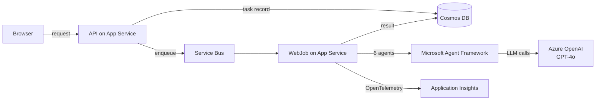

import LearningPath from '@site/src/components/LearningPath';

# Build, observe, and govern multi-agent AI on Azure App Service

Multi-agent AI apps are easy to prototype and hard to run in production. Once
several agents call language models and external tools on a user's behalf, you
need to answer two operational questions: **what are the agents doing?** and
**what are they allowed to do?** This learning path answers both.

You carry **one app** - a six-agent travel planner built with the
[Microsoft Agent Framework](https://learn.microsoft.com/agent-framework/) (MAF)
- from a first deploy all the way to a fully observable, policy-governed app on
[Azure App Service](https://learn.microsoft.com/azure/app-service/overview). You
never rewrite the app. In each step you add one operational capability around it:
first deployment, then observability, then governance.

:::info One app, carried across steps
Each step builds on the last and uses the **same resources**. Do the steps in
order and keep your resources running until you reach [Clean up](#clean-up) at the
end of the path. This path is based on the three-part blog series
[Multi-Agent AI on Azure App Service](https://techcommunity.microsoft.com/blog/appsonazureblog/govern-ai-agents-on-azure-app-service-with-the-agent-governance-toolkit/4510962).
:::

## Meet the app

The sample is a **travel planner** that turns a single request - a destination,
dates, budget, and interests - into a complete day-by-day itinerary. It does this
with six specialized agents that collaborate:

- **Travel Planning Coordinator** - orchestrates the workflow and synthesizes the final plan.
- **Currency Conversion Specialist** - converts budgets using a live exchange-rate tool.
- **Weather & Packing Advisor** - checks forecasts and alerts using a weather tool.
- **Local Expert & Cultural Guide** - adds local knowledge and etiquette tips.
- **Itinerary Planning Expert** - builds the day-by-day schedule.
- **Budget Optimization Specialist** - keeps the plan within budget.

The app runs on App Service as an ASP.NET Core API plus a continuous WebJob. The
API accepts a request and returns immediately with a task ID; the WebJob runs the
multi-agent workflow in the background and writes the result to Cosmos DB, which
the client polls. Azure OpenAI provides the model; Service Bus decouples the API
from the workflow.

## What you will build

By the last step, the travel planner is not just running - it is **observable**
and **governed**:

- **Step 1 - Deploy** the app to App Service and watch six agents produce a travel plan.
- **Step 2 - Observe** every agent, token, and tool call in the Application Insights **Agents (Preview)** view, powered by OpenTelemetry GenAI semantic conventions.
- **Step 3 - Govern** the agents by adding the [Agent Governance Toolkit](https://github.com/microsoft/agent-governance-toolkit) so a policy file decides which tools each agent may call - and denied calls are blocked at runtime.

## What you need

- An Azure subscription with permission to create resources and role assignments.
- Access to **Azure OpenAI** with quota for a **GPT-4o** deployment in your chosen region.
- The [Azure Developer CLI (azd)](https://learn.microsoft.com/azure/developer/azure-developer-cli/install-azd)
  and the [.NET SDK 10 or later](https://dotnet.microsoft.com/download).
- [Git](https://git-scm.com/downloads).

The app for this path lives in
[`Azure-Samples/app-service-multi-agent-maf-otel`](https://github.com/Azure-Samples/app-service-multi-agent-maf-otel).
Step 1 walks you through cloning and deploying it. You start from the `start`
branch (before governance) and add governance yourself in Step 3; the `main`
branch holds the finished version if you want to compare.

## The path

Work through the steps in order. Use the checkboxes to track your progress - they
are saved in your browser.

<LearningPath pathId="govern-multi-agent-ai" />

## Clean up

When you finish the path (or want to stop), delete the single resource group
`azd` created to remove every resource and stop billing. The final step of the
path includes the exact command. Because `azd up` puts everything in one resource
group, one delete removes it all.
