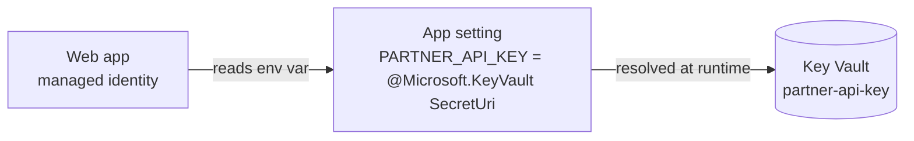

import Tabs from '@theme/Tabs';
import TabItem from '@theme/TabItem';
import PathPicker from '@site/src/components/PathPicker';
import PathNav from '@site/src/components/LearningPath/PathNav';

# Step 4: Move secrets to Key Vault

This is step 4 of the [enterprise web app learning path](/docs/learning-paths/overview).
In [step 3](/docs/learning-paths/connect-a-database) you connected Zava Widgets
to a database with no stored password. Now the app needs another kind of secret: a
**partner API key** for an integration. The tempting shortcut is to paste the key
into an app setting, but then the raw value lives in your configuration, shows up in
exports, and has to be rotated by hand everywhere it was copied.

This step does it the right way. You store the key in
[Azure Key Vault](https://learn.microsoft.com/azure/key-vault/general/overview) and
point an app setting at it with a **Key Vault reference**. App Service resolves the
reference at runtime using the app's managed identity, and hands your app a plain
environment variable - no key, no vault SDK, no secret in your configuration.

The app already reads `PARTNER_API_KEY` from the environment and reports its partner
integration as configured when the value is present. You only need to supply it - as
a reference, not a literal.

In this step you will:

- Create a Key Vault in RBAC authorization mode and store the partner key.
- Grant the app's managed identity read-only access to secrets.
- Point an app setting at the secret with `@Microsoft.KeyVault(SecretUri=...)` and
  watch the integration turn on with no secret in configuration.

**Estimated time:** 25 to 35 minutes.

## Objectives

By the end of this step you will be able to:

- Create a Key Vault in RBAC authorization mode and store a secret.
- Grant a managed identity least-privilege access with the Key Vault Secrets User role.
- Wire an app setting to a Key Vault reference and confirm App Service resolves it.

## Before you start

You need the resource group and web app from the earlier steps, plus the app's
managed identity (you turned it on in step 1). Reuse your variables:

```bash
RESOURCE_GROUP="rg-zava-widgets"
APP_NAME="<your-app-name>"
LOCATION="eastus"
```

If you deployed with `azd`, read the names from your environment:

```bash
cd app-service-labs/samples/zava-widgets
RESOURCE_GROUP=$(azd env get-values | grep RESOURCE_GROUP_NAME | cut -d'"' -f2)
APP_NAME=$(azd env get-values | grep WEB_APP_NAME | cut -d'"' -f2)
```

## How a Key Vault reference works

When an app setting's value looks like `@Microsoft.KeyVault(SecretUri=...)`, App
Service uses the app's managed identity to fetch the secret from Key Vault and
injects the resolved value as a normal environment variable. Your code reads
`process.env.PARTNER_API_KEY` like any other setting - it never sees the vault, the
reference syntax, or a key. If the reference cannot be resolved, the variable is
empty, so a working integration is proof the secret resolved.



<PathPicker
  title="Choose your tooling"
  groups={[
    {
      id: 'tooling',
      label: 'Configure with',
      options: [
        { value: 'az', label: 'Azure CLI (az)' },
        { value: 'portal', label: 'Azure portal' },
      ],
    },
  ]}
/>

## Create the vault and store the secret

<Tabs groupId="tooling" queryString>
<TabItem value="az" label="Azure CLI (az)">

Create a Key Vault in RBAC mode, grant yourself permission to write secrets, then
store the partner key. The value here is a throwaway demo string - never put a real
secret in a lab.

```bash
VAULT="kv-zava-$RANDOM"
SECRET_NAME="partner-api-key"

az keyvault create \
  --name "$VAULT" \
  --resource-group "$RESOURCE_GROUP" \
  --location "$LOCATION" \
  --enable-rbac-authorization true

VAULT_ID=$(az keyvault show --name "$VAULT" --resource-group "$RESOURCE_GROUP" --query id -o tsv)
MY_OID=$(az ad signed-in-user show --query id -o tsv)

az role assignment create \
  --assignee-object-id "$MY_OID" --assignee-principal-type User \
  --role "Key Vault Secrets Officer" --scope "$VAULT_ID"

# Role assignments can take a few seconds to propagate before the next command works.
az keyvault secret set \
  --vault-name "$VAULT" --name "$SECRET_NAME" \
  --value "zava-partner-demo-key-do-not-use-in-prod"
```

</TabItem>
<TabItem value="portal" label="Azure portal">

1. In the [Azure portal](https://portal.azure.com), search for **Key vaults** and select **Create**.
2. Choose your resource group, name the vault (for example, `kv-zava-<unique>`), pick **East US**, and on the **Access configuration** tab set **Permission model** to **Azure role-based access control**. Select **Review + create**, then **Create**.
3. Open the vault, select **Access control (IAM)** > **Add** > **Add role assignment**, choose **Key Vault Secrets Officer**, assign it to your own user, and select **Review + assign**.
4. In the vault, select **Objects** > **Secrets** > **Generate/Import**. Name the secret `partner-api-key`, set the value to a throwaway string such as `zava-partner-demo-key-do-not-use-in-prod`, and select **Create**.

</TabItem>
</Tabs>

## Grant the app read access

Give the app's managed identity the **Key Vault Secrets User** role. This is the
only access the app gets, and it is read-only on secret values.

<Tabs groupId="tooling" queryString>
<TabItem value="az" label="Azure CLI (az)">

```bash
PRINCIPAL_ID=$(az webapp identity show \
  --name "$APP_NAME" --resource-group "$RESOURCE_GROUP" \
  --query principalId -o tsv)

az role assignment create \
  --assignee-object-id "$PRINCIPAL_ID" --assignee-principal-type ServicePrincipal \
  --role "Key Vault Secrets User" --scope "$VAULT_ID"
```

</TabItem>
<TabItem value="portal" label="Azure portal">

1. Open your Key Vault and select **Access control (IAM)** > **Add** > **Add role assignment**.
2. Select the **Key Vault Secrets User** role, then **Next**.
3. For **Assign access to**, choose **Managed identity**, select **+ Select members**, pick your web app, and select **Review + assign**.

</TabItem>
</Tabs>

## Point the app at the secret

Set the `PARTNER_API_KEY` app setting to a Key Vault reference. Use the vault's DNS
name, the secret name, and a trailing slash (no version) so the app always gets the
latest value.

<Tabs groupId="tooling" queryString>
<TabItem value="az" label="Azure CLI (az)">

```bash
KV_REF="@Microsoft.KeyVault(SecretUri=https://${VAULT}.vault.azure.net/secrets/${SECRET_NAME}/)"

az webapp config appsettings set \
  --name "$APP_NAME" --resource-group "$RESOURCE_GROUP" \
  --settings PARTNER_API_KEY="$KV_REF"
```

</TabItem>
<TabItem value="portal" label="Azure portal">

1. Go to your web app and select **Settings** > **Environment variables**.
2. Add an app setting named `PARTNER_API_KEY` with the value
   `@Microsoft.KeyVault(SecretUri=https://<your-vault>.vault.azure.net/secrets/partner-api-key/)`.
3. Select **Apply**, then **Confirm**. The app restarts.

</TabItem>
</Tabs>

## Verify

Give the app a few seconds to restart, then check the info endpoint:

```bash
APP_URL="https://$(az webapp show --name "$APP_NAME" --resource-group "$RESOURCE_GROUP" --query defaultHostName -o tsv)"
curl -s "$APP_URL/api/info"
```

`partnerIntegration` now reports `configured`:

```json
{"catalogTitle":"...","dataSource":"azure-sql","partnerIntegration":"configured","node":"v22.x.x"}
```

Open `$APP_URL` in a browser. The storefront now shows a **Partner integration:
configured** badge. Because a broken reference would leave the variable empty and the
badge would read *not-configured*, seeing it configured proves App Service resolved
the secret from Key Vault.

Confirm the configuration holds only a reference, never the secret:

```bash
az webapp config appsettings list \
  --name "$APP_NAME" --resource-group "$RESOURCE_GROUP" \
  --query "[?name=='PARTNER_API_KEY'].value" -o tsv
```

The output is the `@Microsoft.KeyVault(SecretUri=...)` reference, not the key.

:::tip Rotate without redeploying
Update the secret in Key Vault and, because the reference has no version, the app
picks up the new value on its next restart - nothing to redeploy, nothing to change
in configuration.
:::

## Troubleshooting

- **`partnerIntegration` still says not-configured.** App Service could not resolve
  the reference. Confirm the app has a managed identity, that it holds **Key Vault
  Secrets User** on the vault, and that the vault uses **RBAC authorization**. Role
  assignments can take a minute to propagate; restart the app and retry.
- **`Forbidden` when running `az keyvault secret set`.** In RBAC mode, writing a
  secret needs a data-plane role. Confirm you granted your user **Key Vault Secrets
  Officer** and waited a moment before retrying.
- **The reference will not save.** Check the syntax:
  `@Microsoft.KeyVault(SecretUri=https://<vault>.vault.azure.net/secrets/<name>/)`.
  Use the vault's DNS name, the exact secret name, and a trailing slash.

## Summary

Zava Widgets now reads a secret without the secret ever touching your code or
configuration. The value lives in Key Vault; the app's identity holds a single
read-only role; and the app setting holds only a reference that App Service resolves
at runtime. Your app is data-driven, configured, and keyless. Next you make it
resilient: wire up a health probe and keep it warm.

## Learn more

- [Use Key Vault references in App Service](https://learn.microsoft.com/azure/app-service/app-service-key-vault-references)
- [Azure Key Vault overview](https://learn.microsoft.com/azure/key-vault/general/overview)
- [Managed identities for App Service](https://learn.microsoft.com/azure/app-service/overview-managed-identity)

<PathNav pathId="enterprise-web-app" step={4} />
