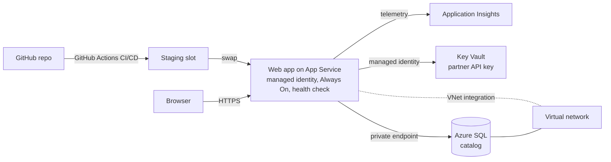

import LearningPath from '@site/src/components/LearningPath';

# From first deploy to enterprise-grade on Azure App Service

Most labs are self-contained - you spin up resources, learn one thing, and tear
them down. This learning path is different. You build **one app** and carry it
all the way from a plain first deploy to an enterprise-grade app, adding a single
capability in each step. By the end you have a running app that is configured,
data-driven, secure, observable, resilient, and continuously delivered - and you
understand how every piece was added.

The app is **Contoso Widgets**, a small product catalog. It starts by serving an
in-memory list. Step by step you move its configuration into app settings, its
data into a database it reaches without a password, its secrets into Key Vault,
and so on - never rewriting the app, only adding platform capabilities around it.

:::info One app, carried across steps
Each step builds on the last and uses the **same resource group**. Do the steps
in order and keep your resources running until you reach [Clean up](#clean-up) at
the end of the path. If you only want one topic, the standalone labs in the
sidebar cover each capability on its own.
:::

## What you will build

By the last step, Contoso Widgets runs as an enterprise-grade app on App Service:

Each step turns on one part of this diagram. You start with just the browser and
the web app serving in-memory data, and grow outward from there.

## What you need

- An Azure subscription with permission to create resources and role assignments.
- The [Azure Developer CLI (azd)](https://learn.microsoft.com/azure/developer/azure-developer-cli/install-azd)
  and the [Azure CLI (az)](https://learn.microsoft.com/cli/azure/install-azure-cli).
- [Node.js 20 or later](https://nodejs.org/) and [Git](https://git-scm.com/downloads).

The app for this path lives in the repository under
[`samples/contoso-widgets`](https://github.com/Azure-Samples/app-service-labs/tree/main/samples/contoso-widgets).
Step 1 walks you through cloning and deploying it.

## The path

Work through the steps in order. Use the checkboxes to track your progress - they
are saved in your browser.

<LearningPath pathId="enterprise-web-app" />

## Clean up

When you finish the path (or want to stop), delete the single resource group you
have been using to remove every resource and stop billing. The final step of the
path includes the exact commands. Because everything lives in one resource group,
one delete removes it all.
