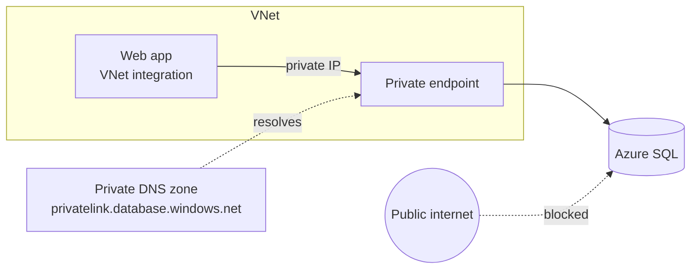

import Tabs from '@theme/Tabs';
import TabItem from '@theme/TabItem';
import PathPicker from '@site/src/components/PathPicker';
import PathNav from '@site/src/components/LearningPath/PathNav';

# Step 10: Isolate the backend with private networking

This is step 10 of the [enterprise web app learning path](/docs/learning-paths/overview).
Zava Widgets reads its catalog from Azure SQL over the public endpoint, allowed
through the SQL firewall. That works, but the traffic still traverses the public
internet and the database is reachable from anywhere the firewall permits. For an
enterprise app you want that traffic to stay on a private network. In this step you
put the app on a **virtual network**, give Azure SQL a **private endpoint**, and turn
off the database's public access - so the only way to reach it is from inside your
network.

You connect the two sides:

- **VNet integration** gives the app an address in your virtual network for outbound calls.
- A **private endpoint** gives Azure SQL a private IP in that same network, and a
  **private DNS zone** makes the SQL hostname resolve to it.

In this step you will:

- Create a virtual network with a subnet for the app and a subnet for private endpoints.
- Integrate the web app with the VNet.
- Add a private endpoint and private DNS zone for Azure SQL.
- Turn off the SQL public endpoint and confirm the app still reads the catalog - privately.

**Estimated time:** 30 to 40 minutes.

## Objectives

By the end of this step you will be able to:

- Explain how VNet integration and private endpoints keep app-to-database traffic off the internet.
- Integrate an App Service app with a virtual network.
- Create a private endpoint and private DNS zone for a PaaS service.
- Disable a service's public endpoint and verify private connectivity still works.

## Before you start

You need the resource group, web app, and the Azure SQL server from
[step 3](/docs/learning-paths/connect-a-database). Your app must already read from
Azure SQL (its `/api/products` reports `azure-sql`). Reuse your variables and set the
network names:

```bash
RESOURCE_GROUP="rg-zava-widgets"
APP_NAME="<your-app-name>"
SQL_SERVER="<your-sql-server-name>"   # without .database.windows.net
LOCATION="eastus"
VNET_NAME="vnet-zava"
APP_SUBNET="snet-app"
PE_SUBNET="snet-endpoints"
```

:::note This step requires a Standard tier or higher
VNet integration needs a Basic or higher plan; private endpoints and the features here
assume the **Standard (S1)** plan you scaled to in step 6. It is not available on the
free or shared tiers.
:::

## How private networking fits together

Today the app calls the SQL public hostname and the SQL firewall lets it in. After
this step, the app sends traffic into the VNet (integration), Azure SQL has a private
IP inside the same VNet (private endpoint), and the private DNS zone rewrites the SQL
hostname to that private IP. With public access turned off, the database is
unreachable from the internet.



<PathPicker
  title="Choose your tooling"
  groups={[
    {
      id: 'tooling',
      label: 'Provision with',
      options: [
        { value: 'az', label: 'Azure CLI (az)' },
        { value: 'portal', label: 'Azure portal' },
      ],
    },
  ]}
/>

## Create the virtual network and integrate the app

<Tabs groupId="tooling" queryString>
<TabItem value="az" label="Azure CLI (az)">

Create a VNet with two subnets - one delegated to App Service for integration, one for
private endpoints:

```bash
az network vnet create \
  --resource-group "$RESOURCE_GROUP" --name "$VNET_NAME" \
  --location "$LOCATION" --address-prefixes 10.10.0.0/16 \
  --subnet-name "$APP_SUBNET" --subnet-prefixes 10.10.1.0/24

az network vnet subnet update \
  --resource-group "$RESOURCE_GROUP" --vnet-name "$VNET_NAME" \
  --name "$APP_SUBNET" \
  --delegations Microsoft.Web/serverFarms

az network vnet subnet create \
  --resource-group "$RESOURCE_GROUP" --vnet-name "$VNET_NAME" \
  --name "$PE_SUBNET" --address-prefixes 10.10.2.0/24
```

Integrate the web app with the app subnet:

```bash
az webapp vnet-integration add \
  --resource-group "$RESOURCE_GROUP" --name "$APP_NAME" \
  --vnet "$VNET_NAME" --subnet "$APP_SUBNET"
```

</TabItem>
<TabItem value="portal" label="Azure portal">

1. In the [Azure portal](https://portal.azure.com), search for **Virtual networks** and select **Create**.
2. Put it in your resource group, name it `vnet-zava`, pick **East US**, and set an address space such as `10.10.0.0/16`. Add a subnet `snet-app` (`10.10.1.0/24`) and a subnet `snet-endpoints` (`10.10.2.0/24`). Select **Review + create**, then **Create**.
3. Go to your web app, select **Settings** > **Networking**, and under **Outbound traffic** select **Virtual network integration** > **Add virtual network integration**.
4. Choose `vnet-zava` and the `snet-app` subnet, then select **Connect**. The portal delegates the subnet to App Service for you.

</TabItem>
</Tabs>

## Add a private endpoint for Azure SQL

<Tabs groupId="tooling" queryString>
<TabItem value="az" label="Azure CLI (az)">

Create the private endpoint against the SQL server's `sqlServer` sub-resource, then a
private DNS zone and the records that point the SQL hostname at the private IP:

```bash
SQL_ID=$(az sql server show --name "$SQL_SERVER" --resource-group "$RESOURCE_GROUP" --query id -o tsv)

az network private-endpoint create \
  --resource-group "$RESOURCE_GROUP" --name "pe-sql-zava" \
  --location "$LOCATION" \
  --vnet-name "$VNET_NAME" --subnet "$PE_SUBNET" \
  --private-connection-resource-id "$SQL_ID" \
  --group-id sqlServer \
  --connection-name "conn-sql-zava"

az network private-dns zone create \
  --resource-group "$RESOURCE_GROUP" \
  --name "privatelink.database.windows.net"

az network private-dns link vnet create \
  --resource-group "$RESOURCE_GROUP" \
  --zone-name "privatelink.database.windows.net" \
  --name "link-zava" --virtual-network "$VNET_NAME" \
  --registration-enabled false

az network private-endpoint dns-zone-group create \
  --resource-group "$RESOURCE_GROUP" \
  --endpoint-name "pe-sql-zava" --name "zg-sql" \
  --private-dns-zone "privatelink.database.windows.net" \
  --zone-name "sql"
```

</TabItem>
<TabItem value="portal" label="Azure portal">

1. In the portal, open your Azure SQL **server** (not the database) and select **Security** > **Networking**.
2. On the **Private access** tab, select **Create a private endpoint**.
3. Name it `pe-sql-zava`, keep the target sub-resource **sqlServer**, and place it in `vnet-zava` / `snet-endpoints`.
4. On **DNS**, keep **Integrate with private DNS zone** set to **Yes** so `privatelink.database.windows.net` is created and linked for you.
5. Select **Review + create**, then **Create**.

</TabItem>
</Tabs>

## Turn off the SQL public endpoint

With the private path in place, block public network access to the database:

<Tabs groupId="tooling" queryString>
<TabItem value="az" label="Azure CLI (az)">

```bash
az sql server update \
  --name "$SQL_SERVER" --resource-group "$RESOURCE_GROUP" \
  --set publicNetworkAccess=Disabled
```

</TabItem>
<TabItem value="portal" label="Azure portal">

1. On the SQL server's **Networking** page, open the **Public access** tab.
2. Set **Public network access** to **Disable**, then select **Save**.

</TabItem>
</Tabs>

## Verify

The app now reaches Azure SQL only over the private endpoint. Give the app a moment,
then confirm the catalog still loads and still comes from SQL:

```bash
APP_URL="https://$(az webapp show --name "$APP_NAME" --resource-group "$RESOURCE_GROUP" --query defaultHostName -o tsv)"
curl -s "$APP_URL/api/products"
```

The response still reports `azure-sql` even though the public endpoint is off, which
proves the app is reaching the database privately:

```json
{"source":"azure-sql","count":6,"products":[ ... ]}
```

Confirm the private endpoint is connected and public access is disabled:

```bash
az network private-endpoint show \
  --resource-group "$RESOURCE_GROUP" --name "pe-sql-zava" \
  --query "privateLinkServiceConnections[0].privateLinkServiceConnectionState.status" -o tsv

az sql server show --name "$SQL_SERVER" --resource-group "$RESOURCE_GROUP" \
  --query publicNetworkAccess -o tsv
```

The first returns `Approved` and the second returns `Disabled`.

:::tip Prove it is really private
From your own machine, `sqlcmd` to the server now fails - the public endpoint is gone.
The only path that works is from inside the VNet, which is exactly where your app lives.
:::

## Troubleshooting

- **App suddenly reads in-memory / cannot reach SQL.** DNS may still be resolving to
  the public IP. Confirm the private DNS zone `privatelink.database.windows.net` is
  linked to the VNet and that the endpoint's DNS zone group was created. Restart the app.
- **`vnet-integration add` fails.** The app subnet must be delegated to
  `Microsoft.Web/serverFarms` and must not already host another integration. Use a
  dedicated, empty subnet.
- **You get locked out of the database.** Disabling public access also blocks your
  client. That is expected - manage the database from inside the VNet, or temporarily
  re-enable public access for administration.

## Summary

Zava Widgets and its database now talk over a private network: the app is integrated
with a VNet, Azure SQL answers on a private endpoint, and the public database endpoint
is switched off. Traffic between the app and its data never touches the public
internet. The application is now genuinely enterprise-grade in its security and
network posture. The final step ties it all together with automated delivery so
changes ship the same way every time.

## Learn more

- [Integrate your app with an Azure virtual network](https://learn.microsoft.com/azure/app-service/overview-vnet-integration)
- [Azure Private Link for Azure SQL Database](https://learn.microsoft.com/azure/azure-sql/database/private-endpoint-overview)
- [Azure Private Endpoint DNS configuration](https://learn.microsoft.com/azure/private-link/private-endpoint-dns)

<PathNav pathId="enterprise-web-app" step={10} />
