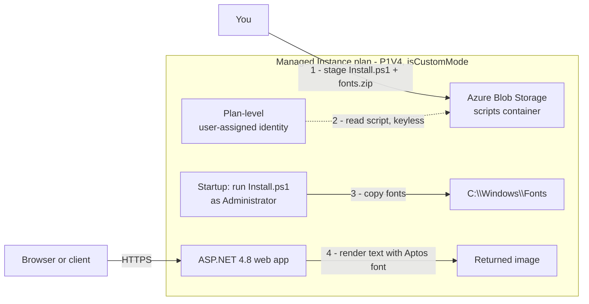

import Tabs from '@theme/Tabs';
import TabItem from '@theme/TabItem';
import PathPicker from '@site/src/components/PathPicker';
import Prerequisites from '@site/src/components/SharedMarkdown/_prerequisites.mdx';
import Cleanup from '@site/src/components/SharedMarkdown/_cleanup.mdx';

# Migrate an ASP.NET app to Managed Instance on App Service

Some Windows apps do not fit neatly into a standard [Azure App Service](https://learn.microsoft.com/azure/app-service/overview) app. A legacy ASP.NET Framework site might register a COM component, run an MSI installer, read a value from the Windows registry, tweak an IIS setting, or depend on a custom font or framework that has to be present on the machine before the app starts. On standard App Service you cannot make those OS-level changes, so these apps often stay on virtual machines long after everything else moved to PaaS.

**Managed Instance on Azure App Service** closes that gap. It is a plan-scoped hosting option for **Windows** web apps that keeps the managed platform - patching, scaling, diagnostics, identity, and load balancing - while giving you a startup **configuration (install) script** that runs with administrator rights so you can lay down OS-level and framework dependencies. It is built for the "lift and improve" migration: move a legacy .NET Framework / IIS app into App Service with minimal rewrites.

In this lab you migrate a prebuilt ASP.NET Framework 4.8 app to a Managed Instance plan. The app renders text into an image using the **Aptos** fonts - fonts that are not on the base image. A configuration script copies those fonts into `C:\Windows\Fonts` at startup, so when the app returns a rendered image you have proof that the OS-level customization worked. You will provision everything, deploy the app, and verify it end to end.

:::warning Managed Instance is in preview
Managed Instance on Azure App Service is in public preview. During preview it is **Windows only** (no Linux or containers), limited to **Premium v4 (Pv4) and Premium Mv4 (Pmv4)** pricing plans, and available in select regions: **East Asia**, **East US**, **North Europe**, and **West Central US**, with more to follow. It is expected to reach general availability soon. Preview features can change, so always confirm current limits in the [official documentation](https://learn.microsoft.com/azure/app-service/overview-managed-instance).
:::

:::info App Service Labs complements Microsoft Learn
This lab is a hands-on, end-to-end walkthrough. For reference depth on any concept, follow the "Learn more" links to the official Microsoft Learn documentation.
:::

**Estimated time:** 60 to 75 minutes

## Objectives

By the end of this lab you will be able to:

- Explain what Managed Instance on App Service is and when to choose it over standard App Service or an App Service Environment.
- Package a configuration (install) script and its dependencies and stage them in Azure Blob Storage.
- Create a Managed Instance plan on a **P1V4** tier with a plan-level user-assigned managed identity and an install script.
- Deploy an ASP.NET Framework app to the plan and confirm the OS-level customization (custom fonts) took effect.
- Describe the plan-level adapters - storage mounts, registry keys, and just-in-time RDP - you would use to finish a real migration.

<Prerequisites
  tools={[
    { name: 'Azure Developer CLI (azd)', url: 'https://learn.microsoft.com/azure/developer/azure-developer-cli/install-azd', description: '(for the azd path)' },
  ]}
/>

You also need permission to **create role assignments** (Owner, or User Access Administrator) on the resource group, because the plan's managed identity is granted read access to the storage account that holds the install script.

:::tip Region and tier
This lab uses the **East US** region and a **Premium v4 P1V4** plan (2 vCPU, about 6 GB RAM). Managed Instance requires a **Pv4** or **Pmv4** plan, which is a premium tier billed per hour - check the [Azure pricing calculator](https://azure.microsoft.com/pricing/calculator/) for the rate in your region. Pick the smallest plan that shows the scenario, and delete the resources when you finish (see [Clean up](#cleanup)) to stop charges. Confirm the region supports Managed Instance for your SKU with `az appservice list-locations --managed-instance-enabled --sku P1V4`.
:::

## When to use Managed Instance

Managed Instance sits between standard App Service and a fully isolated App Service Environment. Use this table to place your workload.

| Choose | When you need |
| --- | --- |
| **Standard App Service** | Modern, cloud-native apps: Linux or Windows, containers, multiple language stacks, and platform-managed infrastructure with no OS customization. This is the default and the cheapest. |
| **Managed Instance on App Service** | Legacy Windows compatibility on PaaS: COM components, registry values, MSI installers, IIS configuration, GAC installs, Windows features, or custom fonts and frameworks - installed with a startup script. "Lift and improve" a .NET Framework / IIS app with minimal rewrites, with optional plan-level virtual network isolation and just-in-time RDP for diagnostics. |
| **App Service Environment (ASE)** | Enterprise-scale, fully isolated, dedicated infrastructure - typically for large fleets (100+ apps) that require complete network boundary control. |

Managed Instance runs **Windows Server 2022** and preinstalls **.NET Framework 3.5, 4.8, and .NET 8**. Anything else - extra runtimes, native components, registry state - you install and maintain yourself through the configuration script.

## How the migration works

A Managed Instance plan is an App Service plan in **custom mode** (`isCustomMode = true`). Two things make the customization work:

- A **plan-level user-assigned managed identity** that the platform uses for infrastructure operations - reading the install script from Blob Storage, and (optionally) pulling secrets from Key Vault for storage mounts and registry adapters.
- A **configuration (install) script**: a single zip whose root contains `Install.ps1`, staged in a Blob container. The platform runs it with administrator rights on every instance at startup, so your OS-level changes persist across restarts and scale-out.



In this lab the script copies the Aptos `.ttf` files into `C:\Windows\Fonts` and registers them. The app draws text into an image with those fonts, so a rendered image is the success signal: it can only work if the OS-level customization ran.

:::note Adapters build on the same identity
Storage mounts and registry key adapters use the **same plan-level identity** to read secrets from Key Vault. You wire the identity and script here; you can add those adapters later without re-architecting. The [Finish the migration](#finish-the-migration-plan-level-adapters) section covers them.
:::

## Assess before you migrate (optional companion)

Before you move a real app, assess it. **GitHub Copilot app modernization for .NET** analyzes an ASP.NET solution in Visual Studio, flags framework and dependency issues, and proposes code changes to make the app cloud-ready - which is exactly the work that precedes a Managed Instance migration. The Microsoft Ignite lab [LAB501: Modernizing ASP.NET applications with Azure Migrate and GitHub Copilot](https://github.com/microsoft/ignite25-LAB501-modernizing-aspnet-applications-with-azure-migrate-and-github-copilot) walks a "devShop" ASP.NET app through an assessment and then deploys it to Managed Instance. This lab focuses on the hosting migration and uses a prebuilt app, so you can skip the assessment - but for a production migration, run the assessment first. See [Azure Migrate](https://learn.microsoft.com/azure/migrate/migrate-services-overview) to discover and plan the move.

## Get the sample

Both deployment paths start from the same sample repository, which contains the infrastructure template, the install script with the Aptos fonts, and a prebuilt ASP.NET 4.8 app (`app.zip`). Get it with `azd init` or a plain `git clone`.

<PathPicker
  description="Set this once - every matching step below follows your choice."
  groups={[
    { id: 'tooling', label: 'Provision with', options: [
      { value: 'azd', label: 'azd' },
      { value: 'az', label: 'az CLI' },
      { value: 'portal', label: 'Portal' },
    ]},
  ]}
/>

<Tabs groupId="tooling" queryString>
<TabItem value="azd" label="Azure Developer CLI (azd)">

```bash
mkdir managed-instance-lab && cd managed-instance-lab
azd init --template https://github.com/Azure-Samples/managed-instance-azure-app-service-quickstart.git
```

The template includes `azure.yaml`, an `infra/` folder (the Bicep and the `app-service-plan-managed-instance.json` ARM template), a `scripts/` folder (`Install.ps1` plus the Aptos fonts), and `app.zip`.

</TabItem>
<TabItem value="az" label="Azure CLI (az)">

```bash
git clone https://github.com/Azure-Samples/managed-instance-azure-app-service-quickstart.git
cd managed-instance-azure-app-service-quickstart
```

The repo includes `infra/app-service-plan-managed-instance.json` (the Managed Instance plan template), `scripts/Install.ps1` plus the Aptos fonts, and a prebuilt `app.zip`.

</TabItem>
<TabItem value="portal" label="Azure portal">

```bash
git clone https://github.com/Azure-Samples/managed-instance-azure-app-service-quickstart.git
cd managed-instance-azure-app-service-quickstart
```

You still need the repo locally: it holds `scripts/Install.ps1` and the fonts (which you zip and upload) and the prebuilt `app.zip` you deploy. The portal steps use these files.

</TabItem>
</Tabs>

## Stage the install script

The platform runs `Install.ps1` from a zip in Blob Storage. Package the script and fonts into a single zip whose **root** contains `Install.ps1`, then you upload it in the next section. This is the script the platform runs at startup:

```powershell
# Install.ps1 - copy and register custom fonts on the Managed Instance
Write-Host "Installing custom fonts on Managed Instance..." -ForegroundColor Green

Get-ChildItem -Recurse -Include *.ttf, *.otf | ForEach-Object {
    $FontName = $_.BaseName + " (TrueType)"
    $Destination = "$env:windir\Fonts\$($_.Name)"
    Copy-Item $_.FullName -Destination $Destination -Force
    New-ItemProperty -Path "HKLM:\SOFTWARE\Microsoft\Windows NT\CurrentVersion\Fonts" `
        -Name $FontName -PropertyType String -Value $_.Name -Force | Out-Null
}

Write-Host "Font installation completed." -ForegroundColor Green
```

Build the zip from the repo root (the sample includes a helper, `scripts/prepare-install.sh`, that does the same thing):

```bash
bash scripts/prepare-install.sh
# Produces scripts.zip with Install.ps1 and the Aptos .ttf fonts at the root.
```

## Provision and deploy

Choose your path. All three create a **user-assigned managed identity**, a **storage account** with a `scripts` container holding `scripts.zip`, a **Managed Instance plan** on **P1V4** with the install script, and an **ASP.NET V4.8** web app that uses the plan identity - then deploy `app.zip`.

<Tabs groupId="tooling" queryString>
<TabItem value="azd" label="Azure Developer CLI (azd)">

The azd template provisions the **base resources** - the managed identity, the storage account and container, and it packages and uploads `scripts.zip` - in one flow. Set the location to a Managed Instance region and run `azd up`:

```bash
azd env set AZURE_LOCATION eastus
azd up
```

`azd up` creates the user-assigned identity, creates the storage account and `scripts` container, grants the identity **Storage Blob Data Contributor** on the account, and uploads `scripts.zip`. When it finishes, read the values you need:

```bash
azd env get-values
# AZURE_RESOURCE_GROUP, STORAGE_ACCOUNT_NAME, STORAGE_CONTAINER_NAME, MANAGED_IDENTITY_ID
```

:::note The preview azd template stops at the base resources
During preview, the azd template provisions the identity, storage, and script upload but does not yet create the Managed Instance plan or the app. Create those with the CLI commands below (they read directly from your azd environment), or use the **Portal** tab. This is expected to be simplified as the product reaches general availability.
:::

Create the plan and app from the same environment values. The plan reads the install script from the blob using the plan identity:

```bash
VALUES=$(azd env get-values --output json)
RG=$(echo "$VALUES" | jq -r .AZURE_RESOURCE_GROUP)
STORAGE=$(echo "$VALUES" | jq -r .STORAGE_ACCOUNT_NAME)
CONTAINER=$(echo "$VALUES" | jq -r .STORAGE_CONTAINER_NAME)
IDENTITY_ID=$(echo "$VALUES" | jq -r .MANAGED_IDENTITY_ID)
SCRIPT_URI="https://${STORAGE}.blob.core.windows.net/${CONTAINER}/scripts.zip"

PLAN="plan-asl-mi"
APP="app-asl-mi-$(openssl rand -hex 3)"

az deployment group create --resource-group "$RG" \
  --template-file infra/app-service-plan-managed-instance.json \
  --parameters location=eastus appServicePlanName="$PLAN" \
    userAssignedIdentityResourceId="$IDENTITY_ID" installScriptSourceUri="$SCRIPT_URI" \
    skuName=P1V4 skuCapacity=1

az webapp create --name "$APP" --resource-group "$RG" --plan "$PLAN" --runtime "ASPNET:V4.8"
az webapp identity assign --name "$APP" --resource-group "$RG" --identities "$IDENTITY_ID"
az webapp deploy --resource-group "$RG" --name "$APP" --src-path app.zip --type zip
```

Get the hostname and skip to [Verify the app](#verify-the-app):

```bash
az webapp show --name "$APP" --resource-group "$RG" --query defaultHostName --output tsv
```

</TabItem>
<TabItem value="az" label="Azure CLI (az)">

Set names once. Use a unique suffix so the storage account and app hostname are globally unique:

```bash
SUFFIX=$(openssl rand -hex 3)
export LOCATION=eastus
export RG_NAME="rg-asl-mi-${SUFFIX}"
export IDENTITY="id-asl-mi-${SUFFIX}"
export STORAGE="stgaslmi${SUFFIX}"
export CONTAINER="scripts"
export PLAN="plan-asl-mi-${SUFFIX}"
export APP="app-asl-mi-${SUFFIX}"
```

Create the resource group and a **user-assigned managed identity**. The plan uses this identity to read the install script:

```bash
az group create --name "$RG_NAME" --location "$LOCATION"

az identity create --name "$IDENTITY" --resource-group "$RG_NAME" --location "$LOCATION"

IDENTITY_ID=$(az identity show --name "$IDENTITY" --resource-group "$RG_NAME" --query id --output tsv)
IDENTITY_PRINCIPAL=$(az identity show --name "$IDENTITY" --resource-group "$RG_NAME" --query principalId --output tsv)
```

Create the storage account and grant the identity (for the plan to read the script) and yourself (to upload it) the **Storage Blob Data Contributor** role. Role assignments take a minute to propagate:

```bash
az storage account create --name "$STORAGE" --resource-group "$RG_NAME" --location "$LOCATION" \
  --sku Standard_LRS --kind StorageV2 --min-tls-version TLS1_2 --allow-blob-public-access false

STORAGE_ID=$(az storage account show --name "$STORAGE" --resource-group "$RG_NAME" --query id --output tsv)
MY_OID=$(az ad signed-in-user show --query id --output tsv)

az role assignment create --role "Storage Blob Data Contributor" \
  --assignee-object-id "$IDENTITY_PRINCIPAL" --assignee-principal-type ServicePrincipal --scope "$STORAGE_ID"
az role assignment create --role "Storage Blob Data Contributor" \
  --assignee-object-id "$MY_OID" --assignee-principal-type User --scope "$STORAGE_ID"

sleep 30   # wait for role assignments to propagate
```

Create the container and upload the install script you built earlier:

```bash
az storage container create --name "$CONTAINER" --account-name "$STORAGE" --auth-mode login

az storage blob upload --account-name "$STORAGE" --container-name "$CONTAINER" \
  --name scripts.zip --file scripts.zip --auth-mode login --overwrite

SCRIPT_URI="https://${STORAGE}.blob.core.windows.net/${CONTAINER}/scripts.zip"
```

Create the **Managed Instance plan** on P1V4 with the install script. The plan template sets `isCustomMode = true` and points an `installScripts` entry at your blob:

```bash
az deployment group create --resource-group "$RG_NAME" \
  --template-file infra/app-service-plan-managed-instance.json \
  --parameters location="$LOCATION" appServicePlanName="$PLAN" \
    userAssignedIdentityResourceId="$IDENTITY_ID" installScriptSourceUri="$SCRIPT_URI" \
    skuName=P1V4 skuCapacity=1
```

Confirm the plan came up in custom mode (this is what makes it a Managed Instance):

```bash
az resource show --resource-group "$RG_NAME" --resource-type Microsoft.Web/serverfarms \
  --name "$PLAN" --api-version 2024-11-01 --query "properties.isCustomMode" --output tsv
# Expected: true
```

Create the **ASP.NET V4.8** web app on the plan, attach the plan identity, and deploy the prebuilt app:

```bash
az webapp create --name "$APP" --resource-group "$RG_NAME" --plan "$PLAN" --runtime "ASPNET:V4.8"

az webapp identity assign --name "$APP" --resource-group "$RG_NAME" --identities "$IDENTITY_ID"

az webapp deploy --resource-group "$RG_NAME" --name "$APP" --src-path app.zip --type zip
```

:::note Deploy timeout
Provisioning the plan takes several minutes, and the first app start also takes a little while as the install script runs. If `az webapp deploy` returns a client-side timeout, the deploy is usually still finishing - wait a minute and check the endpoint.
:::

Get the hostname:

```bash
az webapp show --name "$APP" --resource-group "$RG_NAME" --query defaultHostName --output tsv
```

</TabItem>
<TabItem value="portal" label="Azure portal">

1. **Create a user-assigned managed identity.** In the [Azure portal](https://portal.azure.com), select **Create a resource**, search for **User Assigned Managed Identity**, and select **Create**. Choose your resource group and the **East US** region, name it (for example `id-asl-mi`), and create it.

2. **Create a storage account and container.** Select **Create a resource** > **Storage account**. Use the same resource group and region, and create it. When it finishes, open it, go to **Data storage** > **Containers**, and add a container named `scripts`.

3. **Grant the identity access to the storage account.** On the storage account > **Access control (IAM)** > **Add** > **Add role assignment**, select **Storage Blob Data Reader**. Under **Members**, choose **Managed identity**, then select the identity from step 1. Select **Review + assign**. (Grant your own account **Storage Blob Data Contributor** the same way so you can upload.)

4. **Upload the install script.** Open the `scripts` container > **Upload**, and upload the `scripts.zip` you built earlier (it must contain `Install.ps1` and the fonts at the root).

5. **Create the Managed Instance app and plan.** Select **Create a resource**, search for **managed instance**, and select **Web App (for Managed Instance) (preview)** > **Create**. On the **Basics** tab set:
   - **Resource Group**: your resource group
   - **Name**: for example `app-asl-mi`
   - **Runtime stack**: **ASPNET V4.8**
   - **Region**: **East US**
   - **Windows Plan**: create a new plan, and for **Pricing plan** select a **Premium v4** plan such as **P1V4**. If Pv4 is not offered, confirm the region supports Managed Instance for your SKU.

6. On the **Advanced** tab, in the **Configuration (install) script** section, set the **Storage Account** to the account from step 2, **Container** to `scripts`, and **Zip file** to `scripts.zip`, and select the **managed identity** from step 1. Select **Review + create**, then **Create**.

7. **Deploy the app.** When the app is created, open it > **Deployment Center** (or use `az webapp deploy` from Cloud Shell) and deploy the prebuilt `app.zip`. For a quick path, run from the repo folder in Cloud Shell:

   ```bash
   az webapp deploy --resource-group <your-rg> --name <your-app> --src-path app.zip --type zip
   ```

8. On the app's **Overview** page, note the **Default domain** - you use it to verify next.

</TabItem>
</Tabs>

## Verify the app

The migrated app renders text into an image using the Aptos fonts, and it serves that image straight from its home page. So a single request to `/` is the success signal: it returns a PNG that could only be produced if the configuration script installed the fonts. Set `APP_URL` to your app's hostname and request the home page, saving the response and its headers:

```bash
export APP_URL="https://app-asl-mi-xxxxxx.azurewebsites.net"

curl -s -o rendered.png -w "HTTP %{http_code}  type=%{content_type}  bytes=%{size_download}\n" "$APP_URL/"
```

Expected result (captured during authoring):

```text
HTTP 200  type=image/png  bytes=2412
```

Check the response headers confirm both an image and the ASP.NET Framework runtime:

```bash
curl -sI "$APP_URL/" | grep -iE "content-type|x-aspnet-version"
```

```text
Content-Type: image/png
X-AspNet-Version: 4.0.30319
```

The `image/png` content type is the real proof: the app rendered text with the Aptos fonts, which only exist on the instance because the startup script copied them into `C:\Windows\Fonts`. The `X-AspNet-Version` header confirms the legacy ASP.NET Framework app is running on the Managed Instance plan. Open `$APP_URL/` in a browser to see the rendered image, or open the saved `rendered.png` (a 400 x 100 PNG).

:::tip First request can be slow
The first request after deployment can take a while: the plan provisions, the install script runs on each instance, and the app cold-starts. If you get a `503` immediately after deploy, wait a minute and try again.
:::

## Finish the migration (plan-level adapters)

The lab above proves the core migration. A real legacy app usually needs a few more plan-level features. These are configured on the **plan** (Configuration blade), use the **same plan identity**, and back their secrets with **Key Vault**. They are documented here from the official guidance; the reproducible lab above does not configure them because they need external dependencies and, for RDP, a Windows GUI.

- **Storage mounts.** Map an Azure Files share (or a custom UNC path) to a drive letter for apps that expect a shared filesystem. On the plan, go to **Configuration** > **Mounts** > **New storage mount**, choose the storage account and file share, and point **Value**/**Secret** at a Key Vault secret that holds the connection credential. Mounts persist across restarts. See [Configure storage mounts](https://learn.microsoft.com/azure/app-service/configure-managed-instance#configure-storage-mounts).
- **Registry key adapters.** For apps that read configuration from the Windows registry, add a registry key whose value comes from Key Vault. On the plan, go to **Configuration** > **Registry Keys** > **Add**, set the **Path**, the **Vault** and **Secret**, and the **Type** (String or DWORD). See [Configure registry keys](https://learn.microsoft.com/azure/app-service/configure-managed-instance#configure-registry-keys).
- **Just-in-time RDP via Azure Bastion.** For transient diagnostics - inspecting logs, Event Viewer, IIS Manager, or confirming a script's effect - enable RDP. It requires the plan to be [virtual network integrated](https://learn.microsoft.com/azure/app-service/overview-vnet-integration) and an Azure Bastion host on that network. On the plan, go to **Configuration** > **Bastion/RDP** and select **Allow Remote Desktop (via Bastion)**. Changes made over RDP are **not** persistent - they are lost on restart or maintenance - so always persist real configuration through the install script. See [Configure RDP (Bastion) access](https://learn.microsoft.com/azure/app-service/configure-managed-instance#configure-rdp-bastion-access).

:::warning RDP is for diagnostics, not configuration
Managed Instance instances are recycled and scaled by the platform. Anything you change over an RDP session is lost on the next restart. Persistent customization must go in `Install.ps1` so it reapplies on every instance. If you find yourself fixing something over RDP, move that fix into the script.
:::

<Cleanup />

If you deployed with **azd**, tear down the base resources it created as well:

```bash
azd down --force --purge
```

Confirm the resource group is gone:

```bash
az group exists --name "$RG_NAME"   # should print: false
```

## Summary

You migrated a legacy ASP.NET Framework app to a **Managed Instance plan** on Azure App Service - a Windows hosting option that keeps the managed platform while letting you customize the OS. You staged a configuration (install) script in Blob Storage, created a **P1V4** plan in **custom mode** with a **plan-level user-assigned identity**, deployed the app, and verified the customization: the app rendered an image using fonts that only exist on the instance because the startup script put them there. That is the "lift and improve" pattern - move an infrastructure-dependent Windows app to PaaS with minimal rewrites, then use plan-level adapters (storage mounts, registry keys) and just-in-time RDP to finish the job, with all persistent configuration captured in a script that reapplies on every instance.

## Troubleshooting

- **The home page returns HTML or an error instead of a PNG image.** The fonts did not install, so the app could not render the image. Confirm the plan identity has **Storage Blob Data Reader** (or Contributor) on the storage account, that `scripts.zip` has `Install.ps1` at its **root** (the fonts can be in a subfolder - the script recurses), and that the plan's install script URI points at the blob. The script log is on the instance at `C:\InstallScripts\Script\Install.log`; ship App Service console logs to Azure Monitor to read it centrally.
- **`Pv4` or `Pmv4` is not offered when creating the plan.** The region may not support Managed Instance for that SKU, or you may need quota. Verify with `az appservice list-locations --managed-instance-enabled --sku P1V4` and pick a listed region (East Asia, East US, North Europe, or West Central US during preview).
- **`isCustomMode` is `false` after the deployment.** The plan was created as a standard plan, so install scripts are ignored. Re-deploy with the `infra/app-service-plan-managed-instance.json` template (which sets `isCustomMode: true`) and confirm you are in a supported region.
- **The plan cannot read the install script (script never runs).** The plan identity is missing the storage role, or the role has not propagated. Grant **Storage Blob Data Reader** to the identity's principal, wait a minute, and restart the plan instances.
- **`az webapp deploy` times out.** Provisioning and the first cold start take several minutes while the script runs. The deploy usually completes even when the client poll times out - wait a minute and re-check the endpoint.

## Learn more

- [Managed Instance on Azure App Service overview](https://learn.microsoft.com/azure/app-service/overview-managed-instance)
- [Deploy Managed Instance on Azure App Service (quickstart)](https://learn.microsoft.com/azure/app-service/quickstart-managed-instance)
- [Configure Managed Instance on Azure App Service](https://learn.microsoft.com/azure/app-service/configure-managed-instance)
- [Managed Instance quickstart template and sample app](https://github.com/Azure-Samples/managed-instance-azure-app-service-quickstart)
- [LAB501: Modernizing ASP.NET applications with Azure Migrate and GitHub Copilot](https://github.com/microsoft/ignite25-LAB501-modernizing-aspnet-applications-with-azure-migrate-and-github-copilot)
- [Migrate to Azure App Service](https://learn.microsoft.com/azure/app-service/overview-migrate)
- [Azure App Service community and samples on the Apps on Azure blog](https://azure.github.io/AppService/)
- Back to the [Migration & Modernization overview](./overview.md)
