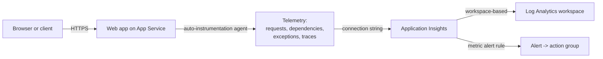

import Tabs from '@theme/Tabs';
import TabItem from '@theme/TabItem';
import PathPicker from '@site/src/components/PathPicker';
import Prerequisites from '@site/src/components/SharedMarkdown/_prerequisites.mdx';
import Cleanup from '@site/src/components/SharedMarkdown/_cleanup.mdx';

# Monitor your app with Application Insights

When something is slow or broken in production, you need to see what your app is actually doing: which requests fail, how long they take, and where the time goes. This lab connects a web app on [Azure App Service](https://learn.microsoft.com/azure/app-service/overview) to [Application Insights](https://learn.microsoft.com/azure/azure-monitor/app/app-insights-overview), the application performance monitoring (APM) service in Azure Monitor, so you get live metrics, request and failure analytics, and queryable logs with no changes to your app code.

You will connect Application Insights three ways so you can pick the workflow that fits you:

- **Azure Developer CLI (azd)** - provision Application Insights in Bicep alongside your app and deploy in one flow.
- **Azure CLI (az)** - create the resources explicitly and wire them together with app settings.
- **Azure portal** - turn on Application Insights from a blade on your app.

App Service supports **auto-instrumentation** (also called codeless attach) for **.NET**, **Node.js**, and **Java**. It injects a monitoring agent at runtime, so you collect telemetry without adding an SDK. **Python** and **PHP** use SDK-based instrumentation instead. This lab calls out the differences.

:::info App Service Labs complements Microsoft Learn
This lab is a hands-on, end-to-end walkthrough. For reference depth on any concept, follow the "Learn more" links to the official Microsoft Learn documentation.
:::

**Estimated time:** 45 to 60 minutes

## Objectives

By the end of this lab you will be able to:

- Create a workspace-based Application Insights resource and connect it to an App Service app.
- Enable auto-instrumentation (codeless) for .NET, Node.js, and Java, and explain where support differs by runtime and OS.
- Generate traffic and read it in Live Metrics, the failures and performance views, and Logs (KQL).
- Create a metric alert that fires on a symptom your users would notice.

<Prerequisites
  tools={[
    { name: 'Azure Developer CLI (azd)', url: 'https://learn.microsoft.com/azure/developer/azure-developer-cli/install-azd', description: '(for the azd path)' },
  ]}
/>

:::tip Choose a region and low-cost tier
This lab uses the **East US** region and the **B1 (Basic)** Linux App Service tier, a low-cost option that is ideal for learning (about USD 13 per month if you leave it running). Application Insights bills on the data it ingests; the small volume in this lab costs little, and the first 5 GB per month is free. Delete the resource group when you finish (see [Clean up](#cleanup)) to stop charges.
:::

## How Application Insights connects to your app

Application Insights stores its telemetry in a Log Analytics workspace (a **workspace-based** resource, the current model). Your app sends telemetry to Application Insights using a **connection string**, which you supply through the `APPLICATIONINSIGHTS_CONNECTION_STRING` app setting. For .NET, Node.js, and Java, a second app setting turns on the App Service-managed agent that collects requests, dependencies, exceptions, and traces automatically.



:::note Connection string, not instrumentation key
Always connect with the **connection string**. Instrumentation keys alone are deprecated because they do not carry the regional ingestion endpoints that newer regions require.
:::

## Choose your path

<PathPicker
  description="Set these once - every matching step and code sample below follows your choice."
  groups={[
    { id: 'tooling', label: 'Tooling', options: [
      { value: 'azd', label: 'azd' },
      { value: 'az', label: 'az CLI' },
      { value: 'portal', label: 'Portal' },
    ]},
    { id: 'language', label: 'Language', options: [
      { value: 'dotnet', label: '.NET' },
      { value: 'node', label: 'Node.js' },
      { value: 'python', label: 'Python' },
      { value: 'java', label: 'Java' },
      { value: 'php', label: 'PHP' },
    ]},
    { id: 'os', label: 'OS', options: [
      { value: 'linux', label: 'Linux' },
      { value: 'windows', label: 'Windows' },
    ]},
  ]}
/>

This lab assumes you already have a web app on App Service, or it helps you create one. Pick a tooling path, then choose your language.

## Provision and connect Application Insights

<Tabs groupId="tooling" queryString>

<TabItem value="azd" label="Azure Developer CLI (azd)">

The Azure Developer CLI provisions your infrastructure and deploys your code together. Here you define Application Insights, a Log Analytics workspace, and the web app in Bicep, with the connection string and the auto-instrumentation setting wired in, so the app is monitored the moment it starts.

### 1. Sign in

```bash
azd auth login
```

### 2. Create the project structure

Create a folder for the project, then choose your language for the sample app. The rest of the files (Bicep and parameters) are the same for every language.

```bash
mkdir monitor-app-insights && cd monitor-app-insights
mkdir infra src
```

Create `azure.yaml` in the project root. Set `language` to match the tab you pick below:

```yaml
# yaml-language-server: $schema=https://raw.githubusercontent.com/Azure/azure-dev/main/schemas/v1.0/azure.yaml.json
name: monitor-app-insights
services:
  web:
    project: ./src
    language: dotnet # dotnet, js, python, or java
    host: appservice
```

Create the sample app - a tiny web app with a home route and a route that fails, so you have both successful and failed requests to look at.

<Tabs groupId="language" queryString>
<TabItem value="dotnet" label=".NET">

Create `src/monitor-app-insights.csproj`:

```xml
<Project Sdk="Microsoft.NET.Sdk.Web">

  <PropertyGroup>
    <TargetFramework>net8.0</TargetFramework>
    <Nullable>enable</Nullable>
    <ImplicitUsings>enable</ImplicitUsings>
  </PropertyGroup>

</Project>
```

Create `src/Program.cs`:

```csharp
var builder = WebApplication.CreateBuilder(args);
var app = builder.Build();

// Home route - a successful request.
app.MapGet("/", () => Results.Content(
    "<h1>Hello from Azure App Service with Application Insights!</h1>", "text/html"));

// A route that fails, so you have a failed request to look at.
app.MapGet("/error", () => Results.Problem("Simulated failure", statusCode: 500));

app.Run();
```

Set `language: dotnet` in `azure.yaml`, and in `infra/resources.bicep` (below) use `linuxFxVersion: 'DOTNETCORE|8.0'` and set `SCM_DO_BUILD_DURING_DEPLOYMENT` to `'false'` - azd builds and publishes .NET locally, so no server-side build is needed.

</TabItem>
<TabItem value="node" label="Node.js">

Create `src/server.js`:

```js
const http = require('http');
const port = process.env.PORT || 3000;
http.createServer((req, res) => {
  if (req.url === '/error') {
    res.writeHead(500, { 'Content-Type': 'text/plain' });
    res.end('Simulated failure');
    return;
  }
  res.writeHead(200, { 'Content-Type': 'text/html' });
  res.end('<h1>Hello from Azure App Service with Application Insights!</h1>');
}).listen(port);
```

Create `src/package.json`:

```json
{
  "name": "monitor-app-insights",
  "version": "1.0.0",
  "main": "server.js",
  "scripts": { "start": "node server.js" },
  "engines": { "node": ">=20" }
}
```

Set `language: js` in `azure.yaml`, and keep `linuxFxVersion: 'NODE|22-lts'` with `SCM_DO_BUILD_DURING_DEPLOYMENT` set to `'true'` in the Bicep below.

</TabItem>
</Tabs>

:::note Python, Java, and PHP
This azd sample shows the two most common runtimes. For **Java**, set `language: java` and `linuxFxVersion: 'JAVA|17-java17'`, and package a JAR with Maven (see the [Deploy your first web app](../getting-started/deploy-your-first-web-app.md) lab for the Java setup). For **Python** or **PHP**, set `language` accordingly, use the matching `linuxFxVersion`, and instrument in code - see [Connect Application Insights by runtime](#connect-application-insights-by-runtime).
:::

Create `infra/main.parameters.json`:

```json
{
  "$schema": "https://schema.management.azure.com/schemas/2019-04-01/deploymentParameters.json#",
  "contentVersion": "1.0.0.0",
  "parameters": {
    "environmentName": { "value": "${AZURE_ENV_NAME}" },
    "location": { "value": "${AZURE_LOCATION}" },
    "resourceGroupName": { "value": "${AZURE_RESOURCE_GROUP}" }
  }
}
```

Create `infra/main.bicep`. It runs at subscription scope so azd creates and owns the resource group for this environment:

```bicep
targetScope = 'subscription'

@description('Name of the azd environment; used to derive resource names.')
param environmentName string

@description('Azure region for all resources.')
param location string

@description('Resource group to create for this environment.')
param resourceGroupName string

resource rg 'Microsoft.Resources/resourceGroups@2024-03-01' = {
  name: resourceGroupName
  location: location
}

module resources 'resources.bicep' = {
  name: 'resources'
  scope: rg
  params: {
    location: location
    environmentName: environmentName
  }
}

output WEB_URI string = resources.outputs.webUri
output APPLICATIONINSIGHTS_NAME string = resources.outputs.appInsightsName
```

Create `infra/resources.bicep`. This creates the workspace, the workspace-based Application Insights resource, the B1 Linux plan, and the web app with the monitoring app settings:

```bicep
@description('Azure region for all resources.')
param location string

@description('azd environment name used to derive globally unique names.')
param environmentName string

var suffix = uniqueString(subscription().id, resourceGroup().id, environmentName)
var planName = 'plan-${suffix}'
var webName = 'app-${suffix}'
var lawName = 'law-${suffix}'
var appInsightsName = 'appi-${suffix}'

resource law 'Microsoft.OperationalInsights/workspaces@2023-09-01' = {
  name: lawName
  location: location
  properties: {
    sku: {
      name: 'PerGB2018'
    }
    retentionInDays: 30
  }
}

resource appInsights 'Microsoft.Insights/components@2020-02-02' = {
  name: appInsightsName
  location: location
  kind: 'web'
  properties: {
    Application_Type: 'web'
    WorkspaceResourceId: law.id // makes this a workspace-based resource
  }
}

resource plan 'Microsoft.Web/serverfarms@2023-12-01' = {
  name: planName
  location: location
  sku: {
    name: 'B1'
  }
  kind: 'linux'
  properties: {
    reserved: true // required for Linux plans
  }
}

resource web 'Microsoft.Web/sites@2023-12-01' = {
  name: webName
  location: location
  kind: 'app,linux'
  tags: {
    'azd-service-name': 'web' // links this site to the "web" service in azure.yaml
  }
  properties: {
    serverFarmId: plan.id
    httpsOnly: true
    siteConfig: {
      linuxFxVersion: 'NODE|22-lts'
      appSettings: [
        {
          name: 'SCM_DO_BUILD_DURING_DEPLOYMENT'
          value: 'true'
        }
        {
          name: 'APPLICATIONINSIGHTS_CONNECTION_STRING'
          value: appInsights.properties.ConnectionString
        }
        {
          name: 'ApplicationInsightsAgent_EXTENSION_VERSION'
          value: '~3' // turns on codeless attach on Linux
        }
        {
          name: 'XDT_MicrosoftApplicationInsights_Mode'
          value: 'recommended'
        }
      ]
    }
  }
}

output webUri string = 'https://${web.properties.defaultHostName}'
output appInsightsName string = appInsights.name
```

:::note Per-language changes
This template uses `linuxFxVersion: 'NODE|22-lts'` with `SCM_DO_BUILD_DURING_DEPLOYMENT` set to `'true'`. For another runtime, change that value (for example `DOTNETCORE|8.0` or `JAVA|17-java17`) and update `language` in `azure.yaml`. For **.NET** and **Java**, azd builds and publishes locally, so set `SCM_DO_BUILD_DURING_DEPLOYMENT` to `'false'`. The `ApplicationInsightsAgent_EXTENSION_VERSION` setting enables codeless attach for .NET, Node.js, and Java. For **Python** or **PHP**, remove that setting from the Bicep (it does nothing for those runtimes) and instrument in code - see the [Connect by runtime](#connect-application-insights-by-runtime) section.
:::

### 3. Create an environment and deploy

Give the environment a unique suffix so names do not collide with earlier runs:

```bash
SUFFIX=$(openssl rand -hex 3)   # 6 lowercase hex chars
azd env new "monitor-appi-${SUFFIX}" --location eastus
azd env set AZURE_RESOURCE_GROUP "rg-appi-${SUFFIX}"
azd up
```

When it finishes, azd prints the app endpoint:

```text
- Endpoint: https://app-<random>.azurewebsites.net/
SUCCESS: Your application was deployed to Azure in 3 minutes 35 seconds.
```

:::note First azd up can miss the tagged resource
On the very first `azd up`, azd occasionally reports `unable to find a resource tagged with 'azd-service-name: web'` because the provisioning outputs are not cached yet. If that happens, run `azd deploy` once more - the resources already exist and the code deploy completes.
:::

</TabItem>

<TabItem value="az" label="Azure CLI (az)">

With the Azure CLI you create each resource explicitly and connect them with app settings. This path uses the `application-insights` CLI extension; the CLI installs it automatically the first time you run an `az monitor app-insights` command.

### 1. Sign in and set variables

```bash
az login
```

```bash
export RAND=$RANDOM
export RG_NAME=rg-appi-$RAND
export LOCATION=eastus
export APP_NAME=app-appi-$RAND
export PLAN_NAME=plan-appi-$RAND
export LAW_NAME=law-appi-$RAND
export AI_NAME=appi-$RAND
```

### 2. Create the resource group and a Log Analytics workspace

Workspace-based Application Insights stores its telemetry in a Log Analytics workspace, so create the workspace first:

```bash
az group create --name $RG_NAME --location $LOCATION

az monitor log-analytics workspace create \
  --resource-group $RG_NAME \
  --workspace-name $LAW_NAME \
  --location $LOCATION
```

### 3. Create the workspace-based Application Insights resource

```bash
LAW_ID=$(az monitor log-analytics workspace show \
  --resource-group $RG_NAME \
  --workspace-name $LAW_NAME \
  --query id -o tsv)

az monitor app-insights component create \
  --app $AI_NAME \
  --location $LOCATION \
  --resource-group $RG_NAME \
  --workspace "$LAW_ID" \
  --application-type web
```

### 4. Create the App Service plan and web app

Use a B1 Linux plan. Choose your language runtime:

<Tabs groupId="language" queryString>

<TabItem value="dotnet" label=".NET">

```bash
az appservice plan create --name $PLAN_NAME --resource-group $RG_NAME --sku B1 --is-linux
az webapp create --resource-group $RG_NAME --plan $PLAN_NAME --name $APP_NAME --runtime "DOTNETCORE:8.0"
```

</TabItem>

<TabItem value="node" label="Node.js">

```bash
az appservice plan create --name $PLAN_NAME --resource-group $RG_NAME --sku B1 --is-linux
az webapp create --resource-group $RG_NAME --plan $PLAN_NAME --name $APP_NAME --runtime "NODE:22-lts"
```

</TabItem>

<TabItem value="python" label="Python">

```bash
az appservice plan create --name $PLAN_NAME --resource-group $RG_NAME --sku B1 --is-linux
az webapp create --resource-group $RG_NAME --plan $PLAN_NAME --name $APP_NAME --runtime "PYTHON:3.13"
```

</TabItem>

<TabItem value="java" label="Java">

```bash
az appservice plan create --name $PLAN_NAME --resource-group $RG_NAME --sku B1 --is-linux
az webapp create --resource-group $RG_NAME --plan $PLAN_NAME --name $APP_NAME --runtime "JAVA:17-java17"
```

</TabItem>

<TabItem value="php" label="PHP">

```bash
az appservice plan create --name $PLAN_NAME --resource-group $RG_NAME --sku B1 --is-linux
az webapp create --resource-group $RG_NAME --plan $PLAN_NAME --name $APP_NAME --runtime "PHP:8.4"
```

</TabItem>

</Tabs>

Deploy your app code to this web app using whatever workflow you prefer. If you need one, the [Deploy your first web app](../getting-started/deploy-your-first-web-app.md) lab covers deployment for every language. For the fastest verification, deploy a small app that has a home route and a route that returns HTTP 500 so you generate both successful and failed requests.

### 5. Connect Application Insights

Read the connection string, then set the app settings that connect and instrument the app:

```bash
AI_CONN=$(az monitor app-insights component show \
  --app $AI_NAME \
  --resource-group $RG_NAME \
  --query connectionString -o tsv)

az webapp config appsettings set \
  --resource-group $RG_NAME \
  --name $APP_NAME \
  --settings \
    APPLICATIONINSIGHTS_CONNECTION_STRING="$AI_CONN" \
    ApplicationInsightsAgent_EXTENSION_VERSION="~3" \
    XDT_MicrosoftApplicationInsights_Mode="recommended"

az webapp restart --resource-group $RG_NAME --name $APP_NAME
```

The `ApplicationInsightsAgent_EXTENSION_VERSION` setting enables codeless attach for .NET, Node.js, and Java. See [Connect by runtime](#connect-application-insights-by-runtime) for what changes on Windows and for Python and PHP.

</TabItem>

<TabItem value="portal" label="Azure portal">

The portal turns on Application Insights from a single blade and creates the workspace-based resource and the app settings for you.

### 1. Open the Application Insights blade

Sign in to the [Azure portal](https://portal.azure.com) and open your web app (**App Services** > your app). If you do not have one yet, create a web app on a **Basic B1** Linux plan first.

In the app's left menu, under **Monitoring**, select **Application Insights**, then select **Turn on Application Insights**.

### 2. Create or pick the resource

- **Application Insights**: select **Create new resource** (the default name matches your app), or choose an existing resource.
- **Log Analytics workspace**: select an existing workspace or let the portal create one. This keeps the resource workspace-based.
- For a supported runtime (**.NET**, **Node.js**, **Java**), the blade shows a **Collection level** or instrumentation option. Leave it at the **Recommended** setting.

Select **Apply**, then confirm. The portal sets `APPLICATIONINSIGHTS_CONNECTION_STRING` and the agent app settings for you and restarts the app.

:::note Python and PHP in the portal
The **Turn on Application Insights** blade instruments .NET, Node.js, and Java. For Python and PHP, create the Application Insights resource here, copy its connection string, and instrument in code (see [Connect by runtime](#connect-application-insights-by-runtime)).
:::

</TabItem>

</Tabs>

## Connect Application Insights by runtime

Auto-instrumentation support differs by language and OS. This section summarizes what to set for each runtime; the app settings go on the web app (the CLI, azd, and portal paths above all set them the same way).

<Tabs groupId="language" queryString>

<TabItem value="dotnet" label=".NET">

.NET and .NET Core have the broadest codeless support: **Windows** (.NET Framework and .NET Core) and **Linux** (.NET Core and later). Set the connection string and the agent version.

<Tabs groupId="os" queryString>

<TabItem value="linux" label="Linux">

| App setting | Value |
| --- | --- |
| `APPLICATIONINSIGHTS_CONNECTION_STRING` | your connection string |
| `ApplicationInsightsAgent_EXTENSION_VERSION` | `~3` |
| `XDT_MicrosoftApplicationInsights_Mode` | `recommended` |

</TabItem>

<TabItem value="windows" label="Windows">

| App setting | Value |
| --- | --- |
| `APPLICATIONINSIGHTS_CONNECTION_STRING` | your connection string |
| `ApplicationInsightsAgent_EXTENSION_VERSION` | `~2` |
| `XDT_MicrosoftApplicationInsights_Mode` | `recommended` |

</TabItem>

</Tabs>

</TabItem>

<TabItem value="node" label="Node.js">

Node.js auto-instrumentation is supported on **Linux** (public preview) and **Windows** for code-based apps. The agent collects requests, dependencies, exceptions, traces, and heartbeats.

<Tabs groupId="os" queryString>

<TabItem value="linux" label="Linux">

| App setting | Value |
| --- | --- |
| `APPLICATIONINSIGHTS_CONNECTION_STRING` | your connection string |
| `ApplicationInsightsAgent_EXTENSION_VERSION` | `~3` |

</TabItem>

<TabItem value="windows" label="Windows">

| App setting | Value |
| --- | --- |
| `APPLICATIONINSIGHTS_CONNECTION_STRING` | your connection string |
| `ApplicationInsightsAgent_EXTENSION_VERSION` | `~2` |
| `XDT_MicrosoftApplicationInsights_NodeJS` | `1` |

</TabItem>

</Tabs>

</TabItem>

<TabItem value="python" label="Python">

Python on App Service uses **SDK-based** instrumentation with the [Azure Monitor OpenTelemetry Distro](https://learn.microsoft.com/azure/azure-monitor/app/opentelemetry-enable?tabs=python), not the codeless agent. Add the package and one line at startup.

Add to `requirements.txt`:

```text
azure-monitor-opentelemetry
```

At the top of your app's entry point, before you create the app:

```python
from azure.monitor.opentelemetry import configure_azure_monitor

configure_azure_monitor()  # reads APPLICATIONINSIGHTS_CONNECTION_STRING
```

Set only the connection string on the web app (do not set `ApplicationInsightsAgent_EXTENSION_VERSION`):

| App setting | Value |
| --- | --- |
| `APPLICATIONINSIGHTS_CONNECTION_STRING` | your connection string |

The distro auto-instruments popular libraries (for example Flask, Django, and requests) and sends telemetry to Application Insights.

</TabItem>

<TabItem value="java" label="Java">

Java auto-instrumentation is supported on **Linux** and **Windows**. The App Service-managed agent attaches the Application Insights Java agent for you.

| App setting | Value |
| --- | --- |
| `APPLICATIONINSIGHTS_CONNECTION_STRING` | your connection string |
| `ApplicationInsightsAgent_EXTENSION_VERSION` | `~3` |

For advanced settings (sampling, custom dimensions), supply a JSON config as described in the [Java standalone configuration](https://learn.microsoft.com/azure/azure-monitor/app/java-standalone-config) reference.

</TabItem>

<TabItem value="php" label="PHP">

PHP has no codeless agent on App Service. Instrument it with the [OpenTelemetry PHP](https://opentelemetry.io/docs/languages/php/) SDK and the Azure Monitor OpenTelemetry exporter, or send custom telemetry to the ingestion endpoint. Set the connection string on the app and configure the OpenTelemetry SDK to export to Application Insights:

| App setting | Value |
| --- | --- |
| `APPLICATIONINSIGHTS_CONNECTION_STRING` | your connection string |

</TabItem>

</Tabs>

:::tip SDK-based instrumentation is the deeper option
Auto-instrumentation is the fastest way to get telemetry, but adding the Application Insights or Azure Monitor OpenTelemetry SDK to your code gives you more: custom events and metrics, precise dependency tracking, and control over sampling. You can use both together - the SDK enriches what the agent already collects. See [Data collection basics](https://learn.microsoft.com/azure/azure-monitor/app/opentelemetry-overview).
:::

## Generate some traffic

Telemetry only appears once your app handles requests. Send a burst that includes both successful and failing requests. Replace the hostname with your app's:

```bash
APP_URL=https://<your-app-name>.azurewebsites.net
for i in $(seq 1 60); do
  curl -s -o /dev/null "$APP_URL/"
  curl -s -o /dev/null "$APP_URL/error"
done
```

Telemetry reaches Application Insights within a minute or two. Live Metrics is near real time; the aggregated charts and Logs have a short ingestion delay.

## Explore your telemetry

Open your Application Insights resource in the [Azure portal](https://portal.azure.com) (search for its name, or open it from the app's **Application Insights** blade).

### Live Metrics

Select **Live metrics** (under **Investigate**). While you send traffic, you see request rate, request duration, and failures update in near real time, with a rolling feed of sample requests. Live Metrics is the fastest way to confirm the connection works and to watch a deployment.

### Failures and Performance

- **Failures** (under **Investigate**) breaks down failed requests by response code and operation. Your `/error` requests appear here as HTTP 500 responses; select one to drill into a sample and its exception.
- **Performance** shows request duration by operation, so you can find the slowest endpoints and see the distribution of response times.

### Logs (KQL)

Select **Logs** (under **Monitoring**) to query telemetry with [Kusto Query Language (KQL)](https://learn.microsoft.com/azure/data-explorer/kusto/query/). Run this to count requests by result code:

```kusto
requests
| summarize count() by resultCode
| order by count_ desc
```

You should see rows for `200` and `500`. To find the slowest requests:

```kusto
requests
| top 10 by duration desc
| project timestamp, name, resultCode, duration
```

:::note Workspace table names
Because this resource is workspace-based, the same data is available in the Log Analytics workspace under the `AppRequests` table (Application Insights presents it as `requests` in its own Logs blade). Both work; use whichever surface you are in.
:::

You can verify the same thing from the command line by querying the workspace directly:

```bash
WS_ID=$(az monitor log-analytics workspace show \
  --resource-group $RG_NAME \
  --workspace-name $LAW_NAME \
  --query customerId -o tsv)

az monitor log-analytics query \
  --workspace "$WS_ID" \
  --analytics-query "AppRequests | summarize count() by ResultCode"
```

## Create a metric alert

Alerts tell you about a problem before your users report it. Create a rule on a symptom users would notice, such as failed requests or slow responses.

<Tabs groupId="tooling" queryString>

<TabItem value="azd" label="Azure Developer CLI (azd)">

Add the alert to your Bicep so it is part of your infrastructure. Append this to `infra/resources.bicep`, then run `azd provision` again. It alerts when the average server response time exceeds 3 seconds over 5 minutes:

```bicep
resource responseTimeAlert 'Microsoft.Insights/metricAlerts@2018-03-01' = {
  name: 'alert-response-time-${appInsightsName}'
  location: 'global'
  properties: {
    severity: 3
    enabled: true
    scopes: [
      appInsights.id
    ]
    evaluationFrequency: 'PT1M'
    windowSize: 'PT5M'
    criteria: {
      'odata.type': 'Microsoft.Azure.Monitor.SingleResourceMultipleMetricCriteria'
      allOf: [
        {
          name: 'ResponseTime'
          metricNamespace: 'microsoft.insights/components'
          metricName: 'requests/duration'
          operator: 'GreaterThan'
          threshold: 3000
          timeAggregation: 'Average'
          criterionType: 'StaticThresholdCriterion'
        }
      ]
    }
  }
}
```

</TabItem>

<TabItem value="az" label="Azure CLI (az)">

Create an alert on the Application Insights server response time. It fires when the average `requests/duration` exceeds 3000 ms over 5 minutes:

```bash
AI_ID=$(az monitor app-insights component show \
  --app $AI_NAME \
  --resource-group $RG_NAME \
  --query id -o tsv)

az monitor metrics alert create \
  --name "alert-response-time-$AI_NAME" \
  --resource-group $RG_NAME \
  --scopes "$AI_ID" \
  --condition "avg requests/duration > 3000" \
  --window-size 5m \
  --evaluation-frequency 1m \
  --severity 3 \
  --description "Average server response time exceeds 3000 ms over 5 minutes."
```

Prefer to alert on failures instead? Create a rule on the App Service `Http5xx` metric:

```bash
APP_ID=$(az webapp show --resource-group $RG_NAME --name $APP_NAME --query id -o tsv)

az monitor metrics alert create \
  --name "alert-http5xx-$APP_NAME" \
  --resource-group $RG_NAME \
  --scopes "$APP_ID" \
  --condition "total Http5xx > 10" \
  --window-size 5m \
  --evaluation-frequency 1m \
  --severity 2 \
  --description "More than 10 HTTP 5xx responses in 5 minutes."
```

To be notified, attach an [action group](https://learn.microsoft.com/azure/azure-monitor/alerts/action-groups) with `--action <action-group-id>`.

</TabItem>

<TabItem value="portal" label="Azure portal">

In your Application Insights resource, select **Alerts** (under **Monitoring**) > **Create** > **Alert rule**.

1. **Scope** is prefilled with your Application Insights resource.
2. **Condition**: select a signal, for example **Server response time**, and set the threshold (for example, greater than **3000 ms**) with an aggregation of **Average** over **5 minutes**.
3. **Actions**: attach or create an **action group** so the alert can email or message you.
4. **Details**: name the rule and set the **Severity**, then select **Create**.

</TabItem>

</Tabs>

Confirm the rule exists and is enabled:

```bash
az monitor metrics alert list --resource-group $RG_NAME \
  --query "[].{name:name, enabled:enabled, severity:severity}" -o table
```

## Verify

Confirm the app is serving traffic and that telemetry is flowing.

1. The app returns HTTP 200. Check from the command line:

   ```bash
   curl -I https://<your-app-name>.azurewebsites.net
   ```

   Expected output (validated during authoring):

   ```text
   HTTP/1.1 200 OK
   Content-Type: text/html
   ```

2. Telemetry is arriving. In the Application Insights **Logs** blade, run:

   ```kusto
   requests | summarize count() by resultCode
   ```

   You should see a nonzero count for `200` and, if you called `/error`, for `500`. During authoring, this returned 195 requests at `200` and 190 at `500` for the Azure CLI run.

3. The alert rule is enabled. The `az monitor metrics alert list` output above shows `enabled: True`.

<Cleanup />

:::note If you used azd
Delete everything azd created (the resource group, resources, and the local environment) with `azd down --purge --force` instead of the command above.
:::

## Summary

In this lab, you connected an App Service web app to Application Insights and confirmed telemetry was flowing. You learned how to:

- Create a **workspace-based** Application Insights resource and connect it with the `APPLICATIONINSIGHTS_CONNECTION_STRING` app setting.
- Enable **auto-instrumentation** for .NET, Node.js, and Java, and where support differs by OS, with Python and PHP using SDK-based instrumentation.
- Explore telemetry in **Live Metrics**, **Failures**, **Performance**, and **Logs** with KQL.
- Create a **metric alert** on server response time or failed requests.

## Troubleshooting

- **No data in Application Insights.** Confirm `APPLICATIONINSIGHTS_CONNECTION_STRING` is set on the app and that you restarted it. Codeless attach only takes effect after a restart and a request. Send more traffic and wait a minute or two - Live Metrics updates first, then the aggregated views. See [Troubleshoot no data](https://learn.microsoft.com/azure/azure-monitor/app/azure-web-apps-troubleshoot).
- **Data appears in Logs but not in the classic query API.** Workspace-based resources store telemetry in the `AppRequests` table in the Log Analytics workspace. Query the workspace with `az monitor log-analytics query` (shown above) or use the Application Insights **Logs** blade, which exposes the `requests` alias.
- **azd up reports `unable to find a resource tagged with 'azd-service-name: web'`.** This is the first-run output-cache race. Run `azd deploy` once more; the resources already exist and the code deploy completes.
- **Wrong runtime instrumented, or nothing for Python or PHP.** Codeless attach covers .NET, Node.js, and Java only. For Python, use the Azure Monitor OpenTelemetry Distro; for PHP, use the OpenTelemetry SDK. See [Connect by runtime](#connect-application-insights-by-runtime).
- **Alert never fires.** Metric alerts evaluate on a schedule and need enough data in the window. Generate sustained traffic (or lower the threshold) and confirm the rule shows `enabled: True`.

## Learn more

- [Application Insights overview](https://learn.microsoft.com/azure/azure-monitor/app/app-insights-overview)
- [Monitor Azure App Service performance](https://learn.microsoft.com/azure/azure-monitor/app/azure-web-apps)
- [Workspace-based Application Insights resources](https://learn.microsoft.com/azure/azure-monitor/app/create-workspace-resource)
- [Enable Azure Monitor OpenTelemetry (Python and more)](https://learn.microsoft.com/azure/azure-monitor/app/opentelemetry-enable)
- [Live Metrics](https://learn.microsoft.com/azure/azure-monitor/app/live-stream)
- [Log-based and pre-aggregated metrics](https://learn.microsoft.com/azure/azure-monitor/app/pre-aggregated-metrics-log-metrics)
- [Create a metric alert rule](https://learn.microsoft.com/azure/azure-monitor/alerts/alerts-create-metric-alert-rule)
- [Kusto Query Language (KQL) overview](https://learn.microsoft.com/azure/data-explorer/kusto/query/)
