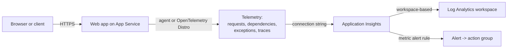

import Tabs from '@theme/Tabs';
import TabItem from '@theme/TabItem';
import PathPicker from '@site/src/components/PathPicker';
import Prerequisites from '@site/src/components/SharedMarkdown/_prerequisites.mdx';
import Cleanup from '@site/src/components/SharedMarkdown/_cleanup.mdx';

# Monitor your app with Application Insights

When something is slow or broken in production, you need to see what your app is actually doing: which requests fail, how long they take, and where the time goes. This lab connects a web app on [Azure App Service](https://learn.microsoft.com/azure/app-service/overview) to [Application Insights](https://learn.microsoft.com/azure/azure-monitor/app/app-insights-overview), the application performance monitoring (APM) service in Azure Monitor. You use either App Service autoinstrumentation or the Azure Monitor OpenTelemetry Distro to collect live metrics, request and failure analytics, and queryable logs. You also add a deterministic slow endpoint to practice diagnosis safely.

You will connect Application Insights three ways so you can pick the workflow that fits you:

- **Azure Developer CLI (azd)** - provision Application Insights in Bicep alongside your app and deploy in one flow.
- **Azure CLI (az)** - create the resources explicitly and wire them together with app settings.
- **Azure portal** - turn on Application Insights from a blade on your app.

App Service supports **autoinstrumentation** (also called codeless attach) for
**.NET**, **Node.js**, **Java**, and supported **Python** apps. It injects a
monitoring agent at runtime, so you collect telemetry without adding an SDK.
This lab's executable sample paths use .NET or Node.js on Linux and include a
current runtime support matrix for existing apps.

:::info App Service Labs complements Microsoft Learn
This lab is a hands-on, end-to-end walkthrough. For reference depth on any concept, follow the "Learn more" links to the official Microsoft Learn documentation.
:::

**Estimated time:** 60 to 75 minutes

## Objectives

By the end of this lab you will be able to:

- Create a workspace-based Application Insights resource and connect it to an App Service app.
- Connect .NET or Node.js on Linux with one instrumentation method and explain
  where autoinstrumentation support differs by runtime and OS.
- Generate normal, failing, and deliberately slow traffic, then diagnose it in
  Live Metrics, Performance, Failures, and Logs (KQL).
- Create a Standard availability test that checks the app from multiple Azure
  locations.
- Create a metric alert that fires on a symptom your users would notice.

<Prerequisites
  tools={[
    { name: 'Azure Developer CLI (azd)', url: 'https://learn.microsoft.com/azure/developer/azure-developer-cli/install-azd', description: '(for the azd path)' },
  ]}
/>

:::tip Choose a region and low-cost tier
This lab uses the **East US** region and the **B1 (Basic)** Linux App Service tier, a low-cost option that is ideal for learning (about USD 13 per month if you leave it running). Application Insights bills on the data it ingests; the small volume in this lab costs little, and the first 5 GB per month is free. Delete the resource group when you finish (see [Clean up](#cleanup)) to stop charges.
:::

## How Application Insights connects to your app

Application Insights stores its telemetry in a Log Analytics workspace (a **workspace-based** resource, the current model). Your app sends telemetry to Application Insights using a **connection string**, which you supply through the `APPLICATIONINSIGHTS_CONNECTION_STRING` app setting. Depending on the runtime, App Service can attach a managed agent, or your code can initialize the Azure Monitor OpenTelemetry Distro. Choose one method for a given app.



:::note Connection string, not instrumentation key
Always connect with the **connection string**. Instrumentation keys alone are deprecated because they do not carry the regional ingestion endpoints that newer regions require.
:::

## Choose your path

<PathPicker
  description="Set these once - every matching step and code sample below follows your choice."
  groups={[
    { id: 'tooling', label: 'Tooling', options: [
      { value: 'azd', label: 'azd' },
      { value: 'az', label: 'az CLI' },
      { value: 'portal', label: 'Portal' },
    ]},
    { id: 'language', label: 'Language', options: [
      { value: 'dotnet', label: '.NET' },
      { value: 'node', label: 'Node.js' },
    ]},
  ]}
/>

The executable paths in this lab use a B1 Linux plan with .NET or Node.js.
Pick a tooling path, then choose one of those languages. If you are connecting
an existing app that uses another supported runtime or Windows, use the
[runtime support matrix](#connect-application-insights-by-runtime) after
provisioning the monitoring resource.

## Provision and connect Application Insights

<Tabs groupId="tooling" queryString>

<TabItem value="azd" label="Azure Developer CLI (azd)">

The Azure Developer CLI provisions your infrastructure and deploys your code together. Here you define Application Insights, a Log Analytics workspace, and the web app in Bicep, with the connection string and the auto-instrumentation setting wired in, so the app is monitored the moment it starts.

### 1. Sign in

```bash
azd auth login
```

### 2. Create the project structure

Create a folder for the project, then choose your language for the sample app. The rest of the files (Bicep and parameters) are the same for every language.

```bash
mkdir monitor-app-insights && cd monitor-app-insights
mkdir infra src
```

Create `azure.yaml` in the project root. Set `language` to match the tab you pick below:

```yaml
# yaml-language-server: $schema=https://raw.githubusercontent.com/Azure/azure-dev/main/schemas/v1.0/azure.yaml.json
name: monitor-app-insights
services:
  web:
    project: ./src
    language: dotnet # dotnet or js
    host: appservice
```

Create the sample app - a tiny web app with a home route, a route that fails,
and a route that deliberately waits two seconds so you have successful,
failed, and slow requests to investigate.

<Tabs groupId="language" queryString>
<TabItem value="dotnet" label=".NET">

Create `src/monitor-app-insights.csproj`:

```xml
<Project Sdk="Microsoft.NET.Sdk.Web">

  <PropertyGroup>
    <TargetFramework>net8.0</TargetFramework>
    <Nullable>enable</Nullable>
    <ImplicitUsings>enable</ImplicitUsings>
  </PropertyGroup>

</Project>
```

Create `src/Program.cs`:

```csharp
var builder = WebApplication.CreateBuilder(args);
var app = builder.Build();

// Home route - a successful request.
app.MapGet("/", () => Results.Content(
    "<h1>Hello from Azure App Service with Application Insights!</h1>", "text/html"));

// A route that fails, so you have a failed request to look at.
app.MapGet("/error", () => Results.Problem("Simulated failure", statusCode: 500));

// A deterministic slow route for a safe performance investigation.
app.MapGet("/slow", async () =>
{
    await Task.Delay(TimeSpan.FromSeconds(2));
    return Results.Json(new { status = "complete", delayedMs = 2000 });
});

app.Run();
```

Set `language: dotnet` in `azure.yaml`, and in `infra/resources.bicep` (below) use `linuxFxVersion: 'DOTNETCORE|8.0'` and set `SCM_DO_BUILD_DURING_DEPLOYMENT` to `'false'` - azd builds and publishes .NET locally, so no server-side build is needed.

</TabItem>
<TabItem value="node" label="Node.js">

Create `src/server.js`:

```js
if (process.env.APPLICATIONINSIGHTS_CONNECTION_STRING) {
  const {useAzureMonitor} = require('@azure/monitor-opentelemetry');
  useAzureMonitor();
}

const http = require('http');
const port = process.env.PORT || 3000;
http.createServer((req, res) => {
  if (req.url === '/slow') {
    setTimeout(() => {
      res.writeHead(200, { 'Content-Type': 'application/json' });
      res.end(JSON.stringify({ status: 'complete', delayedMs: 2000 }));
    }, 2000);
    return;
  }
  if (req.url === '/error') {
    res.writeHead(500, { 'Content-Type': 'text/plain' });
    res.end('Simulated failure');
    return;
  }
  res.writeHead(200, { 'Content-Type': 'text/html' });
  res.end('<h1>Hello from Azure App Service with Application Insights!</h1>');
}).listen(port);
```

Create `src/package.json`:

```json
{
  "name": "monitor-app-insights",
  "version": "1.0.0",
  "main": "server.js",
  "scripts": { "start": "node server.js" },
  "engines": { "node": ">=22" },
  "dependencies": {
    "@azure/monitor-opentelemetry": "1.18.2"
  }
}
```

The same app, including a lock file, is available in
[`samples/monitor-app-insights-node`](https://github.com/Azure-Samples/app-service-labs/tree/main/samples/monitor-app-insights-node)
if you prefer to copy it instead of creating the two files.

Set `language: js` in `azure.yaml`, and keep `linuxFxVersion: 'NODE|22-lts'` with `SCM_DO_BUILD_DURING_DEPLOYMENT` set to `'true'` in the Bicep below.

</TabItem>
</Tabs>

:::note Other runtimes and Windows
The copy-paste azd sample is intentionally limited to .NET and Node.js on
Linux. Do not select another runtime without also changing the application
code, build workflow, plan OS, `linuxFxVersion`, and instrumentation settings.
For an existing app, use the
[runtime support matrix](#connect-application-insights-by-runtime).
:::

Create `infra/main.parameters.json`:

```json
{
  "$schema": "https://schema.management.azure.com/schemas/2019-04-01/deploymentParameters.json#",
  "contentVersion": "1.0.0.0",
  "parameters": {
    "environmentName": { "value": "${AZURE_ENV_NAME}" },
    "location": { "value": "${AZURE_LOCATION}" },
    "resourceGroupName": { "value": "${AZURE_RESOURCE_GROUP}" }
  }
}
```

Create `infra/main.bicep`. It runs at subscription scope so azd creates and owns the resource group for this environment:

```bicep
targetScope = 'subscription'

@description('Name of the azd environment; used to derive resource names.')
param environmentName string

@description('Azure region for all resources.')
param location string

@description('Resource group to create for this environment.')
param resourceGroupName string

resource rg 'Microsoft.Resources/resourceGroups@2024-03-01' = {
  name: resourceGroupName
  location: location
}

module resources 'resources.bicep' = {
  name: 'resources'
  scope: rg
  params: {
    location: location
    environmentName: environmentName
  }
}

output WEB_URI string = resources.outputs.webUri
output APPLICATIONINSIGHTS_NAME string = resources.outputs.appInsightsName
```

Create `infra/resources.bicep`. This creates the workspace, the workspace-based Application Insights resource, the B1 Linux plan, and the web app with the monitoring app settings:

```bicep
@description('Azure region for all resources.')
param location string

@description('azd environment name used to derive globally unique names.')
param environmentName string

var suffix = uniqueString(subscription().id, resourceGroup().id, environmentName)
var planName = 'plan-${suffix}'
var webName = 'app-${suffix}'
var lawName = 'law-${suffix}'
var appInsightsName = 'appi-${suffix}'

resource law 'Microsoft.OperationalInsights/workspaces@2023-09-01' = {
  name: lawName
  location: location
  properties: {
    sku: {
      name: 'PerGB2018'
    }
    retentionInDays: 30
  }
}

resource appInsights 'Microsoft.Insights/components@2020-02-02' = {
  name: appInsightsName
  location: location
  kind: 'web'
  properties: {
    Application_Type: 'web'
    WorkspaceResourceId: law.id // makes this a workspace-based resource
  }
}

resource plan 'Microsoft.Web/serverfarms@2023-12-01' = {
  name: planName
  location: location
  sku: {
    name: 'B1'
  }
  kind: 'linux'
  properties: {
    reserved: true // required for Linux plans
  }
}

resource web 'Microsoft.Web/sites@2023-12-01' = {
  name: webName
  location: location
  kind: 'app,linux'
  tags: {
    'azd-service-name': 'web' // links this site to the "web" service in azure.yaml
  }
  properties: {
    serverFarmId: plan.id
    httpsOnly: true
    siteConfig: {
      linuxFxVersion: 'NODE|22-lts'
      appSettings: [
        {
          name: 'SCM_DO_BUILD_DURING_DEPLOYMENT'
          value: 'true'
        }
        {
          name: 'APPLICATIONINSIGHTS_CONNECTION_STRING'
          value: appInsights.properties.ConnectionString
        }
      ]
    }
  }
}

output webUri string = 'https://${web.properties.defaultHostName}'
output appInsightsName string = appInsights.name
```

:::note Per-language changes
This template uses the Azure Monitor OpenTelemetry Distro in the Node.js sample
and `linuxFxVersion: 'NODE|22-lts'` with
`SCM_DO_BUILD_DURING_DEPLOYMENT` set to `'true'`. For the .NET sample, change
the runtime to `DOTNETCORE|8.0`, set server-side build to `'false'`, and add
the three Linux .NET autoinstrumentation settings from the
[runtime support matrix](#connect-application-insights-by-runtime), including
`XDT_MicrosoftApplicationInsights_PreemptSdk=1`. Do not combine those agent
settings with an application that initializes the OpenTelemetry Distro.
:::

### 3. Create an environment and deploy

Give the environment a unique suffix so names do not collide with earlier runs:

```bash
SUFFIX=$(openssl rand -hex 3)   # 6 lowercase hex chars
azd env new "monitor-appi-${SUFFIX}" --location eastus
azd env set AZURE_RESOURCE_GROUP "rg-appi-${SUFFIX}"
azd up
```

When it finishes, azd prints the app endpoint:

```text
- Endpoint: https://app-<random>.azurewebsites.net/
SUCCESS: Your application was deployed to Azure in 3 minutes 35 seconds.
```

:::note First azd up can miss the tagged resource
On the very first `azd up`, azd occasionally reports `unable to find a resource tagged with 'azd-service-name: web'` because the provisioning outputs are not cached yet. If that happens, run `azd deploy` once more - the resources already exist and the code deploy completes.
:::

</TabItem>

<TabItem value="az" label="Azure CLI (az)">

With the Azure CLI you create each resource explicitly and connect them with app settings. This path uses the `application-insights` CLI extension; the CLI installs it automatically the first time you run an `az monitor app-insights` command.

### 1. Sign in and set variables

```bash
az login
```

```bash
export RAND=$RANDOM
export RG_NAME=rg-appi-$RAND
export LOCATION=eastus
export APP_NAME=app-appi-$RAND
export PLAN_NAME=plan-appi-$RAND
export LAW_NAME=law-appi-$RAND
export AI_NAME=appi-$RAND
```

### 2. Create the resource group and a Log Analytics workspace

Workspace-based Application Insights stores its telemetry in a Log Analytics workspace, so create the workspace first:

```bash
az group create --name $RG_NAME --location $LOCATION

az monitor log-analytics workspace create \
  --resource-group $RG_NAME \
  --workspace-name $LAW_NAME \
  --location $LOCATION
```

### 3. Create the workspace-based Application Insights resource

```bash
LAW_ID=$(az monitor log-analytics workspace show \
  --resource-group $RG_NAME \
  --workspace-name $LAW_NAME \
  --query id -o tsv)

az monitor app-insights component create \
  --app $AI_NAME \
  --location $LOCATION \
  --resource-group $RG_NAME \
  --workspace "$LAW_ID" \
  --application-type web
```

### 4. Create the App Service plan and web app

Use a B1 Linux plan. Choose one of the executable sample runtimes:

<Tabs groupId="language" queryString>

<TabItem value="dotnet" label=".NET">

```bash
az appservice plan create --name $PLAN_NAME --resource-group $RG_NAME --sku B1 --is-linux
az webapp create --resource-group $RG_NAME --plan $PLAN_NAME --name $APP_NAME --runtime "DOTNETCORE:8.0"
```

</TabItem>

<TabItem value="node" label="Node.js">

```bash
az appservice plan create --name $PLAN_NAME --resource-group $RG_NAME --sku B1 --is-linux
az webapp create --resource-group $RG_NAME --plan $PLAN_NAME --name $APP_NAME --runtime "NODE:22-lts"
```

</TabItem>

</Tabs>

Deploy your app code to this web app using whatever workflow you prefer. If you need one, the [Deploy your first web app](../getting-started/deploy-your-first-web-app.md) lab covers deployment for every language. For the fastest verification, deploy a small app that has a home route and a route that returns HTTP 500 so you generate both successful and failed requests.

### 5. Connect Application Insights

Read the connection string:

```bash
AI_CONN=$(az monitor app-insights component show \
  --app $AI_NAME \
  --resource-group $RG_NAME \
  --query connectionString -o tsv)
```

Choose the same language as the web app. These commands assume the app does
not already initialize an Application Insights SDK or the Azure Monitor
OpenTelemetry Distro.

<Tabs groupId="language" queryString>
<TabItem value="dotnet" label=".NET">

```bash
az webapp config appsettings set \
  --resource-group $RG_NAME \
  --name $APP_NAME \
  --settings \
    APPLICATIONINSIGHTS_CONNECTION_STRING="$AI_CONN" \
    ApplicationInsightsAgent_EXTENSION_VERSION="~3" \
    XDT_MicrosoftApplicationInsights_Mode="recommended" \
    XDT_MicrosoftApplicationInsights_PreemptSdk="1"

az webapp restart --resource-group $RG_NAME --name $APP_NAME
```

</TabItem>
<TabItem value="node" label="Node.js">

```bash
az webapp config appsettings set \
  --resource-group $RG_NAME \
  --name $APP_NAME \
  --settings \
    APPLICATIONINSIGHTS_CONNECTION_STRING="$AI_CONN" \
    ApplicationInsightsAgent_EXTENSION_VERSION="~3"

az webapp restart --resource-group $RG_NAME --name $APP_NAME
```

Linux Node.js autoinstrumentation is in public preview. If your Node.js app
initializes the Azure Monitor OpenTelemetry Distro, set only
`APPLICATIONINSIGHTS_CONNECTION_STRING` and do not run the agent command above.

</TabItem>
</Tabs>

See [Connect by runtime](#connect-application-insights-by-runtime) for the
settings required by an existing Windows app or another supported runtime.

</TabItem>

<TabItem value="portal" label="Azure portal">

The portal turns on Application Insights from a single blade and creates the workspace-based resource and the app settings for you.

### 1. Open the Application Insights blade

Sign in to the [Azure portal](https://portal.azure.com) and open your web app (**App Services** > your app). If you do not have one yet, create a web app on a **Basic B1** Linux plan first.

In the app's left menu, under **Monitoring**, select **Application Insights**, then select **Turn on Application Insights**.

### 2. Create or pick the resource

- **Application Insights**: select **Create new resource** (the default name matches your app), or choose an existing resource.
- **Log Analytics workspace**: select an existing workspace or let the portal create one. This keeps the resource workspace-based.
- For a supported runtime, the blade shows a **Collection level** or
  instrumentation option. Leave it at the **Recommended** setting.

Select **Apply**, then confirm. The portal sets `APPLICATIONINSIGHTS_CONNECTION_STRING` and the agent app settings for you and restarts the app.

:::note Runtime support
The portal supports App Service autoinstrumentation for .NET, Java, Node.js,
and Python 3.9 through 3.13 on Linux when deployed as code. Python custom
containers and Windows Python apps are not supported. PHP has no App
Service-managed autoinstrumentation path, so it is outside this lab.
:::

Set the variables used by the common command-line verification and cleanup
steps:

```bash
export RG_NAME="<resource-group-name>"
export APP_NAME="<web-app-name>"
export AI_NAME="<application-insights-name>"
export LAW_ID=$(az monitor app-insights component show \
  --app "$AI_NAME" \
  --resource-group "$RG_NAME" \
  --query workspaceResourceId -o tsv)
export LAW_NAME=${LAW_ID##*/}
```

</TabItem>

</Tabs>

## Connect Application Insights by runtime

Autoinstrumentation support differs by language and OS. This reference is for
connecting an existing code-based App Service app. The executable provisioning
paths above remain limited to .NET and Node.js on Linux.

<Tabs groupId="runtime" queryString>

<TabItem value="dotnet" label=".NET">

This lab's .NET path targets ASP.NET Core on modern .NET, which supports
autoinstrumentation on **Windows** and **Linux**. The required
`XDT_MicrosoftApplicationInsights_PreemptSdk` setting below is specific to
ASP.NET Core autoinstrumentation. For classic ASP.NET on .NET Framework, follow
the separate settings in the
[App Service autoinstrumentation reference](https://learn.microsoft.com/azure/azure-monitor/app/codeless-app-service?tabs=net).

<Tabs groupId="os" queryString>

<TabItem value="linux" label="Linux">

| App setting | Value |
| --- | --- |
| `APPLICATIONINSIGHTS_CONNECTION_STRING` | your connection string |
| `ApplicationInsightsAgent_EXTENSION_VERSION` | `~3` |
| `XDT_MicrosoftApplicationInsights_Mode` | `recommended` |
| `XDT_MicrosoftApplicationInsights_PreemptSdk` | `1` |

</TabItem>

<TabItem value="windows" label="Windows">

| App setting | Value |
| --- | --- |
| `APPLICATIONINSIGHTS_CONNECTION_STRING` | your connection string |
| `ApplicationInsightsAgent_EXTENSION_VERSION` | `~2` |
| `XDT_MicrosoftApplicationInsights_Mode` | `recommended` |
| `XDT_MicrosoftApplicationInsights_PreemptSdk` | `1` |

</TabItem>

</Tabs>

</TabItem>

<TabItem value="node" label="Node.js">

Node.js auto-instrumentation is supported on **Linux** (public preview) and **Windows** for code-based apps. The agent collects requests, dependencies, exceptions, traces, and heartbeats.

For a code-controlled option, initialize the
[Azure Monitor OpenTelemetry Distro](https://learn.microsoft.com/azure/azure-monitor/app/opentelemetry-enable?tabs=nodejs)
before loading `http`, Express, or other instrumented libraries. The azd sample
in this lab uses that approach and needs only
`APPLICATIONINSIGHTS_CONNECTION_STRING`; do not also enable the codeless agent
for the same app.

<Tabs groupId="os" queryString>

<TabItem value="linux" label="Linux">

| App setting | Value |
| --- | --- |
| `APPLICATIONINSIGHTS_CONNECTION_STRING` | your connection string |
| `ApplicationInsightsAgent_EXTENSION_VERSION` | `~3` |

</TabItem>

<TabItem value="windows" label="Windows">

| App setting | Value |
| --- | --- |
| `APPLICATIONINSIGHTS_CONNECTION_STRING` | your connection string |
| `ApplicationInsightsAgent_EXTENSION_VERSION` | `~2` |
| `XDT_MicrosoftApplicationInsights_NodeJS` | `1` |

</TabItem>

</Tabs>

</TabItem>

<TabItem value="python" label="Python">

Python autoinstrumentation is supported for Python 3.9 through 3.13 on **Linux
App Service deployed as code**. Windows apps and custom containers are not
supported, and Live Metrics is not available for this path.

| App setting | Value |
| --- | --- |
| `APPLICATIONINSIGHTS_CONNECTION_STRING` | your connection string |
| `ApplicationInsightsAgent_EXTENSION_VERSION` | `~3` |

The managed agent instruments supported libraries such as Django, FastAPI,
Flask, `requests`, and `urllib3`. Add supported OpenTelemetry community
instrumentation packages only when you need coverage for another library.

</TabItem>

<TabItem value="java" label="Java">

Java autoinstrumentation is supported on **Linux** and **Windows**. The App
Service-managed agent attaches the Application Insights Java agent for you.

<Tabs groupId="os" queryString>
<TabItem value="linux" label="Linux">

| App setting | Value |
| --- | --- |
| `APPLICATIONINSIGHTS_CONNECTION_STRING` | your connection string |
| `ApplicationInsightsAgent_EXTENSION_VERSION` | `~3` |

</TabItem>
<TabItem value="windows" label="Windows">

| App setting | Value |
| --- | --- |
| `APPLICATIONINSIGHTS_CONNECTION_STRING` | your connection string |
| `ApplicationInsightsAgent_EXTENSION_VERSION` | `~2` |
| `XDT_MicrosoftApplicationInsights_Java` | `1` |

</TabItem>
</Tabs>

For advanced settings such as sampling and custom dimensions, supply a JSON
config as described in the
[Java standalone configuration](https://learn.microsoft.com/azure/azure-monitor/app/java-standalone-config)
reference.

</TabItem>

</Tabs>

:::warning Choose one instrumentation method
Do not combine App Service autoinstrumentation with an Application Insights SDK
or the Azure Monitor OpenTelemetry Distro in the same server application.
Overlapping instrumentation can duplicate telemetry and increase ingestion
cost. Use the OpenTelemetry Distro instead of the managed agent when you need
code-level control, then add custom spans or metrics through OpenTelemetry. See
[Data collection basics](https://learn.microsoft.com/azure/azure-monitor/app/opentelemetry-overview).
:::

## Add a safe slow endpoint

The azd .NET and Node.js samples already include `/slow`. It waits for two
seconds and returns HTTP 200. The delay is deterministic, makes no external
network call, and consumes little CPU, so it is safer and more reproducible
than depending on an unreliable public service.

If you brought your own app through the Azure CLI or portal path, add the same
behavior in your runtime and redeploy it. Keep this diagnostic route only in a
nonproduction environment, or protect it with authentication.

<Tabs groupId="language" queryString>
<TabItem value="dotnet" label=".NET">

Add this before `app.Run()`:

```csharp
app.MapGet("/slow", async () =>
{
    await Task.Delay(TimeSpan.FromSeconds(2));
    return Results.Json(new { status = "complete", delayedMs = 2000 });
});
```

</TabItem>
<TabItem value="node" label="Node.js">

Add this route to an Express app:

```javascript
app.get('/slow', async (_req, res) => {
  await new Promise((resolve) => setTimeout(resolve, 2000));
  res.json({status: 'complete', delayedMs: 2000});
});
```

</TabItem>
</Tabs>

## Generate some traffic

Telemetry only appears once your app handles requests. Send a burst that
includes successful, failing, and slow requests. Replace the hostname with
your app's:

```bash
APP_URL=https://<your-app-name>.azurewebsites.net
for i in $(seq 1 30); do
  curl -s -o /dev/null "$APP_URL/"
  curl -s -o /dev/null "$APP_URL/error"
done

for i in $(seq 1 6); do
  curl --fail --silent --max-time 5 "$APP_URL/slow" --output /dev/null
done
```

Telemetry reaches Application Insights within a minute or two. Live Metrics is near real time; the aggregated charts and Logs have a short ingestion delay.

## Explore your telemetry

Open your Application Insights resource in the [Azure portal](https://portal.azure.com) (search for its name, or open it from the app's **Application Insights** blade).

### Live Metrics

Select **Live metrics** (under **Investigate**). Leave the pane open, then run
the traffic commands again. Watch request rate, duration, and failures update
with about one-second latency. The live feed is sampled and is not retained;
use Logs for a durable investigation.

Filter requests to URL containing `/slow` if your runtime supports Live Metrics
filters. Confirm request duration rises while the slow loop runs, then clear
the filter. Live Metrics is the fastest way to validate telemetry during a
deployment, but it is not the place to calculate a long-term service-level
indicator.

### Failures and Performance

- **Failures** (under **Investigate**) breaks down failed requests by response
  code and operation. Your `/error` requests appear as HTTP 500 responses.
  Select one to inspect request details. This route returns a failure response
  but does not throw, so exception telemetry is not expected.
- **Performance** shows request duration by operation. Select the `/slow`
  operation, select **Drill into samples**, and open a sample. Its end-to-end
  transaction should show about two seconds in the request itself and no slow
  external dependency. That distinction prevents you from blaming a database
  or remote service when the delay is inside application code.

### Logs (KQL)

Select **Logs** (under **Monitoring**) to query telemetry with [Kusto Query Language (KQL)](https://learn.microsoft.com/azure/data-explorer/kusto/query/). Run this to count requests by result code:

```kusto
requests
| summarize count() by resultCode
| order by count_ desc
```

You should see rows for `200` and `500`. To find the slowest requests:

```kusto
requests
| top 10 by duration desc
| project timestamp, name, url, resultCode, duration, operation_Id
```

Summarize request latency by operation and include the median, 95th percentile,
and 99th percentile:

```kusto
requests
| where timestamp > ago(30m)
| summarize
    requests=count(),
    failures=countif(success == false),
    p50=percentile(duration, 50),
    p95=percentile(duration, 95),
    p99=percentile(duration, 99)
  by name
| order by p95 desc
```

The `/slow` operation should have a p50 and p95 near two seconds. Find only
slow successful requests:

```kusto
requests
| where timestamp > ago(30m)
| where success == true and duration > 1s
| project timestamp, name, url, duration, operation_Id
| order by duration desc
```

If your app calls a database or HTTP service, correlate requests with
dependencies before assigning a cause:

```kusto
requests
| where timestamp > ago(30m) and duration > 1s
| join kind=leftouter (
    dependencies
    | project operation_Id, dependencyName=name, target, dependencyDuration=duration, dependencySuccess=success
  ) on operation_Id
| project timestamp, name, duration, dependencyName, target, dependencyDuration, dependencySuccess
| order by duration desc
```

For this lab's deterministic `/slow` route, dependency columns should be empty
or unrelated. The request remains slow because the delay is in the endpoint.

:::note Workspace table names
Because this resource is workspace-based, the same data is available in the Log Analytics workspace under the `AppRequests` table (Application Insights presents it as `requests` in its own Logs blade). Both work; use whichever surface you are in.
:::

You can verify the same thing from the command line by querying the workspace directly:

```bash
WS_ID=$(az monitor log-analytics workspace show \
  --resource-group $RG_NAME \
  --workspace-name $LAW_NAME \
  --query customerId -o tsv)

az monitor log-analytics query \
  --workspace "$WS_ID" \
  --analytics-query "AppRequests | summarize count() by ResultCode"
```

## Create a Standard availability test

An availability test sends a safe HTTP request from Azure-managed locations on
a schedule. Use a **Standard test**, not the deprecated URL ping test. Standard
tests are billed through Azure Monitor, so review the current
[availability-test pricing](https://azure.microsoft.com/pricing/details/monitor/)
and delete the lab resource group when you finish.

The test checks the public home page every five minutes from five locations,
expects HTTP 200, validates the TLS certificate, and warns when fewer than
seven certificate-validity days remain. Five is the Microsoft-recommended
minimum for distinguishing an app problem from a regional network problem;
each additional location increases the number of billable test executions.

<Tabs groupId="tooling" queryString>

<TabItem value="azd" label="Azure Developer CLI (azd)">

Append this resource to `infra/resources.bicep`, then run `azd provision`:

```bicep
var availabilityTestName = 'availability-${appInsightsName}'

resource availabilityTest 'Microsoft.Insights/webtests@2022-06-15' = {
  name: availabilityTestName
  location: location
  tags: {
    'hidden-link:${appInsights.id}': 'Resource'
  }
  properties: {
    SyntheticMonitorId: availabilityTestName
    Name: availabilityTestName
    Enabled: true
    Frequency: 300
    Timeout: 30
    Kind: 'standard'
    RetryEnabled: true
    Locations: [
      { Id: 'us-ca-sjc-azr' }
      { Id: 'us-va-ash-azr' }
      { Id: 'emea-au-syd-edge' }
      { Id: 'us-tx-sn1-azr' }
      { Id: 'emea-nl-ams-azr' }
    ]
    Request: {
      RequestUrl: 'https://${web.properties.defaultHostName}/'
      HttpVerb: 'GET'
      FollowRedirects: true
    }
    ValidationRules: {
      ExpectedHttpStatusCode: 200
      SSLCheck: true
      SSLCertRemainingLifetimeCheck: 7
    }
  }
}
```

The template already defines `appInsights`, `appInsightsName`, `location`, and
`webUri`. Provision the new resource:

```bash
azd provision
```

</TabItem>

<TabItem value="az" label="Azure CLI (az)">

Create the Standard test and link it to the Application Insights component
with the hidden-link tag:

```bash
SUBSCRIPTION_ID=$(az account show --query id -o tsv)
AI_ID=$(az monitor app-insights component show \
  --app "$AI_NAME" \
  --resource-group "$RG_NAME" \
  --query id -o tsv)
AVAILABILITY_TEST_NAME="availability-${AI_NAME}"

az monitor app-insights web-test create \
  --resource-group "$RG_NAME" \
  --location "$LOCATION" \
  --web-test-kind standard \
  --name "$AVAILABILITY_TEST_NAME" \
  --defined-web-test-name "$AVAILABILITY_TEST_NAME" \
  --synthetic-monitor-id "$AVAILABILITY_TEST_NAME" \
  --request-url "$APP_URL/" \
  --http-verb GET \
  --follow-redirects true \
  --expected-status-code 200 \
  --ssl-check true \
  --ssl-lifetime-check 7 \
  --frequency 300 \
  --timeout 30 \
  --retry-enabled true \
  --enabled true \
  --locations Id="us-ca-sjc-azr" \
  --locations Id="us-va-ash-azr" \
  --locations Id="emea-au-syd-edge" \
  --locations Id="us-tx-sn1-azr" \
  --locations Id="emea-nl-ams-azr" \
  --tags "hidden-link:${AI_ID}=Resource"
```

</TabItem>

<TabItem value="portal" label="Azure portal">

1. In the Application Insights resource, select **Availability**.
2. Select **Add Standard test**. Do not select a URL ping test.
3. Name it `availability-home`, enter the app's HTTPS home-page URL, and use
   **GET**.
4. Set the frequency to **5 minutes** and timeout to **30 seconds**.
5. Choose at least five test locations.
6. Enable retries, TLS certificate validation, and the certificate lifetime
   check with a seven-day threshold.
7. Set the expected HTTP status to **200**, then select **Create**.

</TabItem>

</Tabs>

Wait for at least one five-minute interval. In **Availability**, select the test
to see success percentage, duration, and results by test location. You can also
query the results:

```kusto
availabilityResults
| where timestamp > ago(30m)
| summarize tests=count(), failures=countif(success == false), p95=percentile(duration, 95) by name, location
| order by name asc, location asc
```

## Create a metric alert

Alerts tell you about a problem before your users report it. Create a rule on a symptom users would notice, such as failed requests or slow responses.

<Tabs groupId="tooling" queryString>

<TabItem value="azd" label="Azure Developer CLI (azd)">

Add the alert to your Bicep so it is part of your infrastructure. Append this to `infra/resources.bicep`, then run `azd provision` again. It alerts when the average server response time exceeds 3 seconds over 5 minutes:

```bicep
resource responseTimeAlert 'Microsoft.Insights/metricAlerts@2018-03-01' = {
  name: 'alert-response-time-${appInsightsName}'
  location: 'global'
  properties: {
    severity: 3
    enabled: true
    scopes: [
      appInsights.id
    ]
    evaluationFrequency: 'PT1M'
    windowSize: 'PT5M'
    criteria: {
      'odata.type': 'Microsoft.Azure.Monitor.SingleResourceMultipleMetricCriteria'
      allOf: [
        {
          name: 'ResponseTime'
          metricNamespace: 'microsoft.insights/components'
          metricName: 'requests/duration'
          operator: 'GreaterThan'
          threshold: 3000
          timeAggregation: 'Average'
          criterionType: 'StaticThresholdCriterion'
        }
      ]
    }
  }
}
```

</TabItem>

<TabItem value="az" label="Azure CLI (az)">

Create an alert on the Application Insights server response time. It fires when the average `requests/duration` exceeds 3000 ms over 5 minutes:

```bash
AI_ID=$(az monitor app-insights component show \
  --app $AI_NAME \
  --resource-group $RG_NAME \
  --query id -o tsv)

az monitor metrics alert create \
  --name "alert-response-time-$AI_NAME" \
  --resource-group $RG_NAME \
  --scopes "$AI_ID" \
  --condition "avg requests/duration > 3000" \
  --window-size 5m \
  --evaluation-frequency 1m \
  --severity 3 \
  --description "Average server response time exceeds 3000 ms over 5 minutes."
```

Prefer to alert on failures instead? Create a rule on the App Service `Http5xx` metric:

```bash
APP_ID=$(az webapp show --resource-group $RG_NAME --name $APP_NAME --query id -o tsv)

az monitor metrics alert create \
  --name "alert-http5xx-$APP_NAME" \
  --resource-group $RG_NAME \
  --scopes "$APP_ID" \
  --condition "total Http5xx > 10" \
  --window-size 5m \
  --evaluation-frequency 1m \
  --severity 2 \
  --description "More than 10 HTTP 5xx responses in 5 minutes."
```

To be notified, attach an [action group](https://learn.microsoft.com/azure/azure-monitor/alerts/action-groups) with `--action <action-group-id>`.

</TabItem>

<TabItem value="portal" label="Azure portal">

In your Application Insights resource, select **Alerts** (under **Monitoring**) > **Create** > **Alert rule**.

1. **Scope** is prefilled with your Application Insights resource.
2. **Condition**: select a signal, for example **Server response time**, and set the threshold (for example, greater than **3000 ms**) with an aggregation of **Average** over **5 minutes**.
3. **Actions**: attach or create an **action group** so the alert can email or message you.
4. **Details**: name the rule and set the **Severity**, then select **Create**.

</TabItem>

</Tabs>

Confirm the rule exists and is enabled:

```bash
az monitor metrics alert list --resource-group $RG_NAME \
  --query "[].{name:name, enabled:enabled, severity:severity}" -o table
```

## Verify

Confirm the app is serving traffic and that telemetry is flowing.

1. The app returns HTTP 200. Check from the command line:

   ```bash
   curl -I https://<your-app-name>.azurewebsites.net
   ```

   Expected output (validated during authoring):

   ```text
   HTTP/1.1 200 OK
   Content-Type: text/html
   ```

2. The diagnostic endpoint is deliberately slow but successful:

   ```bash
   curl --fail --silent \
     --output /dev/null \
     --write-out "HTTP %{http_code} in %{time_total}s\n" \
     "$APP_URL/slow"
   ```

   Expect HTTP `200` in about two seconds. A much longer response suggests an
   unrelated startup or platform issue.

3. Telemetry is arriving. In the Application Insights **Logs** blade, run:

   ```kusto
   requests
   | summarize requests=count(), p95=percentile(duration, 95) by name, resultCode
   | order by p95 desc
   ```

   You should see successful and failed requests, and `/slow` should have a p95
   near two seconds.

4. The Standard availability test is enabled. In **Availability**, confirm at
   least one successful result from each configured location. If the first run
   has not completed, wait for the five-minute interval and refresh.

5. The alert rule is enabled. The `az monitor metrics alert list` output above
   shows `enabled: True`.

<Tabs groupId="tooling" queryString>
<TabItem value="azd" label="Azure Developer CLI (azd)">

## Cleanup

Delete the Azure resources and the local azd environment:

```bash
azd down --purge --force
```

</TabItem>
<TabItem value="az" label="Azure CLI (az)">

<Cleanup />

</TabItem>
<TabItem value="portal" label="Azure portal">

<Cleanup />

</TabItem>
</Tabs>

## Summary

In this lab, you connected an App Service web app to Application Insights and confirmed telemetry was flowing. You learned how to:

- Create a **workspace-based** Application Insights resource and connect it with the `APPLICATIONINSIGHTS_CONNECTION_STRING` app setting.
- Connect .NET or Node.js on Linux with one instrumentation method and identify
  the supported App Service autoinstrumentation paths for .NET, Node.js, Java,
  and Python.
- Diagnose a deterministic slow endpoint in **Live Metrics**,
  **Performance**, and **Logs**, and distinguish in-process delay from a slow
  dependency.
- Use KQL to summarize result codes, latency percentiles, slow requests,
  dependencies, and availability.
- Create a multi-location **Standard availability test** with TLS validation.
- Create a **metric alert** on server response time or failed requests.

## Troubleshooting

- **No data in Application Insights.** Confirm
  `APPLICATIONINSIGHTS_CONNECTION_STRING` is set on the app and that you
  restarted it. Autoinstrumentation only takes effect after a restart and a
  request. Send more traffic and allow time for ingestion. See
  [Troubleshoot Application Insights autoinstrumentation](https://learn.microsoft.com/troubleshoot/azure/azure-monitor/app-insights/telemetry/auto-instrumentation-troubleshoot).
- **Data appears in Logs but not in the classic query API.** Workspace-based resources store telemetry in the `AppRequests` table in the Log Analytics workspace. Query the workspace with `az monitor log-analytics query` (shown above) or use the Application Insights **Logs** blade, which exposes the `requests` alias.
- **azd up reports `unable to find a resource tagged with 'azd-service-name: web'`.** This is the first-run output-cache race. Run `azd deploy` once more; the resources already exist and the code deploy completes.
- **Wrong runtime instrumented.** Confirm the app uses a supported runtime and
  OS combination and that its exact app settings match the
  [runtime support matrix](#connect-application-insights-by-runtime). Python
  autoinstrumentation supports Python 3.9 through 3.13 on Linux App Service
  deployed as code, not Windows or custom containers.
- **`/slow` is fast or returns 404.** Confirm you added the route to the deployed
  app, not only to a local copy, then redeploy and restart. The expected
  duration is about two seconds.
- **The Standard availability test is not linked to Application Insights.**
  Confirm the `hidden-link:<application-insights-resource-id>` tag exists on
  the web test. In the portal, create the test from the Application Insights
  **Availability** pane.
- **Availability results have not appeared.** The test runs every five minutes.
  Confirm the URL is publicly reachable, wait for a complete interval, and
  check that the selected test locations are valid.
- **Alert never fires.** Metric alerts evaluate on a schedule and need enough data in the window. Generate sustained traffic (or lower the threshold) and confirm the rule shows `enabled: True`.

## Learn more

- [Application Insights overview](https://learn.microsoft.com/azure/azure-monitor/app/app-insights-overview)
- [Monitor Azure App Service performance](https://learn.microsoft.com/azure/azure-monitor/app/azure-web-apps)
- [Workspace-based Application Insights resources](https://learn.microsoft.com/azure/azure-monitor/app/create-workspace-resource)
- [Enable Azure Monitor OpenTelemetry (Python and more)](https://learn.microsoft.com/azure/azure-monitor/app/opentelemetry-enable)
- [Live Metrics](https://learn.microsoft.com/azure/azure-monitor/app/live-stream)
- [Application Insights availability tests](https://learn.microsoft.com/azure/azure-monitor/app/availability)
- [Dependency tracking and slow-request diagnosis](https://learn.microsoft.com/azure/azure-monitor/app/dependencies)
- [Application Insights telemetry data model](https://learn.microsoft.com/azure/azure-monitor/app/data-model-complete)
- [Log-based and pre-aggregated metrics](https://learn.microsoft.com/azure/azure-monitor/app/pre-aggregated-metrics-log-metrics)
- [Create a metric alert rule](https://learn.microsoft.com/azure/azure-monitor/alerts/alerts-create-metric-alert-rule)
- [Kusto Query Language (KQL) overview](https://learn.microsoft.com/azure/data-explorer/kusto/query/)
