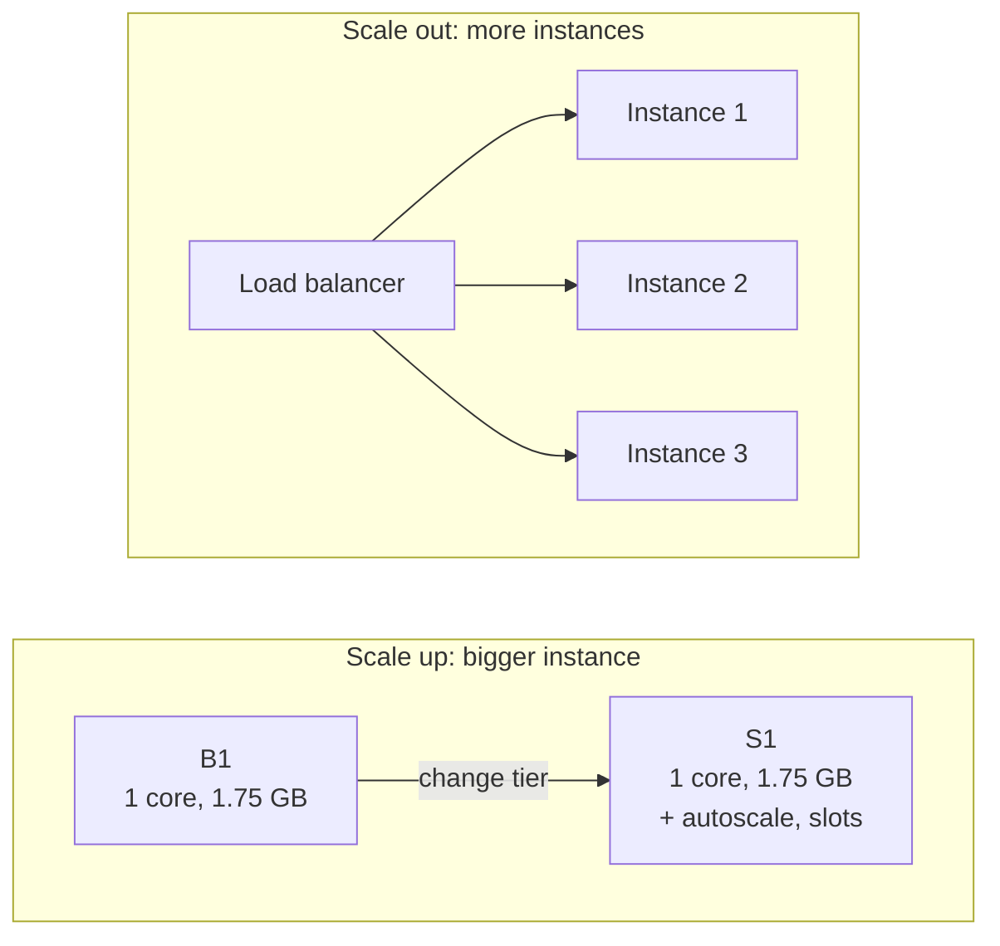

import Tabs from '@theme/Tabs';
import TabItem from '@theme/TabItem';
import PathPicker from '@site/src/components/PathPicker';
import Prerequisites from '@site/src/components/SharedMarkdown/_prerequisites.mdx';

# Scale your app up and out with autoscale

In this lab, you take a running web app on [Azure App Service](https://learn.microsoft.com/azure/app-service/overview) from a single small instance to an app that grows and shrinks with demand. You start on the **Basic B1** tier, **scale up** to **Standard S1** for more power per instance, then turn on **autoscale** so App Service adds and removes instances automatically based on CPU.

Scaling happens at the [App Service plan](https://learn.microsoft.com/azure/app-service/overview-hosting-plans) level, so everything here is language-agnostic. Any app on the plan - .NET, Node.js, Python, Java, PHP, or a custom container - scales the same way. You'll deploy a minimal app just so there's something to scale.

You'll do it three ways so you can pick the workflow that fits you:

- **Azure Developer CLI (azd)** - declare the plan tier and autoscale rules in Bicep, then provision.
- **Azure CLI (az)** - `az appservice plan update` to scale up, then `az monitor autoscale` to add rules.
- **Azure portal** - the visual **Scale up** and **Scale out** blades on the plan.

:::info App Service Labs complements Microsoft Learn
This lab is a hands-on, end-to-end walkthrough. For reference depth on any concept, follow the "Learn more" links to the official Microsoft Learn docs.
:::

**Estimated time:** 30-40 minutes

## What you'll build

A single web app that starts on a **B1** plan (about USD 13/month), scaled up to an **S1** plan (about USD 70/month), with an autoscale setting that keeps **1 to 3 instances** running: it scales out when average CPU goes above 70 percent and scales back in when CPU drops below 30 percent, plus a scheduled profile that guarantees extra instances during business hours.

## Objectives

By the end of this lab you will be able to:

- Explain the difference between **scale up** (vertical) and **scale out** (horizontal).
- Scale an App Service plan up from **B1** to **S1**.
- Create an autoscale setting with a **CPU** metric rule to scale out and scale in.
- Add a **scheduled** autoscale profile for predictable load.
- Recognize **Always On** and **health check** as related performance settings.

<Prerequisites
  tools={[
    { name: 'Azure Developer CLI (azd)', url: 'https://learn.microsoft.com/azure/developer/azure-developer-cli/install-azd', description: '(for the azd path)' },
  ]}
/>

:::tip Region and tier
This lab uses the **East US** region. Autoscale requires the **Standard** tier or higher, so you scale up to **S1** before turning it on. Pick the smallest tier that shows the scenario, and change the region to one near you if you prefer.
:::

## Scale up vs scale out

These two words sound similar but mean different things. Getting them straight is the whole point of this lab.

- **Scale up (vertical)** changes the **pricing tier** of the App Service plan - for example B1 to S1 to P1v3. Each instance gets more CPU, memory, and features (custom domains, staging slots, autoscale, and more). You get a bigger box, not more boxes.
- **Scale out (horizontal)** changes the **number of instances** running your app behind the built-in load balancer. More instances handle more concurrent traffic and add redundancy. **Autoscale** adjusts that instance count for you based on a schedule or a metric such as CPU.



You often do both: scale up to unlock a tier that meets your per-request needs, then scale out to handle concurrency. Autoscale (scale out and in) is only available on **Standard** and higher, which is why this lab moves from B1 to S1 first.

## Deploy, scale up, and autoscale

<PathPicker
  description="Set these once - every matching step and code sample below follows your choice."
  groups={[
    { id: 'tooling', label: 'Tooling', options: [
      { value: 'azd', label: 'azd' },
      { value: 'az', label: 'az CLI' },
      { value: 'portal', label: 'Portal' },
    ]},
    { id: 'language', label: 'Language', options: [
      { value: 'dotnet', label: '.NET' },
      { value: 'node', label: 'Node.js' },
      { value: 'python', label: 'Python' },
      { value: 'java', label: 'Java' },
      { value: 'php', label: 'PHP' },
    ]},
  ]}
/>

<Tabs groupId="tooling" queryString>

<TabItem value="azd" label="Azure Developer CLI (azd)">

With the Azure Developer CLI you describe the plan tier and the autoscale rules in Bicep, so scaling is repeatable infrastructure as code. You provision on B1 first, then change the tier to S1 and add an autoscale resource, and re-provision.

### 1. Sign in

```bash
azd auth login
```

### 2. Create the project structure

```bash
mkdir asl-autoscale && cd asl-autoscale
mkdir infra src
```

Create `azure.yaml` in the project root:

```yaml
# yaml-language-server: $schema=https://raw.githubusercontent.com/Azure/azure-dev/main/schemas/v1.0/azure.yaml.json
name: asl-autoscale
services:
  web:
    project: ./src
    language: js # change per language: js, dotnet, python, java
    host: appservice
```

Add a minimal app under `src/`. This lab uses Node.js; any stack works because scaling is at the plan level. See [Deploy your first web app](../getting-started/deploy-your-first-web-app.md) for the other languages.

Create `src/server.js`:

```js
const http = require('http');
const port = process.env.PORT || 3000;
http.createServer((req, res) => {
  res.writeHead(200, { 'Content-Type': 'text/html' });
  res.end('<h1>Hello from Azure App Service autoscale lab!</h1>');
}).listen(port);
```

Create `src/package.json`:

```json
{
  "name": "asl-autoscale",
  "version": "1.0.0",
  "main": "server.js",
  "scripts": { "start": "node server.js" }
}
```

Create `infra/main.parameters.json`. The `planSku` parameter is what you change to scale up:

```json
{
  "$schema": "https://schema.management.azure.com/schemas/2019-04-01/deploymentParameters.json#",
  "contentVersion": "1.0.0.0",
  "parameters": {
    "environmentName": { "value": "${AZURE_ENV_NAME}" },
    "location": { "value": "${AZURE_LOCATION}" },
    "resourceGroupName": { "value": "${AZURE_RESOURCE_GROUP}" },
    "planSku": { "value": "${PLAN_SKU=B1}" }
  }
}
```

Create `infra/main.bicep`. It runs at subscription scope so `azd` creates and owns the resource group:

```bicep
targetScope = 'subscription'

@description('Name of the azd environment; used to derive resource names.')
param environmentName string

@description('Azure region for all resources.')
param location string

@description('Resource group to create for this environment.')
param resourceGroupName string

@description('App Service plan SKU. Autoscale requires Standard (S1) or higher.')
param planSku string = 'B1'

@description('Deploy the autoscale setting. Requires a Standard or higher planSku.')
param enableAutoscale bool = false

resource rg 'Microsoft.Resources/resourceGroups@2024-03-01' = {
  name: resourceGroupName
  location: location
}

module resources 'resources.bicep' = {
  name: 'resources'
  scope: rg
  params: {
    location: location
    environmentName: environmentName
    planSku: planSku
    enableAutoscale: enableAutoscale
  }
}

output WEB_URI string = resources.outputs.webUri
```

Create `infra/resources.bicep`. The `autoscalesettings` resource holds the CPU rules and only deploys when `enableAutoscale` is true:

```bicep
@description('Azure region for all resources.')
param location string

@description('azd environment name used to derive globally unique names.')
param environmentName string

@description('App Service plan SKU. Autoscale requires Standard (S1) or higher.')
param planSku string = 'B1'

@description('Deploy the autoscale setting.')
param enableAutoscale bool = false

var suffix = uniqueString(subscription().id, resourceGroup().id, environmentName)
var planName = 'plan-${suffix}'
var webName = 'app-${suffix}'

resource plan 'Microsoft.Web/serverfarms@2023-12-01' = {
  name: planName
  location: location
  sku: {
    name: planSku // change B1 to S1 to scale up
  }
  kind: 'linux'
  properties: {
    reserved: true // required for Linux plans
  }
}

resource web 'Microsoft.Web/sites@2023-12-01' = {
  name: webName
  location: location
  kind: 'app,linux'
  tags: {
    'azd-service-name': 'web' // links this site to the "web" service in azure.yaml
  }
  properties: {
    serverFarmId: plan.id
    httpsOnly: true
    siteConfig: {
      linuxFxVersion: 'NODE|22-lts' // change per language, for example DOTNETCORE|8.0
      alwaysOn: true // keep the app loaded; needs Basic or higher
      appSettings: [
        {
          name: 'SCM_DO_BUILD_DURING_DEPLOYMENT'
          value: 'true'
        }
      ]
    }
  }
}

resource autoscale 'Microsoft.Insights/autoscalesettings@2022-10-01' = if (enableAutoscale) {
  name: 'autoscale-${webName}'
  location: location
  properties: {
    enabled: true
    targetResourceUri: plan.id
    profiles: [
      {
        name: 'CPU based autoscale'
        capacity: {
          minimum: '1'
          maximum: '3'
          default: '1'
        }
        rules: [
          {
            metricTrigger: {
              metricName: 'CpuPercentage'
              metricResourceUri: plan.id
              timeGrain: 'PT1M'
              statistic: 'Average'
              timeWindow: 'PT5M'
              timeAggregation: 'Average'
              operator: 'GreaterThan'
              threshold: 70
            }
            scaleAction: {
              direction: 'Increase'
              type: 'ChangeCount'
              value: '1'
              cooldown: 'PT5M'
            }
          }
          {
            metricTrigger: {
              metricName: 'CpuPercentage'
              metricResourceUri: plan.id
              timeGrain: 'PT1M'
              statistic: 'Average'
              timeWindow: 'PT5M'
              timeAggregation: 'Average'
              operator: 'LessThan'
              threshold: 30
            }
            scaleAction: {
              direction: 'Decrease'
              type: 'ChangeCount'
              value: '1'
              cooldown: 'PT5M'
            }
          }
        ]
      }
    ]
  }
}

output webUri string = 'https://${web.properties.defaultHostName}'
```

### 3. Provision on B1 and deploy

Create an environment with a unique suffix, then provision and deploy in one step. `planSku` defaults to `B1` and `enableAutoscale` is off:

```bash
SUFFIX=$(openssl rand -hex 3)   # 6 lowercase hex chars
azd env new "asl-autoscale-${SUFFIX}" --location eastus
azd env set AZURE_RESOURCE_GROUP "rg-asl-autoscale-${SUFFIX}"
azd up
```

When it finishes, `azd` prints the app endpoint. Confirm it returns HTTP `200`:

```bash
curl -I $(azd env get-value WEB_URI)
```

### 4. Scale up to S1 and turn on autoscale

Now raise the tier and enable the autoscale resource, then re-provision. Because the plan already exists, `azd` updates it in place:

```bash
azd env set PLAN_SKU S1
azd env set ENABLE_AUTOSCALE true
azd provision
```

`azd` reads `ENABLE_AUTOSCALE` into the `enableAutoscale` parameter through the environment. If your `main.parameters.json` doesn't map it yet, add this parameter line:

```json
"enableAutoscale": { "value": "${ENABLE_AUTOSCALE=false}" }
```

:::note Bool parameters from azd environment
`azd` environment values are strings. The Bicep `@allowed`-free `bool` parameter accepts `true`/`false` from `${ENABLE_AUTOSCALE=false}`. If you hit a type error, set the value directly in `main.parameters.json` to `true` instead of using the environment variable.
:::

</TabItem>

<TabItem value="az" label="Azure CLI (az)">

With the Azure CLI you scale up with a single `az appservice plan update`, then use the `az monitor autoscale` commands to add rules.

### 1. Sign in and set variables

```bash
az login
```

```bash
export SUFFIX=$(openssl rand -hex 3)
export RESOURCE_GROUP=rg-asl-autoscale-$SUFFIX
export LOCATION=eastus
export PLAN_NAME=plan-asl-autoscale-$SUFFIX
export APP_NAME=app-asl-autoscale-$SUFFIX
```

### 2. Create the plan and app on B1

```bash
az group create --name $RESOURCE_GROUP --location $LOCATION

az appservice plan create \
  --name $PLAN_NAME \
  --resource-group $RESOURCE_GROUP \
  --sku B1 \
  --is-linux
```

Deploy a minimal app. This lab uses Node.js; pick your language below - the rest of the lab is identical because scaling is at the plan level.

<Tabs groupId="language" queryString>

<TabItem value="dotnet" label=".NET">

```bash
dotnet new webapp -o app && cd app
dotnet publish -c Release -o publish
cd publish && zip -r ../app.zip . && cd ..
az webapp create --resource-group $RESOURCE_GROUP --plan $PLAN_NAME --name $APP_NAME --runtime "DOTNETCORE:8.0"
az webapp deploy --resource-group $RESOURCE_GROUP --name $APP_NAME --src-path app.zip --type zip
cd ..
```

</TabItem>

<TabItem value="node" label="Node.js">

```bash
mkdir app && cd app
cat > server.js <<'EOF'
const http = require('http');
const port = process.env.PORT || 3000;
http.createServer((req, res) => {
  res.writeHead(200, { 'Content-Type': 'text/html' });
  res.end('<h1>Hello from Azure App Service autoscale lab!</h1>');
}).listen(port);
EOF
cat > package.json <<'EOF'
{ "name": "app", "version": "1.0.0", "main": "server.js", "scripts": { "start": "node server.js" } }
EOF
zip -r app.zip server.js package.json
az webapp create --resource-group $RESOURCE_GROUP --plan $PLAN_NAME --name $APP_NAME --runtime "NODE:22-lts"
az webapp deploy --resource-group $RESOURCE_GROUP --name $APP_NAME --src-path app.zip --type zip
cd ..
```

</TabItem>

<TabItem value="python" label="Python">

```bash
git clone https://github.com/Azure-Samples/msdocs-python-flask-webapp-quickstart
cd msdocs-python-flask-webapp-quickstart
az webapp create --resource-group $RESOURCE_GROUP --plan $PLAN_NAME --name $APP_NAME --runtime "PYTHON:3.13"
zip -r app.zip . -x '*.git*'
az webapp deploy --resource-group $RESOURCE_GROUP --name $APP_NAME --src-path app.zip --type zip
cd ..
```

</TabItem>

<TabItem value="java" label="Java">

Use the [Maven Plugin for Azure App Service](https://learn.microsoft.com/azure/app-service/quickstart-java) to create the app and deploy a JAR. Create the plan first (above), then point the plugin at the same resource group and plan when it prompts.

</TabItem>

<TabItem value="php" label="PHP">

```bash
git clone https://github.com/Azure-Samples/php-docs-hello-world
cd php-docs-hello-world
az webapp create --resource-group $RESOURCE_GROUP --plan $PLAN_NAME --name $APP_NAME --runtime "PHP:8.4"
zip -r app.zip . -x '*.git*'
az webapp deploy --resource-group $RESOURCE_GROUP --name $APP_NAME --src-path app.zip --type zip
cd ..
```

</TabItem>

</Tabs>

Confirm the app returns HTTP `200`:

```bash
curl -I https://$APP_NAME.azurewebsites.net
```

### 3. Scale up to S1 (vertical)

Change the plan's pricing tier. This is a fast, in-place update; no redeploy needed:

```bash
az appservice plan update \
  --name $PLAN_NAME \
  --resource-group $RESOURCE_GROUP \
  --sku S1
```

Confirm the new tier:

```bash
az appservice plan show \
  --name $PLAN_NAME \
  --resource-group $RESOURCE_GROUP \
  --query "sku.{name:name, tier:tier}" -o table
```

### 4. Create the autoscale setting (scale out and in)

Create an autoscale setting on the plan with a floor of 1 and a ceiling of 3 instances:

```bash
PLAN_ID=$(az appservice plan show --name $PLAN_NAME --resource-group $RESOURCE_GROUP --query id -o tsv)

az monitor autoscale create \
  --resource-group $RESOURCE_GROUP \
  --resource "$PLAN_ID" \
  --name autoscale-$APP_NAME \
  --min-count 1 \
  --max-count 3 \
  --count 1
```

Add a rule to **scale out** by 1 instance when average CPU is above 70 percent over 5 minutes:

```bash
az monitor autoscale rule create \
  --resource-group $RESOURCE_GROUP \
  --autoscale-name autoscale-$APP_NAME \
  --condition "CpuPercentage > 70 avg 5m" \
  --scale out 1
```

Add a matching rule to **scale in** by 1 instance when average CPU drops below 30 percent:

```bash
az monitor autoscale rule create \
  --resource-group $RESOURCE_GROUP \
  --autoscale-name autoscale-$APP_NAME \
  --condition "CpuPercentage < 30 avg 5m" \
  --scale in 1
```

:::tip Always pair scale-out with scale-in
A profile with only a scale-out rule grows but never shrinks. Always add the opposite rule with a lower threshold so instances return to the floor when traffic drops. The gap between 70 and 30 percent avoids "flapping" (scaling out and in repeatedly).
:::

### 5. Add a scheduled profile (optional)

Metric rules react to load. A **scheduled profile** guarantees capacity at known-busy times - for example, a floor of 2 instances during business hours:

```bash
az monitor autoscale profile create \
  --resource-group $RESOURCE_GROUP \
  --autoscale-name autoscale-$APP_NAME \
  --name "Business hours" \
  --min-count 2 \
  --max-count 3 \
  --count 2 \
  --recurrence week Mon Tue Wed Thu Fri \
  --start 09:00 \
  --end 17:00 \
  --timezone "Pacific Standard Time"
```

The CLI keeps your metric-based `default` profile in effect outside these hours. To keep CPU-based scaling active during business hours too, add the same scale-out and scale-in rules to the `Business hours` profile with `az monitor autoscale rule create --profile-name "Business hours"`.

</TabItem>

<TabItem value="portal" label="Azure portal">

The portal gives you visual **Scale up** and **Scale out** blades on the App Service plan.

### 1. Create the app on B1

Sign in to the [Azure portal](https://portal.azure.com). In the top search bar, enter **app services**, then select **App Services** > **Create** > **Web App**. On the **Basics** tab:

- **Resource Group**: select **Create new** and enter a name such as `rg-asl-autoscale`.
- **Name**: a globally unique name.
- **Publish**: **Code**, then choose a **Runtime stack** (for example **Node 22 LTS**) and **Operating System**.
- **Region**: **East US**.
- **Pricing plan**: create a new plan and choose the **Basic B1** tier.

Select **Review + create**, then **Create**. When deployment finishes, deploy code from Visual Studio Code with the **Azure App Service** extension (right-click the app > **Deploy to Web App**), or connect a repo in **Deployment Center**. See [Deploy your first web app](../getting-started/deploy-your-first-web-app.md) for details.

### 2. Scale up to S1 (vertical)

In your app, under **Settings**, select **Scale up (App Service plan)**. Choose the **Production** workloads, select **S1**, and select **Select** to apply. Your plan now has autoscale, staging slots, and more.

### 3. Turn on autoscale (scale out and in)

Under **Settings**, select **Scale out (App Service plan)**, then select **Custom autoscale**.

1. For **Scale mode**, choose **Scale based on a metric**.
2. Set **Instance limits**: **Minimum** 1, **Maximum** 3, **Default** 1.
3. Under the **Default** profile, select **Add a rule**:
   - **Metric source**: Current resource.
   - **Metric name**: **CPU Percentage**.
   - **Operator**: **Greater than**, **Threshold**: **70**, over a **5** minute duration.
   - **Operation**: **Increase count by** **1**.
   - Select **Add**.
4. Select **Add a rule** again for scale in:
   - **Metric name**: **CPU Percentage**.
   - **Operator**: **Less than**, **Threshold**: **30**.
   - **Operation**: **Decrease count by** **1**.
   - Select **Add**.
5. Select **Save**.

### 4. Add a scheduled profile (optional)

Still on the **Custom autoscale** page, select **Add a scale condition**. Choose **Scale based on a metric** or a fixed instance count, set the instance limits (for example minimum 2), then under **Schedule** choose **Repeat specific days**, select **Monday** through **Friday**, and set the start and end times and time zone. Select **Save**.

</TabItem>

</Tabs>

## Verify

Confirm all three outcomes.

The app still returns HTTP `200` after scaling up:

```bash
curl -I https://<your-app-name>.azurewebsites.net
```

Expected output (validated during authoring):

```text
HTTP/1.1 200 OK
Content-Type: text/html
```

The plan is on the **S1 (Standard)** tier:

```bash
az appservice plan show \
  --name <your-plan-name> \
  --resource-group <your-rg> \
  --query "sku.{name:name, tier:tier}" -o table
```

The autoscale setting exists, is enabled, and has both CPU rules:

```bash
az monitor autoscale show \
  --name autoscale-<your-app-name> \
  --resource-group <your-rg> \
  --query "{enabled:enabled, min:profiles[0].capacity.minimum, max:profiles[0].capacity.maximum, rules:profiles[0].rules[].{metric:metricTrigger.metricName, op:metricTrigger.operator, threshold:metricTrigger.threshold, dir:scaleAction.direction}}" -o json
```

You should see `enabled: true`, a floor of `1` and ceiling of `3`, and two `CpuPercentage` rules - one `GreaterThan 70` that increases count, one `LessThan 30` that decreases it.

:::note Watching a real scale-out takes time
Autoscale evaluates metrics on a schedule and honors a cooldown, so a real CPU-driven scale-out can take 10 or more minutes under sustained load. For this lab, the **created and enabled** rules are the success signal. To watch scaling live, generate load (for example with a load test) and open **Scale out (App Service plan)** > **Run history** to see instance count change.
:::

## Related performance settings

While you're tuning performance, two more plan-level settings are worth knowing. They aren't autoscale, but they pair with it:

- **Always On** keeps your app loaded so it doesn't unload after idle time, which avoids slow cold starts on the first request. It's available on Basic and higher. Turn it on under **Settings** > **Configuration** > **General settings**.
- **Health check** pings a path you choose (for example `/healthz`) and removes unhealthy instances from the load balancer rotation - especially useful once you scale out to multiple instances. Configure it under **Settings** > **Health check**.

## Clean up resources

To avoid ongoing charges, delete the resources when you're done. Deleting the resource group removes the web app, its plan, and the autoscale setting.

<Tabs groupId="tooling" queryString>

<TabItem value="azd" label="Azure Developer CLI (azd)">

```bash
azd down --force
```

</TabItem>

<TabItem value="az" label="Azure CLI (az)">

```bash
az group delete --name $RESOURCE_GROUP --yes --no-wait
```

Confirm the group is gone:

```bash
az group exists --name $RESOURCE_GROUP
```

</TabItem>

<TabItem value="portal" label="Azure portal">

In the portal, open your resource group, select **Delete resource group**, enter the group name to confirm, and select **Delete**.

</TabItem>

</Tabs>

## Summary

In this lab, you took an app from one small instance to an elastic app on App Service. You learned how to:

- Tell **scale up** (bigger instances, a higher tier) apart from **scale out** (more instances).
- Scale a plan up from **B1** to **S1** to unlock Standard-tier features, including autoscale.
- Create an autoscale setting with **CPU** rules to scale out above 70 percent and scale in below 30 percent, bounded to **1 to 3** instances.
- Add a **scheduled** profile for predictable busy hours.
- Recognize **Always On** and **health check** as complementary performance settings.

## Troubleshooting

- **`az monitor autoscale create` fails with a usage error about `--resource`.** Pass the plan's full resource ID to `--resource` and don't also pass `--resource-type`. Get the ID with `az appservice plan show --name <plan> --resource-group <rg> --query id -o tsv`.
- **Autoscale options are greyed out or the create command is rejected.** Autoscale requires **Standard** or higher. Scale up to **S1** first, then create the setting.
- **The app scales out but never scales back in.** You likely have only a scale-out rule. Add a scale-in rule with a lower threshold (for example CPU less than 30) so instances return to the floor.
- **Instances "flap" up and down.** Your scale-out and scale-in thresholds are too close, or the cooldown is too short. Widen the gap between thresholds and increase the cooldown.
- **azd type error on the autoscale bool parameter.** `azd` environment values are strings. If `${ENABLE_AUTOSCALE=false}` doesn't resolve to a Bicep `bool`, set `"enableAutoscale": { "value": true }` directly in `infra/main.parameters.json`.

For deeper guidance, see [Get started with autoscale in Azure](https://learn.microsoft.com/azure/azure-monitor/autoscale/autoscale-get-started).

## Learn more

- [Scale up an app in Azure App Service](https://learn.microsoft.com/azure/app-service/manage-scale-up)
- [Scale out an app - autoscale](https://learn.microsoft.com/azure/azure-monitor/autoscale/autoscale-get-started)
- [Autoscale best practices](https://learn.microsoft.com/azure/azure-monitor/autoscale/autoscale-best-practices)
- [App Service plans and pricing tiers](https://learn.microsoft.com/azure/app-service/overview-hosting-plans)
- [Configure Always On and other general settings](https://learn.microsoft.com/azure/app-service/configure-common)
- [Monitor App Service instances with health check](https://learn.microsoft.com/azure/app-service/monitor-instances-health-check)
