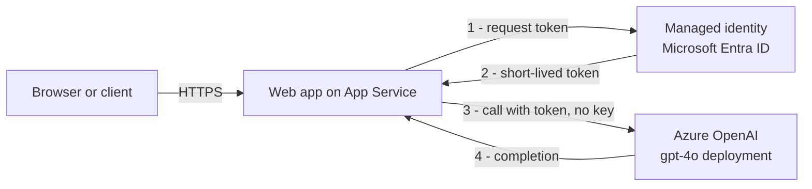

{/*
SCREENSHOT MANIFEST - capture the following and save under
static/img/labs/deploy-an-ai-app/. Lightweight placeholder PNGs are committed
so the build passes; replace them with real captures. Do NOT fabricate these.

1. portal-create-openai.png
   URL/blade: https://portal.azure.com > Create a resource > Azure OpenAI > Basics tab
   Capture: the Basics tab with Region = East US, a unique Name (for example
   aoai-asl-xxxxxx), and the Standard S0 pricing tier selected.

2. portal-deploy-model.png
   URL/blade: Azure AI Foundry portal (ai.azure.com) > your resource > Deployments > Deploy model
   Capture: the Deploy model dialog with Model = gpt-4o, a deployment name of
   gpt-4o, and Deployment type = Standard, just before selecting Deploy.

3. portal-create-webapp.png
   URL/blade: https://portal.azure.com > Create a resource > Web App > Basics tab
   Capture: the Basics tab with Publish = Code, Runtime stack = Python 3.12
   (or Node 22 LTS), Operating System = Linux, and a Basic B1 plan selected.

4. portal-identity-on.png
   URL/blade: App Service > Settings > Identity > System assigned
   Capture: the System assigned tab with Status set to On and an Object
   (principal) ID visible after saving.

5. portal-add-role-assignment.png
   URL/blade: Azure OpenAI resource > Access control (IAM) > Add role assignment
   Capture: the Add role assignment flow with Role = Cognitive Services OpenAI
   User and the web app's managed identity selected as the member.

6. portal-app-settings.png
   URL/blade: App Service > Settings > Environment variables > App settings
   Capture: the app settings list showing AZURE_OPENAI_ENDPOINT,
   AZURE_OPENAI_DEPLOYMENT, and AZURE_OPENAI_API_VERSION before selecting Apply.

7. portal-overview-domain.png
   URL/blade: App Service > Overview
   Capture: the Overview blade with the Default domain
   (for example, app-asl-aiapp-xxxxxx.azurewebsites.net) highlighted.

8. portal-test-response.png
   URL/blade: a terminal or browser showing the /chat response
   Capture: the JSON reply from POST /chat, confirming a real AI completion
   returned over HTTPS with no API key in the request.
*/}

import Tabs from '@theme/Tabs';
import TabItem from '@theme/TabItem';
import PathPicker from '@site/src/components/PathPicker';

# Build and deploy an AI-powered app

Adding AI to a web app usually means calling a large language model from your code. The tempting shortcut is to paste an API key into an app setting - but keys leak, expire, and end up in source control. This lab shows the recommended path instead: a web app on [Azure App Service](https://learn.microsoft.com/azure/app-service/overview) that calls an [Azure OpenAI](https://learn.microsoft.com/azure/ai-services/openai/overview) model using a **managed identity**, so there are no keys in your code or configuration at all.

In this lab you will:

- Build a small web app that calls an Azure OpenAI chat model (Python and Node.js variants, with notes for .NET, Java, and PHP).
- Provision Azure OpenAI and deploy a `gpt-4o` model.
- Deploy the app to App Service three ways: **Azure Developer CLI (azd)**, **Azure CLI (az)**, and the **Azure portal**.
- Wire up **keyless** authentication: turn on the app's managed identity and grant it the **Cognitive Services OpenAI User** role.
- Verify a real AI completion returns over HTTPS - with no API key anywhere.

App Service is a strong home for AI apps: managed HTTPS, built-in managed identity, autoscale, and the same deployment tooling you already use for web apps. This lab **complements** the reference docs - see [Tutorial: Build a web app with Azure OpenAI on App Service](https://learn.microsoft.com/azure/app-service/) for the conceptual overview.

**Estimated time:** 30 to 45 minutes.

## Objectives

By the end of this lab you will be able to:

- Explain why managed identity is the recommended way to reach Azure OpenAI from App Service.
- Provision an Azure OpenAI resource and deploy a chat model.
- Deploy an AI web app to App Service with azd, az, or the portal.
- Grant a managed identity the right role and confirm a keyless call succeeds.

## Prerequisites

- An [Azure subscription](https://azure.microsoft.com/free/) with access to [Azure OpenAI](https://learn.microsoft.com/azure/ai-services/openai/overview/#how-do-i-get-access-to-azure-openai). Some subscriptions require you to [request access](https://aka.ms/oai/access) before you can create an Azure OpenAI resource.
- Permission to **create role assignments** on the Azure OpenAI resource (Owner, or User Access Administrator on the resource). Granting the managed identity its role needs this.
- [Azure CLI](https://learn.microsoft.com/cli/azure/install-azure-cli) 2.60 or later.
- [Azure Developer CLI (azd)](https://learn.microsoft.com/azure/developer/azure-developer-cli/install-azd) 1.9 or later (for the azd path).
- One runtime for the sample:
  - [Python](https://www.python.org/downloads/) 3.10 or later, **or**
  - [Node.js](https://nodejs.org/) 20 or later.

Sign in first:

```bash
az login
azd auth login
```

:::tip Choose a region and low-cost tier
This lab uses the **East US** region and the **B1 (Basic)** App Service tier, a low-cost option that's ideal for learning. Azure OpenAI is billed per 1,000 tokens on top of the plan. Delete the resource group when you're done (see [Clean up](#clean-up-resources)) to stop charges.
:::

## Why keyless, and how it works

An Azure OpenAI resource accepts two kinds of authentication: an **API key** or a **Microsoft Entra ID token**. Keys are simple but risky - anyone who reads the key can call your model, and rotating a leaked key means redeploying every app that uses it. A **managed identity** removes the key entirely: App Service gives your app an identity in Microsoft Entra ID, you grant that identity a role on the Azure OpenAI resource, and the Azure SDK fetches short-lived tokens automatically at runtime.



In code, this is the `DefaultAzureCredential` from the Azure Identity library. Locally it uses your `az login` session; on App Service it uses the app's managed identity - the same code, no keys, in both places.

## The app sample

<PathPicker
  description="Set these once - the sample code and every deployment step below follow your choice."
  groups={[
    { id: 'lang', label: 'Language', options: [
      { value: 'python', label: 'Python' },
      { value: 'node', label: 'Node.js' },
      { value: 'dotnet', label: '.NET' },
      { value: 'java', label: 'Java' },
      { value: 'php', label: 'PHP' },
    ]},
    { id: 'deploy', label: 'Deploy with', options: [
      { value: 'azd', label: 'azd' },
      { value: 'az', label: 'az CLI' },
      { value: 'portal', label: 'Portal' },
    ]},
  ]}
/>

The sample exposes a `/health` endpoint for App Service health checks and a `/chat` endpoint that forwards a prompt to the model. Pick your language.

<Tabs groupId="lang" queryString>
<TabItem value="python" label="Python">

Create a project with these files.

`requirements.txt`

```text
flask
gunicorn
openai
azure-identity
```

`app.py`

```python
import os

from azure.identity import DefaultAzureCredential, get_bearer_token_provider
from flask import Flask, jsonify, request
from openai import AzureOpenAI

app = Flask(__name__)

ENDPOINT = os.environ["AZURE_OPENAI_ENDPOINT"]
DEPLOYMENT = os.environ["AZURE_OPENAI_DEPLOYMENT"]
API_VERSION = os.environ.get("AZURE_OPENAI_API_VERSION", "2024-10-21")

# Keyless auth: DefaultAzureCredential uses the App Service managed identity in
# Azure and your az login session locally. No API keys anywhere.
token_provider = get_bearer_token_provider(
    DefaultAzureCredential(),
    "https://cognitiveservices.azure.com/.default",
)

client = AzureOpenAI(
    azure_endpoint=ENDPOINT,
    azure_ad_token_provider=token_provider,
    api_version=API_VERSION,
)


@app.route("/health")
def health():
    return jsonify(status="ok")


@app.route("/")
def home():
    return (
        "<h1>AI app on Azure App Service</h1>"
        "<p>POST JSON {\"prompt\": \"...\"} to <code>/chat</code>.</p>"
    )


@app.route("/chat", methods=["POST"])
def chat():
    data = request.get_json(silent=True) or {}
    prompt = data.get("prompt", "Say hello from Azure App Service in one sentence.")
    completion = client.chat.completions.create(
        model=DEPLOYMENT,
        messages=[
            {"role": "system", "content": "You are a helpful assistant."},
            {"role": "user", "content": prompt},
        ],
        max_tokens=200,
    )
    return jsonify(reply=completion.choices[0].message.content)


if __name__ == "__main__":
    app.run(host="0.0.0.0", port=int(os.environ.get("PORT", 8000)))
```

Run it locally to confirm it works (your `az login` session provides the token):

```bash
python -m venv .venv
source .venv/bin/activate   # Windows: .venv\Scripts\activate
pip install -r requirements.txt
export AZURE_OPENAI_ENDPOINT="https://<your-openai>.openai.azure.com/"
export AZURE_OPENAI_DEPLOYMENT="gpt-4o"
python app.py
# In another terminal:
curl http://localhost:8000/health
```

The App Service **startup command** for this app is `gunicorn --bind=0.0.0.0 --timeout 600 app:app`.

:::note Linux only
Python App Service apps run on **Linux** plans only. If you need Windows, use the Node.js or .NET variant.
:::

</TabItem>
<TabItem value="node" label="Node.js">

Create a project with these files.

`package.json`

```json
{
  "name": "ai-app-appservice",
  "version": "1.0.0",
  "main": "server.js",
  "scripts": {
    "start": "node server.js"
  },
  "engines": {
    "node": ">=20"
  },
  "dependencies": {
    "@azure/identity": "^4.5.0",
    "express": "^4.21.2",
    "openai": "^4.73.0"
  }
}
```

`server.js`

```js
const express = require("express");
const { DefaultAzureCredential, getBearerTokenProvider } = require("@azure/identity");
const { AzureOpenAI } = require("openai");

const app = express();
app.use(express.json());

const endpoint = process.env.AZURE_OPENAI_ENDPOINT;
const deployment = process.env.AZURE_OPENAI_DEPLOYMENT;
const apiVersion = process.env.AZURE_OPENAI_API_VERSION || "2024-10-21";

// Keyless auth: DefaultAzureCredential uses the App Service managed identity in
// Azure and your az login session locally. No API keys anywhere.
const tokenProvider = getBearerTokenProvider(
  new DefaultAzureCredential(),
  "https://cognitiveservices.azure.com/.default"
);
const client = new AzureOpenAI({ endpoint, apiVersion, azureADTokenProvider: tokenProvider });

app.get("/health", (_req, res) => res.json({ status: "ok" }));

app.get("/", (_req, res) =>
  res.send('<h1>AI app on Azure App Service</h1><p>POST JSON {"prompt":"..."} to <code>/chat</code>.</p>')
);

app.post("/chat", async (req, res) => {
  try {
    const prompt = req.body?.prompt || "Say hello from Azure App Service in one sentence.";
    const completion = await client.chat.completions.create({
      model: deployment,
      messages: [
        { role: "system", content: "You are a helpful assistant." },
        { role: "user", content: prompt },
      ],
      max_tokens: 200,
    });
    res.json({ reply: completion.choices[0].message.content });
  } catch (err) {
    console.error(err);
    res.status(500).json({ error: "completion failed" });
  }
});

const port = process.env.PORT || 3000;
app.listen(port, () => console.log(`Listening on ${port}`));
```

Install and run locally:

```bash
npm install
export AZURE_OPENAI_ENDPOINT="https://<your-openai>.openai.azure.com/"
export AZURE_OPENAI_DEPLOYMENT="gpt-4o"
node server.js
# In another terminal:
curl http://localhost:3000/health
```

:::tip Windows vs Linux
The Node.js sample runs on both **Windows** and **Linux** App Service plans. The steps below use Linux; the Windows notes call out the differences.
:::

</TabItem>
<TabItem value="dotnet" label=".NET">

The deployment steps are identical - only the keyless client setup differs. Add the [`Azure.AI.OpenAI`](https://www.nuget.org/packages/Azure.AI.OpenAI) and [`Azure.Identity`](https://www.nuget.org/packages/Azure.Identity) packages, then build the client with `DefaultAzureCredential`:

```csharp
using Azure.AI.OpenAI;
using Azure.Identity;
using OpenAI.Chat;

var endpoint = new Uri(Environment.GetEnvironmentVariable("AZURE_OPENAI_ENDPOINT")!);
var deployment = Environment.GetEnvironmentVariable("AZURE_OPENAI_DEPLOYMENT")!;

// Keyless: no API key, uses the App Service managed identity at runtime.
var client = new AzureOpenAIClient(endpoint, new DefaultAzureCredential());
ChatClient chat = client.GetChatClient(deployment);

var completion = await chat.CompleteChatAsync(
    new UserChatMessage("Say hello from Azure App Service in one sentence."));
Console.WriteLine(completion.Value.Content[0].Text);
```

.NET runs on both **Windows** and **Linux** plans. Use `az webapp create --runtime "DOTNETCORE:8.0"` (Linux) or `"dotnet:8"` (Windows) in the deployment steps.

</TabItem>
<TabItem value="java" label="Java">

Python and Node.js are the fully worked samples in this lab; the pattern is the same in Java. Add the [`azure-ai-openai`](https://central.sonatype.com/artifact/com.azure/azure-ai-openai) and [`azure-identity`](https://central.sonatype.com/artifact/com.azure/azure-identity) dependencies, then build the client with `DefaultAzureCredential`:

```java
import com.azure.ai.openai.OpenAIClient;
import com.azure.ai.openai.OpenAIClientBuilder;
import com.azure.identity.DefaultAzureCredentialBuilder;

String endpoint = System.getenv("AZURE_OPENAI_ENDPOINT");

// Keyless: credential resolves to the App Service managed identity in Azure.
OpenAIClient client = new OpenAIClientBuilder()
    .endpoint(endpoint)
    .credential(new DefaultAzureCredentialBuilder().build())
    .buildClient();
```

Java runs on both **Windows** and **Linux** plans. Package your app as an executable JAR and use a Java runtime such as `JAVA|17-java17` in the deployment steps.

</TabItem>
<TabItem value="php" label="PHP">

The Azure OpenAI SDKs target Python, Node.js, .NET, and Java. For **PHP**, call the REST API directly and fetch a Microsoft Entra token with the managed identity. On App Service, the identity endpoint is available through the `IDENTITY_ENDPOINT` and `IDENTITY_HEADER` environment variables:

```php
<?php
// Fetch a token for Azure OpenAI from the App Service managed identity endpoint.
$resource = "https://cognitiveservices.azure.com";
$url = getenv("IDENTITY_ENDPOINT") . "?resource=$resource&api-version=2019-08-01";
$ch = curl_init($url);
curl_setopt($ch, CURLOPT_RETURNTRANSFER, true);
curl_setopt($ch, CURLOPT_HTTPHEADER, ["X-IDENTITY-HEADER: " . getenv("IDENTITY_HEADER")]);
$token = json_decode(curl_exec($ch), true)["access_token"];
// Use $token as a Bearer token against
// $AZURE_OPENAI_ENDPOINT/openai/deployments/<name>/chat/completions?api-version=2024-10-21
```

PHP is supported on **Linux** plans only.

</TabItem>
</Tabs>

## Create the Azure OpenAI resource

The app needs an Azure OpenAI resource with a chat model deployed. You create this once, regardless of how you deploy the app.

<Tabs groupId="deploy" queryString>
<TabItem value="azd" label="Azure Developer CLI (azd)">

With azd, the Azure OpenAI resource, the model deployment, the App Service, and the role assignment are all defined in Bicep and created by `azd up` in the next section. Skip ahead to [Deploy to App Service](#deploy-to-app-service).

</TabItem>
<TabItem value="az" label="Azure CLI (az)">

Create the resource group and Azure OpenAI account, then deploy a `gpt-4o` model. Use a unique suffix so the OpenAI endpoint is globally unique:

```bash
SUFFIX=$(openssl rand -hex 3)   # 6 lowercase hex chars
export RG="rg-asl-aiapp-${SUFFIX}"
export LOCATION=eastus
export AOAI="aoai-asl-${SUFFIX}"
export DEPLOYMENT="gpt-4o"

az group create --name "$RG" --location "$LOCATION"

az cognitiveservices account create --name "$AOAI" --resource-group "$RG" \
  --location "$LOCATION" --kind OpenAI --sku S0 --custom-domain "$AOAI" --yes

az cognitiveservices account deployment create --name "$AOAI" --resource-group "$RG" \
  --deployment-name "$DEPLOYMENT" \
  --model-name gpt-4o --model-version "2024-11-20" --model-format OpenAI \
  --sku-name Standard --sku-capacity 10
```

Capture the endpoint for later:

```bash
export ENDPOINT=$(az cognitiveservices account show --name "$AOAI" \
  --resource-group "$RG" --query properties.endpoint --output tsv)
echo "$ENDPOINT"
```

:::note Model versions change
`gpt-4o` version `2024-11-20` was current when this lab was validated. If Azure reports a version as deprecated, list what's available with `az cognitiveservices account list-models --name "$AOAI" --resource-group "$RG" --output table` and pick a current one.
:::

</TabItem>
<TabItem value="portal" label="Azure portal">

1. In the [Azure portal](https://portal.azure.com), select **Create a resource**, search for **Azure OpenAI**, and select **Create**.
2. On the **Basics** tab, set **Region** to **East US**, enter a unique **Name** (for example `aoai-asl-xxxxxx`), and choose the **Standard S0** pricing tier. Select **Review + create**, then **Create**.

   

3. When the resource is ready, open it and select **Go to Azure AI Foundry portal** (or open [ai.azure.com](https://ai.azure.com)). Under **Deployments**, select **Deploy model** > **Deploy base model**.
4. Choose **gpt-4o**, set the **Deployment name** to `gpt-4o`, keep **Deployment type** = **Standard**, and select **Deploy**.

   

5. On the OpenAI resource **Overview**, copy the **Endpoint** (for example `https://aoai-asl-xxxxxx.openai.azure.com/`). You'll use it as an app setting.

</TabItem>
</Tabs>

## Deploy to App Service

Choose one deployment mechanism. All three create a Linux App Service on a low-cost **B1** plan, turn on the app's **managed identity**, and grant it the **Cognitive Services OpenAI User** role so the keyless call works.

<Tabs groupId="deploy" queryString>
<TabItem value="azd" label="Azure Developer CLI (azd)">

The Azure Developer CLI provisions everything - Azure OpenAI, the model deployment, the App Service, the managed identity, and the role assignment - then deploys your code in one step. Add these files to your project.

`azure.yaml`

```yaml
# yaml-language-server: $schema=https://raw.githubusercontent.com/Azure/azure-dev/main/schemas/v1.0/azure.yaml.json
name: ai-app-appservice
services:
  web:
    project: .
    language: py   # use "js" for the Node.js variant
    host: appservice
```

`infra/main.bicep`

```bicep
targetScope = 'subscription'

param resourceGroupName string
param location string
param openAiAccountName string
param webAppName string
param appServicePlanName string
param chatDeploymentName string = 'gpt-4o'

resource rg 'Microsoft.Resources/resourceGroups@2024-03-01' = {
  name: resourceGroupName
  location: location
}

module resources 'resources.bicep' = {
  name: 'ai-app-resources'
  scope: rg
  params: {
    location: location
    openAiAccountName: openAiAccountName
    webAppName: webAppName
    appServicePlanName: appServicePlanName
    chatDeploymentName: chatDeploymentName
  }
}

output WEB_URI string = resources.outputs.webUri
output AZURE_OPENAI_ENDPOINT string = resources.outputs.openAiEndpoint
```

`infra/resources.bicep`

```bicep
param location string
param openAiAccountName string
param webAppName string
param appServicePlanName string
param chatDeploymentName string = 'gpt-4o'

// Role definition ID for "Cognitive Services OpenAI User".
var openAiUserRoleId = '5e0bd9bd-7b93-4f28-af87-19fc36ad61bd'

resource openAi 'Microsoft.CognitiveServices/accounts@2024-10-01' = {
  name: openAiAccountName
  location: location
  kind: 'OpenAI'
  sku: { name: 'S0' }
  properties: {
    customSubDomainName: openAiAccountName
    publicNetworkAccess: 'Enabled'
    disableLocalAuth: true   // keyless only: block API-key auth entirely
  }
}

resource chat 'Microsoft.CognitiveServices/accounts/deployments@2024-10-01' = {
  parent: openAi
  name: chatDeploymentName
  sku: { name: 'Standard', capacity: 10 }
  properties: {
    model: { format: 'OpenAI', name: 'gpt-4o', version: '2024-11-20' }
  }
}

resource plan 'Microsoft.Web/serverfarms@2023-12-01' = {
  name: appServicePlanName
  location: location
  sku: { name: 'B1', tier: 'Basic' }
  kind: 'linux'
  properties: { reserved: true }
}

resource web 'Microsoft.Web/sites@2023-12-01' = {
  name: webAppName
  location: location
  kind: 'app,linux'
  tags: { 'azd-service-name': 'web' }
  identity: { type: 'SystemAssigned' }
  properties: {
    serverFarmId: plan.id
    httpsOnly: true
    siteConfig: {
      linuxFxVersion: 'PYTHON|3.12'   // use 'NODE|22-lts' for Node.js
      alwaysOn: true
      minTlsVersion: '1.2'
      healthCheckPath: '/health'
      appCommandLine: 'gunicorn --bind=0.0.0.0 --timeout 600 app:app'  // Node.js: leave empty (uses npm start)
      appSettings: [
        { name: 'SCM_DO_BUILD_DURING_DEPLOYMENT', value: 'true' }
        { name: 'AZURE_OPENAI_ENDPOINT', value: openAi.properties.endpoint }
        { name: 'AZURE_OPENAI_DEPLOYMENT', value: chatDeploymentName }
        { name: 'AZURE_OPENAI_API_VERSION', value: '2024-10-21' }
      ]
    }
  }
}

// Grant the web app's managed identity keyless access to Azure OpenAI.
resource roleAssignment 'Microsoft.Authorization/roleAssignments@2022-04-01' = {
  name: guid(openAi.id, web.id, openAiUserRoleId)
  scope: openAi
  properties: {
    principalId: web.identity.principalId
    roleDefinitionId: subscriptionResourceId('Microsoft.Authorization/roleDefinitions', openAiUserRoleId)
    principalType: 'ServicePrincipal'
  }
}

output webUri string = 'https://${web.properties.defaultHostName}'
output openAiEndpoint string = openAi.properties.endpoint
```

`infra/main.parameters.json`

```json
{
  "$schema": "https://schema.management.azure.com/schemas/2019-04-01/deploymentParameters.json#",
  "contentVersion": "1.0.0.0",
  "parameters": {
    "resourceGroupName": { "value": "${AZURE_RESOURCE_GROUP}" },
    "location": { "value": "${AZURE_LOCATION}" },
    "openAiAccountName": { "value": "${OPENAI_ACCOUNT_NAME}" },
    "webAppName": { "value": "${WEB_APP_NAME}" },
    "appServicePlanName": { "value": "${APP_SERVICE_PLAN_NAME}" },
    "chatDeploymentName": { "value": "${CHAT_DEPLOYMENT_NAME=gpt-4o}" }
  }
}
```

Create an environment and set names. Use a unique suffix so the hostnames are globally unique:

```bash
SUFFIX=$(openssl rand -hex 3)
azd env new aiapp --location eastus --subscription <your-subscription-id>
azd env set AZURE_RESOURCE_GROUP "rg-asl-aiapp-${SUFFIX}"
azd env set OPENAI_ACCOUNT_NAME "aoai-asl-${SUFFIX}"
azd env set WEB_APP_NAME "app-asl-aiapp-${SUFFIX}"
azd env set APP_SERVICE_PLAN_NAME "plan-asl-aiapp-${SUFFIX}"
```

Provision and deploy:

```bash
azd up
```

When it finishes, azd prints the endpoint, for example:

```text
Endpoint: https://app-asl-aiapp-xxxxxx.azurewebsites.net/
SUCCESS: Your application was deployed to Azure in 6 minutes 12 seconds.
```

Because the role assignment is in the Bicep, the keyless call works as soon as the app starts - no extra steps.

:::note First deploy
On the very first `azd up`, azd occasionally reports it can't find the tagged resource because provisioning outputs aren't cached yet. If that happens, run `azd deploy` once more - the resources already exist and the code deploy completes.
:::

Skip to [Verify the app](#verify-the-app).

</TabItem>
<TabItem value="az" label="Azure CLI (az)">

You already created the resource group and Azure OpenAI resource above. Now create the App Service, deploy the code, turn on the managed identity, and grant it the role.

Create the plan and web app (Python 3.12 shown; for Node.js use `NODE:22-lts`):

```bash
export PLAN="plan-asl-aiapp-${SUFFIX}"
export APP="app-asl-aiapp-${SUFFIX}"

az appservice plan create --resource-group "$RG" --name "$PLAN" --is-linux --sku B1
az webapp create --resource-group "$RG" --plan "$PLAN" --name "$APP" --runtime "PYTHON:3.12"
```

Configure build, startup, health check, and the app settings the code reads:

```bash
az webapp config appsettings set --resource-group "$RG" --name "$APP" --settings \
  SCM_DO_BUILD_DURING_DEPLOYMENT=true \
  AZURE_OPENAI_ENDPOINT="$ENDPOINT" \
  AZURE_OPENAI_DEPLOYMENT="$DEPLOYMENT" \
  AZURE_OPENAI_API_VERSION="2024-10-21"

az webapp config set --resource-group "$RG" --name "$APP" \
  --startup-file "gunicorn --bind=0.0.0.0 --timeout 600 app:app" \
  --generic-configurations '{"healthCheckPath":"/health"}'
```

Turn on the system-assigned managed identity and grant it the **Cognitive Services OpenAI User** role on the OpenAI resource:

```bash
PRINCIPAL_ID=$(az webapp identity assign --resource-group "$RG" --name "$APP" \
  --query principalId --output tsv)

AOAI_ID=$(az cognitiveservices account show --name "$AOAI" \
  --resource-group "$RG" --query id --output tsv)

az role assignment create --assignee-object-id "$PRINCIPAL_ID" \
  --assignee-principal-type ServicePrincipal \
  --role "Cognitive Services OpenAI User" --scope "$AOAI_ID"
```

Package the source (App Service installs dependencies remotely) and deploy:

```bash
zip -r app.zip app.py requirements.txt
az webapp deploy --resource-group "$RG" --name "$APP" --src-path app.zip --type zip
```

For the Node.js variant, use `--runtime "NODE:22-lts"`, leave the startup command empty (App Service runs `npm start`), and zip `server.js package.json`.

:::note Deploy timeout
The remote build can take a few minutes. If `az webapp deploy` returns a `504 GatewayTimeout`, the build is usually still finishing - wait a minute and check the endpoint. It succeeds even when the client-side poll times out.
:::

Get the hostname:

```bash
az webapp show --resource-group "$RG" --name "$APP" --query defaultHostName --output tsv
```

</TabItem>
<TabItem value="portal" label="Azure portal">

1. In the [Azure portal](https://portal.azure.com), select **Create a resource** > **Web App**.
2. On the **Basics** tab, set:
   - **Publish**: **Code**
   - **Runtime stack**: **Python 3.12** (or **Node 22 LTS**)
   - **Operating System**: **Linux**
   - **Region**: **East US**
   - **Pricing plan**: create or select a **Basic B1** plan.

   

3. Select **Review + create**, then **Create**. Wait for deployment to finish, then open the app.
4. Under **Settings** > **Configuration** (or **Environment variables**), add these app settings, then select **Apply**:
   - `SCM_DO_BUILD_DURING_DEPLOYMENT` = `true`
   - `AZURE_OPENAI_ENDPOINT` = your OpenAI endpoint
   - `AZURE_OPENAI_DEPLOYMENT` = `gpt-4o`
   - `AZURE_OPENAI_API_VERSION` = `2024-10-21`

   

5. Under **Settings** > **Configuration** > **General settings**, set the **Startup Command** to `gunicorn --bind=0.0.0.0 --timeout 600 app:app` (leave empty for Node.js), turn **Always On** to **On**, and set the **Health check** path to `/health`.
6. Under **Settings** > **Identity** > **System assigned**, set **Status** to **On** and select **Save**. Copy the **Object (principal) ID**.

   

7. Open your **Azure OpenAI** resource > **Access control (IAM)** > **Add** > **Add role assignment**. Select the **Cognitive Services OpenAI User** role, then under **Members** choose **Managed identity** and select your web app. Select **Review + assign**.

   

8. Under **Deployment** > **Deployment Center**, connect a source (for example, **Local Git** or **GitHub**) and push your code. App Service builds and starts the app.
9. On the app's **Overview** page, copy the **Default domain**.

   

</TabItem>
</Tabs>

## Verify the app

Set `APP_URL` to your app's hostname, then test the health and chat endpoints:

```bash
export APP_URL="https://app-asl-aiapp-xxxxxx.azurewebsites.net"

# 1) Health check
curl -i "$APP_URL/health"

# 2) Keyless AI call - no API key in the request
curl -s -X POST "$APP_URL/chat" \
  -H "Content-Type: application/json" \
  -d '{"prompt":"In one short sentence, say hello from Azure App Service using a keyless managed identity."}'
```

Expected results (captured during authoring):

```text
HTTP/1.1 200 OK
{"status":"ok"}
```

```json
{"reply":"\"Hello from Azure App Service using a keyless managed identity!\""}
```

A `200` with a `reply` payload confirms the app reached Azure OpenAI **without any key** - the managed identity fetched a token and the `Cognitive Services OpenAI User` role authorized the call.


:::tip First request can be slow
The first request after a deployment may take a few seconds while the app starts and the identity fetches its first token. If you see a `503` or an auth error immediately after granting the role, wait a minute for the role assignment to propagate and try again.
:::

## Clean up resources

To avoid ongoing charges (App Service plan plus Azure OpenAI token usage), delete the resource group when you're done:

```bash
az group delete --name "$RG" --yes --no-wait
```

Confirm it's gone:

```bash
az group exists --name "$RG"   # should print: false
```

If you deployed with azd, you can instead run:

```bash
azd down --force --purge
```

:::note Purge soft-deleted OpenAI resources
Azure OpenAI accounts are soft-deleted and still count against your regional quota until purged. If you plan to recreate one with the same name, purge it with `az cognitiveservices account purge --name "$AOAI" --resource-group "$RG" --location "$LOCATION"` after the group is deleted.
:::

## Summary

You built a small AI web app, provisioned Azure OpenAI with a `gpt-4o` deployment, and deployed the app to Azure App Service with azd, the Azure CLI, and the portal. Instead of storing an API key, you turned on the app's managed identity and granted it the **Cognitive Services OpenAI User** role, then confirmed a real completion returned over HTTPS with no key anywhere in your code or configuration. This keyless pattern is the recommended way to reach Azure OpenAI - and the same `DefaultAzureCredential` code works locally and in the cloud, so there's nothing to change between environments.

## Troubleshooting

- **`401` or `PermissionDenied` from `/chat`.** The managed identity is missing the role, or the assignment hasn't propagated. Confirm the app has a system-assigned identity, that it holds **Cognitive Services OpenAI User** on the OpenAI resource, and wait a minute after assigning before retrying.
- **`DefaultAzureCredential failed to retrieve a token`.** Locally, run `az login`. On App Service, confirm the system-assigned identity is **On** under **Settings** > **Identity**.
- **`DeploymentNotFound` or `404` on the model.** The `AZURE_OPENAI_DEPLOYMENT` app setting must match the deployment name you created (this lab uses `gpt-4o`), not the model name.
- **`ServiceModelDeprecated` when creating the deployment.** The pinned model version is no longer available. List current versions with `az cognitiveservices account list-models --name "$AOAI" --resource-group "$RG" --output table` and update the version.
- **`503` right after deploy.** The app is still starting. Turn on **Always On**, confirm the startup command, and check logs with `az webapp log tail --resource-group "$RG" --name "$APP"`.

## Learn more

- [What is Azure OpenAI Service?](https://learn.microsoft.com/azure/ai-services/openai/overview)
- [How to configure Azure OpenAI with managed identities](https://learn.microsoft.com/azure/ai-services/openai/how-to/managed-identity)
- [Managed identities for App Service](https://learn.microsoft.com/azure/app-service/overview-managed-identity)
- [DefaultAzureCredential in the Azure Identity library](https://learn.microsoft.com/azure/developer/intro/passwordless-overview)
- [Configure a Python app for App Service](https://learn.microsoft.com/azure/app-service/configure-language-python)
- [Configure a Node.js app for App Service](https://learn.microsoft.com/azure/app-service/configure-language-nodejs)
- [Role-based access control for Azure OpenAI](https://learn.microsoft.com/azure/ai-services/openai/how-to/role-based-access-control)
- Back to the [Scenarios & Modern Apps overview](./overview.md)
