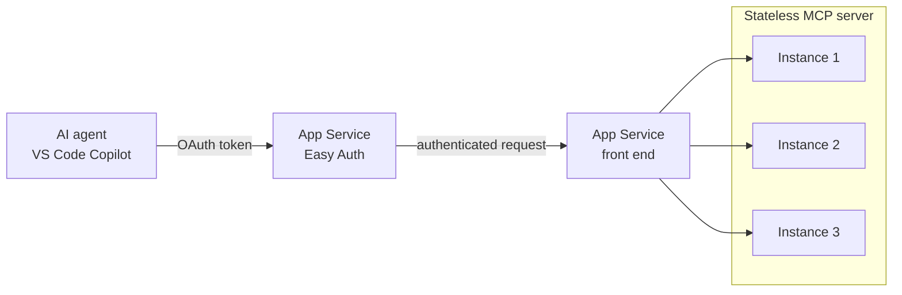

{/*
SCREENSHOT MANIFEST - capture the following and save under
static/img/labs/host-an-mcp-server/. onBrokenLinks does not fail on missing
images, so these paths can be filled in after authoring.

1. portal-create-webapp.png
   URL/blade: https://portal.azure.com > Create a resource > Web App > Basics tab
   Capture: the Basics tab with Publish = Code, Runtime stack = Node 22 LTS,
   Operating System = Linux, and a Basic B1 plan selected.

2. portal-deployment-center.png
   URL/blade: App Service > Deployment > Deployment Center
   Capture: Deployment Center configured for your source (for example, Local Git
   or GitHub) after the first successful deployment shows a green status.

3. portal-overview-domain.png
   URL/blade: App Service > Overview
   Capture: the Overview blade with the Default domain
   (for example, app-asl-mcp-xxxxxx.azurewebsites.net) highlighted.

4. portal-auth-add-provider.png
   URL/blade: App Service > Settings > Authentication > Add identity provider
   Capture: the Add an identity provider page with Identity provider = Microsoft.

5. portal-auth-provider-settings.png
   URL/blade: App Service > Settings > Authentication > Add identity provider (settings)
   Capture: App Service authentication settings showing Client secret expiration
   and the default "Require authentication" option, just before selecting Add.

6. portal-auth-allowed-clients.png
   URL/blade: App Service > Authentication > Edit identity provider > Additional checks
   Capture: "Allow requests from specific client applications" selected with the
   Visual Studio Code client ID aebc6443-996d-45c2-90f0-388ff96faa56 added.

7. portal-expose-api.png
   URL/blade: Microsoft Entra ID > App registrations > (your app) > Expose an API
   Capture: Authorized client applications with the VS Code client ID added and
   the user_impersonation scope checked; the full scope value
   api://<app-id>/user_impersonation visible.

8. portal-app-setting-prm.png
   URL/blade: App Service > Settings > Environment variables
   Capture: the new app setting WEBSITE_AUTH_PRM_DEFAULT_WITH_SCOPES with value
   api://<app-id>/user_impersonation before selecting Apply.

9. vscode-mcp-signin.png
   URL/blade: Visual Studio Code > MCP: List Servers > Start Server
   Capture: the "Authenticate with Microsoft" prompt shown when the server starts,
   confirming protected resource metadata is configured correctly.

10. vscode-copilot-tool-call.png
    URL/blade: Visual Studio Code > GitHub Copilot Chat (agent mode)
    Capture: Copilot Chat calling the roll_dice tool and returning a result.
*/}

import Tabs from '@theme/Tabs';
import TabItem from '@theme/TabItem';
import PathPicker from '@site/src/components/PathPicker';

# Host an MCP server on Azure App Service, secured with OAuth

The [Model Context Protocol (MCP)](https://modelcontextprotocol.io/) is how AI agents such as GitHub Copilot, Cursor, and Claude discover and call your tools. A *remote* MCP server exposes those tools over HTTP so any agent can reach them, from anywhere. That reach is exactly why security matters: an unauthenticated MCP server is an open door to whatever your tools can do.

Most remote MCP servers in the wild ship that door wide open. The Apps on Azure post [*Only 8.5% of MCP Servers Use OAuth - Here's How to Host One Securely on App Service*](https://azure.github.io/AppService/) makes the point plainly: the overwhelming majority of public MCP servers have no real authorization at all. This lab shows you the secure path instead.

In this lab you will:

- Build a minimal, **stateless** MCP server (Node.js/TypeScript and Python variants).
- Deploy it to Azure App Service three ways: **Azure Developer CLI (azd)**, **Azure CLI (az)**, and the **Azure portal**.
- Verify the MCP endpoint responds over HTTP.
- Secure it with **OAuth 2.0 / Microsoft Entra ID** using App Service Authentication ("Easy Auth"), and connect from Visual Studio Code.

App Service is a strong home for MCP servers: managed HTTPS, built-in OAuth through Easy Auth, autoscale, and the same deployment tooling you already use for web apps. This lab **complements** the reference docs - see [App Service as Model Context Protocol (MCP) servers](https://learn.microsoft.com/azure/app-service/scenario-ai-model-context-protocol-server) for the conceptual overview.

**Estimated time:** 30 to 45 minutes.

## Objectives

By the end of this lab you will be able to:

- Explain why an MCP server should be stateless to scale out on App Service.
- Deploy an MCP server to App Service with azd, az, or the portal.
- Confirm the server responds to an MCP `initialize` request.
- Configure Easy Auth with Microsoft Entra ID and protected resource metadata (PRM) so MCP clients can complete the OAuth flow.

## Prerequisites

- An [Azure subscription](https://azure.microsoft.com/free/). Configuring the OAuth portion requires permission to **create a Microsoft Entra ID app registration** (Application Administrator or equivalent). If you don't have that permission, ask an administrator to complete the [OAuth section](#secure-the-server-with-oauth-and-microsoft-entra-id).
- [Azure CLI](https://learn.microsoft.com/cli/azure/install-azure-cli) 2.60 or later.
- [Azure Developer CLI (azd)](https://learn.microsoft.com/azure/developer/azure-developer-cli/install-azd) 1.9 or later (for the azd path).
- One runtime for the sample:
  - [Node.js](https://nodejs.org/) 20 or later, **or**
  - [Python](https://www.python.org/downloads/) 3.10 or later.
- [Visual Studio Code](https://code.visualstudio.com/) with [GitHub Copilot](https://code.visualstudio.com/docs/copilot/overview) to test the secured server (optional but recommended).

Sign in first:

```bash
az login
azd auth login
```

## How it works, and why stateless matters

An MCP server built on the current spec speaks **Streamable HTTP**: the client sends JSON-RPC messages to a single endpoint (here, `/mcp`) with `POST`, and the server can stream responses back as Server-Sent Events (SSE) on the same connection.

Early MCP servers kept a session in memory and pinned each client to one process. That works on a single instance but breaks the moment you scale out - a request can land on any instance. The Apps on Azure post [*MCP Just Went Stateless - What the 2026 Spec Changes About Scaling on App Service*](https://azure.github.io/AppService/) describes the shift: the protocol now supports fully stateless operation, where the server holds **no** per-client session state between requests. Any instance can serve any request, so App Service [scale out](https://learn.microsoft.com/azure/app-service/manage-scale-up) just works.



The sample below follows this pattern: it creates a fresh MCP server per request and keeps nothing in memory between calls.

## The MCP server sample

<PathPicker
  description="Set these once - the sample code and every deployment step below follow your choice."
  groups={[
    { id: 'lang', label: 'Language', options: [
      { value: 'node', label: 'Node.js' },
      { value: 'python', label: 'Python' },
    ]},
    { id: 'deploy', label: 'Deploy with', options: [
      { value: 'azd', label: 'azd' },
      { value: 'az', label: 'az CLI' },
      { value: 'portal', label: 'Portal' },
    ]},
  ]}
/>

The sample exposes one trivial tool (`roll_dice`) plus a `/health` endpoint for App Service health checks. Pick your language.

<Tabs groupId="lang" queryString>
<TabItem value="node" label="Node.js / TypeScript">

Create a project with these files.

`package.json`

```json
{
  "name": "mcp-server-appservice",
  "version": "1.0.0",
  "type": "module",
  "main": "dist/server.js",
  "scripts": {
    "build": "tsc",
    "start": "node dist/server.js"
  },
  "engines": {
    "node": ">=20"
  },
  "dependencies": {
    "@modelcontextprotocol/sdk": "^1.12.0",
    "express": "^4.21.2",
    "zod": "^3.24.1"
  },
  "devDependencies": {
    "@types/express": "^4.17.21",
    "@types/node": "^22.10.0",
    "typescript": "^5.7.2"
  }
}
```

`tsconfig.json`

```json
{
  "compilerOptions": {
    "target": "ES2022",
    "module": "NodeNext",
    "moduleResolution": "NodeNext",
    "outDir": "./dist",
    "rootDir": "./src",
    "strict": true,
    "esModuleInterop": true,
    "skipLibCheck": true,
    "forceConsistentCasingInFileNames": true
  },
  "include": ["src/**/*.ts"]
}
```

`src/server.ts`

```typescript
import express, { Request, Response } from "express";
import { randomUUID } from "node:crypto";
import { McpServer } from "@modelcontextprotocol/sdk/server/mcp.js";
import { StreamableHTTPServerTransport } from "@modelcontextprotocol/sdk/server/streamableHttp.js";
import { z } from "zod";

// Build a fresh MCP server instance for every request. Keeping no state in
// the process is what lets App Service scale out: any instance can serve any
// request.
function createServer(): McpServer {
  const server = new McpServer({ name: "appservice-mcp-demo", version: "1.0.0" });

  server.tool(
    "roll_dice",
    "Roll an n-sided dice and return the result.",
    { sides: z.number().int().min(2).max(100).default(6) },
    async ({ sides }) => {
      const value = 1 + Math.floor(Math.random() * sides);
      return { content: [{ type: "text", text: `You rolled a ${value} (d${sides}).` }] };
    }
  );

  return server;
}

const app = express();
app.use(express.json());

// Health probe for App Service health check and quick smoke tests.
app.get("/health", (_req: Request, res: Response) => {
  res.status(200).json({ status: "ok" });
});

// Stateless Streamable HTTP endpoint: a new server + transport are created per
// request and disposed when the response closes.
app.post("/mcp", async (req: Request, res: Response) => {
  try {
    const server = createServer();
    const transport = new StreamableHTTPServerTransport({
      sessionIdGenerator: undefined, // stateless: no session persistence
    });
    res.on("close", () => {
      transport.close();
      server.close();
    });
    await server.connect(transport);
    await transport.handleRequest(req, res, req.body);
  } catch (err) {
    console.error("MCP request error:", err);
    if (!res.headersSent) {
      res.status(500).json({
        jsonrpc: "2.0",
        error: { code: -32603, message: "Internal server error" },
        id: null,
      });
    }
  }
});

// In stateless mode the server does not support GET streaming or DELETE.
const rejectStateless = (_req: Request, res: Response) => {
  res.status(405).json({
    jsonrpc: "2.0",
    error: { code: -32000, message: "Method not allowed in stateless mode." },
    id: randomUUID(),
  });
};
app.get("/mcp", rejectStateless);
app.delete("/mcp", rejectStateless);

const port = Number(process.env.PORT) || 3000;
app.listen(port, () => console.log(`MCP server listening on port ${port}`));
```

Install and build:

```bash
npm install
npm run build
```

Run it locally to confirm it works:

```bash
node dist/server.js
# In another terminal:
curl http://localhost:3000/health
```

:::tip Windows vs Linux
The Node.js sample runs on both **Windows** and **Linux** App Service plans. The Python variant below is **Linux only** - Python is not a built-in Windows App Service stack.
:::

</TabItem>
<TabItem value="python" label="Python">

Create a project with these files.

`requirements.txt`

```text
mcp>=1.12.0
```

`app.py`

```python
import os
import random

from mcp.server.fastmcp import FastMCP
from mcp.server.transport_security import TransportSecuritySettings
from starlette.requests import Request
from starlette.responses import JSONResponse

# FastMCP enables DNS-rebinding protection and, by default, only trusts
# localhost. On App Service the request Host header is <app>.azurewebsites.net,
# which would otherwise be rejected with HTTP 421 "Invalid Host header".
# App Service exposes that hostname as WEBSITE_HOSTNAME, so add it (plus
# localhost for local runs) to the allowed hosts.
allowed_hosts = ["localhost", "localhost:*", "127.0.0.1", "127.0.0.1:*"]
website_hostname = os.environ.get("WEBSITE_HOSTNAME")
if website_hostname:
    allowed_hosts += [website_hostname, f"{website_hostname}:*"]

security = TransportSecuritySettings(allowed_hosts=allowed_hosts)

# stateless_http=True keeps no session state in memory, so any App Service
# instance can serve any request when you scale out.
mcp = FastMCP("appservice-mcp-demo", stateless_http=True, transport_security=security)


@mcp.tool()
def roll_dice(sides: int = 6) -> str:
    """Roll an n-sided dice and return the result."""
    value = random.randint(1, sides)
    return f"You rolled a {value} (d{sides})."


# Health probe for App Service health check and quick smoke tests.
@mcp.custom_route("/health", methods=["GET"])
async def health(_request: Request) -> JSONResponse:
    return JSONResponse({"status": "ok"})


if __name__ == "__main__":
    # FastMCP serves the Streamable HTTP endpoint at /mcp.
    mcp.settings.host = "0.0.0.0"
    mcp.settings.port = int(os.environ.get("PORT", 8000))
    mcp.run(transport="streamable-http")
```

Install and run locally:

```bash
python -m venv .venv
source .venv/bin/activate   # Windows: .venv\Scripts\activate
pip install -r requirements.txt
python app.py
# In another terminal:
curl http://localhost:8000/health
```

The App Service **startup command** for this app is `python app.py`.

:::note Linux only
Python App Service apps run on **Linux** plans only. If you need Windows, use the Node.js variant.
:::

</TabItem>
</Tabs>

## Deploy to App Service

Choose one deployment mechanism. All three create a Linux App Service on a low-cost **B1** plan with **Always On** enabled (streaming responses need a tier that supports Always On; avoid the Free F1 tier for MCP).

<Tabs groupId="deploy" queryString>
<TabItem value="azd" label="Azure Developer CLI (azd)">

The Azure Developer CLI provisions infrastructure and deploys code in one step. Add these files to your project.

`azure.yaml`

```yaml
# yaml-language-server: $schema=https://raw.githubusercontent.com/Azure/azure-dev/main/schemas/v1.0/azure.yaml.json
name: mcp-server-appservice
services:
  web:
    project: .
    language: js   # use "py" for the Python variant
    host: appservice
```

`infra/main.bicep`

```bicep
targetScope = 'subscription'

param resourceGroupName string
param location string
param webAppName string
param appServicePlanName string

resource rg 'Microsoft.Resources/resourceGroups@2024-03-01' = {
  name: resourceGroupName
  location: location
}

module app 'app.bicep' = {
  name: 'mcp-app'
  scope: rg
  params: {
    location: location
    webAppName: webAppName
    appServicePlanName: appServicePlanName
  }
}

output webAppHostName string = app.outputs.webAppHostName
```

`infra/app.bicep`

```bicep
param location string
param webAppName string
param appServicePlanName string

resource plan 'Microsoft.Web/serverfarms@2023-12-01' = {
  name: appServicePlanName
  location: location
  sku: { name: 'B1', tier: 'Basic' }
  kind: 'linux'
  properties: { reserved: true }
}

resource webApp 'Microsoft.Web/sites@2023-12-01' = {
  name: webAppName
  location: location
  tags: { 'azd-service-name': 'web' }
  properties: {
    serverFarmId: plan.id
    httpsOnly: true
    siteConfig: {
      linuxFxVersion: 'NODE|22-lts'      // use 'PYTHON|3.12' for Python
      alwaysOn: true
      minTlsVersion: '1.2'
      healthCheckPath: '/health'
      appCommandLine: 'node dist/server.js' // use 'python app.py' for Python
      appSettings: [
        { name: 'SCM_DO_BUILD_DURING_DEPLOYMENT', value: 'true' }
      ]
    }
  }
}

output webAppHostName string = webApp.properties.defaultHostName
```

`infra/main.parameters.json`

```json
{
  "$schema": "https://schema.management.azure.com/schemas/2019-04-01/deploymentParameters.json#",
  "contentVersion": "1.0.0.0",
  "parameters": {
    "resourceGroupName": { "value": "${AZURE_RESOURCE_GROUP}" },
    "location": { "value": "${AZURE_LOCATION}" },
    "webAppName": { "value": "${WEB_APP_NAME}" },
    "appServicePlanName": { "value": "${APP_SERVICE_PLAN_NAME}" }
  }
}
```

Create an environment and set names. Use a unique suffix so the app's hostname is globally unique:

```bash
SUFFIX=$(openssl rand -hex 3)   # 6 lowercase hex chars
azd env new asl-mcp --location eastus --subscription <your-subscription-id>
azd env set AZURE_RESOURCE_GROUP "rg-asl-mcp-${SUFFIX}"
azd env set WEB_APP_NAME "app-asl-mcp-${SUFFIX}"
azd env set APP_SERVICE_PLAN_NAME "plan-asl-mcp-${SUFFIX}"
```

Provision and deploy:

```bash
azd up
```

When it finishes, azd prints the endpoint, for example:

```text
Endpoint: https://app-asl-mcp-xxxxxx.azurewebsites.net/
SUCCESS: Your application was deployed to Azure in 5 minutes 48 seconds.
```

:::note First deploy
On the very first `azd up`, azd occasionally reports it can't find the tagged resource because provisioning outputs aren't cached yet. If that happens, simply run `azd deploy` once more - the resources already exist and the code deploy completes.
:::

</TabItem>
<TabItem value="az" label="Azure CLI (az)">

Create the resources, configure the app, then deploy the code as a zip. App Service builds the code remotely because `SCM_DO_BUILD_DURING_DEPLOYMENT=true` is set.

```bash
SUFFIX=$(openssl rand -hex 3)
export RG="rg-asl-mcp-${SUFFIX}"
export PLAN="plan-asl-mcp-${SUFFIX}"
export APP="app-asl-mcp-${SUFFIX}"
export LOCATION=eastus

az group create --name "$RG" --location "$LOCATION"
az appservice plan create --resource-group "$RG" --name "$PLAN" --is-linux --sku B1
az webapp create --resource-group "$RG" --plan "$PLAN" --name "$APP" --runtime "NODE|22-lts"
```

Configure build, startup, Always On, and the health check path:

```bash
az webapp config appsettings set --resource-group "$RG" --name "$APP" \
  --settings SCM_DO_BUILD_DURING_DEPLOYMENT=true

az webapp config set --resource-group "$RG" --name "$APP" \
  --startup-file "node dist/server.js" --always-on true

az webapp config set --resource-group "$RG" --name "$APP" \
  --generic-configurations '{"healthCheckPath":"/health"}'
```

Package the source (App Service compiles it) and deploy:

```bash
zip -r app.zip package.json package-lock.json tsconfig.json src
az webapp deploy --resource-group "$RG" --name "$APP" --src-path app.zip --type zip
```

:::note Deploy timeout
The remote build can take a few minutes. If `az webapp deploy` returns a `504 GatewayTimeout`, the build is usually still finishing - wait a minute and check the endpoint. It succeeds even when the client-side poll times out.
:::

For the Python variant, use `--runtime "PYTHON|3.12"`, set `--startup-file "python app.py"`, and zip `app.py requirements.txt`.

Get the hostname:

```bash
az webapp show --resource-group "$RG" --name "$APP" --query defaultHostName --output tsv
```

</TabItem>
<TabItem value="portal" label="Azure portal">

1. In the [Azure portal](https://portal.azure.com), select **Create a resource** > **Web App**.
2. On the **Basics** tab, set:
   - **Publish**: **Code**
   - **Runtime stack**: **Node 22 LTS** (or **Python 3.12**)
   - **Operating System**: **Linux**
   - **Pricing plan**: create or select a **Basic B1** plan.

   

3. Select **Review + create**, then **Create**. Wait for deployment to finish.
4. Go to the new app > **Settings** > **Configuration** (or **Environment variables**) and add the app setting **SCM_DO_BUILD_DURING_DEPLOYMENT** = **true**.
5. Under **Settings** > **Configuration** > **General settings**, set the **Startup Command** to `node dist/server.js` (or `python app.py`), turn **Always On** to **On**, and set the **Health check** path to `/health`.
6. Under **Deployment** > **Deployment Center**, connect a source (for example, **Local Git** or **GitHub**) and push your code. App Service builds and starts the app.

   

7. On the app's **Overview** page, copy the **Default domain**.

   

</TabItem>
</Tabs>

## Verify the server

Set `APP_URL` to your app's hostname, then test the health and MCP endpoints:

```bash
export APP_URL="https://app-asl-mcp-xxxxxx.azurewebsites.net"

# 1) Health check
curl -i "$APP_URL/health"

# 2) MCP initialize - the core protocol handshake
curl -s -X POST "$APP_URL/mcp" \
  -H "Content-Type: application/json" \
  -H "Accept: application/json, text/event-stream" \
  -d '{"jsonrpc":"2.0","id":1,"method":"initialize","params":{"protocolVersion":"2024-11-05","capabilities":{},"clientInfo":{"name":"curl","version":"1.0"}}}'
```

Expected results:

```text
HTTP/1.1 200 OK
{"status":"ok"}
```

```text
event: message
data: {"result":{"protocolVersion":"2024-11-05","capabilities":{"tools":{"listChanged":true}},"serverInfo":{"name":"appservice-mcp-demo","version":"1.0.0"}},"jsonrpc":"2.0","id":1}
```

A `200` with a `serverInfo` payload confirms the MCP endpoint is live. You can also list tools:

```bash
curl -s -X POST "$APP_URL/mcp" \
  -H "Content-Type: application/json" \
  -H "Accept: application/json, text/event-stream" \
  -d '{"jsonrpc":"2.0","id":2,"method":"tools/list","params":{}}'
```

## Secure the server with OAuth and Microsoft Entra ID

Right now the endpoint is open. App Service Authentication ("Easy Auth") adds an OAuth 2.0 / OpenID Connect gate in front of your app with **no code changes**. Combined with protected resource metadata (PRM), MCP clients such as Visual Studio Code can discover the authorization server and complete the sign-in flow automatically.

:::warning Corporate tenant and admin consent
Enabling a Microsoft identity provider **creates a Microsoft Entra ID app registration** and may require administrator consent in your tenant. The app-registration and consent steps below are marked **[Manual / admin]**. If you can't create app registrations, ask an administrator to complete them. This lab live-tested only the App Service hosting and endpoint reachability; the app-registration and consent flow must be verified in your own tenant.
:::

### Step 1 - Enable Microsoft Entra authentication  **[Manual / admin]**

1. In the portal, go to your App Service app > **Settings** > **Authentication** > **Add identity provider**.
2. Select **Microsoft** as the identity provider.
3. For **Client secret expiration**, choose a period (for example, **6 months**).
4. Accept the defaults and select **Add**. This creates an app registration and configures the app to require authentication.


### Step 2 - Allow the Visual Studio Code client  **[Manual / admin]**

1. On the **Authentication** page, select **Edit** (pencil) next to the Microsoft provider.
2. Under **Additional checks** > **Client application requirement**, select **Allow requests from specific client applications**.
3. Add the Visual Studio Code client ID: `aebc6443-996d-45c2-90f0-388ff96faa56`.
4. Select **OK**, then **Save**.


### Step 3 - Expose the API to Visual Studio Code  **[Manual / admin]**

1. On the **Authentication** page, select the Microsoft provider to open its app registration.
2. Select **Manage** > **Expose an API**.
3. Under **Authorized client applications**, select **Add a client application**.
4. Enter the Visual Studio Code client ID `aebc6443-996d-45c2-90f0-388ff96faa56`, check the **user_impersonation** scope, and select **Add application**.
5. Copy the full scope value; it looks like `api://<app-registration-app-id>/user_impersonation`.


### Step 4 - Publish protected resource metadata

Setting the authorization scope in an app setting turns on the `/.well-known/oauth-protected-resource` endpoint, which is how MCP clients discover your authorization requirements.

1. Go to your App Service app > **Settings** > **Environment variables**.
2. Add a setting named `WEBSITE_AUTH_PRM_DEFAULT_WITH_SCOPES` with the scope value you copied, for example `api://<app-registration-app-id>/user_impersonation`.
3. Select **Apply** to save and restart the app.


You can set the same app setting from the CLI:

```bash
az webapp config appsettings set --resource-group "$RG" --name "$APP" \
  --settings WEBSITE_AUTH_PRM_DEFAULT_WITH_SCOPES="api://<app-registration-app-id>/user_impersonation"
```

### Step 5 - Connect from Visual Studio Code

1. In your workspace, create `.vscode/mcp.json`:

   ```json
   {
     "servers": {
       "my-app-service-mcp": {
         "type": "http",
         "url": "https://app-asl-mcp-xxxxxx.azurewebsites.net/mcp"
       }
     }
   }
   ```

2. Open the Command Palette, run **MCP: List Servers**, select your server, and choose **Start Server**.
3. VS Code prompts you to **authenticate with Microsoft**. Complete the sign-in.

   

4. In GitHub Copilot Chat (agent mode), try the tool:

   ```text
   Roll a 20-sided dice.
   ```

   

:::tip Troubleshooting the auth prompt
If VS Code prompts you to authenticate against `https://<your-app>.azurewebsites.net/authorize` instead of Microsoft, the PRM isn't configured. Confirm `WEBSITE_AUTH_PRM_DEFAULT_WITH_SCOPES` is set to the full `api://.../user_impersonation` scope and that the app fully restarted. See [Secure MCP calls with Microsoft Entra authentication](https://learn.microsoft.com/azure/app-service/configure-authentication-mcp-server-vscode#troubleshooting).
:::

## Clean up resources

To avoid ongoing charges, delete the resource group when you're done:

```bash
az group delete --name "$RG" --yes --no-wait
```

If you deployed with azd, you can instead run:

```bash
azd down --force --purge
```

## Summary

You built a stateless MCP server, deployed it to Azure App Service with azd, the Azure CLI, and the portal, and confirmed the `/mcp` endpoint answered an `initialize` request over HTTPS. You then secured it with OAuth 2.0 / Microsoft Entra ID using Easy Auth and protected resource metadata, so MCP clients like Visual Studio Code sign in before calling your tools. The stateless design means you can scale the app out on App Service without pinning clients to a single instance - the shift that makes remote MCP servers production-ready.

## Learn more

- [App Service as Model Context Protocol (MCP) servers](https://learn.microsoft.com/azure/app-service/scenario-ai-model-context-protocol-server)
- [Integrate an App Service app as an MCP Server for GitHub Copilot Chat (Node.js)](https://learn.microsoft.com/azure/app-service/tutorial-ai-model-context-protocol-server-node)
- [Secure MCP calls to App Service from VS Code with Microsoft Entra authentication](https://learn.microsoft.com/azure/app-service/configure-authentication-mcp-server-vscode)
- [Authentication and authorization in App Service (Easy Auth)](https://learn.microsoft.com/azure/app-service/overview-authentication-authorization)
- [Configure a Node.js app for App Service](https://learn.microsoft.com/azure/app-service/configure-language-nodejs)
- [Scale up an app in App Service](https://learn.microsoft.com/azure/app-service/manage-scale-up)
- [Model Context Protocol specification](https://modelcontextprotocol.io/specification)
- Apps on Azure blog: [*Only 8.5% of MCP Servers Use OAuth - Here's How to Host One Securely on App Service*](https://azure.github.io/AppService/) and [*MCP Just Went Stateless - What the 2026 Spec Changes About Scaling on App Service*](https://azure.github.io/AppService/)
- Back to the [Scenarios & Modern Apps overview](./overview.md)
