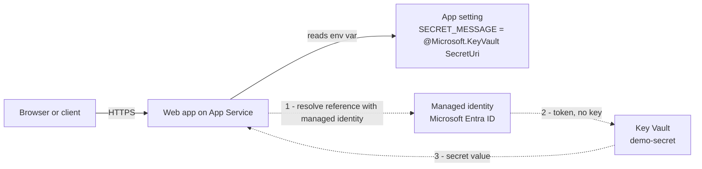

import Tabs from '@theme/Tabs';
import TabItem from '@theme/TabItem';
import PathPicker from '@site/src/components/PathPicker';
import Prerequisites from '@site/src/components/SharedMarkdown/_prerequisites.mdx';
import Cleanup from '@site/src/components/SharedMarkdown/_cleanup.mdx';

# Reference Key Vault secrets from App Service

Apps need secrets - a database password, an API token, a signing key. The tempting shortcut is to paste the secret straight into an app setting, but then the raw value lives in your configuration, shows up in exports, and has to be rotated by hand everywhere it was copied. This lab shows the recommended pattern instead: store the secret in [Azure Key Vault](https://learn.microsoft.com/azure/key-vault/general/overview), and point an app setting at it with a **Key Vault reference**. [Azure App Service](https://learn.microsoft.com/azure/app-service/overview) resolves the reference at runtime using the app's **managed identity**, so your app reads the secret as an ordinary environment variable - with no key, secret, or vault SDK in your code.

In this lab you will:

- Deploy a small web app that echoes a secret it reads from an environment variable (Python, Node.js, and Java are fully worked, with snippets for .NET and PHP).
- Create a Key Vault in **RBAC authorization** mode and add a secret.
- Turn on the app's **system-assigned managed identity** and grant it the **Key Vault Secrets User** role.
- Add an app setting whose value is a Key Vault reference: `@Microsoft.KeyVault(SecretUri=...)`.
- Deploy three ways - **Azure Developer CLI (azd)**, **Azure CLI (az)**, and the **Azure portal** - and confirm the app serves the resolved secret with no secret in code or configuration.

This is the keyless, no-secrets-in-config pattern. The secret value lives only in Key Vault; your configuration holds a reference, and only the app's identity can read it.

:::info App Service Labs complements Microsoft Learn
This lab is a hands-on, end-to-end walkthrough. For reference depth on any concept, follow the "Learn more" links to the official Microsoft Learn documentation.
:::

**Estimated time:** 30 to 40 minutes.

## Objectives

By the end of this lab you will be able to:

- Explain why a Key Vault reference is safer than storing a secret in an app setting.
- Create a Key Vault in RBAC authorization mode and store a secret.
- Turn on a managed identity and grant it read access to secrets with the Key Vault Secrets User role.
- Wire an app setting to a Key Vault reference and confirm App Service resolves it.

<Prerequisites
  tools={[
    { name: 'Azure Developer CLI (azd)', url: 'https://learn.microsoft.com/azure/developer/azure-developer-cli/install-azd' },
    { name: 'The SDK or runtime for your chosen language', description: '(.NET SDK, Node.js, Python, JDK + Maven, or PHP)' },
  ]}
/>

You also need permission to **create role assignments** on the Key Vault (Owner, or User Access Administrator on the vault). Granting the managed identity its role, and granting yourself access to write the secret, both require this.

:::tip Choose a region and low-cost tier
This lab uses the **East US** region and the **B1 (Basic)** App Service plan - a low-cost Linux plan (about USD 13/month) that is ideal for learning. Key Vault standard secrets are billed per 10,000 operations and cost almost nothing for this lab. Delete the resources when you are done (see [Clean up](#cleanup)) to stop charges.
:::

## How a Key Vault reference works

App Service reads a Key Vault reference for you. When an app setting's value looks like `@Microsoft.KeyVault(SecretUri=...)`, App Service uses the app's managed identity to fetch the secret from Key Vault and injects the resolved value into the app as a normal environment variable. Your code never sees the vault, the reference syntax, or a key - it just reads `os.environ["SECRET_MESSAGE"]` (or the equivalent) like any other setting.



Two things make this keyless and safe:

- The Key Vault uses **RBAC authorization** (not access policies), so access is granted with standard Azure roles. The app's identity gets exactly one role: **Key Vault Secrets User**, which allows reading secret values and nothing else.
- The secret value is **never** stored in your app configuration. The app setting holds only the reference. Anyone who reads your configuration sees `@Microsoft.KeyVault(SecretUri=...)`, not the secret.

## The app sample

<PathPicker
  description="Set these once - the sample code and every deployment step below follow your choice."
  groups={[
    { id: 'language', label: 'Language', options: [
      { value: 'python', label: 'Python' },
      { value: 'node', label: 'Node.js' },
      { value: 'dotnet', label: '.NET' },
      { value: 'java', label: 'Java' },
      { value: 'php', label: 'PHP' },
    ]},
    { id: 'tooling', label: 'Deploy with', options: [
      { value: 'azd', label: 'azd' },
      { value: 'az', label: 'az CLI' },
      { value: 'portal', label: 'Portal' },
    ]},
  ]}
/>

The sample exposes a `/health` endpoint for App Service health checks and a `/secret` endpoint that returns the value it read from the `SECRET_MESSAGE` environment variable. Because a Key Vault reference resolves to a plain environment variable, the app is identical to one that reads any other app setting - there is no Key Vault code. Pick your language.

<Tabs groupId="language" queryString>
<TabItem value="python" label="Python">

Create a project with these two files.

`requirements.txt`

```text
flask
gunicorn
```

`app.py`

```python
import os

from flask import Flask, jsonify

app = Flask(__name__)


@app.route("/health")
def health():
    return jsonify(status="ok")


@app.route("/")
def home():
    return (
        "<h1>Key Vault reference demo on Azure App Service</h1>"
        "<p>GET <code>/secret</code> to see the value resolved from Key Vault.</p>"
    )


@app.route("/secret")
def secret():
    # SECRET_MESSAGE is populated by a Key Vault reference app setting.
    # The app reads it as a normal environment variable - no key or secret in code.
    value = os.environ.get("SECRET_MESSAGE", "<not set>")
    return jsonify(secretMessage=value, source="Key Vault reference via managed identity")


if __name__ == "__main__":
    app.run(host="0.0.0.0", port=int(os.environ.get("PORT", 8000)))
```

</TabItem>
<TabItem value="node" label="Node.js">

Create a project with these two files.

`package.json`

```json
{
  "name": "kvref-appservice",
  "version": "1.0.0",
  "main": "server.js",
  "scripts": { "start": "node server.js" },
  "dependencies": { "express": "^4.19.2" }
}
```

`server.js`

```javascript
const express = require("express");
const app = express();

app.get("/health", (_req, res) => res.json({ status: "ok" }));

app.get("/", (_req, res) =>
  res.send(
    "<h1>Key Vault reference demo on Azure App Service</h1>" +
      "<p>GET <code>/secret</code> to see the value resolved from Key Vault.</p>"
  )
);

app.get("/secret", (_req, res) => {
  // SECRET_MESSAGE is populated by a Key Vault reference app setting.
  // The app reads it as a normal environment variable - no key or secret in code.
  const value = process.env.SECRET_MESSAGE || "<not set>";
  res.json({ secretMessage: value, source: "Key Vault reference via managed identity" });
});

const port = process.env.PORT || 3000;
app.listen(port, () => console.log(`Listening on ${port}`));
```

</TabItem>
<TabItem value="dotnet" label=".NET">

There is no Key Vault code - the reference resolves to an environment variable that the standard configuration provider already reads. A minimal API `Program.cs`:

```csharp
var builder = WebApplication.CreateBuilder(args);
var app = builder.Build();

app.MapGet("/health", () => Results.Json(new { status = "ok" }));

// SECRET_MESSAGE arrives as a normal configuration value - no key or secret in code.
app.MapGet("/secret", (IConfiguration config) =>
    Results.Json(new
    {
        secretMessage = config["SECRET_MESSAGE"] ?? "<not set>",
        source = "Key Vault reference via managed identity",
    }));

app.Run();
```

For the deployment steps, use `az webapp create --runtime "DOTNETCORE:8.0"` (Linux) or `"dotnet:8"` (Windows).

</TabItem>
<TabItem value="java" label="Java">

A Key Vault reference is just an environment variable, so `System.getenv` reads it directly. This is a complete, runnable Spring Boot app. Create these three files.

`pom.xml`

```xml
<?xml version="1.0" encoding="UTF-8"?>
<project xmlns="http://maven.apache.org/POM/4.0.0"
         xmlns:xsi="http://www.w3.org/2001/XMLSchema-instance"
         xsi:schemaLocation="http://maven.apache.org/POM/4.0.0 https://maven.apache.org/xsd/maven-4.0.0.xsd">
  <modelVersion>4.0.0</modelVersion>

  <parent>
    <groupId>org.springframework.boot</groupId>
    <artifactId>spring-boot-starter-parent</artifactId>
    <version>3.3.5</version>
    <relativePath/>
  </parent>

  <groupId>com.example</groupId>
  <artifactId>kvref</artifactId>
  <version>1.0.0</version>
  <packaging>jar</packaging>

  <properties>
    <java.version>17</java.version>
  </properties>

  <dependencies>
    <dependency>
      <groupId>org.springframework.boot</groupId>
      <artifactId>spring-boot-starter-web</artifactId>
    </dependency>
  </dependencies>

  <build>
    <!-- Produces a runnable target/app.jar that App Service starts with java -jar. -->
    <finalName>app</finalName>
    <plugins>
      <plugin>
        <groupId>org.springframework.boot</groupId>
        <artifactId>spring-boot-maven-plugin</artifactId>
      </plugin>
    </plugins>
  </build>
</project>
```

`src/main/java/com/example/kvref/Application.java`

```java
package com.example.kvref;

import org.springframework.boot.SpringApplication;
import org.springframework.boot.autoconfigure.SpringBootApplication;
import org.springframework.web.bind.annotation.GetMapping;
import org.springframework.web.bind.annotation.RestController;

import java.util.Map;

@SpringBootApplication
@RestController
public class Application {

    public static void main(String[] args) {
        SpringApplication.run(Application.class, args);
    }

    @GetMapping("/health")
    public Map<String, String> health() {
        return Map.of("status", "ok");
    }

    @GetMapping("/")
    public String home() {
        return "<h1>Key Vault reference demo on Azure App Service</h1>"
            + "<p>GET <code>/secret</code> to see the value resolved from Key Vault.</p>";
    }

    // SECRET_MESSAGE arrives as a normal environment variable - no key or secret in code.
    @GetMapping("/secret")
    public Map<String, String> secret() {
        String value = System.getenv().getOrDefault("SECRET_MESSAGE", "<not set>");
        return Map.of("secretMessage", value, "source", "Key Vault reference via managed identity");
    }
}
```

`src/main/resources/application.properties`

```properties
# App Service Linux sets the PORT environment variable; listen on it (8080 locally).
server.port=${PORT:8080}
```

Build the runnable JAR (produces `target/app.jar`). The deployment steps below use a Java 17 runtime and deploy this JAR:

```bash
mvn -DskipTests package
```

</TabItem>
<TabItem value="php" label="PHP">

PHP reads the resolved reference with `getenv` - again, no Key Vault code. An `index.php`:

```php
<?php
$path = $_SERVER["REQUEST_URI"] ?? "/";
header("Content-Type: application/json");

if ($path === "/health") {
    echo json_encode(["status" => "ok"]);
    exit;
}

// SECRET_MESSAGE arrives as a normal environment variable - no key or secret in code.
$value = getenv("SECRET_MESSAGE") ?: "<not set>";
echo json_encode([
    "secretMessage" => $value,
    "source" => "Key Vault reference via managed identity",
]);
```

PHP is supported on **Linux** plans only. Use a PHP runtime such as `PHP:8.3` in the deployment steps.

</TabItem>
</Tabs>

## Create the resources and wire up the reference

Choose one path. All three create a **B1 Linux** App Service, a Key Vault in **RBAC authorization** mode with a secret named `demo-secret`, turn on the app's **system-assigned managed identity**, grant it the **Key Vault Secrets User** role, and set an app setting to the Key Vault reference. The demo secret value is a throwaway string; never use a real secret in a lab.

<Tabs groupId="tooling" queryString>
<TabItem value="azd" label="Azure Developer CLI (azd)">

The Azure Developer CLI provisions everything - the App Service, the Key Vault, the secret, the managed identity, and the role assignment - then deploys your code in one step. Add these files to your project.

`azure.yaml`

```yaml
# yaml-language-server: $schema=https://raw.githubusercontent.com/Azure/azure-dev/main/schemas/v1.0/azure.yaml.json
name: keyvault-references-appservice
services:
  web:
    project: .
    language: py   # use "js" for the Node.js variant
    host: appservice
```

`infra/main.bicep`

```bicep
targetScope = 'subscription'

param resourceGroupName string
param location string
param appServicePlanName string
param webAppName string
param keyVaultName string
param secretName string = 'demo-secret'
@secure()
param secretValue string

resource rg 'Microsoft.Resources/resourceGroups@2024-03-01' = {
  name: resourceGroupName
  location: location
}

module resources 'resources.bicep' = {
  name: 'kvref-resources'
  scope: rg
  params: {
    location: location
    appServicePlanName: appServicePlanName
    webAppName: webAppName
    keyVaultName: keyVaultName
    secretName: secretName
    secretValue: secretValue
  }
}

output WEB_URI string = resources.outputs.webUri
output KEY_VAULT_NAME string = keyVaultName
```

`infra/resources.bicep`

```bicep
param location string
param appServicePlanName string
param webAppName string
param keyVaultName string
param secretName string = 'demo-secret'
@secure()
param secretValue string

// Role definition ID for "Key Vault Secrets User" (read secret values only).
var keyVaultSecretsUserRoleId = '4633458b-17de-408a-b874-0445c86b69e6'

resource plan 'Microsoft.Web/serverfarms@2023-12-01' = {
  name: appServicePlanName
  location: location
  sku: { name: 'B1', tier: 'Basic' }
  kind: 'linux'
  properties: { reserved: true }
}

// Key Vault in RBAC authorization mode (no access policies).
resource vault 'Microsoft.KeyVault/vaults@2023-07-01' = {
  name: keyVaultName
  location: location
  properties: {
    tenantId: subscription().tenantId
    sku: { family: 'A', name: 'standard' }
    enableRbacAuthorization: true
  }
}

// Creating a secret through Bicep is a management-plane (ARM) operation, so the
// deploying identity needs Contributor on the vault - not a data-plane role.
resource secret 'Microsoft.KeyVault/vaults/secrets@2023-07-01' = {
  parent: vault
  name: secretName
  properties: {
    value: secretValue
  }
}

resource web 'Microsoft.Web/sites@2023-12-01' = {
  name: webAppName
  location: location
  kind: 'app,linux'
  tags: { 'azd-service-name': 'web' }
  identity: { type: 'SystemAssigned' }
  properties: {
    serverFarmId: plan.id
    httpsOnly: true
    siteConfig: {
      linuxFxVersion: 'PYTHON|3.12'   // use 'NODE|22-lts' for Node.js
      alwaysOn: true
      minTlsVersion: '1.2'
      healthCheckPath: '/health'
      appCommandLine: 'gunicorn --bind=0.0.0.0 --timeout 600 app:app'  // Node.js: leave empty (uses npm start)
      appSettings: [
        { name: 'SCM_DO_BUILD_DURING_DEPLOYMENT', value: 'true' }
        // Key Vault reference: App Service resolves this with the app's managed
        // identity at runtime. No secret value is stored in configuration.
        { name: 'SECRET_MESSAGE', value: '@Microsoft.KeyVault(SecretUri=${vault.properties.vaultUri}secrets/${secretName}/)' }
      ]
    }
  }
}

// Grant the web app's managed identity keyless read access to secrets.
resource roleAssignment 'Microsoft.Authorization/roleAssignments@2022-04-01' = {
  name: guid(vault.id, web.id, keyVaultSecretsUserRoleId)
  scope: vault
  properties: {
    principalId: web.identity.principalId
    roleDefinitionId: subscriptionResourceId('Microsoft.Authorization/roleDefinitions', keyVaultSecretsUserRoleId)
    principalType: 'ServicePrincipal'
  }
}

output webUri string = 'https://${web.properties.defaultHostName}'
```

`infra/main.parameters.json`

```json
{
  "$schema": "https://schema.management.azure.com/schemas/2019-04-01/deploymentParameters.json#",
  "contentVersion": "1.0.0.0",
  "parameters": {
    "resourceGroupName": { "value": "${AZURE_RESOURCE_GROUP}" },
    "location": { "value": "${AZURE_LOCATION}" },
    "appServicePlanName": { "value": "${APP_SERVICE_PLAN_NAME}" },
    "webAppName": { "value": "${WEB_APP_NAME}" },
    "keyVaultName": { "value": "${KEY_VAULT_NAME}" },
    "secretName": { "value": "${SECRET_NAME=demo-secret}" },
    "secretValue": { "value": "${SECRET_VALUE}" }
  }
}
```

:::note For Node.js, use these azd settings
The files above show Python. For the Node.js sample from the **Node.js** tab, change three values before you run `azd up`:

- **`azure.yaml`** - set `language: js`.
- **`infra/resources.bicep`** - set `linuxFxVersion: 'NODE|22-lts'` and remove the `appCommandLine` line so App Service runs `npm start`.

`SCM_DO_BUILD_DURING_DEPLOYMENT` stays `'true'` - App Service runs `npm install` on deploy.
:::

:::note For Java, use these azd settings
Java is deployed as a prebuilt JAR, so the azd config differs from Python and Node.js. Use the complete Spring Boot sample from the **Java** tab above, then:

- **`azure.yaml`** - set `language: java` and build the JAR in a `prepackage` hook, deploying only the JAR:

  ```yaml
  services:
    web:
      project: .
      language: java
      host: appservice
      dist: dist
      hooks:
        prepackage:
          shell: sh
          run: mvn -q -DskipTests package && rm -rf dist && mkdir dist && cp target/app.jar dist/app.jar
  ```

- **`infra/resources.bicep`** - set the runtime to Java 17, remove the `appCommandLine` line (App Service runs the JAR with `java -jar`), and set `SCM_DO_BUILD_DURING_DEPLOYMENT` to `'false'` because you deploy a prebuilt JAR:

  ```bicep
  linuxFxVersion: 'JAVA|17-java17'
  // no appCommandLine for a Java SE app
  ```

The `SUFFIX` and `azd env set` commands below are identical for every language.
:::

Create an environment and set names. Use a unique suffix so the App Service hostname and vault name are globally unique:

```bash
SUFFIX=$(openssl rand -hex 3)
azd env new kvref --location eastus --subscription <your-subscription-id>
azd env set AZURE_RESOURCE_GROUP "rg-asl-kvref-${SUFFIX}"
azd env set APP_SERVICE_PLAN_NAME "plan-asl-kvref-${SUFFIX}"
azd env set WEB_APP_NAME "app-asl-kvref-${SUFFIX}"
azd env set KEY_VAULT_NAME "kv-asl-${SUFFIX}"
azd env set SECRET_NAME "demo-secret"
azd env set SECRET_VALUE "keyless-hello-from-key-vault"
```

Provision and deploy:

```bash
azd up
```

When it finishes, azd prints the app URL, for example:

```text
Endpoint: https://app-asl-kvref-xxxxxx.azurewebsites.net/
SUCCESS: Your application was deployed to Azure in 5 minutes 40 seconds.
```

Because the role assignment and the reference are both in the Bicep, the reference resolves as soon as the app starts - no extra steps. Skip to [Verify the app](#verify-the-app).

:::note First deploy
On the very first `azd up`, azd occasionally reports it cannot find the tagged resource because provisioning outputs are not cached yet. If that happens, run `azd deploy` once more - the resources already exist and the code deploy completes.
:::

</TabItem>
<TabItem value="az" label="Azure CLI (az)">

Set names once. Use a unique suffix so the hostname and vault name are globally unique:

```bash
SUFFIX=$(openssl rand -hex 3)
export RG_NAME="rg-asl-kvref-${SUFFIX}"
export LOCATION=eastus
export PLAN="plan-asl-kvref-${SUFFIX}"
export APP="app-asl-kvref-${SUFFIX}"
export VAULT="kv-asl-${SUFFIX}"
export SECRET_NAME="demo-secret"
```

Create the resource group, the B1 Linux plan, and the web app (Python 3.12 shown; for Node.js use `NODE:22-lts`, for Java use `JAVA:17-java17`):

```bash
az group create --name "$RG_NAME" --location "$LOCATION"

az appservice plan create --resource-group "$RG_NAME" --name "$PLAN" --is-linux --sku B1

az webapp create --resource-group "$RG_NAME" --plan "$PLAN" --name "$APP" --runtime "PYTHON:3.12"
```

:::note Java runtime on older Azure CLI
If `--runtime "JAVA:17-java17"` reports the runtime is not supported, your Azure CLI's bundled runtime list is out of date - App Service still supports Java 17. Create the app with a listed runtime and then set Java 17 directly:

```bash
az webapp config set --resource-group "$RG_NAME" --name "$APP" \
  --linux-fx-version "JAVA|17-java17"
```
:::

Turn on the system-assigned managed identity and capture its principal ID:

```bash
PRINCIPAL_ID=$(az webapp identity assign --resource-group "$RG_NAME" --name "$APP" \
  --query principalId --output tsv)
echo "$PRINCIPAL_ID"
```

Create the Key Vault in **RBAC authorization** mode:

```bash
az keyvault create --name "$VAULT" --resource-group "$RG_NAME" --location "$LOCATION" \
  --enable-rbac-authorization true

VAULT_ID=$(az keyvault show --name "$VAULT" --resource-group "$RG_NAME" --query id --output tsv)
```

In RBAC mode, writing a secret with the CLI is a data-plane operation, so grant **yourself** the **Key Vault Secrets Officer** role on the vault, then add the secret. Role assignments can take a minute to take effect:

```bash
# Identify the caller. This works whether you are signed in as a user or as a
# service principal / managed identity (for example in CI). The first command
# returns nothing for a non-user identity, so fall back to the service principal.
MY_OID=$(az ad signed-in-user show --query id --output tsv 2>/dev/null)
if [ -z "$MY_OID" ]; then
  MY_OID=$(az ad sp show --id "$(az account show --query user.name --output tsv)" \
    --query id --output tsv)
fi

az role assignment create --assignee-object-id "$MY_OID" --assignee-principal-type User \
  --role "Key Vault Secrets Officer" --scope "$VAULT_ID"

sleep 30   # wait for the role assignment to propagate

az keyvault secret set --vault-name "$VAULT" --name "$SECRET_NAME" \
  --value "keyless-hello-from-key-vault"
```

:::note Assignee principal type
The `--assignee-principal-type` above is `User`. If you ran the fallback because you are signed in as a service principal, change it to `ServicePrincipal`.
:::

Grant the app's managed identity the **Key Vault Secrets User** role - this is the only access the app gets, and it is read-only on secret values:

```bash
az role assignment create --assignee-object-id "$PRINCIPAL_ID" --assignee-principal-type ServicePrincipal \
  --role "Key Vault Secrets User" --scope "$VAULT_ID"
```

Build the Key Vault reference and set it as an app setting. The versionless secret URI (a trailing slash after the secret name) tells App Service to always resolve the latest version:

```bash
KV_REF="@Microsoft.KeyVault(SecretUri=https://${VAULT}.vault.azure.net/secrets/${SECRET_NAME}/)"

az webapp config appsettings set --resource-group "$RG_NAME" --name "$APP" --settings \
  SCM_DO_BUILD_DURING_DEPLOYMENT=true \
  "SECRET_MESSAGE=$KV_REF"
```

Set the startup command and health check, then deploy the code. For Node.js, use `--runtime "NODE:22-lts"`, leave the startup command empty (App Service runs `npm start`), and zip `server.js package.json` instead:

```bash
az webapp config set --resource-group "$RG_NAME" --name "$APP" \
  --startup-file "gunicorn --bind=0.0.0.0 --timeout 600 app:app" \
  --generic-configurations '{"healthCheckPath":"/health"}'

zip -r app.zip app.py requirements.txt
az webapp deploy --resource-group "$RG_NAME" --name "$APP" --src-path app.zip --type zip
```

:::note Deploy timeout
The remote build can take a few minutes. If `az webapp deploy` returns a `504 GatewayTimeout`, the build is usually still finishing - wait a minute and check the endpoint. It succeeds even when the client-side poll times out.
:::

:::note For Java, deploy the prebuilt JAR
Java is deployed as a prebuilt JAR, so there is no startup command and no server-side build. Skip the `az webapp config set --startup-file ...` step above (still set the health check), set `SCM_DO_BUILD_DURING_DEPLOYMENT` to `false` when you set the app settings, build the JAR, and deploy it with `--type jar`:

```bash
az webapp config set --resource-group "$RG_NAME" --name "$APP" \
  --generic-configurations '{"healthCheckPath":"/health"}'

mvn -DskipTests package
az webapp deploy --resource-group "$RG_NAME" --name "$APP" \
  --src-path target/app.jar --type jar
```
:::

Get the hostname:

```bash
az webapp show --resource-group "$RG_NAME" --name "$APP" --query defaultHostName --output tsv
```

</TabItem>
<TabItem value="portal" label="Azure portal">

1. In the [Azure portal](https://portal.azure.com), select **Create a resource** > **Web App**. On the **Basics** tab set:
   - **Publish**: **Code**
   - **Runtime stack**: **Python 3.12** (or **Node 22 LTS**, or **Java 17** with the **Java SE (Embedded Web Server)** stack)
   - **Operating System**: **Linux**
   - **Region**: **East US**
   - **Pricing plan**: create or select a **Basic B1** plan.

   Select **Review + create**, then **Create**. When deployment finishes, open the app.

2. Under **Settings** > **Identity** > **System assigned**, set **Status** to **On** and select **Save**. Copy the **Object (principal) ID**.

3. Create the Key Vault. Select **Create a resource**, search for **Key Vault**, and select **Create**. On the **Basics** tab, choose the same resource group and region. On the **Access configuration** tab, set the **Permission model** to **Azure role-based access control**. Select **Review + create**, then **Create**.

4. Grant yourself access to write the secret. Open the vault > **Access control (IAM)** > **Add** > **Add role assignment**. Select **Key Vault Secrets Officer**, then assign it to your own user account. Select **Review + assign**.

5. Add the secret. Open **Objects** > **Secrets** > **Generate/Import**. Set **Name** to `demo-secret` and **Value** to `keyless-hello-from-key-vault`, then select **Create**. Open the secret's current version and copy its **Secret Identifier** (for example, `https://<vault-name>.vault.azure.net/secrets/demo-secret/<version>`).

6. Grant the app read access. On the vault > **Access control (IAM)** > **Add** > **Add role assignment**, select **Key Vault Secrets User**. Under **Members**, choose **Managed identity**, then select your web app. Select **Review + assign**.

7. Add the app setting. Open the web app > **Settings** > **Environment variables** > **App settings** and add:
   - `SCM_DO_BUILD_DURING_DEPLOYMENT` = `true`
   - `SECRET_MESSAGE` = `@Microsoft.KeyVault(SecretUri=https://<vault-name>.vault.azure.net/secrets/demo-secret/)`

   Use the vault name and secret name in the reference. Leave off the version (end with a trailing slash) to always resolve the latest version. Select **Apply**.

8. Under **Settings** > **Configuration** > **General settings**, set the **Startup Command** to `gunicorn --bind=0.0.0.0 --timeout 600 app:app` (leave empty for Node.js and Java), turn **Always On** to **On**, and set the **Health check** path to `/health`. Select **Save**.

9. Under **Deployment** > **Deployment Center**, connect a source (for example, **Local Git** or **GitHub**) and push your code. App Service builds and starts the app. For Java, build the JAR with `mvn -DskipTests package` and deploy `target/app.jar` (for example with `az webapp deploy --type jar`); App Service runs it with `java -jar`.

10. Back on **Environment variables**, confirm the `SECRET_MESSAGE` setting shows a **Key vault Reference** source with a green resolved indicator. If it shows an error, the identity is missing the role or the reference URI is wrong - see [Troubleshooting](#troubleshooting).

</TabItem>
</Tabs>

## Verify the app

Set `APP_URL` to your app's hostname, then test the health and secret endpoints:

```bash
export APP_URL="https://app-asl-kvref-xxxxxx.azurewebsites.net"

# 1) Health check
curl -i "$APP_URL/health"

# 2) The app returns the value it read from the SECRET_MESSAGE environment variable,
#    which App Service resolved from Key Vault using the managed identity.
curl -s "$APP_URL/secret"
```

Expected results (captured during authoring):

```text
HTTP/1.1 200 OK
{"status":"ok"}
```

```json
{"secretMessage":"keyless-hello-from-key-vault","source":"Key Vault reference via managed identity"}
```

Seeing the secret value in the response proves the reference resolved: App Service used the app's managed identity to read `demo-secret` from Key Vault and injected it as an environment variable.

Confirm your configuration holds the **reference**, not the secret value, and that App Service reports it as **Resolved**:

```bash
# The stored value is the reference - the secret itself is never in configuration.
az webapp config appsettings list --resource-group "$RG_NAME" --name "$APP" \
  --query "[?name=='SECRET_MESSAGE'].value" --output tsv

# Reference status should be "Resolved".
az rest --method get \
  --uri "https://management.azure.com/subscriptions/<your-subscription-id>/resourceGroups/${RG_NAME}/providers/Microsoft.Web/sites/${APP}/config/configreferences/appsettings?api-version=2023-12-01" \
  --query "value[?name=='SECRET_MESSAGE'].{name:name, status:properties.status}" --output json
```

Expected output:

```text
@Microsoft.KeyVault(SecretUri=https://kv-asl-xxxxxx.vault.azure.net/secrets/demo-secret/)
```

```json
[
  {
    "name": "SECRET_MESSAGE",
    "status": "Resolved"
  }
]
```

In the portal, the same status appears on **Settings** > **Environment variables**: the `SECRET_MESSAGE` app setting shows a **Key vault Reference** source with a green checkmark.

:::tip First request can be slow
The first request after a deployment may take a few seconds while the app starts. If you see a `503` or an unresolved reference immediately after granting the role, wait a minute for the role assignment to propagate, then restart the app and try again.
:::

<Cleanup />

If you deployed with **azd**, tear everything down with a single command instead:

```bash
azd down --force --purge
```

Confirm the resource group is gone:

```bash
az group exists --name "$RG_NAME"   # should print: false
```

:::note Purge the soft-deleted vault
Key Vault has soft delete on by default, so a deleted vault is retained (and its name reserved) until it is purged or the retention period passes. If you plan to recreate a vault with the same name, purge it after the resource group is deleted:

```bash
az keyvault purge --name "$VAULT"
```
:::

## Summary

You deployed a small web app to Azure App Service and gave it a secret without ever putting the secret in your code or configuration. The secret lives in a Key Vault that uses RBAC authorization; the app's system-assigned managed identity holds only the **Key Vault Secrets User** role; and an app setting points at the secret with a `@Microsoft.KeyVault(SecretUri=...)` reference. App Service resolves that reference at runtime and hands your app a plain environment variable, so the same code works whether a setting is a Key Vault reference or a literal value. This is the keyless, no-secrets-in-config pattern - rotate the secret in Key Vault and every app that references it picks up the new value, with nothing to redeploy.

## Troubleshooting

- **The reference shows an error, or `/secret` returns `<not set>`.** App Service could not resolve the reference. Confirm the app has a system-assigned managed identity, that the identity holds **Key Vault Secrets User** on the vault, and that the vault uses **RBAC authorization**. Role assignments can take a minute to propagate; restart the app after granting the role.
- **`Forbidden` when running `az keyvault secret set`.** In RBAC mode, writing a secret needs a data-plane role. Grant your user the **Key Vault Secrets Officer** role on the vault and wait a minute before retrying.
- **`(BadRequest) ... SecretUri` or the reference will not save.** Check the reference syntax: `@Microsoft.KeyVault(SecretUri=https://<vault>.vault.azure.net/secrets/<name>/)`. Use the vault's DNS name, the exact secret name, and end with a trailing slash (no version) to track the latest version.
- **The value updates in Key Vault but the app still serves the old one.** App Service caches resolved references. Restart the app, or set a new version and confirm the reference is versionless so it picks up the latest.
- **`503` right after deploy.** The app is still starting. Turn on **Always On**, confirm the startup command, and check logs with `az webapp log tail --resource-group "$RG_NAME" --name "$APP"`.

## Learn more

- [Use Key Vault references as app settings in App Service](https://learn.microsoft.com/azure/app-service/app-service-key-vault-references)
- [Managed identities for App Service](https://learn.microsoft.com/azure/app-service/overview-managed-identity)
- [Azure Key Vault overview](https://learn.microsoft.com/azure/key-vault/general/overview)
- [Provide access to Key Vault keys, certificates, and secrets with Azure RBAC](https://learn.microsoft.com/azure/key-vault/general/rbac-guide)
- [Azure built-in roles for Key Vault](https://learn.microsoft.com/azure/role-based-access-control/built-in-roles/security#key-vault-secrets-user)
- Back to the [Security & Identity overview](./overview.md)
