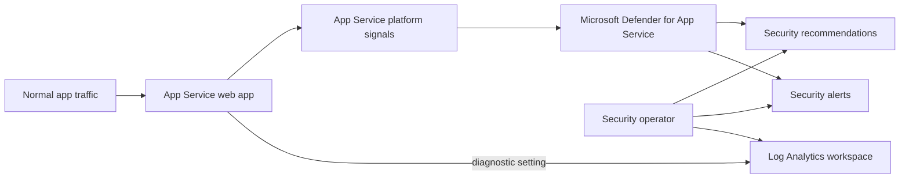

import Tabs from '@theme/Tabs';
import TabItem from '@theme/TabItem';
import PathPicker from '@site/src/components/PathPicker';
import Prerequisites from '@site/src/components/SharedMarkdown/_prerequisites.mdx';
import ProvisionResourceGroup from '@site/src/components/SharedMarkdown/_provision_resource_group.mdx';
import ProvisionResources from '@site/src/components/SharedMarkdown/_provision_resources.mdx';
import Cleanup from '@site/src/components/SharedMarkdown/_cleanup.mdx';

# Protect App Service with Microsoft Defender

Microsoft Defender for App Service adds cloud-native threat detection and
security recommendations for apps and APIs on Azure App Service. In this lab,
you inspect the existing subscription setting, deliberately enable the paid
plan, review recommendations and alerts without generating malicious traffic,
and send App Service diagnostic logs to a Log Analytics workspace for
investigation.

This is an advanced lab for cloud security engineers, platform engineers, and
App Service operators.

**Estimated time:** 35 to 50 minutes.

## Objectives

By the end of this lab, you will be able to:

- Explain the subscription scope and cost effect of Defender for App Service.
- Record the original Defender plan state and enable the `AppServices`
  Standard pricing tier only after approval.
- Review App Service recommendations and security alerts safely.
- Route supported App Service logs and metrics to a Log Analytics workspace.
- Verify the pricing tier and diagnostic destination.
- Restore the original Defender pricing tier and remove lab resources.

<Prerequisites
  tools={[
    { name: 'Access to a nonproduction Azure subscription', description: 'where subscription-wide Defender changes are approved' },
    { name: 'Microsoft Defender for Cloud pricing information', url: 'https://azure.microsoft.com/pricing/details/defender-for-cloud/' },
  ]}
/>

:::danger Subscription-wide paid change
Defender for App Service is enabled at the **subscription** scope. Turning the
`AppServices` plan to `Standard` can protect and bill for App Service plan
instances across that subscription, not only the app created in this lab.
Diagnostic ingestion and retention can add Azure Monitor charges.

Do not run the enable step in a shared or production subscription until the
subscription owner and cost owner approve the change. Record the original
pricing tier first. Deleting the lab resource group does **not** turn off the
subscription plan.
:::

:::note Permissions and least privilege
Enabling or disabling a Defender plan requires subscription-scope permission
to write `Microsoft.Security/pricings`, commonly provided by **Security Admin**
or **Owner**. Creating the lab app and workspace needs resource-group
Contributor. Configuring the diagnostic setting also needs write access to the
app and permission to use the workspace. Separate these duties when one person
should not hold all permissions.
:::

## How protection and diagnostics fit together

Defender for App Service is integrated into the platform; you do not install an
agent in the app. Defender analyzes platform signals and produces
recommendations and alerts. App Service diagnostic settings are separate: they
route HTTP, console, application, audit, and platform logs supported by your
app to a destination you control for investigation.



Defender alerts are not guaranteed immediately after enablement, and a healthy
lab subscription can have no alerts. Do not attack the app or paste exploit
payloads to force an alert.

## Provision resources

<ProvisionResourceGroup />

<ProvisionResources />

Create a low-cost web app and a Log Analytics workspace. This lab uses a Linux
B1 plan, about USD 13/month if left running. The workspace has usage-based
ingestion charges; the small lab volume should be low, but it is not
guaranteed to be free.

There is no azd path for enabling the Defender plan. The setting belongs to the
subscription security boundary, not an individual app environment, and hiding
that paid change inside `azd up` would make its scope and rollback less clear.

<PathPicker
  description="Choose the explicit Azure CLI or portal path."
  groups={[
    { id: 'tooling', label: 'Tooling', options: [
      { value: 'az', label: 'az CLI' },
      { value: 'portal', label: 'Portal' },
    ]},
  ]}
/>

<Tabs groupId="tooling" queryString>
<TabItem value="az" label="Azure CLI (az)">

Set names, create the App Service plan, web app, and workspace, and capture
their resource IDs:

```bash
export SUBSCRIPTION_ID=$(az account show --query id -o tsv)
export PLAN_NAME=plan-defender-$RAND
export APP_NAME=app-defender-$RAND
export LAW_NAME=law-defender-$RAND
export DIAGNOSTIC_SETTING=send-to-law

az appservice plan create \
  --name "$PLAN_NAME" \
  --resource-group "$RG_NAME" \
  --sku B1 \
  --is-linux

az webapp create \
  --name "$APP_NAME" \
  --resource-group "$RG_NAME" \
  --plan "$PLAN_NAME" \
  --runtime "NODE:22-lts"

az monitor log-analytics workspace create \
  --resource-group "$RG_NAME" \
  --workspace-name "$LAW_NAME" \
  --location "$LOCATION"

export APP_ID=$(az webapp show \
  --name "$APP_NAME" \
  --resource-group "$RG_NAME" \
  --query id -o tsv)

export WORKSPACE_ID=$(az monitor log-analytics workspace show \
  --resource-group "$RG_NAME" \
  --workspace-name "$LAW_NAME" \
  --query id -o tsv)
```

</TabItem>
<TabItem value="portal" label="Azure portal">

1. In the [Azure portal](https://portal.azure.com), create a **Web App** in the
   lab resource group.
2. Choose **Code**, **Linux**, a supported runtime, and a **Basic B1** App
   Service plan.
3. Create a **Log Analytics workspace** in the same resource group and region.
4. Record the app and workspace names:

   ```bash
   export APP_NAME="<your-app-name>"
   export LAW_NAME="<your-workspace-name>"
   export DIAGNOSTIC_SETTING=send-to-law
   export SUBSCRIPTION_ID=$(az account show --query id -o tsv)
   ```

</TabItem>
</Tabs>

## Step 1: Inspect and approve the current Defender state

<Tabs groupId="tooling" queryString>
<TabItem value="az" label="Azure CLI (az)">

Read and save the current pricing tier **before** changing it. Also capture the
full response as an audit reference; this lab changes and restores only
`pricingTier` for `AppServices`:

```bash
export ORIGINAL_DEFENDER_TIER=$(az security pricing show \
  --name AppServices \
  --subscription "$SUBSCRIPTION_ID" \
  --query pricingTier -o tsv)

az security pricing show \
  --name AppServices \
  --subscription "$SUBSCRIPTION_ID" \
  -o json

printf "Original AppServices tier: %s\n" "$ORIGINAL_DEFENDER_TIER"
```

The value is normally `Free` or `Standard`. Save it in the current shell; you
will use it during cleanup.

</TabItem>
<TabItem value="portal" label="Azure portal">

1. Search for and open **Microsoft Defender for Cloud**.
2. Select **Management** > **Environment settings**.
3. Select the lab subscription.
4. Under **Defender plans**, record whether **App Service** is **On** or
   **Off**. Do not change it yet.
5. Review the current Defender for Cloud cost estimate with the subscription
   owner.

</TabItem>
</Tabs>

Stop here until the authorized subscription owner confirms all three points:

- The selected subscription is the intended nonproduction subscription.
- Enabling Defender can affect and bill all App Service plan instances in it.
- The team has chosen whether to keep the plan enabled or restore its original
  pricing tier after the lab.

## Step 2: Enable Defender for App Service

<Tabs groupId="tooling" queryString>
<TabItem value="az" label="Azure CLI (az)">

After approval, set only the App Service Defender plan to `Standard`:

```bash
az security pricing create \
  --name AppServices \
  --tier Standard \
  --subscription "$SUBSCRIPTION_ID"
```

This command does not enable every Defender plan. It changes the `AppServices`
pricing resource for the subscription.

</TabItem>
<TabItem value="portal" label="Azure portal">

1. Return to **Microsoft Defender for Cloud** > **Environment settings** and
   select the subscription.
2. On **Defender plans**, turn **App Service** to **On**.
3. Leave unrelated Defender plans unchanged.
4. Select **Save** and confirm the approved cost impact.

</TabItem>
</Tabs>

Verify the result:

```bash
az security pricing show \
  --name AppServices \
  --subscription "$SUBSCRIPTION_ID" \
  --query "{plan:name,tier:pricingTier,trialRemaining:freeTrialRemainingTime}" \
  -o table
```

Expect `AppServices` and `Standard`. Do not assume a free trial is available.

## Step 3: Review recommendations and alerts safely

Defender for Cloud continuously evaluates resources. Recommendations can take
time to appear after a new app is created.

<Tabs groupId="tooling" queryString>
<TabItem value="az" label="Azure CLI (az)">

List assessments whose resource path contains this web app:

```bash
az security assessment list \
  --subscription "$SUBSCRIPTION_ID" \
  --query "[?contains(id, '/sites/$APP_NAME/')].{recommendation:displayName,status:status.code,id:name}" \
  -o table
```

An empty table can mean the app has not been assessed yet. It is not proof that
the app is secure.

List alerts in the lab resource group:

```bash
az security alert list \
  --resource-group "$RG_NAME" \
  --subscription "$SUBSCRIPTION_ID" \
  --query "[].{name:alertDisplayName,severity:severity,status:status,time:timeGeneratedUtc}" \
  -o table
```

No output is the expected safe result for a new app with normal traffic.

</TabItem>
<TabItem value="portal" label="Azure portal">

1. In **Microsoft Defender for Cloud**, select **Recommendations**.
2. Filter **Resource type** to App Service and, if available, filter by the lab
   resource group.
3. Open a recommendation and review its affected resource, severity, rationale,
   remediation, and exemption workflow. Do not change unrelated resources.
4. Select **Security alerts** and filter by the lab resource group.
5. Record that no alert is expected for normal traffic. If an existing alert is
   present, follow your organization's incident process; do not dismiss it as
   part of this lab.

</TabItem>
</Tabs>

:::tip Recommendations and alerts are different
A recommendation reports a configuration or posture issue. An alert reports
activity that Defender detected as potentially malicious. Enabling the paid
plan does not make every recommendation healthy, and fixing recommendations
does not guarantee that alerts will never occur.
:::

## Step 4: Send App Service diagnostics to Log Analytics

First inspect the categories supported by this app. Categories can differ by
operating system, runtime, and App Service feature:

```bash
export APP_ID=$(az webapp show \
  --name "$APP_NAME" \
  --resource-group "$RG_NAME" \
  --query id -o tsv)

export WORKSPACE_ID=$(az monitor log-analytics workspace show \
  --resource-group "$RG_NAME" \
  --workspace-name "$LAW_NAME" \
  --query id -o tsv)

az monitor diagnostic-settings categories list \
  --resource "$APP_ID" \
  --query "value[].{name:name,type:categoryType,groups:categoryGroups}" \
  -o table
```

<Tabs groupId="tooling" queryString>
<TabItem value="az" label="Azure CLI (az)">

Use the `allLogs` category group so Azure applies the app's currently supported
log categories. Use resource-specific tables to make queries clearer:

```bash
az monitor diagnostic-settings create \
  --name "$DIAGNOSTIC_SETTING" \
  --resource "$APP_ID" \
  --workspace "$WORKSPACE_ID" \
  --export-to-resource-specific true \
  --logs '[{"categoryGroup":"allLogs","enabled":true}]' \
  --metrics '[{"category":"AllMetrics","enabled":true}]'
```

</TabItem>
<TabItem value="portal" label="Azure portal">

1. Open the web app and select **Monitoring** > **Diagnostic settings**.
2. Select **Add diagnostic setting** and name it `send-to-law`.
3. Select **allLogs** and **AllMetrics**.
4. Select **Send to Log Analytics workspace** and choose the lab workspace.
5. If offered, select **Resource specific** as the destination table mode.
6. Select **Save**.

</TabItem>
</Tabs>

Generate only normal traffic:

```bash
APP_URL="https://$(az webapp show \
  --name "$APP_NAME" \
  --resource-group "$RG_NAME" \
  --query defaultHostName -o tsv)"

for i in $(seq 1 10); do
  curl --fail --silent "$APP_URL/" --output /dev/null
done
```

Diagnostic logs can take several minutes to reach the workspace.

## Verify

1. Confirm the Defender pricing tier:

   ```bash
   az security pricing show \
     --name AppServices \
     --subscription "$SUBSCRIPTION_ID" \
     --query pricingTier -o tsv
   ```

   Expected output after the approved enable step:

   ```text
   Standard
   ```

2. Confirm the diagnostic setting points to the intended workspace:

   ```bash
   az monitor diagnostic-settings show \
     --name "$DIAGNOSTIC_SETTING" \
     --resource "$APP_ID" \
     --query "{workspaceId:workspaceId,logs:logs[].{group:categoryGroup,enabled:enabled},metrics:metrics[].{category:category,enabled:enabled}}" \
     -o json
   ```

   Verify the `workspaceId` exactly matches `$WORKSPACE_ID`, `allLogs` is
   enabled, and `AllMetrics` is enabled.

3. After ingestion, list tables that received records for the app:

   ```bash
   WORKSPACE_CUSTOMER_ID=$(az monitor log-analytics workspace show \
     --resource-group "$RG_NAME" \
     --workspace-name "$LAW_NAME" \
     --query customerId -o tsv)

   az monitor log-analytics query \
     --workspace "$WORKSPACE_CUSTOMER_ID" \
     --analytics-query "search * | where _ResourceId =~ '$APP_ID' | summarize records=count() by \$table | order by records desc" \
     -o table
   ```

   At least one App Service resource-specific table should appear after normal
   requests and ingestion. Table availability depends on the categories the
   app emitted.

## Restore the subscription pricing tier

Restore the original pricing tier unless the authorized owner explicitly
decided to keep `Standard`. This lab changes only `pricingTier`; it does not
change a subplan or extension configuration.

<Tabs groupId="tooling" queryString>
<TabItem value="az" label="Azure CLI (az)">

```bash
az security pricing create \
  --name AppServices \
  --tier "$ORIGINAL_DEFENDER_TIER" \
  --subscription "$SUBSCRIPTION_ID"

az security pricing show \
  --name AppServices \
  --subscription "$SUBSCRIPTION_ID" \
  --query pricingTier -o tsv
```

The final value must equal the value you recorded before the lab. If it was
already `Standard`, this command leaves the plan enabled.

</TabItem>
<TabItem value="portal" label="Azure portal">

1. Return to **Defender for Cloud** > **Environment settings** > your
   subscription > **Defender plans**.
2. Set **App Service** back to the **On** or **Off** state you recorded before
   the lab.
3. Leave unrelated plans unchanged and select **Save**.
4. Refresh the page and confirm the state persisted.

</TabItem>
</Tabs>

<Cleanup />

Deleting the resource group removes the app, workspace, and its diagnostic
setting. It does not change `Microsoft.Security/pricings` at subscription
scope, so complete **Restore the subscription pricing tier** first.

Wait for deletion and verify it:

```bash
while [ "$(az group exists --name "$RG_NAME")" = "true" ]; do
  sleep 10
done
az group exists --name "$RG_NAME"
```

Expected output:

```text
false
```

## Summary

You enabled Defender for App Service only after reviewing its subscription-wide
scope, permissions, and cost. You safely inspected recommendations and alerts,
routed App Service diagnostics to Log Analytics, verified the paid tier and
destination, and restored the original subscription setting before deleting
the lab resources.

## Troubleshooting

- **`AuthorizationFailed` on `az security pricing create`.** Ask an authorized
  administrator for a role that includes `Microsoft.Security/pricings/write`
  at subscription scope. Do not broaden your own access or use another
  subscription without approval.
- **The portal plan toggle changes back.** Check Azure Policy, management-group
  settings, or automation that enforces Defender plans. Coordinate with the
  subscription security owner instead of fighting the control.
- **No recommendations appear.** New resources need time for assessment. Check
  that the resource provider is registered and return later. An empty result is
  not a security attestation.
- **No alerts appear.** That is normal for a new app receiving benign traffic.
  Do not simulate attacks. Validate the plan state and review the documented
  [App Service alert types](https://learn.microsoft.com/azure/defender-for-cloud/alerts-azure-app-service).
- **The diagnostic setting rejects a category.** Run the categories-list
  command again. Prefer the supported `allLogs` category group or select only
  categories returned for that resource.
- **No records reach Log Analytics.** Generate normal requests, wait for
  ingestion, confirm the diagnostic setting's workspace ID, and verify the
  app emitted the selected log categories. Diagnostic settings do not create
  application log messages that the app never writes.
- **Charges continue after resource-group deletion.** Recheck the
  `AppServices` pricing tier at subscription scope and check for resource-level
  Defender settings on remaining App Service plans.

## Learn more

- [Microsoft Defender for App Service overview](https://learn.microsoft.com/azure/defender-for-cloud/defender-for-app-service-introduction)
- [Enable Defender for App Service](https://learn.microsoft.com/azure/defender-for-cloud/tutorial-enable-app-service-plan)
- [Defender for App Service pricing](https://azure.microsoft.com/pricing/details/defender-for-cloud/)
- [App Service security recommendations](https://learn.microsoft.com/azure/defender-for-cloud/recommendations-reference-app-services)
- [App Service security alerts](https://learn.microsoft.com/azure/defender-for-cloud/alerts-azure-app-service)
- [Disable Defender plans](https://learn.microsoft.com/azure/defender-for-cloud/disable-plans)
- [App Service diagnostic logging](https://learn.microsoft.com/azure/app-service/troubleshoot-diagnostic-logs)
- [Azure Monitor diagnostic settings](https://learn.microsoft.com/azure/azure-monitor/platform/diagnostic-settings)
